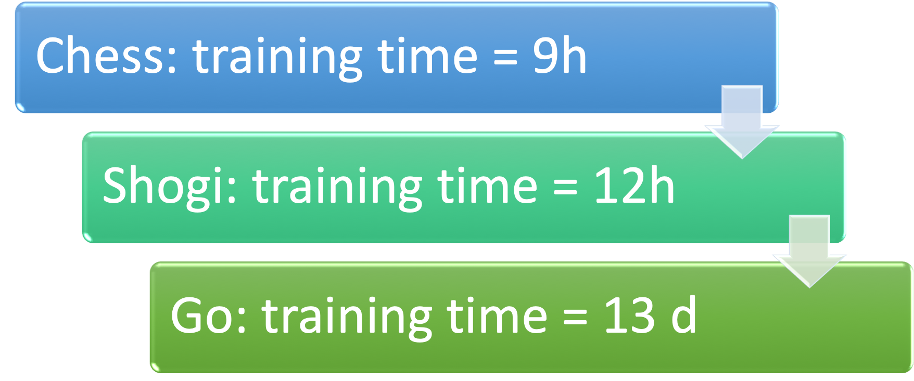

# (PART) Machine learning: Shall we? {-} 

```{r setupMlShall, include=FALSE}
knitr::opts_chunk$set(echo = FALSE)
library(tidyverse)
library(DT)
library(plotly)

```


Before we answer the question **Machine learning, shall we?** lets look into what machine learning is

# What is machine learning? {#whatML}

Machine learning is a sub domain of artificial intelligence and has several definitions:


```{r echo=FALSE, out.width='50%'}
knitr::include_graphics('images/MachineLearning.png')
```


>"Field of study that gives computers the ability to learn without being explicitly programmed"  
>
>--- Arthur Samuel ^[American pioneer in the field of computer gaming and artificial intelligence https://en.wikipedia.org/wiki/Arthur_Samuel]:  


> "Learn from experience E with respect to some task T and some performance measure P, if its performance on T, as measured by P, improves with experience E
>
>--- Tom Mitchell ^[Professor of Computer Science and Machine Learning at Carnegie Mellon http://www.cs.cmu.edu/~tom/] 


## What is intelligence?

To discuss the question of what is artificial intelligence, the first step is to define what intelligence is.

A group of 52 psychology researchers published in [@gottfredson1997mainstream] the following definition:   

>A very general mental capability that, among other things, involves the ability to reason, plan, solve problems, think abstractly, comprehend complex ideas, learn quickly and learn from experience. It is not merely book learning, a narrow academic skill, or test-taking smarts. Rather, it reflects a broader and deeper capability for comprehending our surroundings—"catching on," "making sense" of things, or "figuring out" what to do.

Alfred Binet, a french psychologist who invented first practical IQ test defined in 1905 [@binet1916new]:

>Judgment, otherwise called "good sense", "practical sense", "initiative", the faculty of adapting one's self to circumstances

And Albert Einstein said:  

>The measure of intelligence is the ability to change.

Tegmark's summarizes the situation in [@tegmark2017life]  

> There’s no agreement on what intelligence is even among intelligent intelligence researchers! So there’s clearly no undisputed “correct” definition of intelligence.

### Definition of artificial intelligence sub domains

Even though there is no undisputed definition of **intelligence** there is a undisputed definition of how machine learning is related to artificial intelligence

Agreement: **Machine learning is a sub domain of artificial intelligence (AI)**

---


---


The history of those fields goes back to the 1950's

---


---

## Is AI smarter than humans?

Which of the following questions can a computer answer better?

```{block2 echo=TRUE, type='rmdtip'}

- 17*35  ^[17*35=595]
- Wie viele Tiere von jeder Art nahm Moses mit auf die Arche?     ^[Knowledge neglect https://en.wikipedia.org/wiki/Knowledge_neglect]
- Wie heißen die drei letzten Bundespräsidenten?           ^[Die drei letzten Bundespräsidenten: Steinmeier, Gauck, Wulf]

```


```{r echo=FALSE, out.width='40%'}
knitr::include_graphics('images/ship.png')
```

### Thinking, fast and slow [@kahneman2011thinking]

In Daniel Kahneman's **Thinking, fast and slow**  [@kahneman2011thinking] there are plenty of surprising social psychology experiments, on page 166 the following question is posed:


<blockquote>

A cab was involved in a hit-and-run accident at night. Two cab companies, the Green and the Blue, operate in the city. You are given the following data:  
- 85% of the cabs in the city are Green and 15% are Blue.   
- A witness identified the cab as Blue. The court tested the reliability of the witness under the circumstances that existed on the night of the accident and concluded that the witness correctly identified each one of the two colors 80% of the time and failed 20% of the time. 


**What is the probability that the cab involved in the accident was Blue rather than Green?** ^[https://www.anesi.com/bayes.htm]

</blockquote>

```{r echo=FALSE, out.width='100%'}
knitr::include_graphics('images/CabsBlueGreen.png')
```

Please cast your vote at https://pingo.coactum.de/157678 ^[Pingo question: What is the probability that the cab involved in the accident was Blue rather than Green? https://pingo.coactum.de/questions] or access Pingo webpage scanning QR code below:

```{r echo=FALSE, out.width='40%'}
knitr::include_graphics('images/PingoQrCode.png')
```


## Comparisons between AI and humans

### Breast cancer detection
<p>In a Google Health project ^[Screening mammography aims to identify breast cancer at earlier stages of the disease, when treatment can be more successful. Despite the existence of screening programmes worldwide, the interpretation of mammograms is affected by high rates of false positives and false negatives. Here we present an artificial intelligence (AI) system that is capable of surpassing human experts in breast cancer prediction. To assess its performance in the clinical setting, we curated a large representative dataset from the UK and a large enriched dataset from the USA. We show an absolute reduction of 5.7% and 1.2% (USA and UK) in false positives and 9.4% and 2.7% in false negatives. We provide evidence of the ability of the system to generalize from the UK to the USA. In an independent study of six radiologists, the AI system outperformed all of the human readers: the area under the receiver operating characteristic curve (AUC-ROC) for the AI system was greater than the AUC-ROC for the average radiologist by an absolute margin of 11.5%. We ran a simulation in which the AI system participated in the double-reading process that is used in the UK, and found that the AI system maintained non-inferior performance and reduced the workload of the second reader by 88%. This robust assessment of the AI system paves the way for clinical trials to improve the accuracy and efficiency of breast cancer screening. https://www.nature.com/articles/s41586-019-1799-6] the following results were achieved: </p>

```{block2 echo=TRUE, type='rmdtip'}
- Absolute reduction of 5.7% and 1.2% (USA and UK) in false positives 
- Absolute reduction 9.4% and 2.7% (USA and UK)in false negatives. 
```

In an independent study of six radiologists, the AI system outperformed all of the human readers.
More on the study at https://www.nature.com/articles/s41586-019-1799-6

### Working together: Lung cancer detection
With an estimated 160,000 deaths in 2018, lung cancer is the most common cause of cancer death in the United States

```{r echo=FALSE, out.width='20%'}
knitr::include_graphics('images/lung.svg')
```

A study published in Nature medicine ^[Abstract With an estimated 160,000 deaths in 2018, lung cancer is the most common cause of cancer death in the United States1. Lung cancer screening using low-dose computed tomography has been shown to reduce mortality by 20–43% and is now included in US screening guidelines. Existing challenges include inter-grader variability and high false-positive and false-negative rates. We propose a deep learning algorithm that uses a patient’s current and prior computed tomography volumes to predict the risk of lung cancer. Our model achieves a state-of-the-art performance (94.4% area under the curve) on 6,716 National Lung Cancer Screening Trial cases, and performs similarly on an independent clinical validation set of 1,139 cases. We conducted two reader studies. When prior computed tomography imaging was not available, our model outperformed all six radiologists with absolute reductions of 11% in false positives and 5% in false negatives. Where prior computed tomography imaging was available, the model performance was on-par with the same radiologists. This creates an opportunity to optimize the screening process via computer assistance and automation. While the vast majority of patients remain unscreened, we show the potential for deep learning models to increase the accuracy, consistency and adoption of lung cancer screening worldwide. Website: https://www.nature.com/articles/s41591-019-0447-x] a team of members of Google AI and several hospitals reported

When prior computed tomography imaging was not available

```{block2 echo=TRUE, type='rmdtip'}

- Model outperformed all six radiologists
- Absolute reductions of 11% in false positives 
- Absolute reductions 5% in false negatives
```


### ImageNet Large Scale Visual Recognition Challenge (ILSVRC)

The ImageNet Large Scale Visual Recognition Challenge ^[Homepage of ILSVRC http://www.image-net.org/challenges/LSVRC/] (ILSVRC) [@ILSVRC15] evaluates algorithms for object recognition and image classification on a large scale.

Facts of ImageNet ^[ Homepage of ImageNet http://www.image-net.org]:

```{block2 echo=TRUE, type='rmdtip'}

- 14 million images
- 20,000 image categories
- 1000 image categories used for ILSVRC

```

The development of the results is shown in the graph below. The number of layers is a indication of model complexity

--- 

```{r booklistTable, out.height= '80%',out.width= '80%'}
ILSVRC <- tribble(
  ~ Year, ~ ErrorRate, ~ NumberOfLayers,
  2010, 28.2, 1,
  2011, 25.8, 1,
  2012, 16.4, 8,
  2013, 11.7, 8,
  2014, 7.3, 19,
  2015, 3.6,152)
  

p <- ggplot(ILSVRC, aes(Year, ErrorRate)) + geom_col(aes(fill=NumberOfLayers)) + labs(title = "Error rate of ILSVRC", x = "Year", y = "Error Rate [%]", caption ="Human level = 5%") +geom_hline(yintercept =5, color ="red") + geom_label(color = "red",aes(2012.5, 4,label = "Human Level", vjust = -1))
p <- ggplot(ILSVRC, aes(Year, ErrorRate)) + geom_col(aes(fill=NumberOfLayers)) + labs(title = "Error rate of ILSVRC, human error rate = 5% (red line)", x = "Year", y = "Error Rate [%]", caption ="Human level = 5%") +geom_hline(yintercept =5, color ="red") 
p <- ggplotly(p)
p
```

--- 

In 2017 the problem set to status "solved"  

```{block2 echo=TRUE, type='rmdtip'}

- 29 of 38 competing teams had an accuracy of more than 95%  
- ImageNet stopped competition

```

### AlphaGo Zero

Go is a strategy game **invented 2500 years ago** and has an estimated number of **possible board configuration of 10¹⁷⁴** compared to chess which has is 10¹²º. A detailed description is given by DeepMind's blog post "AlphaGo Zero: Starting from scratch" ^[https://deepmind.com/blog/article/alphago-zero-starting-scratch]

**AlphaGo Zero** is a version of DeepMind's^[Homepage of DeepMind https://deepmind.com] Go software AlphaGo

```{block2 echo=TRUE, type='rmdtip'}

- <p>No human intervention </p>
- No usage of historical data
- After 3 days of training as good as AlphaGo which beat world champion in 4 out of 5
- After 40 days of training becomes best Go player in the world

```

 AlphaZero learned three games,
 
 ```{r echo=FALSE, out.width='70%'}

```

The capability progress of Alpha Zero during training is shown below

 {width=100% .external}
 
 
  NOTE: EACH TRAINING STEP REPRESENTS 4,096 BOARD POSITIONS.
 

At the end of the training Alpha Zero achieved the following performance:

 {width=100% .external}
 
 
 Implications are wider than just playing a game, as Garry Kasparov, a former world chess champion puts it:
 
 >The implications go far beyond my beloved chessboard... Not only do these self-taught expert machines perform incredibly well, but we can actually learn from the new knowledge they produce."
 
    
## ML models with bias {#ModelsWithBias}

Models might end up biased, why is that?

<iframe width="560" height="315" src="https://www.youtube-nocookie.com/embed/tlOIHko8ySg" frameborder="0" allow="accelerometer; autoplay; encrypted-media; gyroscope; picture-in-picture" allowfullscreen></iframe>

[source: https://www.youtube.com/watch?time_continue=1&v=tlOIHko8ySg&feature=emb_logo]

With a **unsuitable reward function** an **undesired result** can occur

```{block2 echo=TRUE, type='rmdtip'}

- <p>Framing the problem  </p>
    - Goal is business reason, not fairness or avoidance of discrimination
    - Goal might lead to unwanted side effects https://openai.com/blog/faulty-reward-functions/ 
    
- <p>Collecting data</p>
     - Unrepresentative of reality
          - Collecting images of zebras only when sun shines => model might look for shadow for classifying a zebra 
     - Reflects existing prejudices
          - Historical data might lead recruiting tools to dismiss female candidates

- <p>Preparing the data</p>
    - Selecting attributes to be considered might lead to bias
        - Attribute gender might lead to bias

```

####  How to avoid bias

Avoiding bias is harder than you might think

```{block2 echo=TRUE, type='rmdtip'}

- <p>Unknown unknowns</p>
    - Gender might be deducted by recruiting tool from use of language

- Imperfect processes
    - Test data has same bias as training data
    - Bias not easy to discover

```

#### Human bias

Machine learning model can be biased for several reasons as shown above, how about humans?

```{block2 echo=TRUE, type='rmdtip'}

- <p>Study in Germany</p>
- Judges read description of shoplifter
- Rolled a pair of loaded dice
- Dice = **3** => Average **5** months prison
- Dice = **9** => Average **8** months prison

```


## Attacks on ML models

Especially image classification models have shown to be susceptible to attacks which leads to wrong classifications. This could lead to

```{block2 echo=TRUE, type='rmdwarning'}

- Traffic sign misclassification
    - targeted attack $\implies$ force a certain prediction
    - untargeted attack $\implies$ force misclassification, but not a particular predcition
- Avoiding face detection
```

How a attack can be performed is described by Goodfellow et al. in [@goodfellow2014explaining]

### Adding noise to image leads to misclassification


 ![Figure from Image Credit: Goodfellow et al. [@goodfellow2014explaining])](images/GanAttack.png){width=100% .external}


--- 


### But what about attacks on human perception?

Which statement is correct?

- <p>Top line longer</p>
- Bottom line longer
- Both are same length

---


<div class="HeadingNoNumber">
Is this a picture of a real person? 

</div>

Look at the picture below, is it a real person or an animation?

--- 

 ![Figure from https://commons.wikimedia.org/wiki/File:Woman_1.jpg (Image Credit: Owlsmcgee [Public domain] )](images/GanWomen.png){width=60% .external}
 

The image is create using a generative adversarial network (GAN), see below for the principle, for detailed description see https://medium.com/ai-society/gans-from-scratch-1-a-deep-introduction-with-code-in-pytorch-and-tensorflow-cb03cdcdba0f 

---

```{r, layout="l-screen-inset"}
knitr::include_graphics('images/GanPrincipleAndSteps.png')
```

---


### Model Hacking ADAS to Pave Safer Roads for Autonomous Vehicles

A McAfee Advanced Threat Research (ATR) hack which caused cars to drive 50 miles faster than the speed limit by tricking the camera using a piece of tape on the traffic sign. This simple attack tricked the Advanced Driver Assist Systems (ADAS) to drive the car at 85mph instead of 35mph. A detailed description of the hack can be found at https://www.mcafee.com/blogs/other-blogs/mcafee-labs/model-hacking-adas-to-pave-safer-roads-for-autonomous-vehicles/


<div class="rmdtip">
<p>Facts about ATR hack:</p>

- McAfee Advanced Threat Research (ATR)
- MobilEye camera system
     - utilized by over 40Mio vehicles (incl. Tesla Harware Pack 1)
- MobileEye reads a 35mph sign as 85mph sign    

</div>

<iframe width="560" height="315" src="https://www.youtube-nocookie.com/embed/4uGV_fRj0UA" frameborder="0" allow="accelerometer; autoplay; encrypted-media; gyroscope; picture-in-picture" allowfullscreen></iframe>

---

As a look forward Steve Povolny, Head of McAfee Advanced Threat Research wrote:

<blockquote>
In order to drive success in this key industry and shift the perception that machine learning systems are secure, we need to accelerate discussions and awareness of the problems and steer the direction and development of next-generation technologies. Puns intended.  

Steve Povolny, Head of McAfee Advanced Threat Research
</blockquote>

#### Press coverage

Interesting was to see the coverage of the media


<blockquote>
TESLA CARS TRICKED INTO AUTONOMOUSLY ACCELERATING 50 MPH USING SPEED SIGN ALTERED WITH SMALL PIECE OF TAPE
[Newsweek](https://www.newsweek.com/tesla-model-x-model-s-mcafee-research-tricks-acceleration-speed-limit-signs-1487956)
</blockquote>

<blockquote>

Tesla in Autopilot mode tricked into speeding using terrifying hack
[The Telegraph](https://www.telegraph.co.uk/technology/2020/02/19/self-driving-tesla-tricked-speeding-using-terrifying-hack/)
</blockquote>


<blockquote>

</blockquote>
# Outlook

What will the future bring for society?


<blockquote>
The saddest aspect of life right now is that science gathers knowledge faster than society gathers wisdom. 

Isaac Asimov
</blockquote>


## Development of life

Tegmark in "Life 3.0: Being human in the age of artificial intelligence" [@tegmark2017life] p. 23. **classifies life into three stages** and shows the two existing stages of life and the third stage which might be ahead.

---


---


The three stages of life have overlapping skills, **but only life 3.0 has all skills** and is able to design its hardware and therefore might be able to have unlimited skills


---

### When will superhuman AI come, and will it be good?

Several opinions about when and if superhuman AI will appear and if it will be a good thing or not exists. Those opinions can be grouped as shown in the following graph.


Luddite => A person opposed to new technology or ways of working

Please cast your vote at https://pingo.coactum.de/157678 ^[Pingo question: Ihre Position zur AGI? https://pingo.coactum.de/questions]


### AI aftermath scenario

To be prepared we might want to ask yourselves:

1. Do you want there to be superintelligence?   
2. Do you want humans to still exist, be replaced, cyborgized and/or uploaded/simulated?   
1. Do you want humans or machines in control?  
1. Do you want AIs to be conscious or not?  
1. Do you want to maximize positive experiences, minimize suffering or leave this to sort itself out?  
1. Do you want life spreading into the cosmos?   
1. Do you want a civilization striving toward a greater purpose that you sympathize with, or are you OK with future life forms that appear content?

Depending on your answers this might lead to one of the following scenario

---

```{r AIAftermathTable}
AiAftermath <- tribble(
  ~ Scenario, ~ SuperinteligenceExists, ~ HumansExitst, ~ HumansInControl, ~ HumansSafe, ~ HumansHappy, ~ ConsciousnessExists,
"Libertarian utopia", "Yes", "Yes", "No", "No", "Mixed", "Yes",
"Benevolent dictator", "Yes", "Yes", "No", "Yes", "Mixed", "Yes",
"Egalitarian utopia", "No", "Yes", "Yes?", "Yes", "Yes?", "Yes",
"Gatekeeper", "Yes", "Yes", "Partially", "Potentially", "Mixed", "Yes",
"Protector god", "Yes", "Yes", "Partially", "Potentially", "Mixed", "Yes",
"Enslaved god", "Yes", "Yes", "Yes", "Potentially", "Mixed", "Yes",
"Conquerors", "Yes", "No", "-", "-", "-", "?",
"Descendants", "Yes", "No", "-", "-", "-", "?",
"Zookeeper", "Yes", "Yes", "No", "Yes", "No", "Yes",
"1984", "No", "Yes", "Yes", "Potentially", "Mixed", "Yes",
"Reversion", "No", "Yes", "Yes", "No", "Mixed", "Yes",
"Self-destruction", "No", "No", "-", "-", "-", "No"
)

datatable(data = AiAftermath, rownames = FALSE, filter = "top", colnames = c("Scenario", "Superinteligence exists?",  "Humans exist?",  "Humans in Control?", "Humans safe?",  "Humans happy?",  "Consciousness exists?"),  options = list(
  pageLength = 12, autoWidth = FALSE
)) %>% formatStyle('HumansExitst',
  backgroundColor = styleEqual(c("No"), c('red')))

```

---

A verbal description of the scenarios is given below, type the name of the scenario into the left field, if you want more scenarios to be shown increase the "Show entries" entry

---

```{r SuperHumanAi}

SuperHumanAi <- tribble(
  ~ Name, ~ Definition,
"Conquerors"," AI takes control, decides that humans are a threat/nuisance/waste of resources, and gets rid of us by a method that we don’t even understand",
"Libertarian utopia",
"Humans, cyborgs, uploads and superintelligences coexist peacefully thanks to property rights",
"Benevolent dictator"," Everybody knows that the AI runs society and enforces strict rules, but most people view this as a good thing",
"Egalitarian utopia", " Humans, cyborgs and uploads coexist peacefully thanks to property abolition and guaranteed income",
"Gatekeeper", "A superintelligent AI is created with the goal of interfering as little as necessary to prevent the creation of another superintelligence. As a result, helper robots with slightly subhuman intelligence abound, and human-machine cyborgs exist, but technological progress is forever stymied",
"Protector god", "Essentially omniscient and omnipotent AI maximizes human happiness by intervening only in ways that preserve our feeling of control of our own destiny and hides well enough that many humans even doubt the AI’s existence",
"Enslaved god"," A superintelligent AI is confined by humans, who use it to produce unimaginable technology and wealth that can be used for good or bad depending on the human controllers",
"Descendants", "AIs replace humans, but give us a graceful exit, making us view them as our worthy descendants, much as parents feel happy and proud to have a child who’s smarter than them, who learns from them and then accomplishes what they could only dream of—even if they can’t live to see it all",
"Zookeeper", "An omnipotent AI keeps some humans around, who feel treated like zoo animals and lament their fate",
"1984"," Technological progress toward superintelligence is permanently curtailed not by an AI but by a human-led Orwellian surveillance state where certain kinds of AI research are banned",
"Reversion"," Technological progress toward superintelligence is prevented by reverting to a pre-technological society in the style of the Amish",
"Self-destruction"," Superintelligence is never created because humanity drives itself extinct by other means (say nuclear and/or biotech)")

datatable(data = SuperHumanAi, rownames = FALSE, filter = "top", colnames = c("Name", "Definition"),  options = list(
  pageLength = 1, autoWidth = FALSE
))

```


## Data religion: Dataism

A data based religion called **Dataism** is a concept described by Harari in Homo Deus: A brief history of tomorrow [@harari2016homo] and says:

- Universe consists of data flow
- Value of entity determined by contribution to data processing
- Collapses barrier between animals and machines ^["Dataism was born from the explosive confluence of two scientific tidal waves. In the 150 years since Charles Darwin published On the Origin of Species, the life sciences have come to see organisms as biochemical algorithms. Simultaneously, in the eight decades since Alan Turing formulated the idea of a Turing Machine, computer scientists have learned to engineer increasingly sophisticated electronic algorithms. Dataism puts the two together, pointing out that exactly the same mathematical laws apply to both biochemical and electronic algorithms. Dataism thereby collapses the barrier between animals and machines, and expects electronic algorithms to eventually decipher and outperform biochemical algorithms." Harari, Yuval Noah. Homo Deus: A Brief History of Tomorrow . HarperCollins. Kindle Edition. ]
    - electronic algorithms eventually outperform biochemical algorithms
    
---

In data we trust


- <p>Humans supposed to distill </p>
    - data => information
    - information => knowledge
    - knowledge => wisdom
- Dataists
    - believe humans can not cope with immense flow of data
    - put there trust in Big Data and computer algorithms
    

---


Dataism: only wild fantasy?

- <p>Dataism entrenched in</p>
    - computer science
    - biology
        - giraffes, tomatoes and human beings are just different methods for processing data
        - that is current scientific dogma
    
 ---
 
Economists interpret economy as data processing system


- Gathering data about desires and abilities
- Turning data into decisions
    - Capitalism => distributed processing
    - Communism => centralized processing
- Capitalists against high taxes
    - capital accumulates at state 
    - more decisions by single processor, namely government
    

# Discussion points

There are concerns about if and how AI shall be regularized, a few angles to look at the issue are given below as starting point for further thoughts

## Researcher stops his work due to ethical concerns

Joe Redmon, the creator of You Only Look Once (YOLO) with a huge impact on modern object detection stopped doing any computer vision research due to ethical concerns.


<blockquote class="twitter-tweet"><p lang="en" dir="ltr">This is huge.<br><br>The creator of the YOLO algorithms, which (along with SSD) set much of the path of modern object detection, has stopped doing any computer vision research due to ethical concerns.<br><br>I&#39;ve never seen anything quite like this before. <a href="https://t.co/jzu1p4my5V">https://t.co/jzu1p4my5V</a></p>&mdash; Jeremy Howard (@jeremyphoward) <a href="https://twitter.com/jeremyphoward/status/1230610470991589376?ref_src=twsrc%5Etfw">February 20, 2020</a></blockquote> <script async src="https://platform.twitter.com/widgets.js" charset="utf-8"></script>

YOLO is a state-of-the-art, real time object detection system.

<iframe width="560" height="315" src="https://www.youtube-nocookie.com/embed/MPU2HistivI" frameborder="0" allow="accelerometer; autoplay; encrypted-media; gyroscope; picture-in-picture" allowfullscreen></iframe>


## Career: Oxford seeks AI ethics professor

The question is, who should or should not be involved in the decisions about the faith of AI?


<div class="rmdtip">
- Associate Professorship or Professorship in Philosophy
- Apply for [University of Oxford - Faculty of Philosophy (Ethics in AI)](https://www.jobs.ac.uk/job/BYC826/associate-professorship-or-professorship-in-philosophy)
</div>

## Shaping Europe's digital future: Commission presents strategies for data and Artificial Intelligence

On February 19th 2020 the EU commission presented its strategies for data and AI. https://ec.europa.eu/commission/presscorner/detail/en/ip_20_273


<blockquote>
Today we are presenting our ambition to shape Europe's digital future. It covers everything from cybersecurity to critical infrastructures, digital education to skills, democracy to media. I want that digital Europe reflects the best of Europe – open, fair, diverse, democratic, and confident.  

Ursula von der Leyen, President of the Commission
</blockquote>


As key objectives in digital technologies over the next five years the commission will focus on three areas


<div class="rmdtip">
<p>Key objectives in digital technologies:</p>

- Technology that works for people
- Fair and competitive economy
- Open, democratic and sustainable society

</div>

Furthermore the commission wants the EU to be the trustworthy leader of AI as well as in the data economy

        
<div class="rmdtip">

- Europe as a leader in trustworthy Artificial Intelligence
    - excellent research centers
    - accelerate deployment of AI
        - smaller and medium-sized enterprises
    - attract and keep talent    
    - rules
        - need to address high-risk AI systems 
        - without putting too much burden on less risky ones
- Europe as a leader in the data economy
    - European data space
        - single market
    -  Commission propose to establish right regulatory framework regarding data governance
    
    - Commission will invest in data spaces and cloud infrastructures
        - efficient
        - trustworthy
        
</div>        