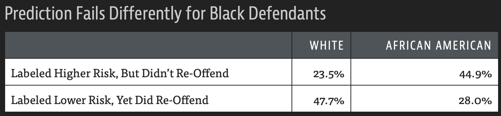

```{r setupDataEthics, include=FALSE}
knitr::opts_chunk$set(echo = FALSE)
library(tidyverse)
library(DT)
library(plotly)

```

    

# Data Ethics {#dataEthics}

This section draws on material from "Deep learning for Coders with fastai & PyTorch" by Jeremey Howard and Sylvain Gugger [@fastaiBook2020]. The chapter "Data Ethics" is co-authored by Dr. Rachel Thomas, founding director of the Center of Applied Data Ethics at the University of San Francisco.

First lets look at a definition of ethics from [Markkula Center for Applied Ethics](https://www.scu.edu/ethics/ethics-resources/ethical-decision-making/what-is-ethics/) 
Ethics is complicated and context-dependent. The following definition has therefore to be abstract since the answer to what is right and wrong are vary between cultures, over time and context.

<div class="rmdtip">

**Definition of  ethics: **

- Well-founded standards of right and wrong that prescribe what humans should do  
- The study and development of one’s ethical standards

</div>

As a company there is the need to develop an ethical standard for the company. In times of demand for fair trade, green investment and anti-racism the topic of corporate ethics gains more and more significance to maintain a better connection with stakeholders of the company. Many major corporations promote their commitment to non-economic values in the frame of their ethics codes.


## Topics in data ethics

Data ethics is a wide field with many aspects, this section is meant to be an introduction into the field and therefore focuses on a few topics which are of high relevance.
```{block2 echo=TRUE, type='rmdtip'}


**Topics in data ethics:**

- Need for recourse and accountability
    - without accountability systems will not be accepted
    - mechanisms have to be in place to solve issues 
- Feedback loops
    - lead to information bubbles and spread of conspiracy theories
    - avoided by careful design of metrics 
    - monitore results
- Bias
    - leads to discrimination and racism 
    - there are no un-biased data
    - audit
        - data
        - results
    

```


### Recourse and accountabilty 

There are already plenty of examples were machine learning algorithms had negative impacts on peoples life due to wrong or biased data. 

One example is a large-scale study of credit reports by the Federal Trace Commission (FTC) in 2012. The study reports that 26% of consumers had at least one mistake, 5% had errors that could be devastating.
For cases like that, mechanisms must be in place to fix those problems if they occur, and steps in the development process have to implemented to avoid such problems in the first place. This can be done by data and code audits.

### Feedback loops

Machine learning algorithms will optimize the metric given to it. This can lead to edge cases, for example in recommendation systems, which create information bubbles and spread of conspiracy theories. To avoid such unwanted effects careful design of the metrics and monitoring of the results are necessary.

Also a way to allow users to give feedback to the system can help to identify unwanted feedback loops.

The coverage of the Mueller report by Russia Today has a very high number of channels recommending the video, it is not clear how this high number is achieved, but assumption is that Russia Today has successful way to take advantage of YouTube's recommendation system.


![Mueller report recommendation of YouTube, figure from  [@fastaiBook2020]](images/MuellerReportOnYoutube.png){width=80% .external}


### Bias

Bias leads to predictions of the machine learning algorithm which are flawed by data which are misrepresenting reality or represent social bias. For example the COMPASS algorithm used for sentencing and bail decisions in the US, when tested by [ProPublica](https://www.propublica.org/article/machine-bias-risk-assessments-in-criminal-sentencing)

{width=80% .external}

The numbers show that more African American who were rated higher risk did not re-offend, but lower risk White people did re-offend more often than African Amercian. 

Google Photos autocategorized photos show racial bias in computer vision

![Racist bias of Google Photo, figure from  [@fastaiBook2020]](images/RacistBias.png){width=80% .external}

Part of the problem is the source of data which is heavily western based as shown in the paper "No Classification without Representation: Assessing Geodiversity Issues in Open Data Sets for the Developing World" [@shankar2017no].

![ImageNet and Open Images data origin, figure from  [@shankar2017no]](images/imageNetDataOrigin.png){width=80% .external}

This reflects in the ability of algorithms to classify pictures across different nations In the next graph it is shown that a classifier trained on Open Image data does not work to the same accuracy for images from Ethiopia and Pakistan as it does for images form the US and Australia.

![Classifier trained on Open Images failing across different nations, figure from  [@shankar2017no]](images/OpenImagesGroom.png){width=80% .external}


## Identify and adressing ethical issues

No system is perfect, but we need to address critical issues as early as possible.

```{block2 echo=TRUE, type='rmdtip'}


**Steps to address ethical issues**

- Analyze a planned project   
- Implement processes at your company to find and address ethical risks.
- Increase diversity.


```


### Analyze a planned project 

Rachel Thomas recommends considering the following questions throughout the development of a data project: 

```{block2 echo=TRUE, type='rmdtip'}


**Recommended questions:**

- Should we even be doing this?
- What bias is in the data?
- Can the code and data be audited?
- What are the error rates for different subgroups?
- What is the accuracy of a simple rule-based alternative?
- What processes are in place to handle appeals or mistakes?
- How diverse is the team that built it?

```

When answering those questions one needs to consider also how data can be misused in the future. 


### Process to implement
The Markkula Center for Applied Ethics has released [an Ethical Toolkit for Engineering/Design Practice](https://www.scu.edu/ethics-in-technology-practice/ethical-toolkit/).
The toolkit includes seven tools

This toolkit includes seven tools:

- Tool 1: Ethical Risk Sweeping
- Tool 2: Ethical Pre-mortems and Post-mortems
- Tool 3: Expanding the Ethical Circle
- Tool 4: Case-based Analysis
- Tool 5: Remembering the Ethical Benefits of Creative Work
- Tool 6: Think About the Terrible People
- Tool 7: Closing the Loop: Ethical Feedback and Iteration
 
 For details about the tools check Markkula Center's web pages https://www.scu.edu/ethics-in-technology-practice/ethical-toolkit/
 
 
### Diversity

A diverse team in terms of:  

- Gender
- Age
- Experience
- Education

helps to identify issues and find solutions which might have not found with a less diverse team.


## Data Ethics consequences 
In the following a few cases of how data ethics are addressed are given.


### Researcher stops his work due to ethical concerns

Joe Redmon, the creator of You Only Look Once (YOLO) with a huge impact on modern object detection stopped doing any computer vision research due to ethical concerns.


<blockquote class="twitter-tweet"><p lang="en" dir="ltr">This is huge.<br><br>The creator of the YOLO algorithms, which (along with SSD) set much of the path of modern object detection, has stopped doing any computer vision research due to ethical concerns.<br><br>I&#39;ve never seen anything quite like this before. <a href="https://t.co/jzu1p4my5V">https://t.co/jzu1p4my5V</a></p>&mdash; Jeremy Howard (@jeremyphoward) <a href="https://twitter.com/jeremyphoward/status/1230610470991589376?ref_src=twsrc%5Etfw">February 20, 2020</a></blockquote> <script async src="https://platform.twitter.com/widgets.js" charset="utf-8"></script>

YOLO is a state-of-the-art, real time object detection system.

<iframe width="560" height="315" src="https://www.youtube-nocookie.com/embed/MPU2HistivI" frameborder="0" allow="accelerometer; autoplay; encrypted-media; gyroscope; picture-in-picture" allowfullscreen></iframe>


### Career: Oxford seeks AI ethics professor

The question is, who should or should not be involved in the decisions about the faith of AI?


<div class="rmdtip">
- Associate Professorship or Professorship in Philosophy
- Apply for [University of Oxford - Faculty of Philosophy (Ethics in AI)](https://www.jobs.ac.uk/job/BYC826/associate-professorship-or-professorship-in-philosophy)
</div>

### Shaping Europe's digital future: Commission presents strategies for data and Artificial Intelligence

On February 19th 2020 the EU commission presented its strategies for data and AI. https://ec.europa.eu/commission/presscorner/detail/en/ip_20_273


<blockquote>
Today we are presenting our ambition to shape Europe's digital future. It covers everything from cybersecurity to critical infrastructures, digital education to skills, democracy to media. I want that digital Europe reflects the best of Europe – open, fair, diverse, democratic, and confident.  

Ursula von der Leyen, President of the Commission
</blockquote>


As key objectives in digital technologies over the next five years the commission will focus on three areas


<div class="rmdtip">
<p>Key objectives in digital technologies:</p>

- Technology that works for people
- Fair and competitive economy
- Open, democratic and sustainable society

</div>

Furthermore the commission wants the EU to be the trustworthy leader of AI as well as in the data economy

        
<div class="rmdtip">

- Europe as a leader in trustworthy Artificial Intelligence
    - excellent research centers
    - accelerate deployment of AI
        - smaller and medium-sized enterprises
    - attract and keep talent    
    - rules
        - need to address high-risk AI systems 
        - without putting too much burden on less risky ones
- Europe as a leader in the data economy
    - European data space
        - single market
    -  Commission propose to establish right regulatory framework regarding data governance
    
    - Commission will invest in data spaces and cloud infrastructures
        - efficient
        - trustworthy
        
</div>        