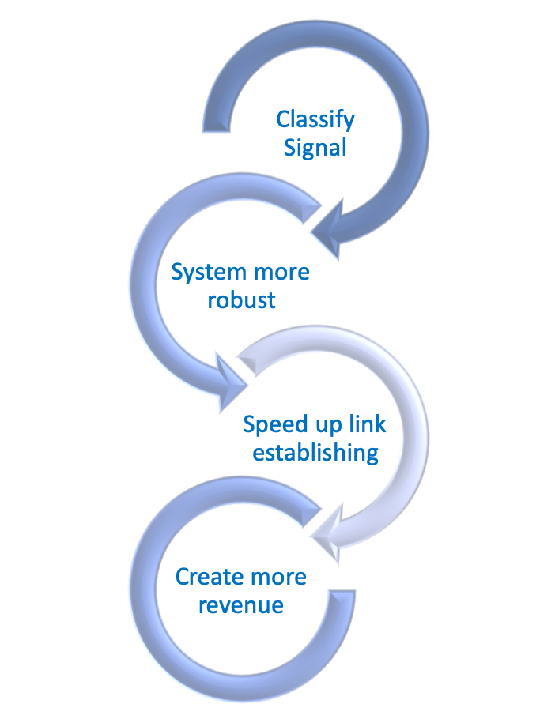
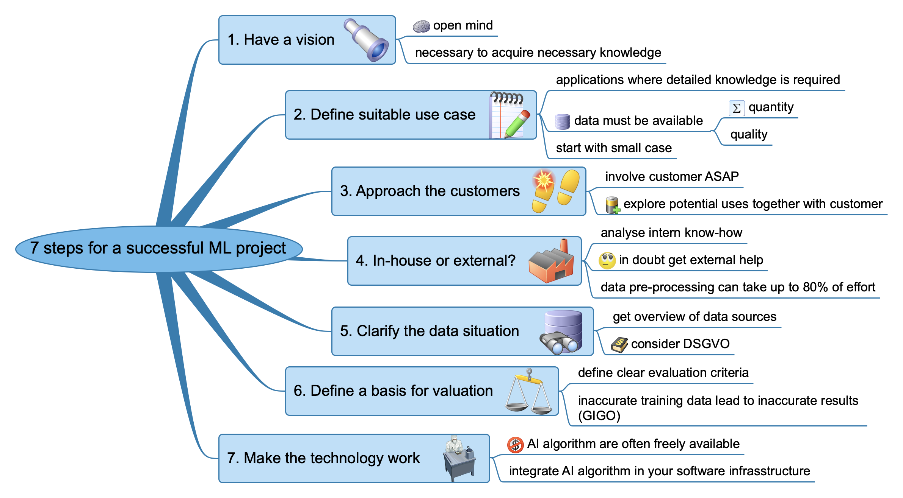
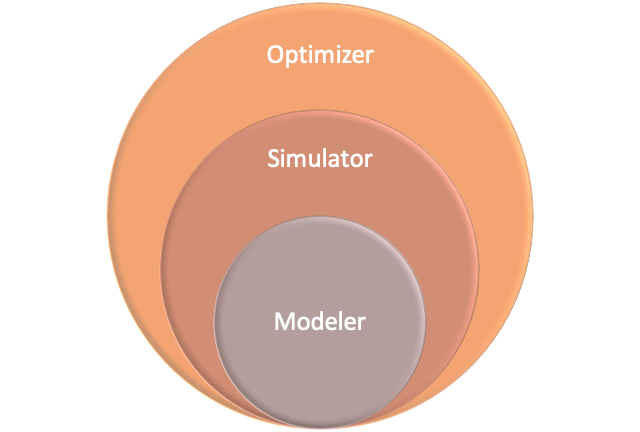

# Strategies for machine learning {#mlStrategie}
There are plenty of point of views and abstraction layers from which ML can be viewed, from the tiniest technical detail up to the birds eye view of management. In the following we give strategy examples for:

- management
- project management
- developer

Different roles will have different views on partly overlapping aspects. For example the subject of a project might have different names for different roles in a company, however, they all address the same project.


---

{width=40% } 

---

As for all discussions between peer groups it is important to find a common language to avoid misunderstanding and to have a clear and efficient way to communicate.


## Management ML strategy: 7 steps for a successful ML project {#mlStrategie7Steps}

This strategy was presented by MachinenMarkt https://www.maschinenmarkt.vogel.de/kuenstliche-intelligenz-ki-einfach-erklaert-beispiele-anwendungen-a-839104/.  

A mind map gives an overview of the strategy, the following text goes further into details.


---

{width=100% }


---


1. Have a vision  
An open mindset is important to acquire the necessary knowledge and understand the context of upcoming questions in production.

2. Define suitable use case  
Ideal for AI projects are applications where detailed knowledge is required. Important: For this purpose, data must be available to you in sufficient quantity and quality. It is best to start with a small dimensioned case.

3. Approach the customers  
Get your customers on board as soon as possible! You shouldn't wait for them to come to you. Show initiative and explore potential uses for AI projects together with these customers.

4. In-house or external?  
Analyse your know-how in relation to the concrete application. If you do not have your own data specialist, you should seek external support. Take the time to make your choice, ask around and trust in recommendations: The necessary preparation of the data often accounts for up to 80% of the entire project. You should only work with the best.

5. Clarify the data situation    
Get an overview of your data sources. Create a data map that records where and in what form company data is stored. Note: Any algorithm is only as good as its data basis. It is also important to clarify your obligations regarding personal data. Violations of the DSGVO quickly become expensive. 
  
6. Define a basis for valuation  
In industry, you are used to quantitative statements in particular - for example in measurement and production systems. However, the field of machine learning is also based on human impressions and experiences, i.e. on subjective and qualitative parameters. For your learning data this means: Define clear evaluation criteria, for example "good / bad" or "valid / not valid". Inaccurate learning data lead to an inaccurate result of artificial intelligence.

7. Make the technology work   
Import your data into the software now. The AI algorithms are usually freely available. You can find them as open source at cloud providers or on platforms like Github. Transfer the learned AI application to the process computer of your machine now. If your machine is older and does not yet have an industrial computer Retrofit it.


## Management ML strategy: Data Project Checklist {#DataProjectChecklist}

To identify the potential of machine learning for a organization a methodical approach is given in TBD. It relates to the drivetrain approach described in chapter \@ref(DriveTrainApproach), however, it is from management perspective and therefore focused on the strategic issues of the organization. 

<div class="rmdtip">
**The elements of drivetrain**

- Objective
- Levers
- Data needed
- Model assembly line

</div>


The elements from drivetrain are present in the data project checklist but not explicitly stated. Another example that in different roles the naming conventions differ. In the mind map below the strategy is presented, the yellow call-outs emphasizes the relation to the drivetrain approach.

---

![Strategy to identify machine learning potential in organization, figure based on [@fastaiBook2020]](images/JeremyStrategy.png){width=100% }


---

Starting from the most important strategic issues of the organization the possibility to work on those issues based on data is evaluated.  

Another starting point could be to look at the profit drivers which can be impacted strongly by the organization. Those could be operational actions (e.g. call customer) or strategic decisions (e.g. release new product) for which data must be available. The data might be already in the organization or might have to be acquired from a vendor, or it can be collected in the future.  

For the biggest identified opportunities for data-driven analysis in the organization few questions have to be answered in order to not lose sight of the top level objective. Also the question of ROI and time constraints have to be considered to streamline resources.

```{r eval=FALSE, include=FALSE}

Strategy

- What are the five most important strategic issues at the organization today?
    - What data is available to help deal with these issues?
    - Is a data-driven approach being used for these issues? 
    - Are data scientists working on these?
- What are the profit drivers that the organization can most strongly impact?
    - what are the specific actions and decisions that the organization can take that might influence that driver
        - operational actions (e.g., call customer) 
        - strategic decisions (e.g., release new product)?
        - what data might be available (either within the organization, or from a vendor, or that could be collected in the future)
- Based on the preceding analysis, what are the biggest opportunities for data-driven analysis within the organization?
    - For each opportunity: 
        - What value driver is it designed to influence?
        - What specific actions or decisions will it drive?
        - How will these actions and decisions be connected to the project’s results? 
        - What is the estimated ROI of the project?  
        - What time constraints and deadlines, if any, may impact it?

```


## Project management ML strategy: The Drivetrain Approach {#DriveTrainApproach}

The drivetrain approach was developed by Jeremy Howard, Margit Zwemer and Mike Loukides and published on [@howard2012designing] and the [O'Reilly](https://www.oreilly.com/radar/drivetrain-approach-data-products/) web page in 2012. The goal of this method is 

<blockquote>
We are entering the era of data as drivetrain, where we use data not just to generate more data (in the form of predictions), but use data to produce actionable outcomes.
[@howard2012designing]
</blockquote>


The method consists of four steps:

<div class="rmdtip">
**Four steps of drive train approach**

1. Start by defining a clear objective
2. Specify what inputs of the system we can control, the levers
3. Consider what data is needed
4. Build the Model Assembly Line

</div>


---

![The four steps in the Drivetrain Approach, figure from [@howard2012designing]](images/0312-2-drivetrain-step4-lg.png){width=100% }


---


 The four steps are detailed in the following sections using examples
 
 
### Recommendation system {#recommendationSystem}
Lets map the four steps to the topic "Recommendation system"

<div class="rmdtip">
**Mapping of steps**

1. Start by defining a clear objective
    - Drive additional sales by surprising and delighting the customer with books he or she would not have purchased without the recommendation 
2. Specify what inputs of the system we can control, the levers
    - Ranking of recommendations
3. Consider what data is needed
    - Reviews of books from customers
4. Build the Model Assembly Line
    - two models  
        a. probability book bought without recommendation
        b. prob with recommendation  
        c. difference between these two probabilities is a utility function for a given recommendation to a customer  
    - simulator
        - run models for many books
        - optimizer is ranking the books according to the simulations results

</div>


From the above it becomes clear that machine learning **produces actionable outcomes**, in this case a ranking of recommendations.


### Exercise: Optimizing lifetime customer value  {#OptimizingLifetimeCustomerValue}

How can the example in chapter \@ref(recommendationSystem) be extended to the new objective optimizing lifetime customer value?


**What are the leavers we got?  **

1. We can make product recommendations that surprise and delight (using the optimized recommendation outlined in the previous section).
2. We could offer tailored discounts or special offers on products the customer was not quite ready to buy or would have bought elsewhere.
3. We can even make customer-care calls just to see how the user is enjoying our site and make them feel that their feedback is valued.

**What about the data we need?**

That can vary case by case. For example the company [Outfittery](https://www.outfittery.de) asks the following questions to be able to optimize their recommendations.

- What do you like to wear in your spare time?  
- What do you wear for work?  
- Which shoes would you wear? 
- What would you NEVER wear?  
- Which brands do you like?  
- How old do you feel?  


**A model assembly line could look like the following graph**


 
---

![Drivetrain Step 4: The Model Assembly Line. Picture a Model Assembly Line for data products that transforms the raw data into an actionable outcome. The Modeler takes the raw data and converts it into slightly more refined predicted data, figure from  [@howard2012designing]](images/driveTrainModeller.png){width=100% .external}

---

To get the optimum of the objective the optimizer changes the levers (price, discounts, customer-calls). Those levers are inputs into the simulator, the simulation in turn uses the modeler to calculate the objective, here, the lifetime value of a customer.

---

{width=60%}

---


The actionable outcome is a combination of 

- Price tags for products
- Discounts
- Suggestions for customer-care calls


## Developer ML strategy TBD


