# (PART) Machine learning fundamentals {-} 


```{r setupMlFunda, include=FALSE}
knitr::opts_chunk$set(echo = FALSE)
```


# Machine learning fundamentals {#MachineLearningFundamentals}

 “If intelligence was a cake, unsupervised learning would be the cake, supervised learning would be the icing, and reinforcement learning would be the carry.” – Yann LeCun


# ML project process

Many ML projects get started the wrong way, trying a way to use data rather than using the data to fulfill a need, a need which has a benefit to the organization It is understandable that organizations want to learn from the data they have, but starting without a clear need in mind often leads to wasted efforts because sooner or later it will be discovered that the data available is not sufficient for a useful model.

At the start of a ML project there should be a clear formulated need which should be answered by the model, because ML is only a tool to help to achieve the objectives of the organization


```{block2 echo=TRUE, type='rmdtip'}

<p>At the beginning there is a need which ML is suitable to fulfill:</p>


- Optimize fertilizer usage
- Improve user experience
- Reduce energy cost
- Increase milk production

```


```{block2 echo=TRUE, type='HeadingNoNumber'}

The main project phases
  
```

Starting with the need the process can be split up in phases as shown below:

---

 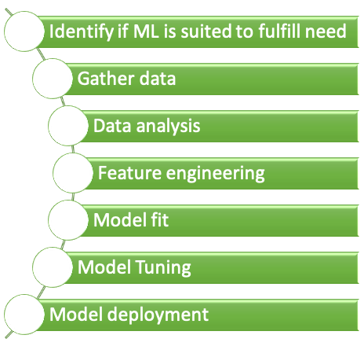{width=50% }


---

The process is not sequential but highly iterative as is described in the next chapters 

## Identify ML suited to fulfill need

There are plenty of needs within an organization and different entities within the organization will have different opinions about how to fulfill those needs. Often the people with the needs are not aware of the potential of ML to fulfill the need, on the other hand, often the people with ML knowledge don't know of the needs. It is therefore necessary to enable that the right people get in contact.


```{block2 echo=TRUE, type='rmdtip'}

<p>Enable contact people with:</p>

- Needs
- ML knowlegde

```


There are plenty of reasons why to choose a ML approach to fulfill the need, but there are also plenty of reasons why not to.


```{block2 echo=TRUE, type='rmdtip'}

<p>Reasons why ML approach should be chosen:</p>

- Suitable solution
    - meets need
    - low development effort
    - no alternative technology

- Build up ML knowledge

<p>Reasons why ML approach should NOT be chosen:</p>


- Less complex solution available
- Not enough experience to estimate effort
- Regulations might prohibit usage of ML due to testing requirements

```


ML right now is very fashionable, but if there is no benefit from choosing ML over another solution other than it is more exciting than think twice before you make your choice.


```{block2 echo=TRUE, type='rmdwarning'}

Make sure that the **most suitable** solution for the need is found, **not the fanciest.**

``` 


## Gather data TBC

Gathering data is one of the key aspects of an ML project with two main questions:

```{block2 echo=TRUE, type='rmdquestion'}

Two fundamental questions:

- How much data is necessary?
- Which data is useful?

```


### How much data is necessary?

There are a number of rules of thumb out there like

-For regression analysis
    - 10 times as many samples than parameters
- For image recognition
    - 1000 samples per category
    - can go down significantly using pre-trained models


but those rules a just a rough guidance since there are plenty of factors influencing the data needed


- model complexity
- similarity of data
    - the higher the similarity the less new samples help
- noise on data
- more samples
     - more computational effort
     - for trees might be counterproductive


Sometimes it is easy to create data. When Ayers was thinking about the title of his new book he targeted Google Ads, each with a different title. He got 250,000 samples related to which ad was clicked on most [@ayres2007super].


TBD:
- picture of bias and variance similar to https://towardsdatascience.com/breaking-the-curse-of-small-datasets-in-machine-learning-part-1-36f28b0c044d
- picture for transfer learning similar to https://medium.com/predict/dealing-with-the-lack-of-data-in-machine-learning-725f2abd2b92


There obviously cannot be a single number as an answer to this question. 

Well, you need roughly 10 times as many examples as there are degrees of freedom in your model.

- Number of categories to be predicted 
What is the expected output of your model? Basically, the fewest number or categories the better.

- Model Performance
If you plan on getting a product in production, you need more. A small dataset might be good enough for a proof of concept but in production, you’ll need way more data.


### Which data is useful?


## Exploratory data analysis

## Qunatitiave anaylsis

## Feature engineering


## Model fit


Lastly, the no free lunch theorems say that there is no a-priori superiority for any classifier system over the others, so the best classifier for a particular task is itself task-dependent. However there is more compelling theory for the SVM that suggests it is likely to be better choice than many other approaches for many problems.

## Model tuning

## After data gathering iteration is trump   {-}

---

 ![Figure from http://www.feat.engineering/intro-intro.html#the-model-versus-the-modeling-process (Image Credit: Owlsmcgee [Public domain] )](images/MLprocess.svg){width=100% .external}
 
---


EDA => exploratory data analysis  
source http://www.feat.engineering/intro-intro.html#the-model-versus-the-modeling-process]

```{block2 echo=TRUE, type='rmdtip'}

- <p>Exploratory data analysis </p>
    - Find correlations or mutial depence
- Quantiative analysis
    - Check distribution
        - Long tail => log of variable
- Feature engineering ^[Good source for feature engineering: http://www.feat.engineering/index.html]
    - Create and select meaningful features
- Model fit
    - Selecting a few suited models
- Model tuning
    - Vary model **hyperpparameters**


```


## Feature engineering

Variables that go into model are called:

```{block2 echo=TRUE, type='rmdtip'}

- <p>Predictors</p>
- Features
- Independent variables

```


Quantity being modeled called: 

```{block2 echo=TRUE, type='rmdtip'}

- <p>Prediction</p>
- Outcome
- Response
- Dependent variable

```


From input to output


```{block2 echo=TRUE, type='rmdtip'}

$$ outcome = f(features) = f(X_1, X_2, \dots, Xp) = f(X)  $$

$$ \hat{Y} = \hat{f}(X)$$

```


# ML types 

scikit-learn

<blockquote>

A comparison of a several classifiers in scikit-learn on synthetic datasets. The point of this example is to illustrate the nature of decision boundaries of different classifiers. This should be taken with a grain of salt, as the intuition conveyed by these examples does not necessarily carry over to real datasets.

Particularly in high-dimensional spaces, data can more easily be separated linearly and the simplicity of classifiers such as naive Bayes and linear SVMs might lead to better generalization than is achieved by other classifiers.

The plots show training points in solid colors and testing points semi-transparent. The lower right shows the classification accuracy on the test set.

https://scikit-learn.org/stable/auto_examples/classification/plot_classifier_comparison.html#sphx-glr-auto-examples-classification-plot-classifier-comparison-py
</blockquote>


 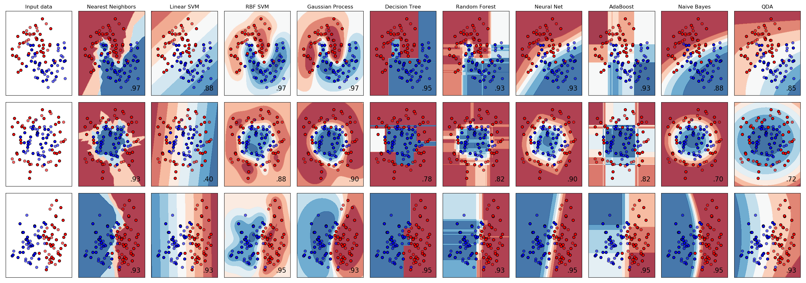{width=120% }


# ML algorithms {#MlAlgorithm}

## Linear regression TBD {#MlAlgoLinReg}


 {width=90%  .external}


## Logistic regression {#MlAlgoLogReg}

Logistic regression is a algorithm with the low computational complexity TBD

```{block2 echo=TRUE, type='rmdtip'}

- Low computational complexity
- Start algorithm to determine suitable algorithm
- Details of algorithm are given at 

```

```{r logsiticFuncitonMlAlgo, echo=FALSE, fig.height=5, message=FALSE, warning=FALSE}
library(ggplot2)
eq = function(x) {
  
  1/(1+exp(-x))
}

ggplot(data.frame(x=c(-6,6)), aes(x=x)) + stat_function(fun=eq, geom = "line") + xlab(expression(eta)) + ylab(expression(logsitic(eta)))
```


```{block2 echo=TRUE, type='rmdmath'}

$$ logistic(\eta) = \frac{1}{1+exp^{-\eta}}$$

$$P(Y = 1 \vert X_i = x_i) = \frac{1}{1+exp^{-(\beta_0 + \beta_1X_1+ \dots \beta_n X_n)}}$$

  
where:

- $\beta_n$ are the coeffcients we are searching
- $X_n$ are the features

```


## Tree based methods TBD {#MlAlgoTrees} 

Tree based methods can be used for different predictions:

```{block2 echo=TRUE, type='rmdtip'}

Types of predictions:

- Regression trees
    - predict quantitative response
- Classification trees
    - predict qualitative response

```

---

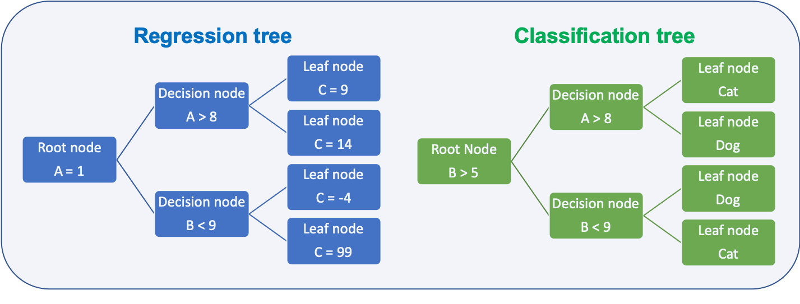{width=90% }

---

Depending on the task the metric to decide how to split the data is different:

```{block2 echo=TRUE, type='rmdtip'}

Metric for splits:

- Regression
    - Residual sum of squares ([RSS](https://en.wikipedia.org/wiki/Residual_sum_of_squares))
    - Goal is to minimize the value
- Classification
    - [Gini index](https://en.wikipedia.org/wiki/Decision_tree)
    - [Cross entropy](https://en.wikipedia.org/wiki/Cross_entropy)
    - Both metrics are numerically very similar
    - Goal is to minimize the value

```


### Splitting metrics

Deciding how to split the data at a node is done based on metrics which shall be minimal for the split

```{block2 echo=TRUE, type='rmdtip'}

Residual sum of squares (RSS):

- Regression trees
- How close are the samples to the mean of all samples in the resulting node  
- $RSS = \sum_{k=1}^{K}\sum_{bi€R_j}(y_i-\hat{y}_{Rj})^2$

Gini index:

- Classification
- How pure is are the resulting leafs  
- $G = \sum_{k=1}^{K}p_i(1-p_i)$


Cross-entropy:
  
- How pure is are the resulting leafs 
- $D = - \sum_{k=1}^{K}p_i \log_{10}(p_i)$
  
```

An example on how the gini value changes 
 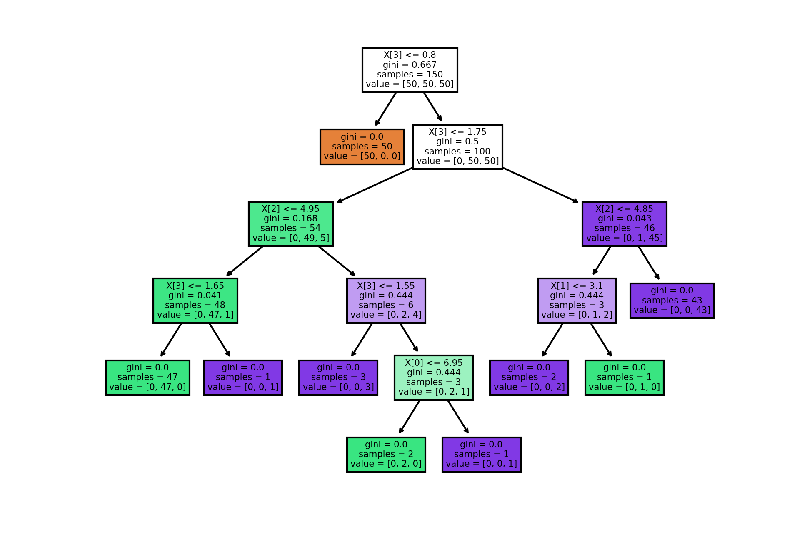{width=100% }


```python
# source: https://scikit-learn.org/stable/auto_examples/tree/plot_iris_dtc.html#sphx-glr-auto-examples-tree-plot-iris-dtc-py
import numpy as np
import matplotlib.pyplot as plt

from sklearn.datasets import load_iris
from sklearn.tree import DecisionTreeClassifier, plot_tree

# Parameters
n_classes = 3
plot_colors = "ryb"
plot_step = 0.02

# Load data
iris = load_iris()

for pairidx, pair in enumerate([[0, 1], [0, 2], [0, 3],
                                [1, 2], [1, 3], [2, 3]]):
    # We only take the two corresponding features
    X = iris.data[:, pair]
    y = iris.target

    # Train
    clf = DecisionTreeClassifier().fit(X, y)

    # Plot the decision boundary
    plt.subplot(2, 3, pairidx + 1)

    x_min, x_max = X[:, 0].min() - 1, X[:, 0].max() + 1
    y_min, y_max = X[:, 1].min() - 1, X[:, 1].max() + 1
    xx, yy = np.meshgrid(np.arange(x_min, x_max, plot_step),
                         np.arange(y_min, y_max, plot_step))
    plt.tight_layout(h_pad=0.5, w_pad=0.5, pad=2.5)

    Z = clf.predict(np.c_[xx.ravel(), yy.ravel()])
    Z = Z.reshape(xx.shape)
    cs = plt.contourf(xx, yy, Z, cmap=plt.cm.RdYlBu)

    plt.xlabel(iris.feature_names[pair[0]])
    plt.ylabel(iris.feature_names[pair[1]])

    # Plot the training points
    for i, color in zip(range(n_classes), plot_colors):
        idx = np.where(y == i)
        plt.scatter(X[idx, 0], X[idx, 1], c=color, label=iris.target_names[i],
                    cmap=plt.cm.RdYlBu, edgecolor='black', s=15)

plt.suptitle("Decision surface of a decision tree using paired features")
plt.legend(loc='lower right', borderpad=0, handletextpad=0)
plt.axis("tight")

plt.figure(dpi = 300) # Uwe Sterr added dpi argument for better readability of plot
clf = DecisionTreeClassifier().fit(iris.data, iris.target)
plot_tree(clf, filled=True)
plt.show()

```


### Ensembles

Prediction ability of a single decision tree is limited, several techniques are employed to enhance the ability. All of them are aimed at buidling a ensemble of trees which combined have a higher prediction ability than a single tree.

```{block2 echo=TRUE, type='rmdtip'}

Ensembling methods: 
  
- [Bootstrap](https://en.wikipedia.org/wiki/Bootstrapping_(statistics))
    - random sample with replacement
- [Bagging](https://en.wikipedia.org/wiki/Bootstrap_aggregating)
    - short for **b**ootstrap and **agg**regation
    - used for example with random forests
- [Boosting](https://en.wikipedia.org/wiki/Gradient_boosting)
    - build several trees
    - trees learn from errors of previous trees

```

#### Bootstrap

[Bootstrapping](https://en.wikipedia.org/wiki/Bootstrapping_(statistics)) is resembling method that relies on sampling with replacement as shown in the image below

---

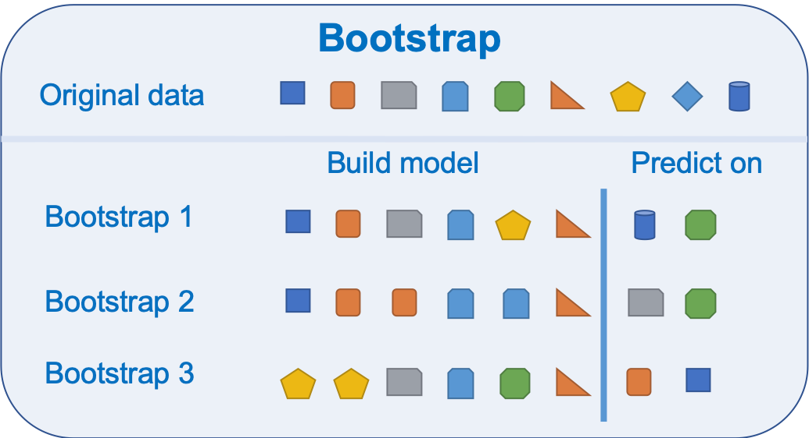{width=60% }

---
 
Bootstrap is a widely applicable and extremely powerful statistical tool that allow assigning measures of accuracy associated with a given estimator or statistical learning method.  
It is used by the random forest algorithm as described in chapter \@ref(MlAlgoTreesRandomForest) 

#### Bagging

[Bagging](https://en.wikipedia.org/wiki/Bootstrap_aggregating) is short for **b**ootstrap and **agg**regation and is a general purpose procedure for reducing the variance of a machine learning algorithm. It is particularly useful and frequently used in the context of decision trees.

For random forests the method works as follows:

```{block2 echo=TRUE, type='rmdtip'}
Bootstrapping for random forest:

- Generate training data by bootstrapping from the original training data set
- Generate a tree
- Repeat this M times
- Predict by averaging the predictions of all trees

```

#### Boosting

[Boosting](https://en.wikipedia.org/wiki/Gradient_boosting) can be utilized for regression and classification problems. It produces an ensemble of weak learners, typically decision trees. The models are build sequentially allowing optimization of an arbitrary differentiable loss function.
An example on how boosting works for tree is given in chapter \@ref(MlAlgoTreesGBM) 

#### Types of decision trees

Two dominant decision tree concepts are:


---

 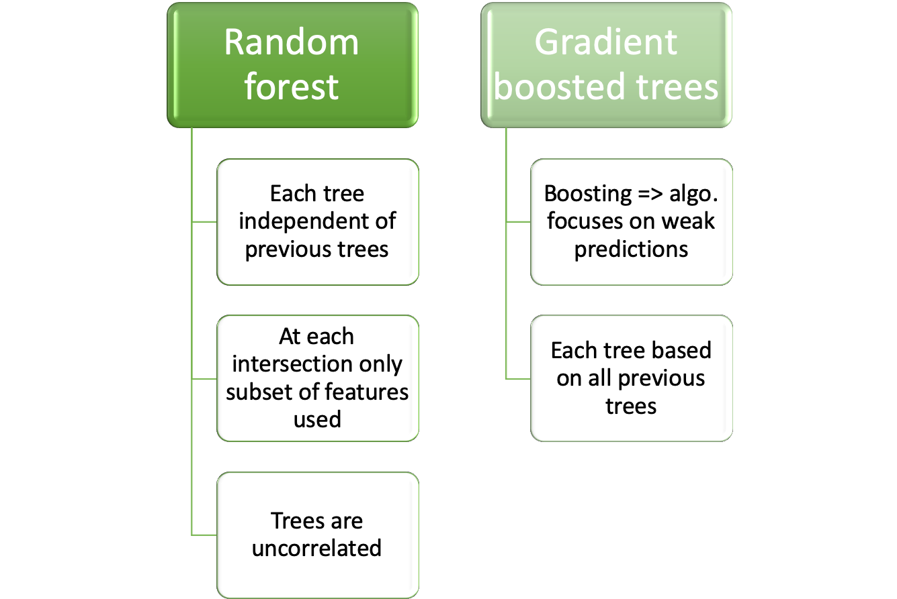{width=90% }

--- 

Two dominant concepts used for ensemble trees are described at:

- Random forest in chapter \@ref(MlAlgoTreesRandomForest) 
- Gradient boosted trees in chapter \@ref(MlAlgoTreesGBM) 


### Random forest TBD {#MlAlgoTreesRandomForest} 

Random forest has its name from the randomly selected predictors at each split. The Algorithm is described in [@kuhn2013applied] p. 200:

```{block2 echo=TRUE, type='rmdtip'}
Random forest algorithm:

- Select number of models to build _m_
- for each model
    - generate bootstrap sample of the original data
    - train a tree model for this sample
        - at each split
        - select randomly _k_ of the original predictors
        - select best predictor
        - partition the data
    - until model stop criteria is meet
- average prediction of all trees for new samples    

```

The algorithm can be depicted as below

 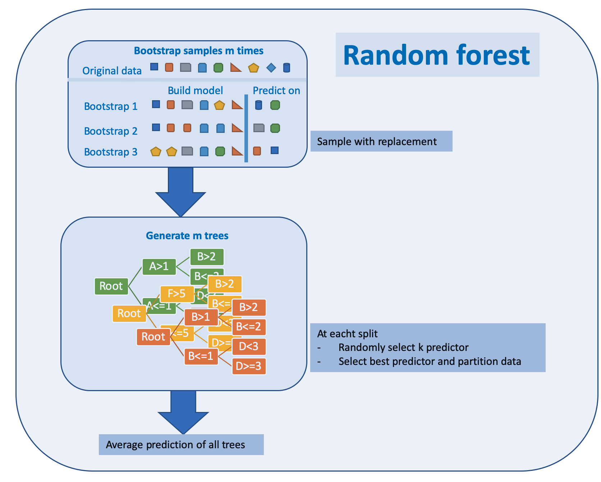{width=90% }


Random forests have weaknesses and strengths

```{block2 echo=TRUE, type='rmdtip'}

Pros and cons of random forest:

- Pro
     - Handle higher dimensionality data very well
     - Handles missing values well
- Cons     
    - Due to aggregation of all trees no precise values for regression

```

#### Python example for random forest

The sample code for a random forest classifier produces a ROC image as shown below


 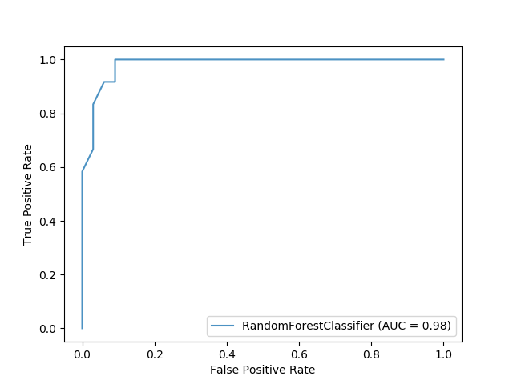{width=60% }
 
 
```Python

import matplotlib.pyplot as plt
from sklearn.ensemble import RandomForestClassifier
from sklearn.metrics import plot_roc_curve
from sklearn.datasets import load_wine
from sklearn.model_selection import train_test_split

X, y = load_wine(return_X_y=True)
y = y == 2

X_train, X_test, y_train, y_test = train_test_split(X, y, random_state=42)

rfc = RandomForestClassifier(n_estimators=10, random_state=42)
rfc.fit(X_train, y_train)
ax = plt.gca()
rfc_disp = plot_roc_curve(rfc, X_test, y_test, ax=ax, alpha=0.8)
plt.show()

```


#### Parameters for random forest

The parameters are from the scikit-learn webpage https://scikit-learn.org/stable/modules/generated/sklearn.ensemble.RandomForestClassifier.html#sklearn.ensemble.RandomForestClassifier

<dd class="field-odd"><dl>
<dt><strong>n_estimators</strong><span class="classifier">integer, optional (default=100)</span></dt><dd><p>The number of trees in the forest.</p>
<div class="versionchanged">
<p><span class="versionmodified changed">Changed in version 0.22: </span>The default value of <code class="docutils literal notranslate"><span class="pre">n_estimators</span></code> changed from 10 to 100
in 0.22.</p>
</div>
</dd>
<dt><strong>criterion</strong><span class="classifier">string, optional (default=”gini”)</span></dt><dd><p>The function to measure the quality of a split. Supported criteria are
“gini” for the Gini impurity and “entropy” for the information gain.
Note: this parameter is tree-specific.</p>
</dd>
<dt><strong>max_depth</strong><span class="classifier">integer or None, optional (default=None)</span></dt><dd><p>The maximum depth of the tree. If None, then nodes are expanded until
all leaves are pure or until all leaves contain less than
min_samples_split samples.</p>
</dd>
<dt><strong>min_samples_split</strong><span class="classifier">int, float, optional (default=2)</span></dt><dd><p>The minimum number of samples required to split an internal node:</p>
<ul class="simple">
<li><p>If int, then consider <code class="docutils literal notranslate"><span class="pre">min_samples_split</span></code> as the minimum number.</p></li>
<li><p>If float, then <code class="docutils literal notranslate"><span class="pre">min_samples_split</span></code> is a fraction and
<code class="docutils literal notranslate"><span class="pre">ceil(min_samples_split</span> <span class="pre">*</span> <span class="pre">n_samples)</span></code> are the minimum
number of samples for each split.</p></li>
</ul>
<div class="versionchanged">
<p><span class="versionmodified changed">Changed in version 0.18: </span>Added float values for fractions.</p>
</div>
</dd>
<dt><strong>min_samples_leaf</strong><span class="classifier">int, float, optional (default=1)</span></dt><dd><p>The minimum number of samples required to be at a leaf node.
A split point at any depth will only be considered if it leaves at
least <code class="docutils literal notranslate"><span class="pre">min_samples_leaf</span></code> training samples in each of the left and
right branches.  This may have the effect of smoothing the model,
especially in regression.</p>
<ul class="simple">
<li><p>If int, then consider <code class="docutils literal notranslate"><span class="pre">min_samples_leaf</span></code> as the minimum number.</p></li>
<li><p>If float, then <code class="docutils literal notranslate"><span class="pre">min_samples_leaf</span></code> is a fraction and
<code class="docutils literal notranslate"><span class="pre">ceil(min_samples_leaf</span> <span class="pre">*</span> <span class="pre">n_samples)</span></code> are the minimum
number of samples for each node.</p></li>
</ul>
<div class="versionchanged">
<p><span class="versionmodified changed">Changed in version 0.18: </span>Added float values for fractions.</p>
</div>
</dd>
<dt><strong>min_weight_fraction_leaf</strong><span class="classifier">float, optional (default=0.)</span></dt><dd><p>The minimum weighted fraction of the sum total of weights (of all
the input samples) required to be at a leaf node. Samples have
equal weight when sample_weight is not provided.</p>
</dd>
<dt><strong>max_features</strong><span class="classifier">int, float, string or None, optional (default=”auto”)</span></dt><dd><p>The number of features to consider when looking for the best split:</p>
<ul class="simple">
<li><p>If int, then consider <code class="docutils literal notranslate"><span class="pre">max_features</span></code> features at each split.</p></li>
<li><p>If float, then <code class="docutils literal notranslate"><span class="pre">max_features</span></code> is a fraction and
<code class="docutils literal notranslate"><span class="pre">int(max_features</span> <span class="pre">*</span> <span class="pre">n_features)</span></code> features are considered at each
split.</p></li>
<li><p>If “auto”, then <code class="docutils literal notranslate"><span class="pre">max_features=sqrt(n_features)</span></code>.</p></li>
<li><p>If “sqrt”, then <code class="docutils literal notranslate"><span class="pre">max_features=sqrt(n_features)</span></code> (same as “auto”).</p></li>
<li><p>If “log2”, then <code class="docutils literal notranslate"><span class="pre">max_features=log2(n_features)</span></code>.</p></li>
<li><p>If None, then <code class="docutils literal notranslate"><span class="pre">max_features=n_features</span></code>.</p></li>
</ul>
<p>Note: the search for a split does not stop until at least one
valid partition of the node samples is found, even if it requires to
effectively inspect more than <code class="docutils literal notranslate"><span class="pre">max_features</span></code> features.</p>
</dd>
<dt><strong>max_leaf_nodes</strong><span class="classifier">int or None, optional (default=None)</span></dt><dd><p>Grow trees with <code class="docutils literal notranslate"><span class="pre">max_leaf_nodes</span></code> in best-first fashion.
Best nodes are defined as relative reduction in impurity.
If None then unlimited number of leaf nodes.</p>
</dd>
<dt><strong>min_impurity_decrease</strong><span class="classifier">float, optional (default=0.)</span></dt><dd><p>A node will be split if this split induces a decrease of the impurity
greater than or equal to this value.</p>
<p>The weighted impurity decrease equation is the following:</p>
<div class="highlight-default notranslate" style="position: relative;"><div class="highlight"><pre><span></span><span class="n">N_t</span> <span class="o">/</span> <span class="n">N</span> <span class="o">*</span> <span class="p">(</span><span class="n">impurity</span> <span class="o">-</span> <span class="n">N_t_R</span> <span class="o">/</span> <span class="n">N_t</span> <span class="o">*</span> <span class="n">right_impurity</span>
                    <span class="o">-</span> <span class="n">N_t_L</span> <span class="o">/</span> <span class="n">N_t</span> <span class="o">*</span> <span class="n">left_impurity</span><span class="p">)</span>
</pre></div>
</div>
<p>where <code class="docutils literal notranslate"><span class="pre">N</span></code> is the total number of samples, <code class="docutils literal notranslate"><span class="pre">N_t</span></code> is the number of
samples at the current node, <code class="docutils literal notranslate"><span class="pre">N_t_L</span></code> is the number of samples in the
left child, and <code class="docutils literal notranslate"><span class="pre">N_t_R</span></code> is the number of samples in the right child.</p>
<p><code class="docutils literal notranslate"><span class="pre">N</span></code>, <code class="docutils literal notranslate"><span class="pre">N_t</span></code>, <code class="docutils literal notranslate"><span class="pre">N_t_R</span></code> and <code class="docutils literal notranslate"><span class="pre">N_t_L</span></code> all refer to the weighted sum,
if <code class="docutils literal notranslate"><span class="pre">sample_weight</span></code> is passed.</p>
<div class="versionadded">
<p><span class="versionmodified added">New in version 0.19.</span></p>
</div>
</dd>
<dt><strong>min_impurity_split</strong><span class="classifier">float, (default=1e-7)</span></dt><dd><p>Threshold for early stopping in tree growth. A node will split
if its impurity is above the threshold, otherwise it is a leaf.</p>
<div class="deprecated">
<p><span class="versionmodified deprecated">Deprecated since version 0.19: </span><code class="docutils literal notranslate"><span class="pre">min_impurity_split</span></code> has been deprecated in favor of
<code class="docutils literal notranslate"><span class="pre">min_impurity_decrease</span></code> in 0.19. The default value of
<code class="docutils literal notranslate"><span class="pre">min_impurity_split</span></code> will change from 1e-7 to 0 in 0.23 and it
will be removed in 0.25. Use <code class="docutils literal notranslate"><span class="pre">min_impurity_decrease</span></code> instead.</p>
</div>
</dd>
<dt><strong>bootstrap</strong><span class="classifier">boolean, optional (default=True)</span></dt><dd><p>Whether bootstrap samples are used when building trees. If False, the
whole datset is used to build each tree.</p>
</dd>
<dt><strong>oob_score</strong><span class="classifier">bool (default=False)</span></dt><dd><p>Whether to use out-of-bag samples to estimate
the generalization accuracy.</p>
</dd>
<dt><strong>n_jobs</strong><span class="classifier">int or None, optional (default=None)</span></dt><dd><p>The number of jobs to run in parallel. <a class="reference internal" href="#sklearn.ensemble.RandomForestClassifier.fit" title="sklearn.ensemble.RandomForestClassifier.fit"><code class="xref py py-meth docutils literal notranslate"><span class="pre">fit</span></code></a>, <a class="reference internal" href="#sklearn.ensemble.RandomForestClassifier.predict" title="sklearn.ensemble.RandomForestClassifier.predict"><code class="xref py py-meth docutils literal notranslate"><span class="pre">predict</span></code></a>,
<a class="reference internal" href="#sklearn.ensemble.RandomForestClassifier.decision_path" title="sklearn.ensemble.RandomForestClassifier.decision_path"><code class="xref py py-meth docutils literal notranslate"><span class="pre">decision_path</span></code></a> and <a class="reference internal" href="#sklearn.ensemble.RandomForestClassifier.apply" title="sklearn.ensemble.RandomForestClassifier.apply"><code class="xref py py-meth docutils literal notranslate"><span class="pre">apply</span></code></a> are all parallelized over the
trees. <code class="docutils literal notranslate"><span class="pre">None</span></code> means 1 unless in a <a class="reference external" href="https://joblib.readthedocs.io/en/latest/parallel.html#joblib.parallel_backend" title="(in joblib v0.14.1.dev0)"><code class="xref py py-obj docutils literal notranslate"><span class="pre">joblib.parallel_backend</span></code></a>
context. <code class="docutils literal notranslate"><span class="pre">-1</span></code> means using all processors. See <a class="reference internal" href="../../glossary.html#term-n-jobs"><span class="xref std std-term">Glossary</span></a> for more details.</p>
</dd>
<dt><strong>random_state</strong><span class="classifier">int, RandomState instance or None, optional (default=None)</span></dt><dd><p>Controls both the randomness of the bootstrapping of the samples used
when building trees (if <code class="docutils literal notranslate"><span class="pre">bootstrap=True</span></code>) and the sampling of the
features to consider when looking for the best split at each node
(if <code class="docutils literal notranslate"><span class="pre">max_features</span> <span class="pre">&lt;</span> <span class="pre">n_features</span></code>).
See <a class="reference internal" href="../../glossary.html#term-random-state"><span class="xref std std-term">Glossary</span></a> for details.</p>
</dd>
<dt><strong>verbose</strong><span class="classifier">int, optional (default=0)</span></dt><dd><p>Controls the verbosity when fitting and predicting.</p>
</dd>
<dt><strong>warm_start</strong><span class="classifier">bool, optional (default=False)</span></dt><dd><p>When set to <code class="docutils literal notranslate"><span class="pre">True</span></code>, reuse the solution of the previous call to fit
and add more estimators to the ensemble, otherwise, just fit a whole
new forest. See <a class="reference internal" href="../../glossary.html#term-warm-start"><span class="xref std std-term">the Glossary</span></a>.</p>
</dd>
<dt><strong>class_weight</strong><span class="classifier">dict, list of dicts, “balanced”, “balanced_subsample” or     None, optional (default=None)</span></dt><dd><p>Weights associated with classes in the form <code class="docutils literal notranslate"><span class="pre">{class_label:</span> <span class="pre">weight}</span></code>.
If not given, all classes are supposed to have weight one. For
multi-output problems, a list of dicts can be provided in the same
order as the columns of y.</p>
<p>Note that for multioutput (including multilabel) weights should be
defined for each class of every column in its own dict. For example,
for four-class multilabel classification weights should be
[{0: 1, 1: 1}, {0: 1, 1: 5}, {0: 1, 1: 1}, {0: 1, 1: 1}] instead of
[{1:1}, {2:5}, {3:1}, {4:1}].</p>
<p>The “balanced” mode uses the values of y to automatically adjust
weights inversely proportional to class frequencies in the input data
as <code class="docutils literal notranslate"><span class="pre">n_samples</span> <span class="pre">/</span> <span class="pre">(n_classes</span> <span class="pre">*</span> <span class="pre">np.bincount(y))</span></code></p>
<p>The “balanced_subsample” mode is the same as “balanced” except that
weights are computed based on the bootstrap sample for every tree
grown.</p>
<p>For multi-output, the weights of each column of y will be multiplied.</p>
<p>Note that these weights will be multiplied with sample_weight (passed
through the fit method) if sample_weight is specified.</p>
</dd>
<dt><strong>ccp_alpha</strong><span class="classifier">non-negative float, optional (default=0.0)</span></dt><dd><p>Complexity parameter used for Minimal Cost-Complexity Pruning. The
subtree with the largest cost complexity that is smaller than
<code class="docutils literal notranslate"><span class="pre">ccp_alpha</span></code> will be chosen. By default, no pruning is performed. See
<a class="reference internal" href="../tree.html#minimal-cost-complexity-pruning"><span class="std std-ref">Minimal Cost-Complexity Pruning</span></a> for details.</p>
<div class="versionadded">
<p><span class="versionmodified added">New in version 0.22.</span></p>
</div>
</dd>
<dt><strong>max_samples</strong><span class="classifier">int or float, default=None</span></dt><dd><p>If bootstrap is True, the number of samples to draw from X
to train each base estimator.</p>
<ul class="simple">
<li><p>If None (default), then draw <code class="docutils literal notranslate"><span class="pre">X.shape[0]</span></code> samples.</p></li>
<li><p>If int, then draw <code class="docutils literal notranslate"><span class="pre">max_samples</span></code> samples.</p></li>
<li><p>If float, then draw <code class="docutils literal notranslate"><span class="pre">max_samples</span> <span class="pre">*</span> <span class="pre">X.shape[0]</span></code> samples. Thus,
<code class="docutils literal notranslate"><span class="pre">max_samples</span></code> should be in the interval <code class="docutils literal notranslate"><span class="pre">(0,</span> <span class="pre">1)</span></code>.</p></li>
</ul>
<div class="versionadded">
<p><span class="versionmodified added">New in version 0.22.</span></p>
</div>
</dd>
</dl>
</dd>


### Boosted trees TBD {#MlAlgoTreesGBM} 

Boosted trees are an ensemble of weak learners where each learner is build on the knowledge gained by all previous learners. 


The following image depicts the algorithm which can be summarized:

```{block2 echo=TRUE, type='rmdtip'}

Boosted tree algorithm

1. Generate small tree
1. Calculate residuals for all samples
1. Use residuals to generate next tree
1. Combine all trees to build new model
1. Repeat from step 1.

```

The algorithm is depicted below

---

 ![Figure based on [@zhang2018exploring], added explanation at the right hand side](images/gradientBoostedTreesSimple.png){width=100% .external}

---

Boosted trees have weaknesses and strengths

```{block2 echo=TRUE, type='rmdtip'}

Pros and cons of boosted trees:

- Pro
     - Supports different loss functions
- Cons     
    - Prone to overfitting
    - Carefully tuning of hyperparameters is required

```

The algorithm of boosted trees for regression is described in a rather mathematically way in [@james2013introduction] p. 323:

```{block2 echo=TRUE, type='rmdtip'}

1. Set $\hat{f} = 0$ and  $r_i = y_i$ for all $i$ in the training set
1. For $b=1,2,\dots,B$ repeat:
    a. Fit a tree $\hat{f}^b$ with $d$ splits ($d+1$ terminal nodes) to the training data $(X,r)$
    a. Update $\hat{f}$ by adding in a shrunken version of the new tree $\hat{f}(x) \leftarrow \hat{f}(x) + \lambda \hat{f}^b(x)$
    a. Update the residuals $r_i \leftarrow r_i + \lambda \hat{f}^b(x_i)$
1. Output the boosted model $\hat{f}(x) = \sum_{b=1}^{B}\lambda \hat{f}^b(x)$

``` 


Another introduction to boosted trees is given at the [XGBoost Documentation](https://xgboost.readthedocs.io/en/latest/tutorials/model.html) with a thorough mathematical explanation of the approach.

#### Python examples for boosted trees

A popular library for boosted trees in Python is **XGBoost**, the documentation is hosted at https://xgboost.readthedocs.io/en/latest/.   
Plenty of examples are on the GitHub page https://github.com/dmlc/xgboost/tree/master/demo/guide-python.

The example script **basic_walkthrough.py** is shown below 


```python
#!/usr/bin/python
import numpy as np
import scipy.sparse
import pickle
import xgboost as xgb

### simple example
# load file from text file, also binary buffer generated by xgboost
dtrain = xgb.DMatrix('../data/agaricus.txt.train')
dtest = xgb.DMatrix('../data/agaricus.txt.test')

# specify parameters via map, definition are same as c++ version
param = {'max_depth':2, 'eta':1, 'silent':1, 'objective':'binary:logistic'}

# specify validations set to watch performance
watchlist = [(dtest, 'eval'), (dtrain, 'train')]
num_round = 2
bst = xgb.train(param, dtrain, num_round, watchlist)

# this is prediction
preds = bst.predict(dtest)
labels = dtest.get_label()
print('error=%f' % (sum(1 for i in range(len(preds)) if int(preds[i] > 0.5) != labels[i]) / float(len(preds))))
bst.save_model('0001.model')
# dump model
bst.dump_model('dump.raw.txt')
# dump model with feature map
bst.dump_model('dump.nice.txt', '../data/featmap.txt')

# save dmatrix into binary buffer
dtest.save_binary('dtest.buffer')
# save model
bst.save_model('xgb.model')
# load model and data in
bst2 = xgb.Booster(model_file='xgb.model')
dtest2 = xgb.DMatrix('dtest.buffer')
preds2 = bst2.predict(dtest2)
# assert they are the same
assert np.sum(np.abs(preds2 - preds)) == 0

# alternatively, you can pickle the booster
pks = pickle.dumps(bst2)
# load model and data in
bst3 = pickle.loads(pks)
preds3 = bst3.predict(dtest2)
# assert they are the same
assert np.sum(np.abs(preds3 - preds)) == 0

###
# build dmatrix from scipy.sparse
print('start running example of build DMatrix from scipy.sparse CSR Matrix')
labels = []
row = []; col = []; dat = []
i = 0
for l in open('../data/agaricus.txt.train'):
    arr = l.split()
    labels.append(int(arr[0]))
    for it in arr[1:]:
        k,v = it.split(':')
        row.append(i); col.append(int(k)); dat.append(float(v))
    i += 1
csr = scipy.sparse.csr_matrix((dat, (row, col)))
dtrain = xgb.DMatrix(csr, label=labels)
watchlist = [(dtest, 'eval'), (dtrain, 'train')]
bst = xgb.train(param, dtrain, num_round, watchlist)

print('start running example of build DMatrix from scipy.sparse CSC Matrix')
# we can also construct from csc matrix
csc = scipy.sparse.csc_matrix((dat, (row, col)))
dtrain = xgb.DMatrix(csc, label=labels)
watchlist = [(dtest, 'eval'), (dtrain, 'train')]
bst = xgb.train(param, dtrain, num_round, watchlist)

print('start running example of build DMatrix from numpy array')
# NOTE: npymat is numpy array, we will convert it into scipy.sparse.csr_matrix in internal implementation
# then convert to DMatrix
npymat = csr.todense()
dtrain = xgb.DMatrix(npymat, label=labels)
watchlist = [(dtest, 'eval'), (dtrain, 'train')]
bst = xgb.train(param, dtrain, num_round, watchlist)

```


The parameters below are from their webpage https://xgboost.readthedocs.io/en/latest/parameter.html#learning-task-parameters

<div class="section" id="learning-task-parameters">
<h2>Learning Task Parameters<a class="headerlink" href="#learning-task-parameters" title="Permalink to this headline">¶</a></h2>
<p>Specify the learning task and the corresponding learning objective. The objective options are below:</p>
<ul class="simple">
<li><p><code class="docutils literal notranslate"><span class="pre">objective</span></code> [default=reg:squarederror]</p>
<ul>
<li><p><code class="docutils literal notranslate"><span class="pre">reg:squarederror</span></code>: regression with squared loss.</p></li>
<li><p><code class="docutils literal notranslate"><span class="pre">reg:squaredlogerror</span></code>: regression with squared log loss <span class="math notranslate nohighlight"><span class="MathJax_Preview" style="color: inherit;"></span><span class="MathJax" id="MathJax-Element-1-Frame" tabindex="0" style="position: relative;" data-mathml="<math xmlns=&quot;http://www.w3.org/1998/Math/MathML&quot;><mfrac><mn>1</mn><mn>2</mn></mfrac><mo stretchy=&quot;false&quot;>[</mo><mi>l</mi><mi>o</mi><mi>g</mi><mo stretchy=&quot;false&quot;>(</mo><mi>p</mi><mi>r</mi><mi>e</mi><mi>d</mi><mo>+</mo><mn>1</mn><mo stretchy=&quot;false&quot;>)</mo><mo>&amp;#x2212;</mo><mi>l</mi><mi>o</mi><mi>g</mi><mo stretchy=&quot;false&quot;>(</mo><mi>l</mi><mi>a</mi><mi>b</mi><mi>e</mi><mi>l</mi><mo>+</mo><mn>1</mn><mo stretchy=&quot;false&quot;>)</mo><msup><mo stretchy=&quot;false&quot;>]</mo><mn>2</mn></msup></math>" role="presentation"><nobr aria-hidden="true"><span class="math" id="MathJax-Span-1" style="width: 17.593em; display: inline-block;"><span style="display: inline-block; position: relative; width: 14.163em; height: 0px; font-size: 124%;"><span style="position: absolute; clip: rect(1.587em, 1014.16em, 3.155em, -1000em); top: -2.621em; left: 0em;"><span class="mrow" id="MathJax-Span-2"><span class="mfrac" id="MathJax-Span-3"><span style="display: inline-block; position: relative; width: 0.474em; height: 0px; margin-right: 0.12em; margin-left: 0.12em;"><span style="position: absolute; clip: rect(3.353em, 1000.28em, 4.133em, -1000em); top: -4.386em; left: 50%; margin-left: -0.177em;"><span class="mn" id="MathJax-Span-4" style="font-size: 70.7%; font-family: STIXGeneral;">1</span><span style="display: inline-block; width: 0px; height: 3.982em;"></span></span><span style="position: absolute; clip: rect(3.353em, 1000.34em, 4.133em, -1000em); top: -3.599em; left: 50%; margin-left: -0.177em;"><span class="mn" id="MathJax-Span-5" style="font-size: 70.7%; font-family: STIXGeneral;">2</span><span style="display: inline-block; width: 0px; height: 3.982em;"></span></span><span style="position: absolute; clip: rect(0.844em, 1000.47em, 1.21em, -1000em); top: -1.278em; left: 0em;"><span style="display: inline-block; overflow: hidden; vertical-align: 0em; border-top: 1.3px solid; width: 0.474em; height: 0px;"></span><span style="display: inline-block; width: 0px; height: 1.058em;"></span></span></span></span><span class="mo" id="MathJax-Span-6" style="font-family: STIXGeneral;">[</span><span class="mi" id="MathJax-Span-7" style="font-family: STIXGeneral; font-style: italic;">𝑙</span><span class="mi" id="MathJax-Span-8" style="font-family: STIXGeneral; font-style: italic;">𝑜</span><span class="mi" id="MathJax-Span-9" style="font-family: STIXGeneral; font-style: italic;">𝑔</span><span class="mo" id="MathJax-Span-10" style="font-family: STIXGeneral;">(</span><span class="mi" id="MathJax-Span-11" style="font-family: STIXGeneral; font-style: italic;">𝑝</span><span class="mi" id="MathJax-Span-12" style="font-family: STIXGeneral; font-style: italic;">𝑟</span><span class="mi" id="MathJax-Span-13" style="font-family: STIXGeneral; font-style: italic;">𝑒</span><span class="mi" id="MathJax-Span-14" style="font-family: STIXGeneral; font-style: italic;">𝑑</span><span class="mo" id="MathJax-Span-15" style="font-family: STIXGeneral; padding-left: 0.25em;">+</span><span class="mn" id="MathJax-Span-16" style="font-family: STIXGeneral; padding-left: 0.25em;">1</span><span class="mo" id="MathJax-Span-17" style="font-family: STIXGeneral;">)</span><span class="mo" id="MathJax-Span-18" style="font-family: STIXGeneral; padding-left: 0.25em;">−</span><span class="mi" id="MathJax-Span-19" style="font-family: STIXGeneral; font-style: italic; padding-left: 0.25em;">𝑙</span><span class="mi" id="MathJax-Span-20" style="font-family: STIXGeneral; font-style: italic;">𝑜</span><span class="mi" id="MathJax-Span-21" style="font-family: STIXGeneral; font-style: italic;">𝑔</span><span class="mo" id="MathJax-Span-22" style="font-family: STIXGeneral;">(</span><span class="mi" id="MathJax-Span-23" style="font-family: STIXGeneral; font-style: italic;">𝑙</span><span class="mi" id="MathJax-Span-24" style="font-family: STIXGeneral; font-style: italic;">𝑎</span><span class="mi" id="MathJax-Span-25" style="font-family: STIXGeneral; font-style: italic;">𝑏</span><span class="mi" id="MathJax-Span-26" style="font-family: STIXGeneral; font-style: italic;">𝑒</span><span class="mi" id="MathJax-Span-27" style="font-family: STIXGeneral; font-style: italic;">𝑙</span><span class="mo" id="MathJax-Span-28" style="font-family: STIXGeneral; padding-left: 0.25em;">+</span><span class="mn" id="MathJax-Span-29" style="font-family: STIXGeneral; padding-left: 0.25em;">1</span><span class="mo" id="MathJax-Span-30" style="font-family: STIXGeneral;">)</span><span class="msubsup" id="MathJax-Span-31"><span style="display: inline-block; position: relative; width: 0.762em; height: 0px;"><span style="position: absolute; clip: rect(3.169em, 1000.25em, 4.289em, -1000em); top: -3.982em; left: 0em;"><span class="mo" id="MathJax-Span-32" style="font-family: STIXGeneral;">]</span><span style="display: inline-block; width: 0px; height: 3.982em;"></span></span><span style="position: absolute; top: -4.345em; left: 0.333em;"><span class="mn" id="MathJax-Span-33" style="font-size: 70.7%; font-family: STIXGeneral;">2</span><span style="display: inline-block; width: 0px; height: 3.982em;"></span></span></span></span></span><span style="display: inline-block; width: 0px; height: 2.621em;"></span></span></span><span style="display: inline-block; overflow: hidden; vertical-align: -0.537em; border-left: 0px solid; width: 0px; height: 1.694em;"></span></span></nobr><span class="MJX_Assistive_MathML" role="presentation"><math xmlns="http://www.w3.org/1998/Math/MathML"><mfrac><mn>1</mn><mn>2</mn></mfrac><mo stretchy="false">[</mo><mi>l</mi><mi>o</mi><mi>g</mi><mo stretchy="false">(</mo><mi>p</mi><mi>r</mi><mi>e</mi><mi>d</mi><mo>+</mo><mn>1</mn><mo stretchy="false">)</mo><mo>−</mo><mi>l</mi><mi>o</mi><mi>g</mi><mo stretchy="false">(</mo><mi>l</mi><mi>a</mi><mi>b</mi><mi>e</mi><mi>l</mi><mo>+</mo><mn>1</mn><mo stretchy="false">)</mo><msup><mo stretchy="false">]</mo><mn>2</mn></msup></math></span></span><script type="math/tex" id="MathJax-Element-1">\frac{1}{2}[log(pred + 1) - log(label + 1)]^2</script></span>.  All input labels are required to be greater than -1.  Also, see metric <code class="docutils literal notranslate"><span class="pre">rmsle</span></code> for possible issue  with this objective.</p></li>
<li><p><code class="docutils literal notranslate"><span class="pre">reg:logistic</span></code>: logistic regression</p></li>
<li><p><code class="docutils literal notranslate"><span class="pre">binary:logistic</span></code>: logistic regression for binary classification, output probability</p></li>
<li><p><code class="docutils literal notranslate"><span class="pre">binary:logitraw</span></code>: logistic regression for binary classification, output score before logistic transformation</p></li>
<li><p><code class="docutils literal notranslate"><span class="pre">binary:hinge</span></code>: hinge loss for binary classification. This makes predictions of 0 or 1, rather than producing probabilities.</p></li>
<li><p><code class="docutils literal notranslate"><span class="pre">count:poisson</span></code> –poisson regression for count data, output mean of poisson distribution</p>
<ul>
<li><p><code class="docutils literal notranslate"><span class="pre">max_delta_step</span></code> is set to 0.7 by default in poisson regression (used to safeguard optimization)</p></li>
</ul>
</li>
<li><p><code class="docutils literal notranslate"><span class="pre">survival:cox</span></code>: Cox regression for right censored survival time data (negative values are considered right censored).
Note that predictions are returned on the hazard ratio scale (i.e., as HR = exp(marginal_prediction) in the proportional hazard function <code class="docutils literal notranslate"><span class="pre">h(t)</span> <span class="pre">=</span> <span class="pre">h0(t)</span> <span class="pre">*</span> <span class="pre">HR</span></code>).</p></li>
<li><p><code class="docutils literal notranslate"><span class="pre">multi:softmax</span></code>: set XGBoost to do multiclass classification using the softmax objective, you also need to set num_class(number of classes)</p></li>
<li><p><code class="docutils literal notranslate"><span class="pre">multi:softprob</span></code>: same as softmax, but output a vector of <code class="docutils literal notranslate"><span class="pre">ndata</span> <span class="pre">*</span> <span class="pre">nclass</span></code>, which can be further reshaped to <code class="docutils literal notranslate"><span class="pre">ndata</span> <span class="pre">*</span> <span class="pre">nclass</span></code> matrix. The result contains predicted probability of each data point belonging to each class.</p></li>
<li><p><code class="docutils literal notranslate"><span class="pre">rank:pairwise</span></code>: Use LambdaMART to perform pairwise ranking where the pairwise loss is minimized</p></li>
<li><p><code class="docutils literal notranslate"><span class="pre">rank:ndcg</span></code>: Use LambdaMART to perform list-wise ranking where <a class="reference external" href="http://en.wikipedia.org/wiki/NDCG">Normalized Discounted Cumulative Gain (NDCG)</a> is maximized</p></li>
<li><p><code class="docutils literal notranslate"><span class="pre">rank:map</span></code>: Use LambdaMART to perform list-wise ranking where <a class="reference external" href="http://en.wikipedia.org/wiki/Mean_average_precision#Mean_average_precision">Mean Average Precision (MAP)</a> is maximized</p></li>
<li><p><code class="docutils literal notranslate"><span class="pre">reg:gamma</span></code>: gamma regression with log-link. Output is a mean of gamma distribution. It might be useful, e.g., for modeling insurance claims severity, or for any outcome that might be <a class="reference external" href="https://en.wikipedia.org/wiki/Gamma_distribution#Applications">gamma-distributed</a>.</p></li>
<li><p><code class="docutils literal notranslate"><span class="pre">reg:tweedie</span></code>: Tweedie regression with log-link. It might be useful, e.g., for modeling total loss in insurance, or for any outcome that might be <a class="reference external" href="https://en.wikipedia.org/wiki/Tweedie_distribution#Applications">Tweedie-distributed</a>.</p></li>
</ul>
</li>
<li><p><code class="docutils literal notranslate"><span class="pre">base_score</span></code> [default=0.5]</p>
<ul>
<li><p>The initial prediction score of all instances, global bias</p></li>
<li><p>For sufficient number of iterations, changing this value will not have too much effect.</p></li>
</ul>
</li>
<li><p><code class="docutils literal notranslate"><span class="pre">eval_metric</span></code> [default according to objective]</p>
<ul>
<li><p>Evaluation metrics for validation data, a default metric will be assigned according to objective (rmse for regression, and error for classification, mean average precision for ranking)</p></li>
<li><p>User can add multiple evaluation metrics. Python users: remember to pass the metrics in as list of parameters pairs instead of map, so that latter <code class="docutils literal notranslate"><span class="pre">eval_metric</span></code> won’t override previous one</p></li>
<li><p>The choices are listed below:</p>
<ul>
<li><p><code class="docutils literal notranslate"><span class="pre">rmse</span></code>: <a class="reference external" href="http://en.wikipedia.org/wiki/Root_mean_square_error">root mean square error</a></p></li>
<li><p><code class="docutils literal notranslate"><span class="pre">rmsle</span></code>: root mean square log error: <span class="math notranslate nohighlight"><span class="MathJax_Preview" style="color: inherit;"></span><span class="MathJax" id="MathJax-Element-2-Frame" tabindex="0" style="position: relative;" data-mathml="<math xmlns=&quot;http://www.w3.org/1998/Math/MathML&quot;><msqrt><mfrac><mn>1</mn><mi>N</mi></mfrac><mo stretchy=&quot;false&quot;>[</mo><mi>l</mi><mi>o</mi><mi>g</mi><mo stretchy=&quot;false&quot;>(</mo><mi>p</mi><mi>r</mi><mi>e</mi><mi>d</mi><mo>+</mo><mn>1</mn><mo stretchy=&quot;false&quot;>)</mo><mo>&amp;#x2212;</mo><mi>l</mi><mi>o</mi><mi>g</mi><mo stretchy=&quot;false&quot;>(</mo><mi>l</mi><mi>a</mi><mi>b</mi><mi>e</mi><mi>l</mi><mo>+</mo><mn>1</mn><mo stretchy=&quot;false&quot;>)</mo><msup><mo stretchy=&quot;false&quot;>]</mo><mn>2</mn></msup></msqrt></math>" role="presentation"><nobr aria-hidden="true"><span class="math" id="MathJax-Span-34" style="width: 19.257em; display: inline-block;"><span style="display: inline-block; position: relative; width: 15.524em; height: 0px; font-size: 124%;"><span style="position: absolute; clip: rect(1.074em, 1015.52em, 3.223em, -1000em); top: -2.419em; left: 0em;"><span class="mrow" id="MathJax-Span-35"><span class="msqrt" id="MathJax-Span-36"><span style="display: inline-block; position: relative; width: 15.524em; height: 0px;"><span style="position: absolute; clip: rect(2.948em, 1014.44em, 4.499em, -1000em); top: -3.982em; left: 1.057em;"><span class="mrow" id="MathJax-Span-37"><span class="mfrac" id="MathJax-Span-38"><span style="display: inline-block; position: relative; width: 0.757em; height: 0px; margin-right: 0.12em; margin-left: 0.12em;"><span style="position: absolute; clip: rect(3.353em, 1000.28em, 4.133em, -1000em); top: -4.386em; left: 50%; margin-left: -0.177em;"><span class="mn" id="MathJax-Span-39" style="font-size: 70.7%; font-family: STIXGeneral;">1</span><span style="display: inline-block; width: 0px; height: 3.982em;"></span></span><span style="position: absolute; clip: rect(3.369em, 1000.64em, 4.133em, -1000em); top: -3.616em; left: 50%; margin-left: -0.319em;"><span class="mi" id="MathJax-Span-40" style="font-size: 70.7%; font-family: STIXGeneral; font-style: italic;">𝑁<span style="display: inline-block; overflow: hidden; height: 1px; width: 0.035em;"></span></span><span style="display: inline-block; width: 0px; height: 3.982em;"></span></span><span style="position: absolute; clip: rect(0.844em, 1000.76em, 1.21em, -1000em); top: -1.278em; left: 0em;"><span style="display: inline-block; overflow: hidden; vertical-align: 0em; border-top: 1.3px solid; width: 0.757em; height: 0px;"></span><span style="display: inline-block; width: 0px; height: 1.058em;"></span></span></span></span><span class="mo" id="MathJax-Span-41" style="font-family: STIXGeneral;">[</span><span class="mi" id="MathJax-Span-42" style="font-family: STIXGeneral; font-style: italic;">𝑙</span><span class="mi" id="MathJax-Span-43" style="font-family: STIXGeneral; font-style: italic;">𝑜</span><span class="mi" id="MathJax-Span-44" style="font-family: STIXGeneral; font-style: italic;">𝑔</span><span class="mo" id="MathJax-Span-45" style="font-family: STIXGeneral;">(</span><span class="mi" id="MathJax-Span-46" style="font-family: STIXGeneral; font-style: italic;">𝑝</span><span class="mi" id="MathJax-Span-47" style="font-family: STIXGeneral; font-style: italic;">𝑟</span><span class="mi" id="MathJax-Span-48" style="font-family: STIXGeneral; font-style: italic;">𝑒</span><span class="mi" id="MathJax-Span-49" style="font-family: STIXGeneral; font-style: italic;">𝑑</span><span class="mo" id="MathJax-Span-50" style="font-family: STIXGeneral; padding-left: 0.25em;">+</span><span class="mn" id="MathJax-Span-51" style="font-family: STIXGeneral; padding-left: 0.25em;">1</span><span class="mo" id="MathJax-Span-52" style="font-family: STIXGeneral;">)</span><span class="mo" id="MathJax-Span-53" style="font-family: STIXGeneral; padding-left: 0.25em;">−</span><span class="mi" id="MathJax-Span-54" style="font-family: STIXGeneral; font-style: italic; padding-left: 0.25em;">𝑙</span><span class="mi" id="MathJax-Span-55" style="font-family: STIXGeneral; font-style: italic;">𝑜</span><span class="mi" id="MathJax-Span-56" style="font-family: STIXGeneral; font-style: italic;">𝑔</span><span class="mo" id="MathJax-Span-57" style="font-family: STIXGeneral;">(</span><span class="mi" id="MathJax-Span-58" style="font-family: STIXGeneral; font-style: italic;">𝑙</span><span class="mi" id="MathJax-Span-59" style="font-family: STIXGeneral; font-style: italic;">𝑎</span><span class="mi" id="MathJax-Span-60" style="font-family: STIXGeneral; font-style: italic;">𝑏</span><span class="mi" id="MathJax-Span-61" style="font-family: STIXGeneral; font-style: italic;">𝑒</span><span class="mi" id="MathJax-Span-62" style="font-family: STIXGeneral; font-style: italic;">𝑙</span><span class="mo" id="MathJax-Span-63" style="font-family: STIXGeneral; padding-left: 0.25em;">+</span><span class="mn" id="MathJax-Span-64" style="font-family: STIXGeneral; padding-left: 0.25em;">1</span><span class="mo" id="MathJax-Span-65" style="font-family: STIXGeneral;">)</span><span class="msubsup" id="MathJax-Span-66"><span style="display: inline-block; position: relative; width: 0.762em; height: 0px;"><span style="position: absolute; clip: rect(3.169em, 1000.25em, 4.289em, -1000em); top: -3.982em; left: 0em;"><span class="mo" id="MathJax-Span-67" style="font-family: STIXGeneral;">]</span><span style="display: inline-block; width: 0px; height: 3.982em;"></span></span><span style="position: absolute; top: -4.271em; left: 0.333em;"><span class="mn" id="MathJax-Span-68" style="font-size: 70.7%; font-family: STIXGeneral;">2</span><span style="display: inline-block; width: 0px; height: 3.982em;"></span></span></span></span></span><span style="display: inline-block; width: 0px; height: 3.982em;"></span></span><span style="position: absolute; clip: rect(3.011em, 1014.47em, 3.363em, -1000em); top: -4.356em; left: 1.057em;"><span style="display: inline-block; position: relative; width: 14.467em; height: 0px;"><span style="position: absolute; font-family: STIXGeneral; top: -3.982em; left: 0em;">‾<span style="display: inline-block; width: 0px; height: 3.982em;"></span></span><span style="position: absolute; font-family: STIXGeneral; top: -3.982em; left: 13.967em;">‾<span style="display: inline-block; width: 0px; height: 3.982em;"></span></span><span style="font-family: STIXGeneral; position: absolute; top: -3.982em; left: 0.426em;">‾<span style="display: inline-block; width: 0px; height: 3.982em;"></span></span><span style="font-family: STIXGeneral; position: absolute; top: -3.982em; left: 0.878em;">‾<span style="display: inline-block; width: 0px; height: 3.982em;"></span></span><span style="font-family: STIXGeneral; position: absolute; top: -3.982em; left: 1.329em;">‾<span style="display: inline-block; width: 0px; height: 3.982em;"></span></span><span style="font-family: STIXGeneral; position: absolute; top: -3.982em; left: 1.78em;">‾<span style="display: inline-block; width: 0px; height: 3.982em;"></span></span><span style="font-family: STIXGeneral; position: absolute; top: -3.982em; left: 2.232em;">‾<span style="display: inline-block; width: 0px; height: 3.982em;"></span></span><span style="font-family: STIXGeneral; position: absolute; top: -3.982em; left: 2.683em;">‾<span style="display: inline-block; width: 0px; height: 3.982em;"></span></span><span style="font-family: STIXGeneral; position: absolute; top: -3.982em; left: 3.134em;">‾<span style="display: inline-block; width: 0px; height: 3.982em;"></span></span><span style="font-family: STIXGeneral; position: absolute; top: -3.982em; left: 3.586em;">‾<span style="display: inline-block; width: 0px; height: 3.982em;"></span></span><span style="font-family: STIXGeneral; position: absolute; top: -3.982em; left: 4.037em;">‾<span style="display: inline-block; width: 0px; height: 3.982em;"></span></span><span style="font-family: STIXGeneral; position: absolute; top: -3.982em; left: 4.488em;">‾<span style="display: inline-block; width: 0px; height: 3.982em;"></span></span><span style="font-family: STIXGeneral; position: absolute; top: -3.982em; left: 4.94em;">‾<span style="display: inline-block; width: 0px; height: 3.982em;"></span></span><span style="font-family: STIXGeneral; position: absolute; top: -3.982em; left: 5.391em;">‾<span style="display: inline-block; width: 0px; height: 3.982em;"></span></span><span style="font-family: STIXGeneral; position: absolute; top: -3.982em; left: 5.842em;">‾<span style="display: inline-block; width: 0px; height: 3.982em;"></span></span><span style="font-family: STIXGeneral; position: absolute; top: -3.982em; left: 6.294em;">‾<span style="display: inline-block; width: 0px; height: 3.982em;"></span></span><span style="font-family: STIXGeneral; position: absolute; top: -3.982em; left: 6.745em;">‾<span style="display: inline-block; width: 0px; height: 3.982em;"></span></span><span style="font-family: STIXGeneral; position: absolute; top: -3.982em; left: 7.197em;">‾<span style="display: inline-block; width: 0px; height: 3.982em;"></span></span><span style="font-family: STIXGeneral; position: absolute; top: -3.982em; left: 7.648em;">‾<span style="display: inline-block; width: 0px; height: 3.982em;"></span></span><span style="font-family: STIXGeneral; position: absolute; top: -3.982em; left: 8.099em;">‾<span style="display: inline-block; width: 0px; height: 3.982em;"></span></span><span style="font-family: STIXGeneral; position: absolute; top: -3.982em; left: 8.551em;">‾<span style="display: inline-block; width: 0px; height: 3.982em;"></span></span><span style="font-family: STIXGeneral; position: absolute; top: -3.982em; left: 9.002em;">‾<span style="display: inline-block; width: 0px; height: 3.982em;"></span></span><span style="font-family: STIXGeneral; position: absolute; top: -3.982em; left: 9.453em;">‾<span style="display: inline-block; width: 0px; height: 3.982em;"></span></span><span style="font-family: STIXGeneral; position: absolute; top: -3.982em; left: 9.905em;">‾<span style="display: inline-block; width: 0px; height: 3.982em;"></span></span><span style="font-family: STIXGeneral; position: absolute; top: -3.982em; left: 10.356em;">‾<span style="display: inline-block; width: 0px; height: 3.982em;"></span></span><span style="font-family: STIXGeneral; position: absolute; top: -3.982em; left: 10.807em;">‾<span style="display: inline-block; width: 0px; height: 3.982em;"></span></span><span style="font-family: STIXGeneral; position: absolute; top: -3.982em; left: 11.259em;">‾<span style="display: inline-block; width: 0px; height: 3.982em;"></span></span><span style="font-family: STIXGeneral; position: absolute; top: -3.982em; left: 11.71em;">‾<span style="display: inline-block; width: 0px; height: 3.982em;"></span></span><span style="font-family: STIXGeneral; position: absolute; top: -3.982em; left: 12.161em;">‾<span style="display: inline-block; width: 0px; height: 3.982em;"></span></span><span style="font-family: STIXGeneral; position: absolute; top: -3.982em; left: 12.613em;">‾<span style="display: inline-block; width: 0px; height: 3.982em;"></span></span><span style="font-family: STIXGeneral; position: absolute; top: -3.982em; left: 13.064em;">‾<span style="display: inline-block; width: 0px; height: 3.982em;"></span></span><span style="font-family: STIXGeneral; position: absolute; top: -3.982em; left: 13.515em;">‾<span style="display: inline-block; width: 0px; height: 3.982em;"></span></span></span><span style="display: inline-block; width: 0px; height: 3.982em;"></span></span><span style="position: absolute; clip: rect(2.279em, 1001.09em, 4.428em, -1000em); top: -3.624em; left: 0em;"><span style="font-family: STIXSizeOneSym;">√</span><span style="display: inline-block; width: 0px; height: 3.982em;"></span></span></span></span></span><span style="display: inline-block; width: 0px; height: 2.419em;"></span></span></span><span style="display: inline-block; overflow: hidden; vertical-align: -0.872em; border-left: 0px solid; width: 0px; height: 2.415em;"></span></span></nobr><span class="MJX_Assistive_MathML" role="presentation"><math xmlns="http://www.w3.org/1998/Math/MathML"><msqrt><mfrac><mn>1</mn><mi>N</mi></mfrac><mo stretchy="false">[</mo><mi>l</mi><mi>o</mi><mi>g</mi><mo stretchy="false">(</mo><mi>p</mi><mi>r</mi><mi>e</mi><mi>d</mi><mo>+</mo><mn>1</mn><mo stretchy="false">)</mo><mo>−</mo><mi>l</mi><mi>o</mi><mi>g</mi><mo stretchy="false">(</mo><mi>l</mi><mi>a</mi><mi>b</mi><mi>e</mi><mi>l</mi><mo>+</mo><mn>1</mn><mo stretchy="false">)</mo><msup><mo stretchy="false">]</mo><mn>2</mn></msup></msqrt></math></span></span><script type="math/tex" id="MathJax-Element-2">\sqrt{\frac{1}{N}[log(pred + 1) - log(label + 1)]^2}</script></span>. Default metric of <code class="docutils literal notranslate"><span class="pre">reg:squaredlogerror</span></code> objective. This metric reduces errors generated by outliers in dataset.  But because <code class="docutils literal notranslate"><span class="pre">log</span></code> function is employed, <code class="docutils literal notranslate"><span class="pre">rmsle</span></code> might output <code class="docutils literal notranslate"><span class="pre">nan</span></code> when prediction value is less than -1.  See <code class="docutils literal notranslate"><span class="pre">reg:squaredlogerror</span></code> for other requirements.</p></li>
<li><p><code class="docutils literal notranslate"><span class="pre">mae</span></code>: <a class="reference external" href="https://en.wikipedia.org/wiki/Mean_absolute_error">mean absolute error</a></p></li>
<li><p><code class="docutils literal notranslate"><span class="pre">logloss</span></code>: <a class="reference external" href="http://en.wikipedia.org/wiki/Log-likelihood">negative log-likelihood</a></p></li>
<li><p><code class="docutils literal notranslate"><span class="pre">error</span></code>: Binary classification error rate. It is calculated as <code class="docutils literal notranslate"><span class="pre">#(wrong</span> <span class="pre">cases)/#(all</span> <span class="pre">cases)</span></code>. For the predictions, the evaluation will regard the instances with prediction value larger than 0.5 as positive instances, and the others as negative instances.</p></li>
<li><p><code class="docutils literal notranslate"><span class="pre">error@t</span></code>: a different than 0.5 binary classification threshold value could be specified by providing a numerical value through ‘t’.</p></li>
<li><p><code class="docutils literal notranslate"><span class="pre">merror</span></code>: Multiclass classification error rate. It is calculated as <code class="docutils literal notranslate"><span class="pre">#(wrong</span> <span class="pre">cases)/#(all</span> <span class="pre">cases)</span></code>.</p></li>
<li><p><code class="docutils literal notranslate"><span class="pre">mlogloss</span></code>: <a class="reference external" href="http://scikit-learn.org/stable/modules/generated/sklearn.metrics.log_loss.html">Multiclass logloss</a>.</p></li>
<li><p><code class="docutils literal notranslate"><span class="pre">auc</span></code>: <a class="reference external" href="http://en.wikipedia.org/wiki/Receiver_operating_characteristic#Area_under_curve">Area under the curve</a></p></li>
<li><p><code class="docutils literal notranslate"><span class="pre">aucpr</span></code>: <a class="reference external" href="https://en.wikipedia.org/wiki/Precision_and_recall">Area under the PR curve</a></p></li>
<li><p><code class="docutils literal notranslate"><span class="pre">ndcg</span></code>: <a class="reference external" href="http://en.wikipedia.org/wiki/NDCG">Normalized Discounted Cumulative Gain</a></p></li>
<li><p><code class="docutils literal notranslate"><span class="pre">map</span></code>: <a class="reference external" href="http://en.wikipedia.org/wiki/Mean_average_precision#Mean_average_precision">Mean Average Precision</a></p></li>
<li><p><code class="docutils literal notranslate"><span class="pre">ndcg@n</span></code>, <code class="docutils literal notranslate"><span class="pre">map@n</span></code>: ‘n’ can be assigned as an integer to cut off the top positions in the lists for evaluation.</p></li>
<li><p><code class="docutils literal notranslate"><span class="pre">ndcg-</span></code>, <code class="docutils literal notranslate"><span class="pre">map-</span></code>, <code class="docutils literal notranslate"><span class="pre">ndcg@n-</span></code>, <code class="docutils literal notranslate"><span class="pre">map@n-</span></code>: In XGBoost, NDCG and MAP will evaluate the score of a list without any positive samples as 1. By adding “-” in the evaluation metric XGBoost will evaluate these score as 0 to be consistent under some conditions.</p></li>
<li><p><code class="docutils literal notranslate"><span class="pre">poisson-nloglik</span></code>: negative log-likelihood for Poisson regression</p></li>
<li><p><code class="docutils literal notranslate"><span class="pre">gamma-nloglik</span></code>: negative log-likelihood for gamma regression</p></li>
<li><p><code class="docutils literal notranslate"><span class="pre">cox-nloglik</span></code>: negative partial log-likelihood for Cox proportional hazards regression</p></li>
<li><p><code class="docutils literal notranslate"><span class="pre">gamma-deviance</span></code>: residual deviance for gamma regression</p></li>
<li><p><code class="docutils literal notranslate"><span class="pre">tweedie-nloglik</span></code>: negative log-likelihood for Tweedie regression (at a specified value of the <code class="docutils literal notranslate"><span class="pre">tweedie_variance_power</span></code> parameter)</p></li>
</ul>
</li>
</ul>
</li>
<li><p><code class="docutils literal notranslate"><span class="pre">seed</span></code> [default=0]</p>
<ul>
<li><p>Random number seed.  This parameter is ignored in R package, use <cite>set.seed()</cite> instead.</p></li>
</ul>
</li>
</ul>
</div>


## Support Vector Machine (SVM) TBD {#MlAlgoSvm}
 
 
 
 
 
 
 
$$maximize \(M\) \(\beta_{0}, \beta_{1}, \ldots, \beta_{p}\)
subject to \(\sum_{j=1}^{p} \beta_{j}^{2}=1\)
\(y_{i}\left(\beta_{0}+\beta_{1} x_{i 1}+\ldots+\beta_{p} x_{i p}\right) \geq M\)
for all \(i=1, \dots, N\)$$ 


 ### Python example for SVM
 
 Two examples are given, both take images and classify them.
 
 #### SVM face recognition
 
 The following example is given at [scikit-learn.org](https://scikit-learn.org/stable/auto_examples/applications/plot_face_recognition.html#sphx-glr-auto-examples-applications-plot-face-recognition-py)
 
It uses a SVM with

- rbf kernel
- grid search  for hyper parameter
    - C
    - gamma
    - using [scikit-learn GridSearchCV](https://scikit-learn.org/stable/modules/generated/sklearn.model_selection.GridSearchCV.html)
- PCA to create input features
    - 150 dimensions
    
See below some examples of the resulting classification of the algorithm    

 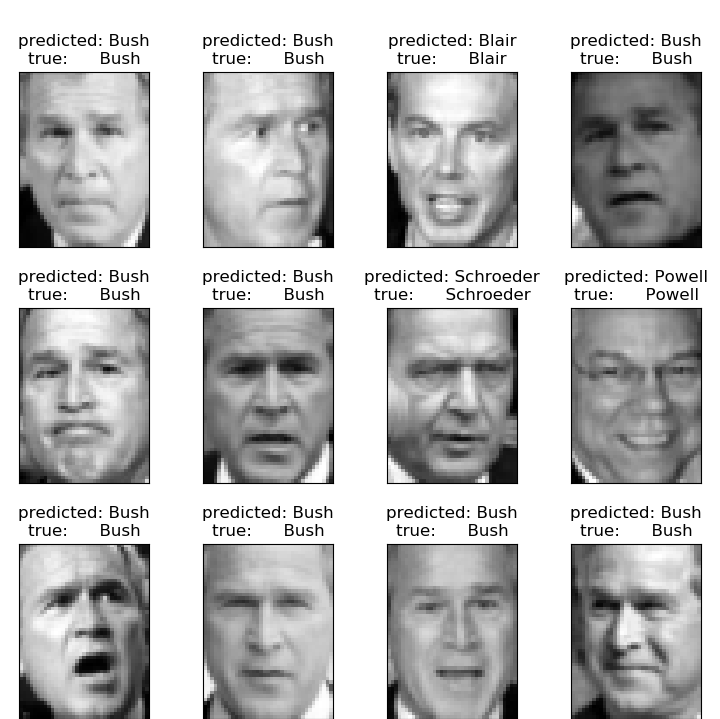{width=60% }


```markdown
Total dataset size:
n_samples: 1288
n_features: 1850
n_classes: 7
Extracting the top 150 eigenfaces from 966 faces
done in 0.320s
Projecting the input data on the eigenfaces orthonormal basis
done in 0.013s
Fitting the classifier to the training set
done in 28.379s
Best estimator found by grid search:
SVC(C=1000.0, break_ties=False, cache_size=200, class_weight='balanced',
    coef0=0.0, decision_function_shape='ovr', degree=3, gamma=0.005,
    kernel='rbf', max_iter=-1, probability=False, random_state=None,
    shrinking=True, tol=0.001, verbose=False)
Predicting people's names on the test set
done in 0.045s
                   precision    recall  f1-score   support

     Ariel Sharon       0.88      0.54      0.67        13
     Colin Powell       0.80      0.87      0.83        60
  Donald Rumsfeld       0.94      0.63      0.76        27
    George W Bush       0.83      0.98      0.90       146
Gerhard Schroeder       0.91      0.80      0.85        25
      Hugo Chavez       1.00      0.53      0.70        15
       Tony Blair       0.96      0.75      0.84        36

         accuracy                           0.85       322
        macro avg       0.90      0.73      0.79       322
     weighted avg       0.86      0.85      0.84       322


Confusion matrix

[[  7   1   0   5   0   0   0]
 [  1  52   0   7   0   0   0]
 [  0   3  17   7   0   0   0]
 [  0   3   0 143   0   0   0]
 [  0   1   0   3  20   0   1]
 [  0   4   0   2   1   8   0]
 [  0   1   1   6   1   0  27]]

```


The python code is given below

```python
from time import time
import logging
import matplotlib.pyplot as plt

from sklearn.model_selection import train_test_split
from sklearn.model_selection import GridSearchCV
from sklearn.datasets import fetch_lfw_people
from sklearn.metrics import classification_report
from sklearn.metrics import confusion_matrix
from sklearn.decomposition import PCA
from sklearn.svm import SVC


print(__doc__)

# Display progress logs on stdout
logging.basicConfig(level=logging.INFO, format='%(asctime)s %(message)s')


# #############################################################################
# Download the data, if not already on disk and load it as numpy arrays

lfw_people = fetch_lfw_people(min_faces_per_person=70, resize=0.4)

# introspect the images arrays to find the shapes (for plotting)
n_samples, h, w = lfw_people.images.shape

# for machine learning we use the 2 data directly (as relative pixel
# positions info is ignored by this model)
X = lfw_people.data
n_features = X.shape[1]

# the label to predict is the id of the person
y = lfw_people.target
target_names = lfw_people.target_names
n_classes = target_names.shape[0]

print("Total dataset size:")
print("n_samples: %d" % n_samples)
print("n_features: %d" % n_features)
print("n_classes: %d" % n_classes)


# #############################################################################
# Split into a training set and a test set using a stratified k fold

# split into a training and testing set
X_train, X_test, y_train, y_test = train_test_split(
    X, y, test_size=0.25, random_state=42)


# #############################################################################
# Compute a PCA (eigenfaces) on the face dataset (treated as unlabeled
# dataset): unsupervised feature extraction / dimensionality reduction
n_components = 150

print("Extracting the top %d eigenfaces from %d faces"
      % (n_components, X_train.shape[0]))
t0 = time()
pca = PCA(n_components=n_components, svd_solver='randomized',
          whiten=True).fit(X_train)
print("done in %0.3fs" % (time() - t0))

eigenfaces = pca.components_.reshape((n_components, h, w))

print("Projecting the input data on the eigenfaces orthonormal basis")
t0 = time()
X_train_pca = pca.transform(X_train)
X_test_pca = pca.transform(X_test)
print("done in %0.3fs" % (time() - t0))


# #############################################################################
# Train a SVM classification model

print("Fitting the classifier to the training set")
t0 = time()
param_grid = {'C': [1e3, 5e3, 1e4, 5e4, 1e5],
              'gamma': [0.0001, 0.0005, 0.001, 0.005, 0.01, 0.1], }
clf = GridSearchCV(
    SVC(kernel='rbf', class_weight='balanced'), param_grid
)
clf = clf.fit(X_train_pca, y_train)
print("done in %0.3fs" % (time() - t0))
print("Best estimator found by grid search:")
print(clf.best_estimator_)


# #############################################################################
# Quantitative evaluation of the model quality on the test set

print("Predicting people's names on the test set")
t0 = time()
y_pred = clf.predict(X_test_pca)
print("done in %0.3fs" % (time() - t0))

print(classification_report(y_test, y_pred, target_names=target_names))
print(confusion_matrix(y_test, y_pred, labels=range(n_classes)))


# #############################################################################
# Qualitative evaluation of the predictions using matplotlib

def plot_gallery(images, titles, h, w, n_row=3, n_col=4):
    """Helper function to plot a gallery of portraits"""
    plt.figure(figsize=(1.8 * n_col, 2.4 * n_row))
    plt.subplots_adjust(bottom=0, left=.01, right=.99, top=.90, hspace=.35)
    for i in range(n_row * n_col):
        plt.subplot(n_row, n_col, i + 1)
        plt.imshow(images[i].reshape((h, w)), cmap=plt.cm.gray)
        plt.title(titles[i], size=12)
        plt.xticks(())
        plt.yticks(())


# plot the result of the prediction on a portion of the test set

def title(y_pred, y_test, target_names, i):
    pred_name = target_names[y_pred[i]].rsplit(' ', 1)[-1]
    true_name = target_names[y_test[i]].rsplit(' ', 1)[-1]
    return 'predicted: %s\ntrue:      %s' % (pred_name, true_name)

prediction_titles = [title(y_pred, y_test, target_names, i)
                     for i in range(y_pred.shape[0])]

plot_gallery(X_test, prediction_titles, h, w)

# plot the gallery of the most significative eigenfaces

eigenface_titles = ["eigenface %d" % i for i in range(eigenfaces.shape[0])]
plot_gallery(eigenfaces, eigenface_titles, h, w)

plt.show()

```


---


 ![Figure from Alisneaky, svg version by User:Zirguezi [CC BY-SA (https://creativecommons.org/licenses/by-sa/4.0)]](images/2880px-Kernel_Machine.svg.png){width=100% .external}


#### SVM Image recognition

From the scikit-learn help page an example showing how the scikit-learn can be used to recognize images of hand-written digits.

The input data are hand written numbers

- Top: training data
- Bottom: Prediction 

  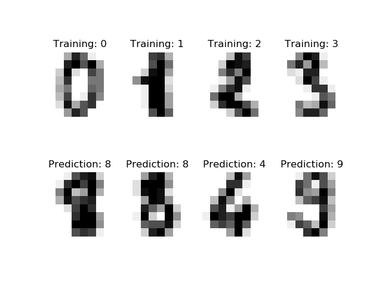{width=60%}
  
  The confusion matrix is given below and shows for example that a true "3" is often mistaken as a "8" (see red circle)
  
 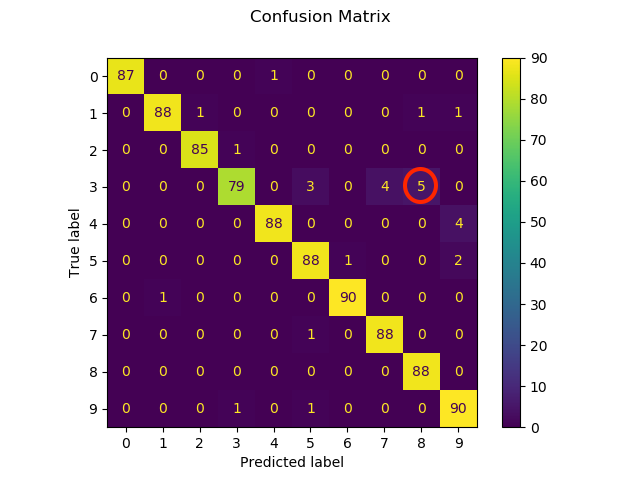{width=80%}
 


```Python 
print(__doc__)

# Author: Gael Varoquaux <gael dot varoquaux at normalesup dot org>
# License: BSD 3 clause

# Standard scientific Python imports
import matplotlib.pyplot as plt

# Import datasets, classifiers and performance metrics
from sklearn import datasets, svm, metrics
from sklearn.model_selection import train_test_split

# The digits dataset
digits = datasets.load_digits()

# The data that we are interested in is made of 8x8 images of digits, let's
# have a look at the first 4 images, stored in the `images` attribute of the
# dataset.  If we were working from image files, we could load them using
# matplotlib.pyplot.imread.  Note that each image must have the same size. For these
# images, we know which digit they represent: it is given in the 'target' of
# the dataset.
_, axes = plt.subplots(2, 4)
images_and_labels = list(zip(digits.images, digits.target))
for ax, (image, label) in zip(axes[0, :], images_and_labels[:4]):
    ax.set_axis_off()
    ax.imshow(image, cmap=plt.cm.gray_r, interpolation='nearest')
    ax.set_title('Training: %i' % label)

# To apply a classifier on this data, we need to flatten the image, to
# turn the data in a (samples, feature) matrix:
n_samples = len(digits.images)
data = digits.images.reshape((n_samples, -1))

# Create a classifier: a support vector classifier
classifier = svm.SVC(gamma=0.001)

# Split data into train and test subsets
X_train, X_test, y_train, y_test = train_test_split(
    data, digits.target, test_size=0.5, shuffle=False)

# We learn the digits on the first half of the digits
classifier.fit(X_train, y_train)

# Now predict the value of the digit on the second half:
predicted = classifier.predict(X_test)

images_and_predictions = list(zip(digits.images[n_samples // 2:], predicted))
for ax, (image, prediction) in zip(axes[1, :], images_and_predictions[:4]):
    ax.set_axis_off()
    ax.imshow(image, cmap=plt.cm.gray_r, interpolation='nearest')
    ax.set_title('Prediction: %i' % prediction)

print("Classification report for classifier %s:\n%s\n"
      % (classifier, metrics.classification_report(y_test, predicted)))
disp = metrics.plot_confusion_matrix(classifier, X_test, y_test)
disp.figure_.suptitle("Confusion Matrix")
print("Confusion matrix:\n%s" % disp.confusion_matrix)

plt.show()

```

## Neural networks

non linear

activation

softmax
 types of layers siehe keras
fully connected


### Convolutional Neural Network (CNN) TBD
 A Convolutional Neural Network is an neural network are mainly used to analyze image and audio data.

The following explanation is based on **The learning machine** tutorial "Classification
Convolutional Neural Network (CNN)"  https://www.thelearningmachine.ai/cnn


A classical CNN consists of

```{block2 echo=TRUE, type='rmdtip'}

- one or more convolutoional layers
- one or more pooling layers
- one or more fully connected layers

```


A classical CNN is depicted in the image below

---
  

 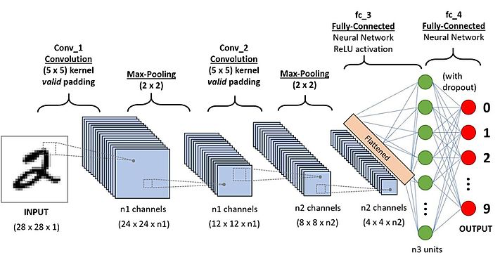{width=100% .external}


---
  

An image is an 3 dimensional array where the third dimension are for the colors red, green and blue, in case of an RGB image. An image can therefore be represented as shown below

---

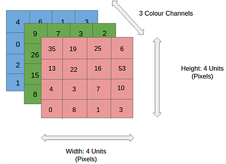{width=60% .external}

---

To analyze an image the spatial relation between different pixels hold important information. Therefore it is beneficial to use an algorithm which looks not only at one pixel but also at the neighbouring pixels. One way of doing so is to slide an 2 dimensional array over the image array as can be seen below


---

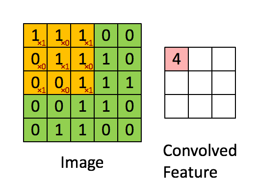{width=60% .external}

---

The 2 dimensional array is called a **kernel** and is named depending on its dimensions. The kernel in the graph below is a **"3 by 3 kernel"**. Sliding the array across the image as gives a set of numbers as shown above. Those kernels can detect structures in images such as


- lines
- boxes
- circles

and kernels in later layers in the CNN can detect more complex structures such as

- faces
- wheels
- trees


---
 
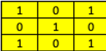{width=20% .external}

---


---

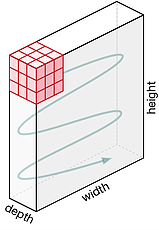{width=20% .external}


---

A kernel has the same depth of the input, in a case of an RGB image, the depth of the kernel is 3.
The output of the kernels is added, for each of the positions of the kernels there is one value at the output.

The movement across the image is based on the stride parameters for x and y direction. In the case below the stride is as follows

- stride x-direction = 1 
- stride y-direction = 1

Depending on stride with and image dimension it might be necessary to apply padding, for details on padding see [deepAi](https://deepai.org/machine-learning-glossary-and-terms/padding)

---

{width=100% .external}

---

#### Pooling layer

The pooling layer reduces the dimension as shown below. There are different types of pooling layers

- max
- average

below the working mechanism for a max pooling layer is shown. The stride for x and y is one, the dimension of the 5 by 5 input is reduced to 3 by 3

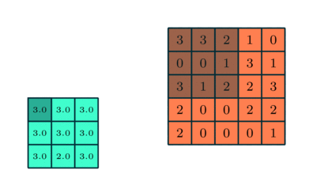{width=80% .external}


After one or more combination of convolutional and pooling layers one or more fully connected layers learn how to classify the image based on non-linear combinations of the high-level features learned by the previous layers. The fully connected layer with the soft-max activation at the end gives the probability of each category, often as a result the three to five classes with the highest probability are reported.

- convolutional and pooling layers => high-level features
- fully connected layers => combine non-linear high level features for classification

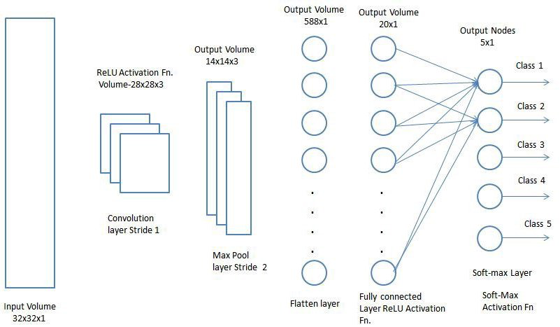{width=100% .external}

The operating principle of a CNN is shown below

---

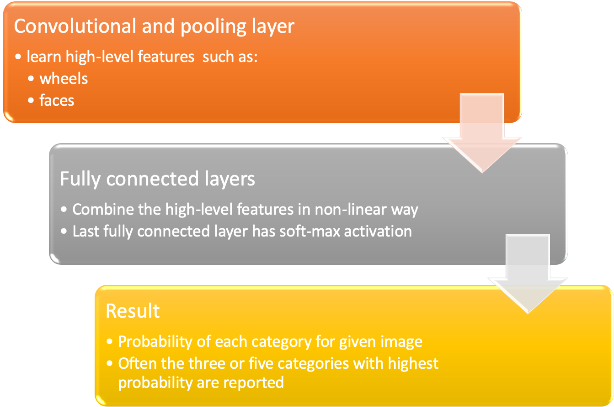{width=90%}

---


### RNN TBD


### GANs

GANs from Scratch 1: A deep introduction. With code in PyTorch and TensorFlow

https://medium.com/ai-society/gans-from-scratch-1-a-deep-introduction-with-code-in-pytorch-and-tensorflow-cb03cdcdba0f 
 

---

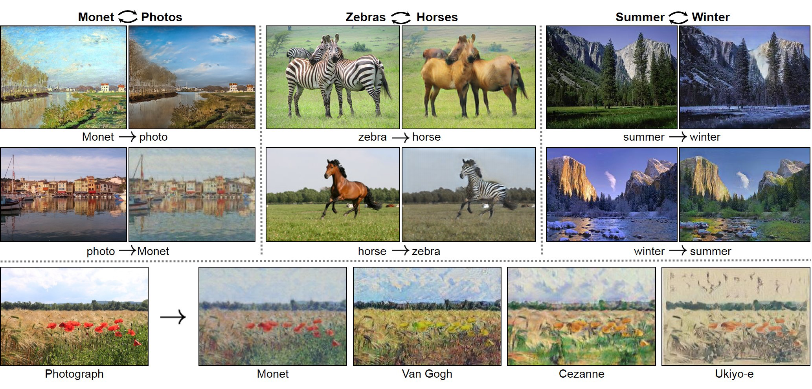


---

credit of the image  [@CycleGAN2017]


Generative models learn the intrinsic distribution function of the input data p(x) (or p(x,y) if there are multiple targets/classes in the dataset), allowing them to generate both synthetic inputs x’ and outputs/targets y’, typically given some hidden parameters.


GANs they have proven to be really succesfull in modeling and generating high dimensional data, which is why they’ve become so popular. Nevertheless they are not the only types of Generative Models, others include Variational Autoencoders (VAEs) and pixelCNN/pixelRNN and real NVP. Each model has its own tradeoffs.

Some of the most relevant GAN pros and cons for the are:

- They currently generate the sharpest images  

- They are easy to train (since no statistical inference is required), and only back-propogation is needed to obtain gradients
- GANs are difficult to optimize due to unstable training dynamics.
- No statistical inference can be done with them (except here):
GANs belong to the class of direct implicit density models; they model p(x) without explicitly defining the p.d.f.


A neural network G(z, θ₁) 

Jupyter notebook on github https://github.com/diegoalejogm/gans/blob/master/1.%20Vanilla%20GAN%20PyTorch.ipynb 


## A Gentle Introduction to CycleGAN for Image Translation

https://machinelearningmastery.com/what-is-cyclegan/ 


### Examples for GANs

#### gans-awesome-applications

a list of plenty of applications can be found at https://github.com/nashory/gans-awesome-applications 

## Software that can generate photos from paintings, turn horses into zebras, perform style transfer, and more.

with software to do style transfer
https://github.com/junyanz/CycleGAN 
### Pix2pix framework

Jupyter notebook for Colab
https://github.com/junyanz/pytorch-CycleGAN-and-pix2pix/blob/master/pix2pix.ipynb

https://colab.research.google.com/github/tensorflow/models/blob/master/research/nst_blogpost/4_Neural_Style_Transfer_with_Eager_Execution.ipynb#scrollTo=aDyGj8DmXCJI


## Transformers TBD

Attention Is All You Need https://arxiv.org/abs/1706.03762 

[Visualizing A Neural Machine Translation Model (Mechanics of Seq2seq Models With Attention)](https://jalammar.github.io/visualizing-neural-machine-translation-mechanics-of-seq2seq-models-with-attention/)


[What is a Transformer?](https://medium.com/inside-machine-learning/what-is-a-transformer-d07dd1fbec04)

[The Illustrated Transformer](http://jalammar.github.io/illustrated-transformer/)


# Food for the algorithms: Data


## Discovering millions of datasets on the web

Published Jan 23, 2020 by Google
Across the web, there are millions of datasets about nearly any subject that interests you. If you’re looking to buy a puppy, you could find datasets compiling complaints of puppy buyers or studies on puppy cognition. Or if you like skiing, you could find data on revenue of ski resorts or injury rates and participation numbers. Dataset Search has indexed almost 25 million of these datasets, giving you a single place to search for datasets and find links to where the data is. Over the past year, people have tried it out and provided feedback, and now Dataset Search is officially out of beta.
 
https://blog.google/products/search/discovering-millions-datasets-web/

