# (PART) Machine learning fundamentals {-} 


```{r setupMlFunda, include=FALSE}
knitr::opts_chunk$set(echo = FALSE)
```


# Machine learning fundamentals {#MachineLearningFundamentals}


<blockquote>
 “If intelligence was a cake, unsupervised learning would be the cake, supervised learning would be the icing, and reinforcement learning would be the carry.” 
 Yann LeCun
</blockquote>


# ML project process

Many ML projects get started the wrong way, trying a way to use data rather than using the data to fulfill a need, a need which has a benefit to the organization It is understandable that organizations want to learn from the data they have, but starting without a clear need in mind often leads to wasted efforts because sooner or later it will be discovered that the data available is not sufficient for a useful model.

At the start of a ML project there should be a clear formulated need which should be answered by the model, because ML is only a tool to help to achieve the objectives of the organization


```{block2 echo=TRUE, type='rmdtip'}

<p>At the beginning there is a need which ML is suitable to fulfill:</p>


- Optimize fertilizer usage
- Improve user experience
- Reduce energy cost
- Increase milk production

```


```{block2 echo=TRUE, type='HeadingNoNumber'}

The main project phases
  
```

Starting with the need the process can be split up in phases as shown below:

---

 {width=50% }


---

The process is not sequential but highly iterative as is described in the next chapters 

## Identify ML suited to fulfill need

There are plenty of needs within an organization and different entities within the organization will have different opinions about how to fulfill those needs. Often the people with the needs are not aware of the potential of ML to fulfill the need, on the other hand, often the people with ML knowledge don't know of the needs. It is therefore necessary to enable that the right people get in contact.


```{block2 echo=TRUE, type='rmdtip'}

<p>Enable contact people with:</p>

- Needs
- ML knowlegde

```


There are plenty of reasons why to choose a ML approach to fulfill the need, but there are also plenty of reasons why not to.


```{block2 echo=TRUE, type='rmdtip'}

<p>Reasons why ML approach should be chosen:</p>

- Suitable solution
    - meets need
    - low development effort
    - no alternative technology

- Build up ML knowledge

<p>Reasons why ML approach should NOT be chosen:</p>


- Less complex solution available
- Not enough experience to estimate effort
- Regulations might prohibit usage of ML due to testing requirements

```


ML right now is very fashionable, but if there is no benefit from choosing ML over another solution other than it is more exciting than think twice before you make your choice.


```{block2 echo=TRUE, type='rmdwarning'}

Make sure that the **most suitable** solution for the need is found, **not the fanciest.**

``` 


## Gather data TBC

Gathering data is one of the key aspects of an ML project with two main questions:

```{block2 echo=TRUE, type='rmdquestion'}

Two fundamental questions:

- How much data is necessary?
- Which data is useful?

```

For the first question there are no clear answers, for the second the are plenty of methods to decide whether data is useful or not.


### How much data is necessary?

There are a number of rules of thumb out there like

```{block2 echo=TRUE, type='rmdtip'}
Rules of thumb:
  
- For regression analysis
    - 10 times as many samples than parameters 
- For image recognition
    - 1000 samples per category
    - can go down significantly using pre-trained models

```
but those rules a just a rough guidance since there are plenty of factors influencing the data needed

```{block2 echo=TRUE, type='rmdtip'}
Factors influencing data requirement:

- model complexity
- similarity of data
    - the higher the similarity the less new samples help
- noise on data
- more samples
     - more computational effort
     - for trees might be counterproductive

```

Sometimes it is easy to create data. When Ayers was thinking about the title of his new book he targeted Google Ads, each with a different title. He got 250,000 samples related to which ad was clicked on most [@ayres2007super].

During model training it might become obvious that we run into overfitting, that is the case when training error gets smaller and at the same time the validation error goes up or when the validation error is much higher than the training error.

```{block2 echo=TRUE, type='rmdtip'}

Overfitting as indicator for not enough data:

- Validation error is much higher than training error
- Validation error increase with training cycles
- Model memorizes dat but doesn't generalise

```

--- 

 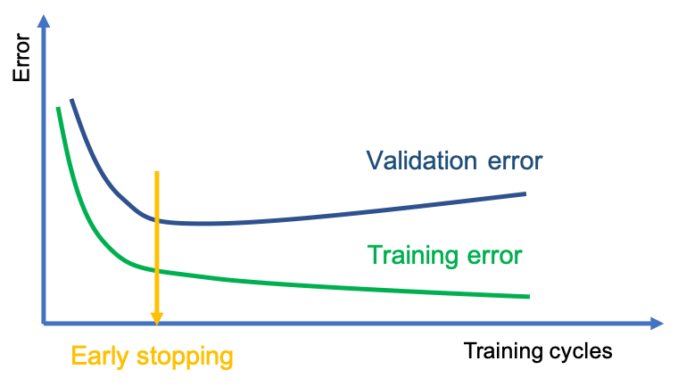{width=80% }

#### Dealing with small data TBC


 source https://www.industryweek.com/technology-and-iiot/digital-tools/article/21122846/making-ai-work-with-small-data 
>
Synthetic data generation is used to synthesize novel images that are difficult to collect in real life. Recent advances in techniques such as GANs, variational autoencoders, domain randomization and data augmentation can be used to do this. 

Transfer learning is a technique that enables AI to learn from a related task where there is ample data available and then uses this knowledge to help solve the small data task. For example, an AI learns to find dents from 1,000 pictures of dents collected from a variety of products and data sources. It can then transfer this knowledge to detect dents in a specific novel product with only a few pictures of dents. 

Self-supervised learning: Similar to transfer-learning. but the obtained knowledge is acquired by solving a slightly different task and then adapted to small data problem. For example, you can take a lot of OK images and create a puzzle-like grid to be sorted by a base model. Solving this dummy problem will force the model to acquire domain knowledge that can be used as starting point in the small data task.

In few-shot learning, the small-data problem is reformulated to help the AI system to learn an easier, less data hungry inspection task while achieving the same goal. In this scenario, AI is given thousands of easier inspection tasks, where each task has only 10 (or another similarly small number) examples. This forces the AI to learn to spot the most important patterns since it only has a small dataset. After that, when you expose this AI to the problem you care about, which has only a similar number of examples, its performance will benefit from it having seen thousands of similar small data tasks.

One-shot learning is a special case of few-shot learning where the number of examples per class it has to learn from is one instead of a few (as in the example above). 

In anomaly detection, the AI sees zero examples of defect and only examples of OK images. The algorithm learns to flag anything that deviates significantly from the OK images as a potential problem. 

Hand-coded knowledge is an example in which an AI team interviews the inspection engineers and tries to encode as much of their institutional knowledge as possible into a system. Modern machine learning has been trending toward systems that rely on data rather than on human institutional knowledge, but when data isn’t available, skilled AI teams can engineer machine learning systems that leverage this knowledge. 

Human-in-the-loop describes situations where any of the techniques listed above can be used to build an initial, perhaps somewhat higher error system. But the AI is smart enough to know when it is confident in a label or not and knows to show it to a human expert and defer to their judgement in the latter case. Each time it does so, it also gets to learn from the human, so that it increases accuracy and confidence in its output over time.


---


### Which data is useful?

Ideally only data which explain the output are fed into a model. But there might be features which are not known to be of importance. On the other hand there might be features which are overrated as to the importance they have for the output. Anyhow, both can only be known after a model is build. Also, it might be that a feature is valuable for one model but not so much for another model.


<div class="rmdtip">


Data useful?:

- Could be detected during exploratory data analysis see chapter \@ref(eda) 
- Has to be tested with model 
- Importance can be model dependent
- Not helpful features cause
    - performance drop
    - more complex models

</div>


Finding the importance of a feature falls into the scope of **feature engineering** as described in chapter  \@ref(featureImportance) 


## Exploratory and quantitative data analysis {#eda}

Before starting to build any model it is good practice to analyze the data. Exploratory and quantitative data analysis are interlinked and therefore can be viewed together.


```{block2 echo=TRUE, type='rmdtip'}

- <p>Exploratory data analysis </p>
    - Find correlations or mutial depence
- Quantiative analysis
    - Check distribution
        - Long tail => log of variable

```


<div class="rmdtip">


- <p>Why data analysis?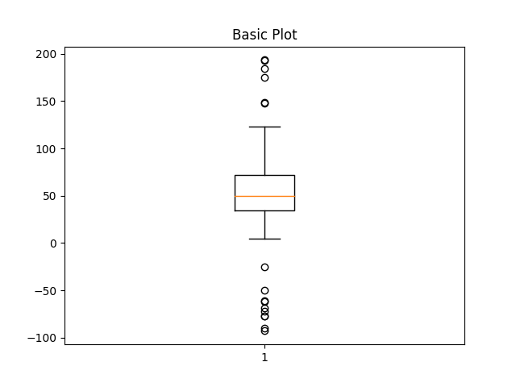</p>

- Understanding characteristic and distribution of response
    - histogram
    - box plot
- Uncover relationships between predictors and response
    - scatter plots
    - pairwise correlation plot among predictors
    - projection of high-dimensional predictors into lower dimensional space
    - heat maps across predictors

</div>


The process of exploratory and quantitative data analysis is described in detail in the following example.

### Example for exploratory and quantitative data analysis

This example is from the online book "Feature Engineering and Selection: A Practical Approach for Predictive Models" 
[@FeatureEngineeringKuhnWebsite]

#### Visualization for numeric data

In this example the data set on ridership on the Chicago Transit Authority (CTA) “L” train system http://bit.ly/FES-Chicago is used to predict the ridership in order to optimize operation of the train system.


<div class="HeadingNoNumber">

Task: predict future ridership volume 14 days in advance

</div>

---

 {width=100% .external}

---

Since for any prediction of future ridership volume only historical values are available lagging data are used. In this case a lag of 14 days are used, i.e. ridership at day D-14.

 <div class="HeadingNoNumber">

Distribution of response

</div>

The distribution of the response gives an indication what to expect from a model. The residuals of a model should have less variation than the variation of the response.

If the distribution shows that the frequency of response decreases proportionally with larger values this might be an indication that the response follows a log-normal distribution. Log-transforming the response would induce a normal distribution and often will enable a model to have better prediction performance.


<div class="rmdtip">


- <p>Why look at distribution?</p>

- Gives indication on what to be expected from model performance
    - variance of residuals < variance of response
- Distribution shaping might enable better prediction performance    

</div>


A **box plot** gives a quick idea of the distribution of a variable

---

 ![Figure from  [@FeatureEngineeringKuhnWebsite]](images/clarkRides.svg){width=70% .external}
 
---
 
 <div class="rmdtip">
Box plot legend:

- Vertical line
    - median of data
- Blue area
    - represents 50% of data
- Whiskers
    - indicate upper and lower 25% of data

</div>

 <div class="HeadingNoNumber">

Skewness of distribution

</div>

In the following picture the relative position of the red line within its surrounding box shows the skewness of the data

---

 ![Figure from <a href="https://commons.wikimedia.org/wiki/File:Boxplots_with_skewness.png" title="via Wikimedia Commons">Ever.chae</a> [<a href="https://creativecommons.org/licenses/by-sa/4.0">CC BY-SA</a>]](images/Boxplots_with_skewness.png){width=50% .external}
 
---

 What the skewness of data means for its distribution is shown in the picture below

---

 ![Figure from <a href="https://commons.wikimedia.org/wiki/File:Relationship_between_mean_and_median_under_different_skewness.png" title="via Wikimedia Commons">Diva Jain</a> [<a href="https://creativecommons.org/licenses/by-sa/4.0">CC BY-SA</a>]](images/Relationship_between_mean_and_median_under_different_skewness.png){width=70% .external}
 
 
 mode: Value which appears most often in data set
 
---

The box plot doesn't show if there are multiple peaks or modes. Histograms and violin plots are better suited in that case

---

 ![Figure from  [@FeatureEngineeringKuhnWebsite]](images/eda-s-40380-distribution-1.svg){width=70% .external}
 
---

 
 <div class="rmdtip">
Box plot alternatives: 

- Histogram
     - data binned into equal regions
     - height of bar proportional frequency of percentage of samples in region
- Violin plot
    - compact visualization of distribution
    - histogram-like characteristics 
    - could add
        - lower quartile ^[lower quarter of the data]
        - median
        - upper quartile ^[higher quarter of the data]

</div>


To **compare multiple distributions box plots are still helpful** as shown in the next image which shows the distribution of weekday ridership at all stations

---

 ![Figure from  [@FeatureEngineeringKuhnWebsite]](images/multipleBoxPlots.png){width=100% .external}
 
---


 <div class="rmdtip">

Knowledge gained through box plot:

- Wider distribution than other stations
- Station is close to stadium of Chicago Clubs
- $\implies$ Clubs home game schedule would be important information for model

</div>


 <div class="HeadingNoNumber">

Using faceting and colors to augment visualizations

</div>

Facets create the same type of plots and splitting the plot into different panels based on some variable

 <div class="rmdtip">
<p>Faceting:</p>


- Same type of plot
- Based on some variable
- Below faceting shows that ridership is different for parts of the week
- $\implies$ **part of the week** is important feature

</div>


The plot below shows the ridership for Clark/Lake, and gives an explanation for the two modes seen in the histogram above, the ridership is vastly different on weekends than during the week.

---

 ![Figure from  [@FeatureEngineeringKuhnWebsite]](images/ridesFacet.svg){width=70% .external}
 
---


 <div class="HeadingNoNumber">

Scatter plots

</div>

Scatter plots can add a new dimesions to the analysis

 <div class="rmdtip">

Scatter plot:

- One variable on x-axis, the other variable on y-axis
- Each sample plotted in this coordinate space
- Assess relationships
    - between predictors
    - between response and predictors

</div>


---

 ![Figure from  [@FeatureEngineeringKuhnWebsite]](images/scatterRidesWeekendsWeekdays.svg){width=60% .external}
 
---

There are several conclusions which can be drawn from the scatter plot above


<div class="rmdtip">

Knowledge gained through scatter plot:

- Strong linear relationship between 14-day lag and current-day ridership
- Two distinct groups of points
    - weekday
    - weekend
- Plenty of outlier
- Uncovering explanation of outlier $\implies$ new useful feature

</div>


<div class="HeadingNoNumber">

Heatmaps

</div>

Heatmaps are a versatile plots that displays one predictor on the x-axis and another predictor on the y-axis. Both predictors must be able to be categorized.
The categorized predictors form a grid, this grid is filled by another variable.

<div class="rmdtip">
<p>Heatmaps:</p>

- Categorize predictor
    - for x and y-axis
- Display another variable on grid
    - categorical or continuous 
- Color depends on either value or category

</div>


The following heatmap investigates the all cases of weekday ridership less than 10,000. Those represent outlier needing explanation


---

 ![Figure from  [@FeatureEngineeringKuhnWebsite]](images/heatMapRidesAnnotated.png){width=70% .external}


blue: holiday  
green: extreme weather

---

<div class="rmdtip">
Heatmap concept

- Categorize predictor
    - x-axis: represents year
    - y-axis: represents month and day
- Red lines indicate weekdays ridership < 10,000
- Blue boxes mark holiday seasons
- Green boxes mark unusual data points
    - both days hat extreme weather
    - $\implies$ **weather** is important feature

</div>


<div class="HeadingNoNumber">

Correlation matrix plots

</div>

An extension to scatter plot correlation matrix plots show the correlation between each pair of variable.

<div class="rmdtip">

Correlation matrix plots

- Extension to scatter plot
- Each variable is represented on the outer x-axis and outer y-axis
- Matrix colored based on correlation value

</div>


---

```{r CorMap, echo=FALSE, message=FALSE, warning=FALSE, out.width = "80%"}
load("images/corMap.RData")
cor_map
```

**Interactive figure** based on  [@FeatureEngineeringKuhnWebsite]

---

<div class="rmdtip">

Knowledge gained through analysis of correlation matrix plot

- Ridership across station is positively correlated for nearly all pairs of stations
- Correlation for majority of stations is extremely high
    - information present across stations is redundant
- Columns and rows are organized based on hierarchical cluster analysis
    - stations that have similar correlation vectors will be nearby on the axis
    - helps to identify groups $\implies$ may point to important features

</div>

<div class="HeadingNoNumber">

Principal Components Analysis (PCA)

</div>

One way of condensing many dimensions into just two or three are dimension reductions techniques such as principle components analysis (PCA). An explanation of dimension reductions techniques is given in chapter \@ref(ManytoManyTransformations) 

<blockquote>

Principal components analysis finds combinations of the variables that best summarizes the variability in the original data 

[@dillon1984multivariate]

</div>

---

![Figure from  [@FeatureEngineeringKuhnWebsite]](images/pcaAndViolinPlot.png){width=100% .external}


---


<div class="rmdtip">

Knowledge gained through analysis of PCA plot

- Component 1 focuses on part of the week
- Component 2 focuses on changes over time

</div>


### Visualizations for Categorical Data: Exploring the OkCupid Data

OkCupid is an online dating platform. A data set of 50,000 San Francisco user data is available at [GitHub](https://github.com/rudeboybert/JSE_OkCupid)

<div class="rmdtip">

Data of OkCupid data set:

- open text essays related to an individual’s interests and personal descriptions,
- single-choice type fields such as profession, diet, and education, and
- multiple-choice fields such as languages spoken and fluency in programming languages.

</div>


<div class="HeadingNoNumber">

Task: Predict whether the profile's author was worked in STEM (science, technology, engineering, and math) field
</div>


#### Visualizing Relationships between Outcomes and Predictors


To find out whether religion would be a good predictor several kinds of plots are compared.

Firstly use a **bar plot**. The figure is ordered from greatest ratio (left) to least ratio (right) of STEM members in that religion.


---

![Figure from  [@FeatureEngineeringKuhnWebsite]](images/barPlotReligionStem.png){width=60% .external}


---

<div class="rmdtip">

Bar plot shortcomings:

- Doesn't easily show ratio
    - see Hinduism
- Gives no sense on uncertainty
    - number of profiles per religion
    - the smaller the number the higher the uncertainty

</div>


A better alternative is a **stacked bar plot** as shown in the next graph

---


![Figure from  [@FeatureEngineeringKuhnWebsite]](images/stackedBarPlotReligionStem.png){width=60% .external}


---

<div class="rmdtip">

Stacked plot shortcomings:

- No sense of frequency
    - No information that there are very few Islamic profiles
- No sense of uncertainty

</div>


A better alternative is a **error bar plot** as shown in the next graph

---


![Figure from  [@FeatureEngineeringKuhnWebsite]](images/errorBarPlotReligionStem.png){width=60% .external}


---

<div class="rmdtip">

Error bar plot:

- Shows uncertainty
    - 95% confidence level ^[In statistics, a binomial proportion confidence interval is a confidence interval for the probability of success calculated from the outcome of a series of success–failure experiments (Bernoulli trials). In other words, a binomial proportion confidence interval is an interval estimate of a success probability $p$ when only the number of experiments $n$ and the number of successes $n_S$ are known.]

</div>

All plots combined are shown below

---


![Figure from  [@FeatureEngineeringKuhnWebsite]](images/eda-religion-1.png){width=80% .external}


---


 each graph should have a clearly defined hypothesis and that this hypothesis is shown concisely in a way that allows the reader to make quick and informative judgments based on the data

<div class="rmdtip">

Conclusion:

- Each graph should have clearly defined hypothesis
- Hypothesis shall be shown clearly
- Reader can make quick, informative judgments based on data
-  $\implies$ **Religion is a useful feature**

</div>


<div class="HeadingNoNumber">

Relationship between a categorical outcome and a numeric predictor
</div>

As an example the relationship between essay length and STEM and others are analyzed using a **histogram** as shown below


---

![Figure from  [@FeatureEngineeringKuhnWebsite]](images/eda-essay-length-1.svg){width=80% .external}


---


The histogram shows that the **distribution is pretty similar** between STEM and others. A way to check whether the predictor could be useful is to **train a logistic regression** an a basis expansion by building a regression spline smoother of the essay length.

<div class="rmdtip">

Conclusion:

- Distribution similar for STEM and others
- Train logisitc regression model on basis expanded essay length
- Values are close to base rate of 18.5%
-  $\implies$ **essay length is NOT a helpful feature**

</div>


## Feature engineering {#featureEngineering}

Sometimes even the best models have less than useful predictive performance. This could be because key relationships are not directly available.

<div class="rmdtip">

<p>Key relationships that are not directly available: </p>


- Transformation of a predictor 
- Interaction of two or more predictors such as a product or ratio
- Functional relationship among predictors
- Equivalent re-representation of a predictor

</div>

Feature engineering can be defined as:

<blockquote>
Adjusting and reworking the predictors to enable models to better uncover predictor-response relationships has been termed feature engineering. 

[@FeatureEngineeringKuhnWebsite]
</blockquote>

Since there are different faculties which work on machine learning (staticians, computer scientists, neurologists) there are different terms for the same thing, so variables that go into model are called:

```{block2 echo=TRUE, type='rmdtip'}

- <p>Predictors</p>
  
- Features
- Independent variables

```


Quantity being modeled called: 

```{block2 echo=TRUE, type='rmdtip'}

- <p>Prediction</p>
  
- Outcome
- Response
- Dependent variable

```


So machine learning is nothing more spectacular than finding a function that maps the input, features, to the output, response as close as possible.


<div class="rmdtip">

$$outcome = f(features) = f(X_1, X_2, \dots, Xp) = f(X)$$

$$\hat{Y} = \hat{f}(X)$$

</div>


###  Encoding Categorical Predictors

Categorical features are not quantitative nature but **qualitative data**, i.e. discrete values in an ordered relationship
For numerical features it is straight forward to feed them into a model, but how can categorical data be handled?

<div class="rmdtip">

<p>Categorical features: </p>


- Gender
- Breeds of dogs
- Postal code


</div>

Ordered categorical features have a clear progression of values

<div class="rmdtip">
<p>Ordered categorical features:</p>

 
- Bad
- Good
- Better

</div>

Ordered and unordered features might be handled differently to include the embedded information into a model.

Not all models need a special treatment for categorical data

<div class="rmdtip">


<p>Models that can deal with categorical features:</p>


- Tree based models
- Naive Bayes models

</div>


one hot vs dummy variable

TBC

add
- bert
- word2vec
- one hot encoding
- dummy variable

This are ways how to modify qualitative features For continuous, real number values exists other tools for converting them into features that can be better utilized by a model.

### Engineering numeric features

Features with continuous, real number values might need some pre-processing before being useful for a model. The pre-processing can be model dependent 


<div class="rmdtip">
<p>Model dependent pre-processing: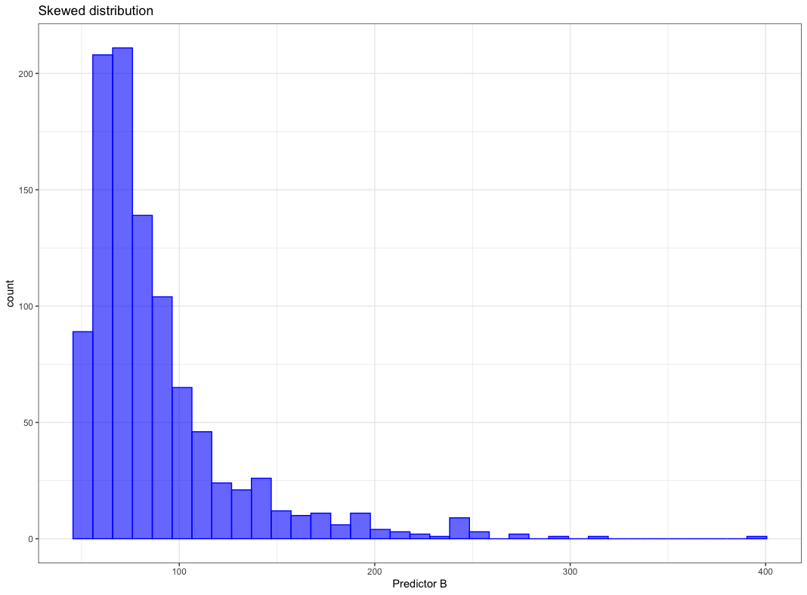</p>


- Skewed distribution
     - No problem for:
         - Trees (based on rank rather than values)
     - Problem for:     
         - K-nearest neighbors
         - SVM 
         - Neural networks

- Correlated features
    - No problem for:
        - Partial least square
    - Problem for:
        - Neural networks
        - Multiple linear regression

</div>


Commonly occurring issues for numerical features and the counter measures are treated in this chapter

<div class="rmdtip">
<p>Commonly occurring issues:</p>


- Vastly different scales
- Skewed distribution
- Small number of extreme values
- Values clipped at on the low/or high end of range
- Complex relationship with response
- Redundant information

</div>

Those problems are addressed by various methods in the next chapters


    
<div class="rmdtip">

<p>Remedies to commonly occurring issues:</p>


- Transform individual feature's distribution in chapter \@ref(Transformations)
    - avoid skewed distribution
- Expanding individual features into many features in chapter \@ref(OneManyTransformations)
    - helps with complex relationships with response
- Mapping higher to lower dimensional space  in chapter \@ref(ManytoManyTransformations)
    - helps with redundant information

</div>


#### 1:1 Transformations {#Transformations}

There are plenty of methods to transform a feature, first focus is on distribution shaping


<div class="HeadingNoNumber">
Box-Cox transformation

</div>

Apply the Box-Cox transformation the **skewed distribution below**

![Figure from  [@FeatureEngineeringKuhnWebsite]](images/SkewedDistribution.png){width=80% .external}

can be shaped by Box-Cox transformation to be almost normally distributed as shown below.

![Figure from  [@FeatureEngineeringKuhnWebsite]](images/BoxCoxShapedDistribution.png){width=80% .external}


Box-Cox transformation maps the original data by the following equation

<div class="rmdmath">

Box-Cox transformation  equation: 

$$x^{*}=\left\{\begin{array}{ll}{\frac{x^{\lambda}-1}{\lambda \bar{x}^{\lambda-1}},} & {\lambda \neq 0} \\ {\tilde{x} \log x,} & {\lambda=0}\end{array}\right.$$

--- 

where  

$\tilde{x}$ is geometric mean $\bar{x}=\sqrt[n]{\prod_{i=1}^{n} x_{i}}=\sqrt[n]{x_{1} \cdot x_{2} \cdots x_{n}}$

</div>


$\lambda$ is estimated from the data, there are a few special cases


<div class="rmdtip">

Special cases for $\lambda$:

- $\lambda$ = 1 $\implies$ no transformation
- $\lambda$ = 0.5 $\implies$ square root transformation
- $\lambda$ = -1 $\implies$ inverse transformation


</div>


#### 1:Many Transformations {#OneManyTransformations}

A single numeric feature can be expanded to many features to improve model performance. 

<div class="rmdmath">

The cubic expansion can be written as:

$$f(x)=\sum_{i=1}^{3} \beta_{i} f_{i}(x)=\beta_{1} x+\beta_{2} x^{2}+\beta_{3} x^{3}$$

</div>


The $\beta$ values can be calculated using linear regression. If the true trend were linear the second and third regression parameter would be close to zero.


For example the **AMES sale price vs lot area ** as given below is clearly **not linear.** 

![Figure from  [@FeatureEngineeringKuhnWebsite]](images/numeric-ames-lot-size-1.svg){width=80% .external}

Considering a spline with 6 regions. Functions of x are shown in figure *"(a)"* below.
Figure *"(b)"* shows the spline 


![Figure from  [@FeatureEngineeringKuhnWebsite]](images/numeric-ames-ns-1.svg){width=80% .external}

<div class="HeadingNoNumber">

One feature was replaced by 6 hopefully more meaningful features for the model

</div>

####  Many:Many Transformations {#ManytoManyTransformations}

Many to many transformation can solve  a variety of issues

<div class="rmdtip">


<p>Many to many transformations help to:</p>


- Deal with 
    -  outliers
    - collinearity (high correlation)
-  Reduce dimensionality     

</div>

Contrary to intuition more features are not always beneficial

<div class="rmdtip">

<p>Considering irrelevant features leads to:</p>


- Increasing computational effort for model training
- Decrease predictive  performance
- Complicating predictor importance calculation


</div>


There are several dimension reduction algorithms

<div class="rmdtip">

<p>Dimension reduction algorithms:</p>


- Unsupervised
    - principle component analysis (PCA)
    - t-SNE
    - independent component analysis (ICA)
    - non-negative matrix factorization (NNMF)
    - autoencoders

- Supervised
    - partial least squares (PLS)
    - reduced predictor space is optimally associated with the response
</div>

The embedding projector of TensorFlow at http://projector.tensorflow.org gives great insight into PCA and t-SNE 
Below a PCA of the Word2Vec 200 dimensional space onto three dimensions, the word *"neural"* and points close by are marked.


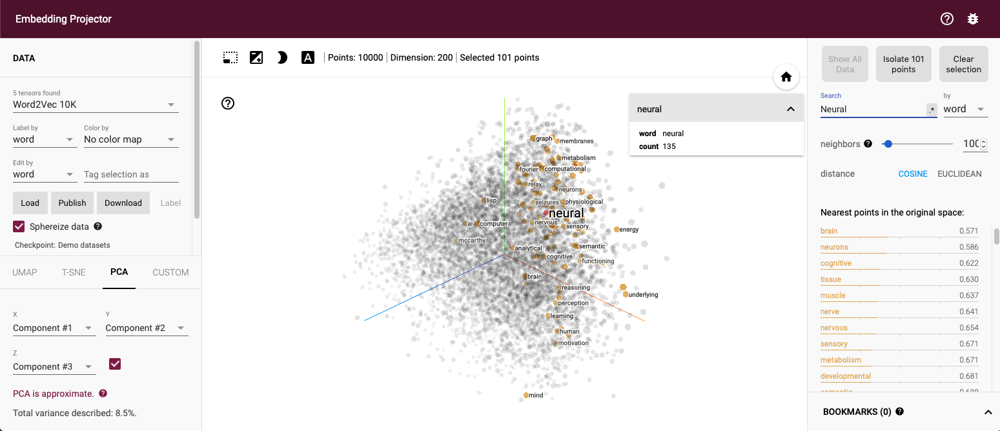{width=100% .external}
A few more details on some of the above mentioned algorithms


<div class="HeadingNoNumber">

Principle component analysis (PCA)

</div>


<div class="rmdtip">

<p>Principle component analysis (PCA):</p>


- Linear orthogonal transformation
- Possibly correlated variables
- Into set of uncorrelated variables
    - principle components

</div>

PCA maps a higher dimensional space to a lower dimensional space by linear orthogonal transformations. The orthogonality results from the condition that principle components are not correlated. Each principle component explains as much variance as possible. The principle components are weighted combinations of the independent variables. More on PCA can be found at Wikipedia https://en.wikipedia.org/wiki/Principal_component_analysis
 
A PCA of the irsis data set is given at https://scikit-learn.org/stable/auto_examples/decomposition/plot_pca_iris.html#sphx-glr-auto-examples-decomposition-plot-pca-iris-py, it creates the graph below.

---

{width=80% .external}

---

A minimal PCA Python example is given below, source https://scikit-learn.org/stable/modules/generated/sklearn.decomposition.PCA.html


```python

>>> import numpy as np
>>> from sklearn.decomposition import IncrementalPCA
>>> X = np.array([[-1, -1], [-2, -1], [-3, -2], [1, 1], [2, 1], [3, 2]])
>>> print(X)
array([[-1.38340578, -0.2935787 ],
       [-2.22189802,  0.25133484],
       [-3.6053038 , -0.04224385],
       [ 1.38340578,  0.2935787 ],
       [ 2.22189802, -0.25133484],
       [ 3.6053038 ,  0.04224385]])
>>> ipca = IncrementalPCA(n_components=2, batch_size=3)
>>> ipca.fit(X)
IncrementalPCA(batch_size=3, n_components=2)
>>> ipca.transform(X) 
[[-1 -1]
 [-2 -1]
 [-3 -2]
 [ 1  1]
 [ 2  1]
 [ 3  2]]

```

<div class="HeadingNoNumber">

t-distributed stochastic neighbor embedding (t-SNE)

</div>

The next algorithm is t-distributed stochastic neighbor embedding **t-SNE** which focuses more on the distance of samples than on variance. The main concept is that samples which are nearby in high dimensional space are also nearby in the lower dimensional space.

<div class="rmdtip">

<p>t-SNE: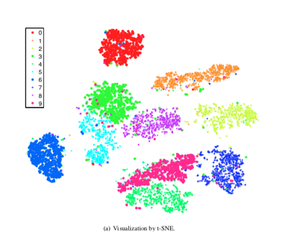</p>


- t-distributed stochastic neighbor embedding
- Nonlinear dimensionality reduction
- Similar object modeled by nearby points

</div>

The t-SNE algorithm has important hyperparameter which need to be set with some insight. More on those hyperparameter and their settings can be found at https://distill.pub/2016/misread-tsne/ and in Laurens van der Maaten's original paper on t-SNE [@maaten2008visualizing]

<div class="HeadingNoNumber">

Independent component analysis (ICA)

</div>

ICA is used in signal processing to differentiate different sources of signal, i.e. suppress in an audio signal the background noise which can be very helpful when using a phone in an loud environment.

<div class="rmdtip">


Independent component analysis (ICA):

- Origin in signal processing
- Separating mulivariate signal into additive subcomponents


</div>

The ability to separate signal sources can be seen in the following example. Whereas PCA picks up the variance ICA assigns signals to the sources. 

---

{width=80% .external}

---

The code is from at https://scikit-learn.org/stable/auto_examples/decomposition/plot_ica_vs_pca.html#sphx-glr-auto-examples-decomposition-plot-ica-vs-pca-py

```python
"""
==========================
FastICA on 2D point clouds
==========================

This example illustrates visually in the feature space a comparison by
results using two different component analysis techniques.

:ref:`ICA` vs :ref:`PCA`.

Representing ICA in the feature space gives the view of 'geometric ICA':
ICA is an algorithm that finds directions in the feature space
corresponding to projections with high non-Gaussianity. These directions
need not be orthogonal in the original feature space, but they are
orthogonal in the whitened feature space, in which all directions
correspond to the same variance.

PCA, on the other hand, finds orthogonal directions in the raw feature
space that correspond to directions accounting for maximum variance.

Here we simulate independent sources using a highly non-Gaussian
process, 2 student T with a low number of degrees of freedom (top left
figure). We mix them to create observations (top right figure).
In this raw observation space, directions identified by PCA are
represented by orange vectors. We represent the signal in the PCA space,
after whitening by the variance corresponding to the PCA vectors (lower
left). Running ICA corresponds to finding a rotation in this space to
identify the directions of largest non-Gaussianity (lower right).
"""
print(__doc__)

# Authors: Alexandre Gramfort, Gael Varoquaux
# License: BSD 3 clause

import numpy as np
import matplotlib.pyplot as plt

from sklearn.decomposition import PCA, FastICA

# #############################################################################
# Generate sample data
rng = np.random.RandomState(42)
S = rng.standard_t(1.5, size=(20000, 2))
S[:, 0] *= 2.

# Mix data
A = np.array([[1, 1], [0, 2]])  # Mixing matrix

X = np.dot(S, A.T)  # Generate observations

pca = PCA()
S_pca_ = pca.fit(X).transform(X)

ica = FastICA(random_state=rng)
S_ica_ = ica.fit(X).transform(X)  # Estimate the sources

S_ica_ /= S_ica_.std(axis=0)


# #############################################################################
# Plot results

def plot_samples(S, axis_list=None):
    plt.scatter(S[:, 0], S[:, 1], s=2, marker='o', zorder=10,
                color='steelblue', alpha=0.5)
    if axis_list is not None:
        colors = ['orange', 'red']
        for color, axis in zip(colors, axis_list):
            axis /= axis.std()
            x_axis, y_axis = axis
            # Trick to get legend to work
            plt.plot(0.1 * x_axis, 0.1 * y_axis, linewidth=2, color=color)
            plt.quiver(0, 0, x_axis, y_axis, zorder=11, width=0.01, scale=6,
                       color=color)

    plt.hlines(0, -3, 3)
    plt.vlines(0, -3, 3)
    plt.xlim(-3, 3)
    plt.ylim(-3, 3)
    plt.xlabel('x')
    plt.ylabel('y')

plt.figure()
plt.subplot(2, 2, 1)
plot_samples(S / S.std())
plt.title('True Independent Sources')

axis_list = [pca.components_.T, ica.mixing_]
plt.subplot(2, 2, 2)
plot_samples(X / np.std(X), axis_list=axis_list)
legend = plt.legend(['PCA', 'ICA'], loc='upper right')
legend.set_zorder(100)

plt.title('Observations')

plt.subplot(2, 2, 3)
plot_samples(S_pca_ / np.std(S_pca_, axis=0))
plt.title('PCA recovered signals')

plt.subplot(2, 2, 4)
plot_samples(S_ica_ / np.std(S_ica_))
plt.title('ICA recovered signals')

plt.subplots_adjust(0.09, 0.04, 0.94, 0.94, 0.26, 0.36)
plt.show()


```


<div class="HeadingNoNumber">

Autoencoders

</div>

Autoencoders learn a latent representation of data by feeding them through a neural network with a bottleneck, i.e. a layer with less width than the input layer. Training an autoencoder is unsupervised since the training task is to create an output as similar to the input as possible.

Further explanation is given in an example implemented in Keras at https://towardsdatascience.com/autoencoders-made-simple-6f59e2ab37ef

<div class="rmdtip">

Autoencoders:

- Type of neural network
- Feeds information through bottleneck
- Input and output shall be as similar as possible
- Representation at bottleneck is dimensionality reduced


</div>

![Figure from <a href="//commons.wikimedia.org/w/index.php?title=User:Michela_Massi&amp;action=edit&amp;redlink=1" class="new" title="User:Michela Massi (page does not exist)">Michela Massi</a> - <span class="int-own-work" lang="en">Own work</span>, <a href="https://creativecommons.org/licenses/by-sa/4.0" title="Creative Commons Attribution-Share Alike 4.0">CC BY-SA 4.0</a>, <a href="https://commons.wikimedia.org/w/index.php?curid=80177333">Link</a> [@FeatureEngineeringKuhnWebsite]](images/Autoencoder_schema.png){width=60% .external}


### Feature importance {#featureImportance}

After creating features the next step is to find out which features are helpful for the model. First, two methods are compared


<div class="rmdtip">
<p>Feature importance analysis methods:</p>


- Permutation Importance 
    - permute one feature
    - calculate the change in prediction performance
    - the bigger the drop in prediction performance $\implies$ more important feature
- Random Forest Feature Importance 
    - during training compute decrease of impurity
    - average for decrease for all features
    - ranking according to decrease $\implies$ ranking of feature importance

</div>

An example shows strength and weakness of the algorithms. The example *"Permutation Importance vs Random Forest Feature Importance"* can be found at the Scikit-Learn [@scikit-learn] site https://scikit-learn.org/stable/auto_examples/inspection/plot_permutation_importance.html 

Comparing test and training accuracy give an indication that the **model might have overfitted**


<div class="rmdtip">

Model might be overfitted:

RF train accuracy: 1.000  
RF test accuracy: 0.817
</div>

---


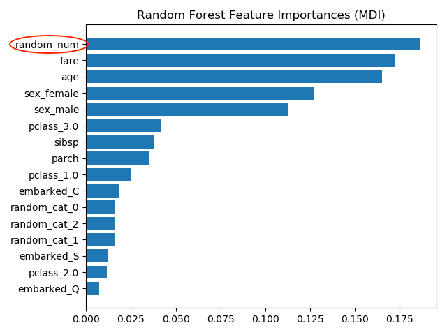{width=80% .external}


---

The most important feature is **random_num** which is totally random numeric feature which the model has used to memorize the training data set but is useless to predict anything. The wrong importance measure results from two causes 


<div class="rmdtip">

Causes of wrong feature importance:

- impurity-based importances are biased towards high cardinality features
- impurity-based importances
    - computed on training set statistics 
    -  do not reflect the ability of feature to be useful to make predictions that generalize to the test set 
</div>


<div class="HeadingNoNumber">

Permutation importance 
</div>


Computing the permutation importance no a held out test data shows that the low cardinality categorical feature ***sex** has highest importance.


---


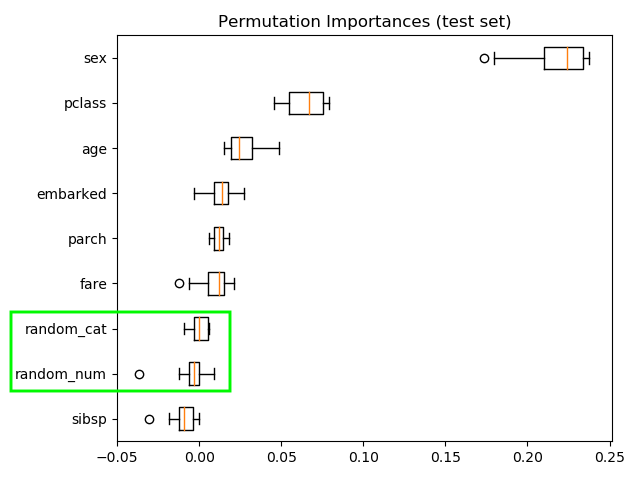{width=80% .external}


---

<div class="rmdtip">


<p>Permutation importance:</p>

- Most important feature: sex
- Random features low importance


</div>


Computing the permutation importance on the training data shows that the random features get significantly higher importance ranking than when computed on the test set.

---


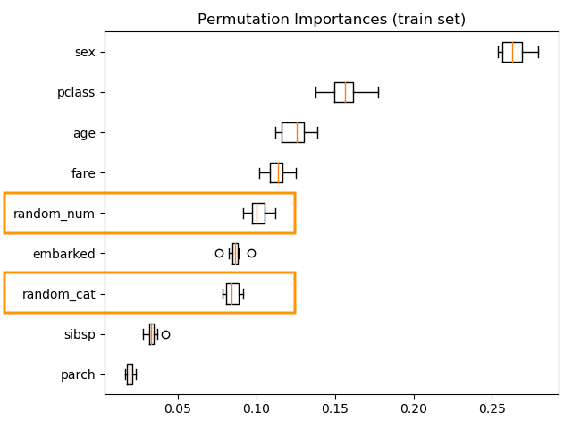{width=80% .external}


---

<div class="HeadingNoNumber">

Permutation Importance with Multicollinear or Correlated Features

</div>

Another example investigates the problem of multicollinear or correlated features. The example *"Permutation Importance with Multicollinear or Correlated Features"* can be found at the Scikit-Learn [@scikit-learn] site https://scikit-learn.org/stable/auto_examples/inspection/plot_permutation_importance_multicollinear.html


<div class="rmdtip">

Facts of example:

- Wisconsin breast cancer datase
- RandomForestClassifier  97% accuracy on a test data set
- Contains multicollinear features

</div>

The permutation importance plot shows that permuting a feature drops the accuracy by at most 0.012, which suggests taht none of the features are important.


---


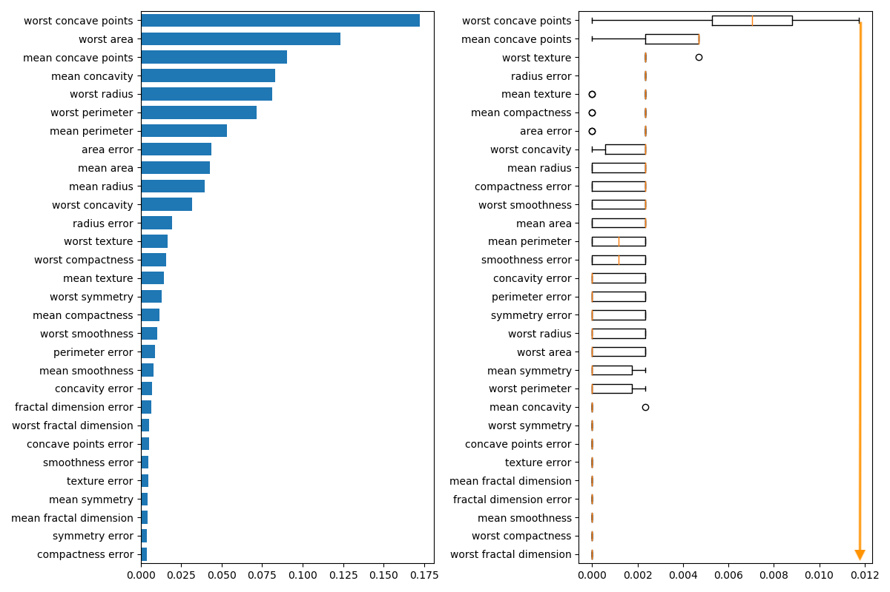{width=100%}


---

<div class="rmdtip">

Permutation importance:

- highest drop = 0.012 $\implies$ no feature is important
- when features collinear
    - permuting one feature will have little effect
- how to handle collinear features
    -  performing hierarchical clustering on the Spearman rank-order correlations ^[The Spearman rank-order correlation coefficient (Spearman's correlation, for short) is a nonparametric measure of the strength and direction of association that exists between two variables measured on at least an ordinal scale.]
    - pick threshold
        - in graph below = 2.0
    - keep single feature from each cluster
        - in graph below 8 cluster $\implies$ 8 features

</div>

---


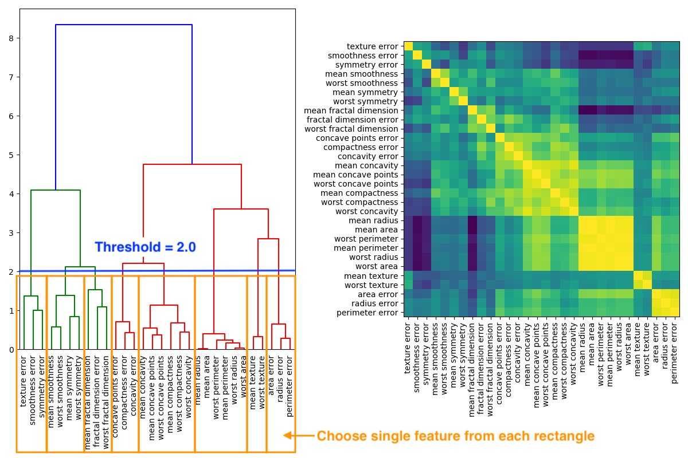{width=100%}


---

If threshold 1.0 is chosen than accuracy stays at 0.97 with 14 features instead of 30


## Model fit


Lastly, the no free lunch theorems say that there is no a-priori superiority for any classifier system over the others, so the best classifier for a particular task is itself task-dependent. However there is more compelling theory for the SVM that suggests it is likely to be better choice than many other approaches for many problems.

## Model tuning TBC


# Machine learning classes {#machineLearningClasses} 

There are three major classes of learning problems

- Supervised learning
- Unsupervised learning
- Reinforcement learning

---

 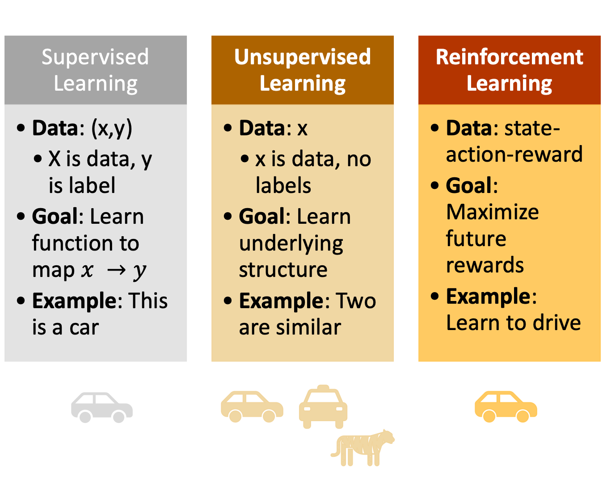{width=100% } 

---

In the following chapters each class will be introduced and examples given

## Supervised learning

## Unsupervised learning

## Reinforcement learning

Reinforcement learning (RL) is the most complex concept of the learning classes. It helps to first look at a simple example where the goal is to find the best possible way in a grid world. How the best possible way is defined and ways to find it will be the topic of this chapter


<iframe width="560" height="315" src="https://www.youtube-nocookie.com/embed/4MOx2_e5tug" frameborder="0" allow="accelerometer; autoplay; encrypted-media; gyroscope; picture-in-picture" allowfullscreen></iframe>

---

### Elements of reinforcement learning

There are five elements of RL as depicted below:

---

 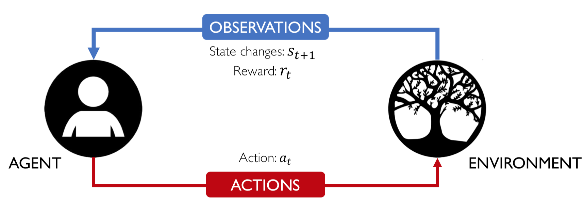{width=100% .external}

---

Those elements together build a Markov decision process (MDP) which might be a more familiar term. In order to solve a taks using RL the first step would be if the real world problem can be described as a MDP in terms of the five RL elements.


```{block2 echo=TRUE, type='rmdtip'}

- <p>Elements of RL: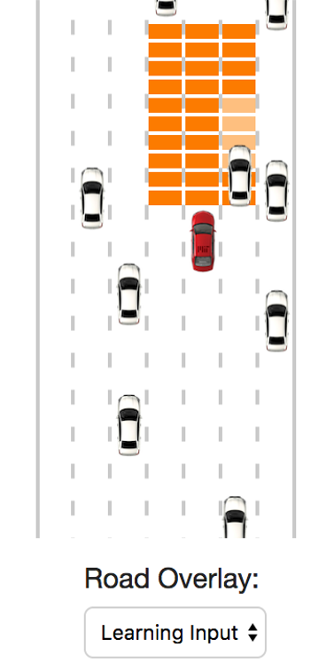 </p>

  
- Agent: takes actions.  
- Environment: the world in which the agent exists and operates.  
- Action $a_t$: a move the agent can make in the environment.  
- Observations: of the environment after taking actions.  
    - State $s_t$: a situation which the agent perceives.  
    - Reward $r_t$: feedback that measures the success or failure of the agent’s action.  

```


In order to understand the above defined terms better it is helpful to look at an example of self driving car in a simulator of MIT (https://selfdrivingcars.mit.edu/deeptraffic/).

The agent is the car which can take any of five actions

```{block2 echo=TRUE, type='rmdtip'}
Actions of agent $a_t$:

- No action
- Accelerate
- Break
- Change lanes
    - to the left
    - to the right
    
```


The **environment** is the **red marked space segments of the road**
The **state** is defined by the spaces in environment which are occupied by another car or empty.
The **reward** is given by the speed of the car, the **faster the better**

```{block2 echo=TRUE, type='HeadingNoNumber'}

Reward
  
```

A close look at the reward shows that the reward is summed up over time weighted with the so called **discount factor $\lambda$** which is in the range of $0\geq \lambda \leq 1$. Therefore the reward is not only dependent on the immidient reward but also on the to be expected reward.


```{block2 echo=TRUE, type='rmdmath'}

$$R_{t}=\sum_{i=t}^{\infty} \gamma^{i} r_{i}=\gamma^{t} r_{t}+\gamma^{t+1} r_{t+1} \ldots+\gamma^{t+n} r_{t+n}+\dots$$

```


  
```{block2 echo=TRUE, type='HeadingNoNumber'}

Find good actions, i.e actions with high total reward
  
```


```{block2 echo=TRUE, type='rmdmath'}

A Q-function can be defined which gives the expected value of the total reward for an action $a$ in a given state $s$.

$$Q(s, a)=\mathbb{E}\left[R_{t}\right]$$

  
  
where $\mathbb{E}$ is the expected value of the total reward. So the equation can be read as:


Q value if the environment is in state $s$ and the agent performing action $a$ is the expected value of the total reward $\mathbb{E}\left[R_{t}\right]$

  

```  
  
The Q-function captures the **expected total future reward** an agent in state $s$ can receive by executing a certain action $a$ .

```{block2 echo=TRUE, type='HeadingNoNumber'}

Find a good policy
  
```


Ultimately, the agent needs a **policy $\pi(s)$**, to infer the **best action to take** at its state $s$


```{block2 echo=TRUE, type='rmdmath'}

The strategy is that the policy should choose an action that maximizes future reward

$$\pi^{*}(s)=\underset{a}{\operatorname{argmax}} Q(s, a)$$


```

  
### RL algorithms

There are two ways to learn the best action

- Value learning

- Policy learning


---


 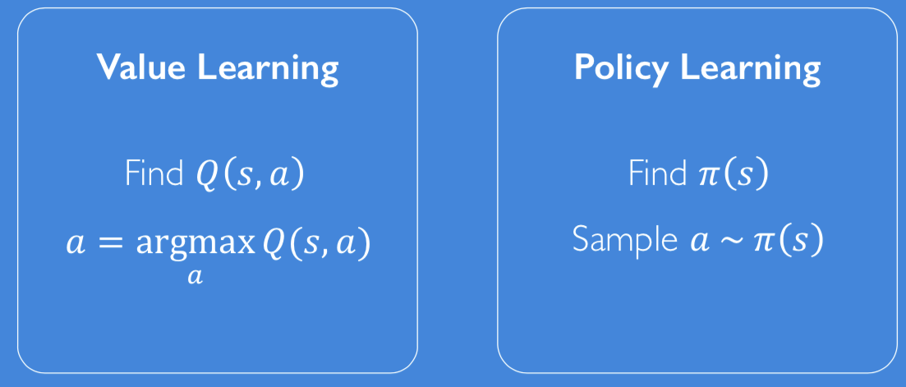{width=100% .external}

---


#### Value learning

The task in value learning is to find the Q-values for the states and acitons $(s,a)$


```{block2 echo=TRUE, type='HeadingNoNumber'}

Find Q-values
  
```


Depending on the complexity of the environment it might be difficult to find the Q values. 

---

 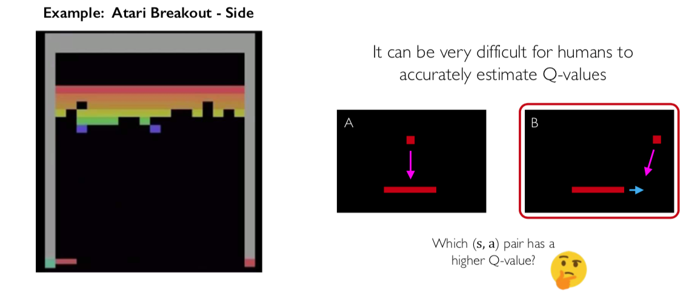{width=100% .external}

---


Q-values can be found using neural networks, the training however is than a two staged task.


```{block2 echo=TRUE, type='HeadingNoNumber'}

Traing deep q-learning
  
```


---

 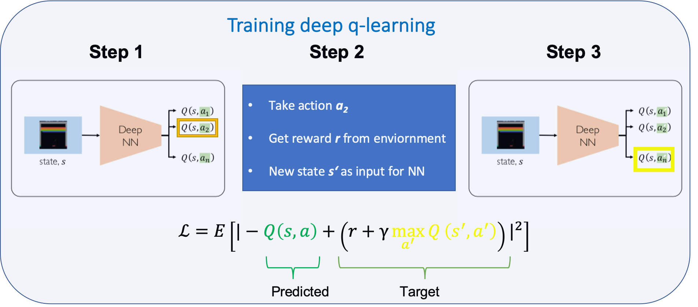{width=100% .external}


---


```{block2 echo=TRUE, type='HeadingNoNumber'}

Downsides of Q-learning
  
```


```{block2 echo=TRUE, type='rmdtip'}
Q-learning downsides: 

- Complexity:
    - Can model scenarios where the action space is discrete and small
    - Cannot handle continuous action spaces
- Flexibility:
    - Cannot learn stochastic policies since policy is deterministically computed from the Q function

```


#### Policy learning

---

 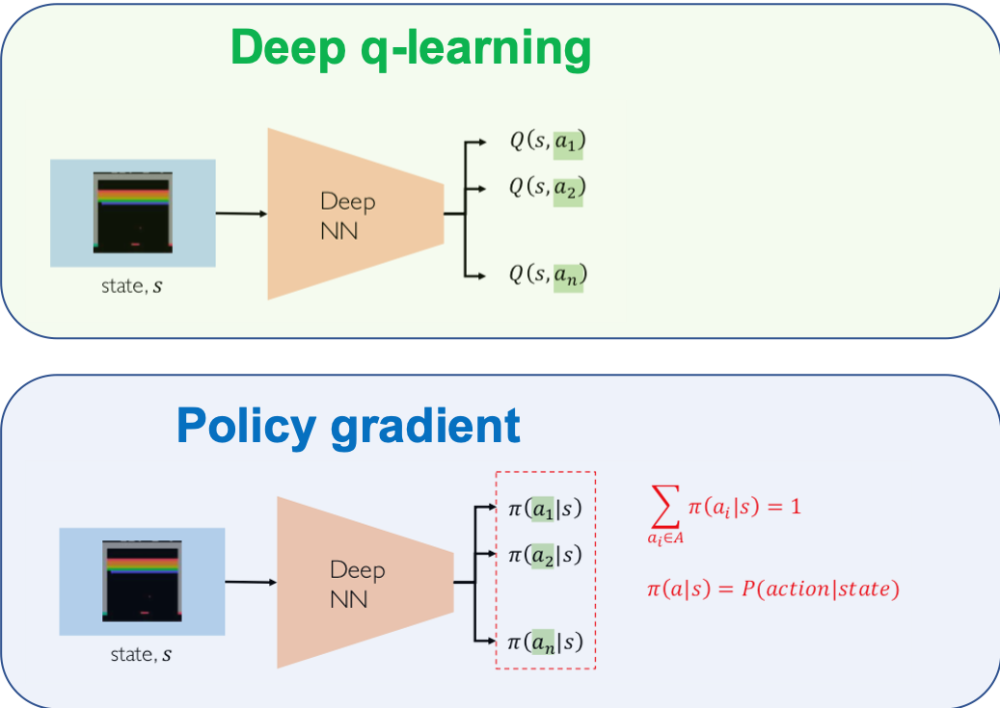{width=100% .external}


---

```{block2 echo=TRUE, type='HeadingNoNumber'}

Traing policy learning
  
```


```{block2 echo=TRUE, type='rmdtip'}
1. Run a policy for a while
2. Increase probability of actions that lead to high
rewards
3. Decrease probability of actions that lead to
low/no rewards

```

In a more mathematically way this could be written as pseudo code

```{block2 echo=TRUE, type='rmdtip'}
Pseudo code for training:
 
- function REINFORCE
    - Initialize $\theta$
    - $\mbox{for episode} \sim \pi_{\theta}$
        - $\left\{s_{i}, a_{i}, r_{i}\right\}_{i=1}^{T-1} \leftarrow episode$
        - for t = 1 to T-1
            - $\nabla \leftarrow \nabla_{\theta} \log \pi_{\theta}\left(a_{t} | s_{t}\right) R_{t}$ 
            - $\theta \leftarrow \theta+\alpha \nabla$
- return $\theta$           
  
where $\log \pi_{\theta}\left(a_{t} | s_{t}\right)$ is the log-likelihood of action $a_t$

```


### Example self driving car MIT

The DeepTraffic website of MIT is a great place to get a feeling for reinforcement learning. Parameters can be varied and the impact can be seen right away without the need to install any code on the computer.

```{block2 echo=TRUE, type='rmdtip'}

DeepTraffic: 
- Competition of MIT in the frame of their self-driving car course
- Target: Create a neural network which drives a car fast through highway traffic
- website https://selfdrivingcars.mit.edu/deeptraffic/
- documentation: https://selfdrivingcars.mit.edu/deeptraffic-documentation/ 

```


The following variables control the size of the input the net gets – a larger input area provides more information about the traffic situation, but it also makes it harder to learn the relevant parts, and may require longer learning times.


```{block2 echo=TRUE, type='rmdtip'}


<p>Environment: </p>

- For each car the grid cells below it are filled with the car’s speed, empty cells are filled with a high value to symbolize the potential for speed.

- Your car gets a car-centric cutout of that map to use as an input to the neural network. You can have a look at it by changing the Road Overlay to *Learning Input*
  
>
lanesSide = 1;  
patchesAhead = 10;  
patchesBehind = 0;  


```

The agent is controlled by a function called learn that receives the current state (provided as a flattened array of the defined learning input cutout), a reward for the last step (in this case the average speed in mph) and has to return one of the following actions:


```{block2 echo=TRUE, type='rmdtip'}

Ouptut of neural network is action:

- Agent is controlled by function called **learn**
- Receives current state
    - flattened array
    - reward of last step
retunrs
>
var noAction = 0;  
var accelerateAction = 1;  
var decelerateAction = 2;  
var goLeftAction = 3;  
var goRightAction = 4;  

```


The learn function is as follows

```python

learn = function (state, lastReward) {
    brain.backward(lastReward);
    var action = brain.forward(state);
 
    draw_net();
    draw_stats();
 
    return action;
}

```


An overview of the most important variables is given below

 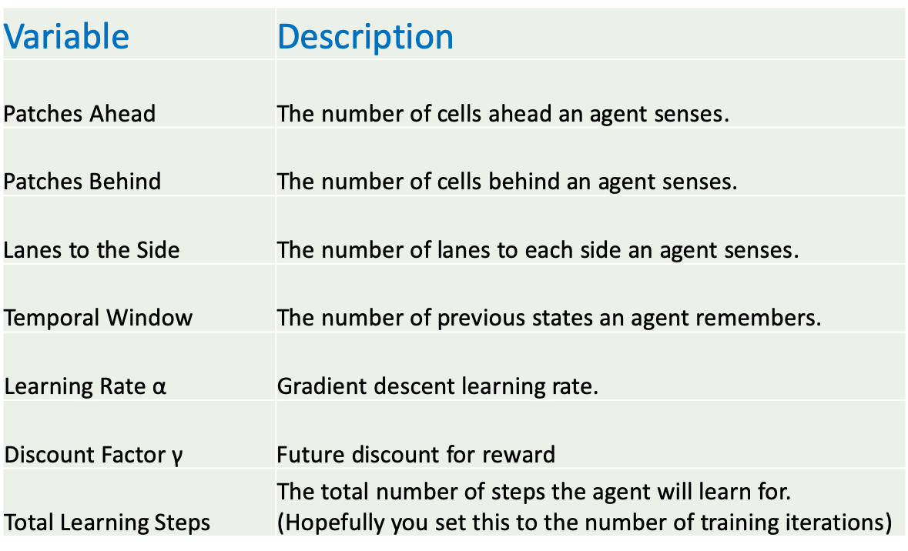{width=100%}


#### Crowdsourced Hyperparmeter tuning

MIT "DeepTraffic: Crowdsourced Hyperparameter Tuning of Deep Reinforcement Learning Systems for Multi-Agent Dense Traffic Navigation" [@fridman2018deeptraffic] in which they present the results of


```{block2 echo=TRUE, type='rmdtip'}

Results of study:

- Number of submissions: 24,013
- Total network parameters optimized: 572.2 million
- Total duration of RL simulations: 96.6 years

```

The results show that over time the results became better until a plateau was reached.

---

![Figure from [@fridman2018deeptraffic]](images/averageVsSpeed.png){width=100% .external}

---

Looking at **average speed vs neural network parameters** it can be seen that

```{block2 echo=TRUE, type='rmdtip'}

Average speed vs NN parameters:

- Few layers sufficient for high average speed
- Balance needed between neural network
    - width
    - deepth 

```

---

![Figure from [@fridman2018deeptraffic]](images/speedVsLayers.png){width=100% .external}

---

Looking at the training iterations it can be seen that with **fewer parameters less iterations are necessary**


---

![Figure from [@fridman2018deeptraffic]](images/aveSpeedIterations){width=100% .external}

---


There is a clear optimum of **three lines** at either side of the car

---

![Figure from [@fridman2018deeptraffic]](images/aveLanes.png){width=100% .external}

---

It can be concluded that it is worth looking into the future when looking at the image below depicting average speed vs pachtes ahead.

---

![Figure from [@fridman2018deeptraffic]](images/avePatchesAhead.png){width=100% .external}

---


Whereas looking into the past only pays of until 5 patches behind.

---

![Figure from [@fridman2018deeptraffic]](images/avePatchesRear.png){width=100% .external}

---


Another idea to improve the performance is to look not only at one image but at several images to get a bette understanding of the dynamics of the scenario. However, the graph below shows that is was **not helpful to look into the past**


---

![Figure from [@fridman2018deeptraffic]](images/aveVsTemporalWindows.png){width=100% .external}

---


The reduction factor $\gamma$ considers future rewards, the higher the value the more attention is given to future awards. The image below shows that **paying attention to future rewards is beneficial**

---

![Figure from [@fridman2018deeptraffic]](images/aveVsGamma.png){width=100% .external}

---

To find a rule out of the parameters analysed a t-SNE mapping of the following parameters onto 2 dimensions was conducted:

- patches ahead
- patches behind
- l2 decay
- layer count
- gamma
- learning rate
- lanes side
- training iterations

---

![Figure from [@fridman2018deeptraffic]](images/avetSNE.png){width=100% .external}

---

The figure shows spots with high average speed, those patches can be used as basis for further improvement.

# ML algorithms {#MlAlgorithm}


<blockquote>

A comparison of a several classifiers in scikit-learn on synthetic datasets. The point of this example is to illustrate the nature of decision boundaries of different classifiers. This should be taken with a grain of salt, as the intuition conveyed by these examples does not necessarily carry over to real datasets.

Particularly in high-dimensional spaces, data can more easily be separated linearly and the simplicity of classifiers such as naive Bayes and linear SVMs might lead to better generalization than is achieved by other classifiers.

The plots show training points in solid colors and testing points semi-transparent. The lower right shows the classification accuracy on the test set.

https://scikit-learn.org/stable/auto_examples/classification/plot_classifier_comparison.html#sphx-glr-auto-examples-classification-plot-classifier-comparison-py
</blockquote>


 {width=120% }

## Linear regression TBD {#MlAlgoLinReg}

A linear regression is a regression analysis, a statistical method, at which a dependent variable is explained through several independent variables.

- Simple linear regression
    - Only one independent variable
- Multiple linear regression
    - more than one independent variables
    


Linear regression algorithm is one of the **fundamental supervised learning algorithms**.

### Example for linear regression

In this example the procedure of a linear regression is described

```{block2 echo=TRUE, type='HeadingNoNumber'}
Data

```

Given is a set of data created by a linear expression plus some noise


```{block2 echo=TRUE, type='rmdmath'}

$$y = 3*x+2+n$$
where $n$ is noise

```


The data can be depicted as below. It is easy to be seen that we are looking at a linear function with superimposed noise.

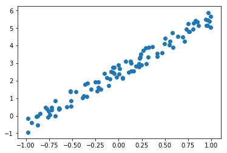{width=50%}


```{block2 echo=TRUE, type='HeadingNoNumber'}
Model

```

The task is to find the value for $w_0$ and $w_1$ of a model which is as close as possible to the original function


```{block2 echo=TRUE, type='rmdmath'}
$$\hat{y} = w_0*x+w_1$$

```


```{block2 echo=TRUE, type='HeadingNoNumber'}
Loss function

```

The metric to define how good the model fits the data is defined as **mean squared error (MSE)**


```{block2 echo=TRUE, type='rmdmath'}
$$L=(\hat{y}-y)^2$$

```

```{block2 echo=TRUE, type='HeadingNoNumber'}
Minimise loss function

```


The difference between $\hat{y}$ and $y$ shall be small **stochastic gradient descent (SGD)** can be applied. 


```{block2 echo=TRUE, type='rmdtip'}
SGD:

- Iteratively updating values of $w_0, w_1$ using
    - gradient
    - learning rate $\eta$

```

In maths terms this can be written as:


```{block2 echo=TRUE, type='rmdmath'}

$$ w_{new} = w_{current} - \eta \frac{\partial L}{\partial w_{current}}$$
```


A graphical representation of SGD is given below. In this example the loss function can be depicted as a 3D plot. In the current case the surface is flat which makes it easy to find the **global optimum**

--- 

 {width=90%  .external}

---


## Logistic regression {#MlAlgoLogReg}

Logistic regression is similar to linear regression, however, the value range of the dependent variable y is limited to:

$$0\leq y \geq 1$$

Logistic regression is a algorithm with the low computational complexity TBD

```{block2 echo=TRUE, type='rmdtip'}

- Low computational complexity
- y limited range of values $0\leq y \geq 1$
- maps x on y ($y \leftarrow x$) using the [logisit function](https://en.wikipedia.org/wiki/Logistic_function)  
- Used of classification 

```


The logistic function is depicted in the graph below


```{r logsiticFuncitonMlAlgo, echo=FALSE, fig.height=5, message=FALSE, warning=FALSE, out.width= "60%"}
library(ggplot2)
eq = function(x) {
  
  1/(1+exp(-x))
}

ggplot(data.frame(x=c(-6,6)), aes(x=x)) + stat_function(fun=eq, geom = "line") + xlab(expression(eta)) + ylab(expression(logsitic(eta)))
```

The logistic function is defined as:

```{block2 echo=TRUE, type='rmdmath'}

Logistic function: 
$$logistic(\eta) = \frac{1}{1+exp^{-\eta}}$$

$$P(Y = 1 \vert X_i = x_i) = \frac{1}{1+exp^{-(\beta_0 + \beta_1X_1+ \dots \beta_n X_n)}}$$

  
where:

- $\beta_n$ are the coeffcients we are searching
- $X_n$ are the features

```

The second equation reads: The probability of $Y=1$ given the value $X=x_i$ which is exactly the result needed for a classification problem.

### Python example logistic regression

An example of scikit-learn is given at https://scikit-learn.org/stable/auto_examples/linear_model/plot_logistic.html#sphx-glr-auto-examples-linear-model-plot-logistic-py and emphasises on the difference between linear and logistic regression. The synthetic data set has values either 0 or 1. This can be modeled quite well with logisitc regression, but not at all with linear regression.

 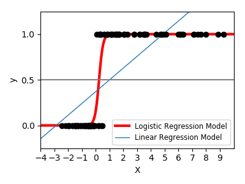{width=70% }

The python code is given below

```python

import numpy as np
import matplotlib.pyplot as plt

from sklearn import linear_model
from scipy.special import expit

# General a toy dataset:s it's just a straight line with some Gaussian noise:
xmin, xmax = -5, 5
n_samples = 100
np.random.seed(0)
X = np.random.normal(size=n_samples)
y = (X > 0).astype(np.float)
X[X > 0] *= 4
X += .3 * np.random.normal(size=n_samples)

X = X[:, np.newaxis]

# Fit the classifier
clf = linear_model.LogisticRegression(C=1e5)
clf.fit(X, y)

# and plot the result
plt.figure(1, figsize=(4, 3))
plt.clf()
plt.scatter(X.ravel(), y, color='black', zorder=20)
X_test = np.linspace(-5, 10, 300)

loss = expit(X_test * clf.coef_ + clf.intercept_).ravel()
plt.plot(X_test, loss, color='red', linewidth=3)

ols = linear_model.LinearRegression()
ols.fit(X, y)
plt.plot(X_test, ols.coef_ * X_test + ols.intercept_, linewidth=1)
plt.axhline(.5, color='.5')

plt.ylabel('y')
plt.xlabel('X')
plt.xticks(range(-5, 10))
plt.yticks([0, 0.5, 1])
plt.ylim(-.25, 1.25)
plt.xlim(-4, 10)
plt.legend(('Logistic Regression Model', 'Linear Regression Model'),
           loc="lower right", fontsize='small')
plt.tight_layout()
plt.show()

```


