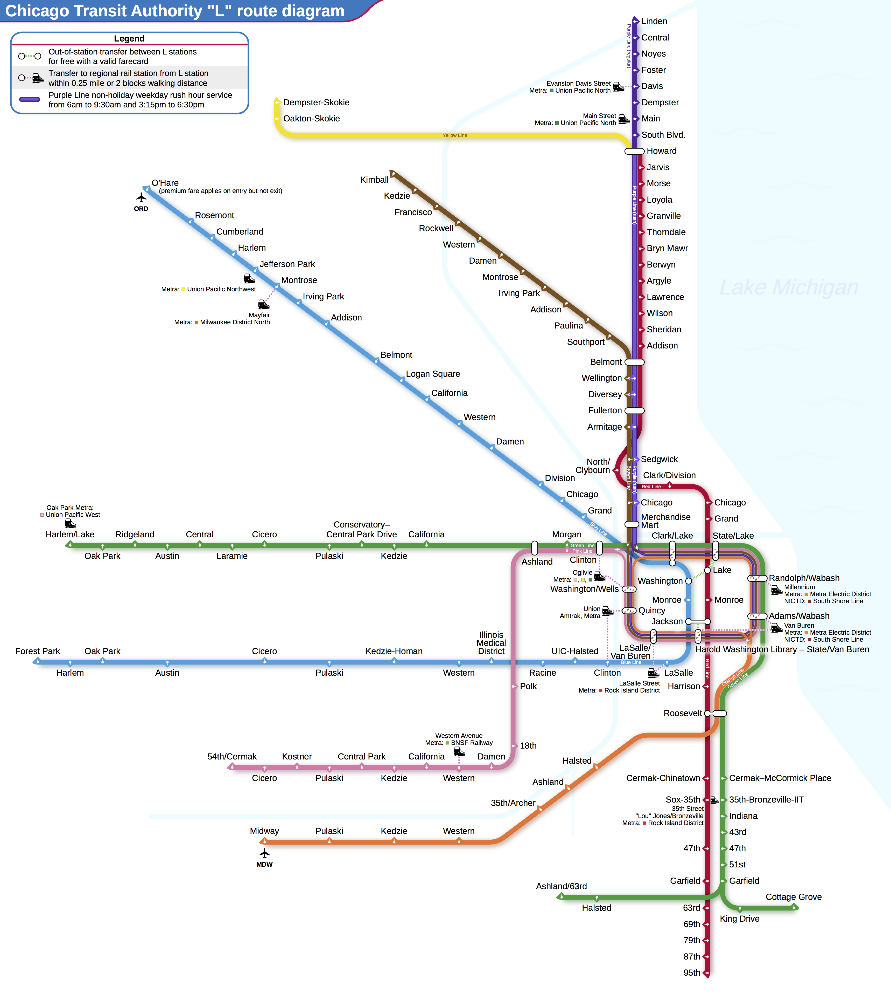
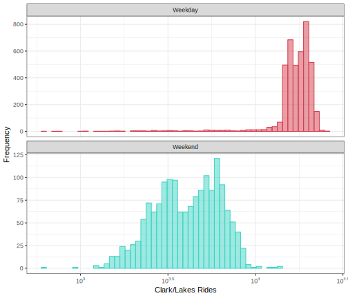
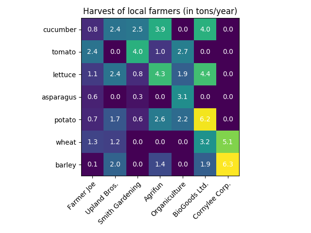
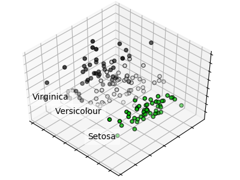
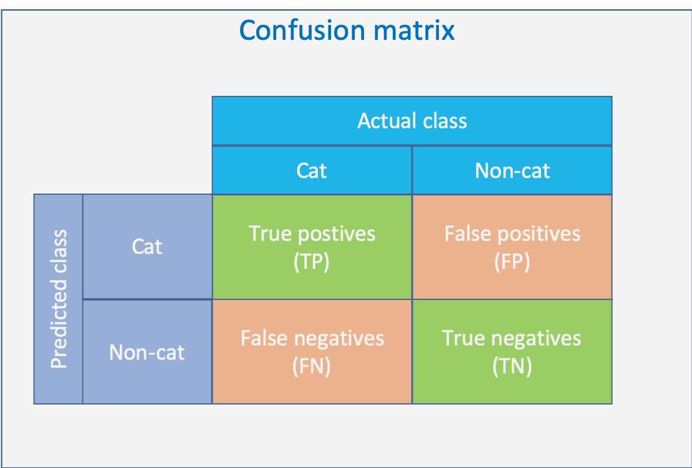
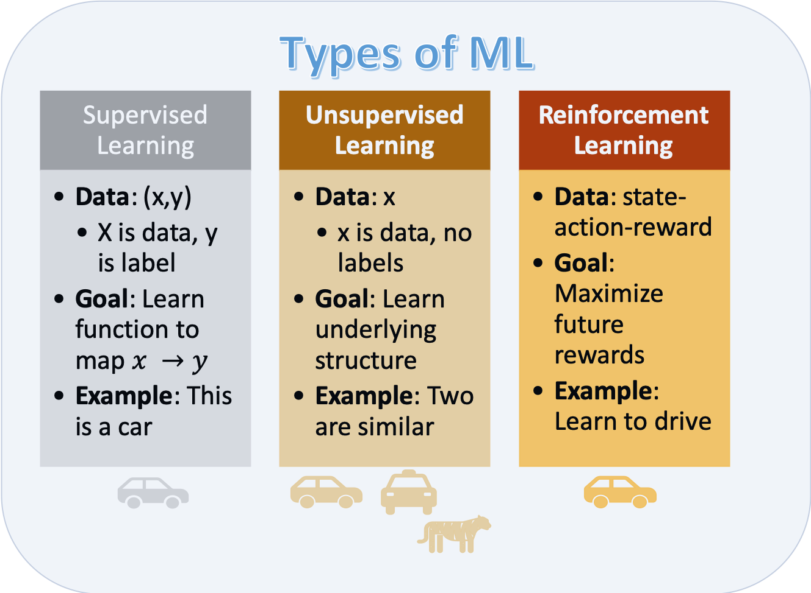

# (PART) Machine learning fundamentals {-} 


```{r setupMlFunda, include=FALSE}
knitr::opts_chunk$set(echo = FALSE)
```


# Machine learning fundamentals {#MachineLearningFundamentals}


<blockquote>
 “If intelligence was a cake, unsupervised learning would be the cake, supervised learning would be the icing, and reinforcement learning would be the cherry” 
 Yann LeCun
</blockquote>


# ML project process

Many ML projects get started the wrong way, trying a way to use data rather than using the data to fulfill a need, a need which has a benefit to the organization It is understandable that organizations want to learn from the data they have, but starting without a clear need in mind often leads to wasted efforts because sooner or later it will be discovered that the data available is not sufficient for a useful model.

At the start of a ML project there should be a clear formulated need which should be answered by the model, because ML is only a tool to help to achieve the objectives of the organization


```{block2 echo=TRUE, type='rmdtip'}

<p>At the beginning there is a need which ML is suitable to fulfill:</p>


- Optimize fertilizer usage
- Improve user experience
- Reduce energy cost
- Increase milk production

```


```{block2 echo=TRUE, type='HeadingNoNumber'}

The main project phases
  
```

Starting with the need the process can be split up in phases as shown below:

---

 {width=50% }


---

The process is not sequential but highly iterative as is described in the next chapters 

## Identify if ML is suited to fulfill need

There are plenty of needs within an organization and different entities within the organization will have different opinions about how to fulfill those needs. Often the people with the needs are not aware of the potential of ML to fulfill the need, on the other hand, often the people with ML knowledge don't know of the needs. It is therefore necessary to enable that the right people get in contact.


```{block2 echo=TRUE, type='rmdtip'}

<p>Enable contact people with:</p>

- Needs
- ML knowlegde

```


There are plenty of reasons why to choose a ML approach to fulfill the need, but there are also plenty of reasons why not to.


```{block2 echo=TRUE, type='rmdtip'}

<p>Reasons why ML approach should be chosen:</p>

- Suitable solution
    - meets need
    - low development effort
    - no alternative technology

- Build up ML knowledge

<p>Reasons why ML approach should NOT be chosen:</p>


- Less complex solution available
- Not enough experience to estimate effort
- Regulations might prohibit usage of ML due to testing requirements

```


ML right now is very fashionable, but if there is no benefit from choosing ML over another solution other than it is more exciting than think twice before you make your choice.


```{block2 echo=TRUE, type='rmdwarning'}

Make sure that the **most suitable** solution for the need is found, **not the fanciest.**

``` 


## Gather data

Gathering data is one of the key aspects of an ML project with three main questions:

```{block2 echo=TRUE, type='rmdquestion'}

Two fundamental questions:

- How much data is necessary?
- Which data is useful?
- What kind of data can be used?
  
```

For the first question there are no clear answers, for the second the are plenty of methods to decide whether data is useful or not.

As for the question about the kind of data which can be used, lets get some inspiration in the next section


--- 

### What kind of data can be used?


```{r networkTypesOfData, echo=FALSE, message=FALSE, warning=FALSE}


nodes1 <-  tribble(
  ~id,                                      ~label,                  ~color,     
                     
  "Data",                                       "Data Types",                            "#00cc99",
  "Image Data",                                 "Image Data",                            "#00cc99",
  "Facial recognition",                         "Facial recognition",                    "#00cc99",
  "Action recognition",                         "Action recognition",                    "#00cc99",
  "Object detection and recognition",           "Object detection and recognition",      "#00cc99",    
  "Handwriting and character recognition",      "Handwriting and character recognition", "#00cc99",         
  "Satellite images",                           "Satellite images",                      "#00cc99",
  "Other images",                               "Other images",                           "#00cc99",
  
  "Text Data",                                   "Text Data",                  "#00ccff",
	"Reviews",                                  	"Reviews",                     "#00ccff",
	"News articles",                            	"News articles",               "#00ccff",
	"Messages",                                 	"Messages",                    "#00ccff",
	"Twitter and tweets",                        	"Twitter and tweets",          "#00ccff",
	"Dialogues",                                	"Dialogues",                   "#00ccff",
	"Other text",                               	"Other text",                  "#00ccff",
  
  "Sound Data",                                 "Sound Data",                  "#33ccff",
  "Speech",                                     "Speech",                      "#33ccff",
  "Music",                                      "Music",                       "#33ccff",
  "Vibration Noise",                            "Vibration Noise",             "#33ccff",
  "Other sounds",                               "Other sounds",                "#33ccff",
  
  "Signal Data",                     "Signal Data",                "#66ccff",
  "Electrical",                      "Electrical",                 "#66ccff",
  "Motion-tracking",                 "Motion-tracking",            "#66ccff",
  "Other signals",                   "Other signals",              "#66ccff",
  
  
  
  "Physical Data",                   "Physical Data",              "#66ffff",
  "High-energy physics",             "High-energy physics",        "#66ffff",
  "Systems",                         "Systems",                    "#66ffff",
  "Astronomy",                       "Astronomy",                  "#66ffff",
  "Earth science",                   "Earth science",              "#66ffff",
  "Other physical",                  "Other physical",             "#66ffff",

  
  "Biological Data",                 "Biological Data",            "#00ffff",
  "Human",                           "Human",                      "#00ffff",
  "Animal",                          "Animal",                     "#00ffff",
  "Plant",                           "Plant",                      "#00ffff",
  "Microbe",                         "Microbe",                    "#00ffff",
  "Drug Discovery",                  "Drug Discovery",             "#00ffff",
  
  
  
  
  "Multivariant Data",                "Multivariant Data",          "#00ffcc",
  "Financial",                        "Financial",                  "#00ffcc",
  "Weather",                          "Weather",                    "#00ffcc",
  "Census",                           "Census",                     "#00ffcc",
  "Transit",                          "Transit",                    "#00ffcc",
  "Internet",                         "Internet",                   "#00ffcc",
  "Games",                            "Games",                      "#00ffcc",
  "Other multivariate",               "Other multivariate",         "#00ffcc"
  
) %>% arrange(id)


edges <- tribble(
  
  ~from,                      ~to,        
  
  "Data",     "Image Data", 
  
  "Image Data", "Facial recognition",                   
  "Image Data", "Action recognition",                   
  "Image Data", "Object detection and recognition",     
  "Image Data", "Handwriting and character recognition",
  "Image Data", "Satellite images",                     
  "Image Data", "Other images",                         

  "Data",  "Text Data",   
  "Text Data",  "Reviews",            
  "Text Data",  "News articles",      
  "Text Data",  "Messages",           
  "Text Data",  "Twitter and tweets", 
  "Text Data",  "Dialogues",          
  "Text Data",  "Other text",         
 
  "Data",  "Sound Data",    
  "Sound Data",      "Speech",        
  "Sound Data",    "Music",           
  "Sound Data",    "Vibration Noise", 
  "Sound Data",    "Other sounds",    
 
 
  "Data",  "Signal Data",     
  "Signal Data",  "Electrical",     
  "Signal Data",  "Motion-tracking",
  "Signal Data",  "Other signals",  
  
  "Data",  "Physical Data",  
   "Physical Data", "High-energy physics", 
   "Physical Data", "Systems",             
   "Physical Data", "Astronomy",           
   "Physical Data", "Earth science",       
   "Physical Data", "Other physical",      

  
  "Data",  "Biological Data", 
  "Biological Data",     "Human",          
  "Biological Data",     "Animal",         
  "Biological Data",     "Plant",          
  "Biological Data",     "Microbe",        
  "Biological Data",     "Drug Discovery", 
 
  
  "Data",  "Multivariant Data",
  "Multivariant Data",      "Financial",        
  "Multivariant Data",    "Weather",           
  "Multivariant Data",    "Census",            
  "Multivariant Data",    "Transit",           
  "Multivariant Data",    "Internet",          
  "Multivariant Data",    "Games",             
  "Multivariant Data",    "Other multivariate"
  
)


visNetwork(nodes1, edges, width = "100%") %>%  visOptions(highlightNearest = list(enabled =TRUE, degree = 1), nodesIdSelection = TRUE) %>% visNodes(shape = "circles") %>% 
    visInteraction(navigationButtons = TRUE)  

```


### How much data is necessary?

There are a number of rules of thumb out there like

```{block2 echo=TRUE, type='rmdtip'}
Rules of thumb:
  
- For regression analysis
    - 10 times as many samples than parameters 
- For image recognition
    - 1000 samples per category
    - can go down significantly using pre-trained models

```
but those rules a just a rough guidance since there are plenty of factors influencing the data needed

```{block2 echo=TRUE, type='rmdtip'}
Factors influencing data requirement:

- model complexity
- similarity of data
    - the higher the similarity the less new samples help
- noise on data
- more samples
     - more computational effort
     - for trees might be counterproductive

```

Sometimes it is easy to create data. When Ayers was thinking about the title of his new book he targeted Google Ads, each with a different title. He got 250,000 samples related to which ad was clicked on most [@ayres2007super].

During model training it might become obvious that we run into overfitting, that is the case when training error gets smaller and at the same time the validation error goes up or when the validation error is much higher than the training error.

```{block2 echo=TRUE, type='rmdtip'}

Overfitting as indicator for not enough data:

- Validation error is much higher than training error
- Validation error increase with training cycles
- Model memorizes dat but doesn't generalise

```

--- 

 {width=80% }

#### Dealing with small data TBC

Recent advances in ML reduce the amount of data needed to build meaningful model. Promising concepts presented at https://www.industryweek.com/technology-and-iiot/digital-tools/article/21122846/making-ai-work-with-small-data are listed below.
 
 
<div class="rmdtip">
<p>Concepts to deal with small data:</p>


- Synthetic data generation
    - synthesize novel images that are difficult to collect in real life. 
    - using GANs, variational autoencoders, and data augmentation

- Transfer learning 
    - using pre-trained model
    - add reduced training to specific task

- Self-supervised learning see chapter \@ref(MlSelfSupvervised)
     - creating labeled data automatically,e.g. masks words in sentence


- Anomaly detection
    - model sees zero examples of defect and only examples of OK samples
    - algorithm flags anything that deviates significantly from the OK as a potential problem. 

- Human-in-the-loop
    - start with higher error system
    - if confidence is low $\implies$ show to human expert
    - over time model will become better


</div> 


---


### Which data is useful?

Ideally only data which explain the output are fed into a model. But there might be features which are not known to be of importance. On the other hand there might be features which are overrated as to the importance they have for the output. Anyhow, both can only be known after a model is build. Also, it might be that a feature is valuable for one model but not so much for another model.


<div class="rmdtip">


Data useful?:

- Could be detected during exploratory data analysis see chapter \@ref(eda) 
- Has to be tested with model 
- Importance can be model dependent
- Not helpful features cause
    - performance drop
    - more complex models

</div>


Finding the importance of a feature falls into the scope of **feature engineering** as described in chapter  \@ref(featureImportance) 


## Exploratory and quantitative data analysis {#eda}

Before starting to build any model it is good practice to analyze the data. Exploratory and quantitative data analysis are interlinked and therefore can be viewed together.


```{block2 echo=TRUE, type='rmdtip'}

- <p>Exploratory data analysis </p>
    - Find correlations or mutial depence
- Quantiative analysis
    - Check distribution
        - Long tail => log of variable

```


<div class="rmdtip">


- <p>Why data analysis?</p>

- Understanding characteristic and distribution of response
    - histogram
    - box plot
- Uncover relationships between predictors and response
    - scatter plots
    - pairwise correlation plot among predictors
    - projection of high-dimensional predictors into lower dimensional space
    - heat maps across predictors

</div>


The process of exploratory and quantitative data analysis is described in detail in the following example.

### Example for exploratory and quantitative data analysis

This example is from the online book "Feature Engineering and Selection: A Practical Approach for Predictive Models" 
[@FeatureEngineeringKuhnWebsite]

#### Visualization for numeric data

In this example the data set on ridership on the Chicago Transit Authority (CTA) “L” train system http://bit.ly/FES-Chicago is used to predict the ridership in order to optimize operation of the train system.


<div class="HeadingNoNumber">

Task: predict future ridership volume 14 days in advance

</div>

---

 {width=100% .external}

---

Since for any prediction of future ridership volume only historical values are available lagging data are used. In this case a lag of 14 days are used, i.e. ridership at day D-14.

 <div class="HeadingNoNumber">

Distribution of response

</div>

The distribution of the response gives an indication what to expect from a model. The residuals of a model should have less variation than the variation of the response.

If the distribution shows that the frequency of response decreases proportionally with larger values this might be an indication that the response follows a log-normal distribution. Log-transforming the response would induce a normal distribution and often will enable a model to have better prediction performance.


<div class="rmdtip">


- <p>Why look at distribution?</p>

- Gives indication on what to be expected from model performance
    - variance of residuals < variance of response
- Distribution shaping might enable better prediction performance    

</div>


A **box plot** gives a quick idea of the distribution of a variable

---

 ![Figure from  [@FeatureEngineeringKuhnWebsite]](images/clarkRides.svg){width=70% .external}
 
---
 
 <div class="rmdtip">
Box plot legend:

- Vertical line
    - median of data
- Blue area
    - represents 50% of data
- Whiskers
    - indicate upper and lower 25% of data

</div>

 <div class="HeadingNoNumber">

Skewness of distribution

</div>

In the following picture the relative position of the red line within its surrounding box shows the skewness of the data

---

 ![Figure from <a href="https://commons.wikimedia.org/wiki/File:Boxplots_with_skewness.png" title="via Wikimedia Commons">Ever.chae</a> [<a href="https://creativecommons.org/licenses/by-sa/4.0">CC BY-SA</a>]](images/Boxplots_with_skewness.png){width=50% .external}
 
---

 What the skewness of data means for its distribution is shown in the picture below

---

 ![Figure from <a href="https://commons.wikimedia.org/wiki/File:Relationship_between_mean_and_median_under_different_skewness.png" title="via Wikimedia Commons">Diva Jain</a> [<a href="https://creativecommons.org/licenses/by-sa/4.0">CC BY-SA</a>]](images/Relationship_between_mean_and_median_under_different_skewness.png){width=70% .external}
 
 
 mode: Value which appears most often in data set
 
---

The box plot doesn't show if there are multiple peaks or modes. Histograms and violin plots are better suited in that case

---

 ![Figure from  [@FeatureEngineeringKuhnWebsite]](images/eda-s-40380-distribution-1.svg){width=70% .external}
 
---

 
 <div class="rmdtip">
Box plot alternatives: 

- Histogram
     - data binned into equal regions
     - height of bar proportional frequency of percentage of samples in region
- Violin plot
    - compact visualization of distribution
    - histogram-like characteristics 
    - could add
        - lower quartile ^[lower quarter of the data]
        - median
        - upper quartile ^[higher quarter of the data]

</div>


To **compare multiple distributions box plots are still helpful** as shown in the next image which shows the distribution of weekday ridership at all stations

---

 ![Figure from  [@FeatureEngineeringKuhnWebsite]](images/multipleBoxPlots.png){width=100% .external}
 
---


 <div class="rmdtip">

Knowledge gained through box plot:

- Wider distribution than other stations
- Station is close to stadium of Chicago Clubs
- $\implies$ Clubs home game schedule would be important information for model

</div>


 <div class="HeadingNoNumber">

Using faceting and colors to augment visualizations

</div>

Facets create the same type of plots and splitting the plot into different panels based on some variable

 <div class="rmdtip">
<p>Faceting:</p>


- Same type of plot
- Based on some variable
- Below faceting shows that ridership is different for parts of the week
- $\implies$ **part of the week** is important feature

</div>


The plot below shows the ridership for Clark/Lake, and gives an explanation for the two modes seen in the histogram above, the ridership is vastly different on weekends than during the week.

---

 ![Figure from  [@FeatureEngineeringKuhnWebsite]](images/ridesFacet.svg){width=70% .external}
 
---


 <div class="HeadingNoNumber">

Scatter plots

</div>

Scatter plots can add a new dimesions to the analysis

 <div class="rmdtip">

Scatter plot:

- One variable on x-axis, the other variable on y-axis
- Each sample plotted in this coordinate space
- Assess relationships
    - between predictors
    - between response and predictors

</div>


---

 ![Figure from  [@FeatureEngineeringKuhnWebsite]](images/scatterRidesWeekendsWeekdays.svg){width=60% .external}
 
---

There are several conclusions which can be drawn from the scatter plot above


<div class="rmdtip">

Knowledge gained through scatter plot:

- Strong linear relationship between 14-day lag and current-day ridership
- Two distinct groups of points
    - weekday
    - weekend
- Plenty of outlier
- Uncovering explanation of outlier $\implies$ new useful feature

</div>


<div class="HeadingNoNumber">

Heatmaps

</div>

Heatmaps are a versatile plots that displays one predictor on the x-axis and another predictor on the y-axis. Both predictors must be able to be categorized.
The categorized predictors form a grid, this grid is filled by another variable.

<div class="rmdtip">
<p>Heatmaps:</p>

- Categorize predictor
    - for x and y-axis
- Display another variable on grid
    - categorical or continuous 
- Color depends on either value or category

</div>


The following heatmap investigates the all cases of weekday ridership less than 10,000. Those represent outlier needing explanation


---

 ![Figure from  [@FeatureEngineeringKuhnWebsite]](images/heatMapRidesAnnotated.png){width=70% .external}


blue: holiday  
green: extreme weather

---

<div class="rmdtip">
Heatmap concept

- Categorize predictor
    - x-axis: represents year
    - y-axis: represents month and day
- Red lines indicate weekdays ridership < 10,000
- Blue boxes mark holiday seasons
- Green boxes mark unusual data points
    - both days hat extreme weather
    - $\implies$ **weather** is important feature

</div>


<div class="HeadingNoNumber">

Correlation matrix plots

</div>

An extension to scatter plot correlation matrix plots show the correlation between each pair of variable.

<div class="rmdtip">

Correlation matrix plots

- Extension to scatter plot
- Each variable is represented on the outer x-axis and outer y-axis
- Matrix colored based on correlation value

</div>


---

```{r CorMap, echo=FALSE, message=FALSE, warning=FALSE, out.width = "80%"}
load("images/corMap.RData")
cor_map
```

**Interactive figure** based on  [@FeatureEngineeringKuhnWebsite]

---

<div class="rmdtip">

Knowledge gained through analysis of correlation matrix plot

- Ridership across station is positively correlated for nearly all pairs of stations
- Correlation for majority of stations is extremely high
    - information present across stations is redundant
- Columns and rows are organized based on hierarchical cluster analysis
    - stations that have similar correlation vectors will be nearby on the axis
    - helps to identify groups $\implies$ may point to important features

</div>

<div class="HeadingNoNumber">

Principal Components Analysis (PCA)

</div>

One way of condensing many dimensions into just two or three are dimension reductions techniques such as principle components analysis (PCA). An explanation of dimension reductions techniques is given in chapter \@ref(ManytoManyTransformations) 

<blockquote>

Principal components analysis finds combinations of the variables that best summarizes the variability in the original data 

[@dillon1984multivariate]

</div>

---

![Figure from  [@FeatureEngineeringKuhnWebsite]](images/pcaAndViolinPlot.png){width=100% .external}


---


<div class="rmdtip">

Knowledge gained through analysis of PCA plot

- Component 1 focuses on part of the week
- Component 2 focuses on changes over time

</div>


### Visualizations for Categorical Data: Exploring the OkCupid Data

OkCupid is an online dating platform. A data set of 50,000 San Francisco user data is available at [GitHub](https://github.com/rudeboybert/JSE_OkCupid)

<div class="rmdtip">

Data of OkCupid data set:

- open text essays related to an individual’s interests and personal descriptions,
- single-choice type fields such as profession, diet, and education, and
- multiple-choice fields such as languages spoken and fluency in programming languages.

</div>


<div class="HeadingNoNumber">

Task: Predict whether the profile's author was worked in STEM (science, technology, engineering, and math) field
</div>


#### Visualizing Relationships between Outcomes and Predictors


To find out whether religion would be a good predictor several kinds of plots are compared.

Firstly use a **bar plot**. The figure is ordered from greatest ratio (left) to least ratio (right) of STEM members in that religion.


---

![Figure from  [@FeatureEngineeringKuhnWebsite]](images/barPlotReligionStem.png){width=60% .external}


---

<div class="rmdtip">

Bar plot shortcomings:

- Doesn't easily show ratio
    - see Hinduism
- Gives no sense on uncertainty
    - number of profiles per religion
    - the smaller the number the higher the uncertainty

</div>


A better alternative is a **stacked bar plot** as shown in the next graph

---


![Figure from  [@FeatureEngineeringKuhnWebsite]](images/stackedBarPlotReligionStem.png){width=60% .external}


---

<div class="rmdtip">

Stacked plot shortcomings:

- No sense of frequency
    - No information that there are very few Islamic profiles
- No sense of uncertainty

</div>


A better alternative is a **error bar plot** as shown in the next graph

---


![Figure from  [@FeatureEngineeringKuhnWebsite]](images/errorBarPlotReligionStem.png){width=60% .external}


---

<div class="rmdtip">

Error bar plot:

- Shows uncertainty
    - 95% confidence level ^[In statistics, a binomial proportion confidence interval is a confidence interval for the probability of success calculated from the outcome of a series of success–failure experiments (Bernoulli trials). In other words, a binomial proportion confidence interval is an interval estimate of a success probability $p$ when only the number of experiments $n$ and the number of successes $n_S$ are known.]

</div>

All plots combined are shown below

---


![Figure from  [@FeatureEngineeringKuhnWebsite]](images/eda-religion-1.png){width=80% .external}


---


 each graph should have a clearly defined hypothesis and that this hypothesis is shown concisely in a way that allows the reader to make quick and informative judgments based on the data

<div class="rmdtip">

Conclusion:

- Each graph should have clearly defined hypothesis
- Hypothesis shall be shown clearly
- Reader can make quick, informative judgments based on data
-  $\implies$ **Religion is a useful feature**

</div>


<div class="HeadingNoNumber">

Relationship between a categorical outcome and a numeric predictor
</div>

As an example the relationship between essay length and STEM and others are analyzed using a **histogram** as shown below


---

![Figure from  [@FeatureEngineeringKuhnWebsite]](images/eda-essay-length-1.svg){width=80% .external}


---


The histogram shows that the **distribution is pretty similar** between STEM and others. A way to check whether the predictor could be useful is to **train a logistic regression** an a basis expansion by building a regression spline smoother of the essay length.

<div class="rmdtip">

Conclusion:

- Distribution similar for STEM and others
- Train logisitc regression model on basis expanded essay length
- Values are close to base rate of 18.5%
-  $\implies$ **essay length is NOT a helpful feature**

</div>


## Feature engineering {#featureEngineering}

Sometimes even the best models have less than useful predictive performance. This could be because key relationships are not directly available.

<div class="rmdtip">

<p>Key relationships that are not directly available: </p>


- Transformation of a predictor 
- Interaction of two or more predictors such as a product or ratio
- Functional relationship among predictors
- Equivalent re-representation of a predictor

</div>

Feature engineering can be defined as:

<blockquote>
Adjusting and reworking the predictors to enable models to better uncover predictor-response relationships has been termed feature engineering. 

[@FeatureEngineeringKuhnWebsite]
</blockquote>

Since there are different faculties which work on machine learning (staticians, computer scientists, neurologists) there are different terms for the same thing, so variables that go into model are called:

```{block2 echo=TRUE, type='rmdtip'}

- <p>Predictors</p>
  
- Features
- Independent variables

```


Quantity being modeled called: 

```{block2 echo=TRUE, type='rmdtip'}

- <p>Prediction</p>
  
- Outcome
- Response
- Dependent variable

```


So machine learning is nothing more spectacular than finding a function that maps the input, features, to the output, response as close as possible.


<div class="rmdtip">

$$outcome = f(features) = f(X_1, X_2, \dots, Xp) = f(X)$$

$$\hat{Y} = \hat{f}(X)$$

</div>


###  Encoding Categorical Predictors

Categorical features are not quantitative nature but **qualitative data**, i.e. discrete values in an ordered relationship
For numerical features it is straight forward to feed them into a model, but how can categorical data be handled?

<div class="rmdtip">

<p>Categorical features: </p>


- Gender
- Breeds of dogs
- Postal code


</div>

Ordered categorical features have a clear progression of values

<div class="rmdtip">
<p>Ordered categorical features:</p>

 
- Bad
- Good
- Better

</div>

Ordered and unordered features might be handled differently to include the embedded information into a model.

Not all models need a special treatment for categorical data

<div class="rmdtip">


<p>Models that can deal with categorical features:</p>


- Tree based models
- Naive Bayes models

</div>


one hot vs dummy variable

TBC

add
- bert
- word2vec
- one hot encoding
- dummy variable

This are ways how to modify qualitative features For continuous, real number values exists other tools for converting them into features that can be better utilized by a model.

### Engineering numeric features

Features with continuous, real number values might need some pre-processing before being useful for a model. The pre-processing can be model dependent 


<div class="rmdtip">
<p>Model dependent pre-processing:</p>


- Skewed distribution
     - No problem for:
         - Trees (based on rank rather than values)
     - Problem for:     
         - K-nearest neighbors
         - SVM 
         - Neural networks

- Correlated features
    - No problem for:
        - Partial least square
    - Problem for:
        - Neural networks
        - Multiple linear regression

</div>


Commonly occurring issues for numerical features and the counter measures are treated in this chapter

<div class="rmdtip">
<p>Commonly occurring issues:</p>


- Vastly different scales
- Skewed distribution
- Small number of extreme values
- Values clipped at on the low/or high end of range
- Complex relationship with response
- Redundant information

</div>

Those problems are addressed by various methods in the next chapters


    
<div class="rmdtip">

<p>Remedies to commonly occurring issues:</p>


- Transform individual feature's distribution in chapter \@ref(Transformations)
    - avoid skewed distribution
- Expanding individual features into many features in chapter \@ref(OneManyTransformations)
    - helps with complex relationships with response
- Mapping higher to lower dimensional space  in chapter \@ref(ManytoManyTransformations)
    - helps with redundant information

</div>


#### 1:1 Transformations {#Transformations}

There are plenty of methods to transform a feature, first focus is on distribution shaping


<div class="HeadingNoNumber">
Box-Cox transformation

</div>

Apply the Box-Cox transformation the **skewed distribution below**

![Figure from  [@FeatureEngineeringKuhnWebsite]](images/SkewedDistribution.png){width=80% .external}

can be shaped by Box-Cox transformation to be almost normally distributed as shown below.

![Figure from  [@FeatureEngineeringKuhnWebsite]](images/BoxCoxShapedDistribution.png){width=80% .external}


Box-Cox transformation maps the original data by the following equation

<div class="rmdmath">

Box-Cox transformation  equation: 

$$x^{*}=\left\{\begin{array}{ll}{\frac{x^{\lambda}-1}{\lambda \bar{x}^{\lambda-1}},} & {\lambda \neq 0} \\ {\tilde{x} \log x,} & {\lambda=0}\end{array}\right.$$

--- 

where  

$\tilde{x}$ is geometric mean $\bar{x}=\sqrt[n]{\prod_{i=1}^{n} x_{i}}=\sqrt[n]{x_{1} \cdot x_{2} \cdots x_{n}}$

</div>


$\lambda$ is estimated from the data, there are a few special cases


<div class="rmdtip">

Special cases for $\lambda$:

- $\lambda$ = 1 $\implies$ no transformation
- $\lambda$ = 0.5 $\implies$ square root transformation
- $\lambda$ = -1 $\implies$ inverse transformation


</div>


#### 1:Many Transformations {#OneManyTransformations}

A single numeric feature can be expanded to many features to improve model performance. 

<div class="rmdmath">

The cubic expansion can be written as:

$$f(x)=\sum_{i=1}^{3} \beta_{i} f_{i}(x)=\beta_{1} x+\beta_{2} x^{2}+\beta_{3} x^{3}$$

</div>


The $\beta$ values can be calculated using linear regression. If the true trend were linear the second and third regression parameter would be close to zero.


For example the **AMES sale price vs lot area ** as given below is clearly **not linear.** 

![Figure from  [@FeatureEngineeringKuhnWebsite]](images/numeric-ames-lot-size-1.svg){width=80% .external}

Considering a spline with 6 regions. Functions of x are shown in figure *"(a)"* below.
Figure *"(b)"* shows the spline 


![Figure from  [@FeatureEngineeringKuhnWebsite]](images/numeric-ames-ns-1.svg){width=80% .external}

<div class="HeadingNoNumber">

One feature was replaced by 6 hopefully more meaningful features for the model

</div>

####  Many:Many Transformations {#ManytoManyTransformations}

Many to many transformation can solve  a variety of issues

<div class="rmdtip">


<p>Many to many transformations help to:</p>


- Deal with 
    -  outliers
    - collinearity (high correlation)
-  Reduce dimensionality     

</div>

Contrary to intuition more features are not always beneficial

<div class="rmdtip">

<p>Considering irrelevant features leads to:</p>


- Increasing computational effort for model training
- Decrease predictive  performance
- Complicating predictor importance calculation


</div>


There are several dimension reduction algorithms

<div class="rmdtip">

<p>Dimension reduction algorithms:</p>


- Unsupervised
    - principle component analysis (PCA)
    - t-SNE
    - independent component analysis (ICA)
    - non-negative matrix factorization (NNMF)
    - autoencoders

- Supervised
    - partial least squares (PLS)
    - reduced predictor space is optimally associated with the response
</div>

The **embedding projector of TensorFlow** at http://projector.tensorflow.org gives great insight into PCA and t-SNE 
Below a PCA of the Word2Vec 200 dimensional space onto three dimensions, the word *"neural"* and points close by are marked.


{width=100% .external}
A few more details on some of the above mentioned algorithms


<div class="HeadingNoNumber">

Principle component analysis (PCA)

</div>


<div class="rmdtip">

<p>Principle component analysis (PCA):</p>


- Linear orthogonal transformation
- Possibly correlated variables
- Into set of uncorrelated variables
    - principle components

</div>

PCA maps a higher dimensional space to a lower dimensional space by linear orthogonal transformations. The orthogonality results from the condition that principle components are not correlated. Each principle component explains as much variance as possible. The principle components are weighted combinations of the independent variables. More on PCA can be found at Wikipedia https://en.wikipedia.org/wiki/Principal_component_analysis
 
A PCA of the irsis data set is given at https://scikit-learn.org/stable/auto_examples/decomposition/plot_pca_iris.html#sphx-glr-auto-examples-decomposition-plot-pca-iris-py, it creates the graph below.

---

{width=80% .external}

---

A minimal PCA Python example is given below, source https://scikit-learn.org/stable/modules/generated/sklearn.decomposition.PCA.html


```python

>>> import numpy as np
>>> from sklearn.decomposition import IncrementalPCA
>>> X = np.array([[-1, -1], [-2, -1], [-3, -2], [1, 1], [2, 1], [3, 2]])
>>> ipca = IncrementalPCA(n_components=2, batch_size=3)
>>> ipca.fit(X)
IncrementalPCA(batch_size=3, n_components=2)
>>> ipca.transform(X) 

```

<div class="HeadingNoNumber">

t-distributed stochastic neighbor embedding (t-SNE)

</div>

The next algorithm is t-distributed stochastic neighbor embedding **t-SNE** which focuses more on the distance of samples than on variance. The main concept is that samples which are nearby in high dimensional space are also nearby in the lower dimensional space.

<div class="rmdtip">

<p>t-SNE:</p>


- t-distributed stochastic neighbor embedding
- Nonlinear dimensionality reduction
- Similar object modeled by nearby points

</div>

The t-SNE algorithm has important hyperparameter which need to be set with some insight. More on those hyperparameter and their settings can be found at https://distill.pub/2016/misread-tsne/ and in Laurens van der Maaten's original paper on t-SNE [@maaten2008visualizing]

<div class="HeadingNoNumber">

Independent component analysis (ICA)

</div>

ICA is used in signal processing to differentiate different sources of signal, i.e. suppress in an audio signal the background noise which can be very helpful when using a phone in an loud environment.

<div class="rmdtip">


Independent component analysis (ICA):

- Origin in signal processing
- Separating mulivariate signal into additive subcomponents


</div>

The ability to separate signal sources can be seen in the following example. Whereas PCA picks up the variance ICA assigns signals to the sources. 

---

{width=80% .external}

---

The code is from at https://scikit-learn.org/stable/auto_examples/decomposition/plot_ica_vs_pca.html#sphx-glr-auto-examples-decomposition-plot-ica-vs-pca-py

```python
"""
==========================
FastICA on 2D point clouds
==========================

This example illustrates visually in the feature space a comparison by
results using two different component analysis techniques.

:ref:`ICA` vs :ref:`PCA`.

Representing ICA in the feature space gives the view of 'geometric ICA':
ICA is an algorithm that finds directions in the feature space
corresponding to projections with high non-Gaussianity. These directions
need not be orthogonal in the original feature space, but they are
orthogonal in the whitened feature space, in which all directions
correspond to the same variance.

PCA, on the other hand, finds orthogonal directions in the raw feature
space that correspond to directions accounting for maximum variance.

Here we simulate independent sources using a highly non-Gaussian
process, 2 student T with a low number of degrees of freedom (top left
figure). We mix them to create observations (top right figure).
In this raw observation space, directions identified by PCA are
represented by orange vectors. We represent the signal in the PCA space,
after whitening by the variance corresponding to the PCA vectors (lower
left). Running ICA corresponds to finding a rotation in this space to
identify the directions of largest non-Gaussianity (lower right).
"""
print(__doc__)

# Authors: Alexandre Gramfort, Gael Varoquaux
# License: BSD 3 clause

import numpy as np
import matplotlib.pyplot as plt

from sklearn.decomposition import PCA, FastICA

# #############################################################################
# Generate sample data
rng = np.random.RandomState(42)
S = rng.standard_t(1.5, size=(20000, 2))
S[:, 0] *= 2.

# Mix data
A = np.array([[1, 1], [0, 2]])  # Mixing matrix

X = np.dot(S, A.T)  # Generate observations

pca = PCA()
S_pca_ = pca.fit(X).transform(X)

ica = FastICA(random_state=rng)
S_ica_ = ica.fit(X).transform(X)  # Estimate the sources

S_ica_ /= S_ica_.std(axis=0)


# #############################################################################
# Plot results

def plot_samples(S, axis_list=None):
    plt.scatter(S[:, 0], S[:, 1], s=2, marker='o', zorder=10,
                color='steelblue', alpha=0.5)
    if axis_list is not None:
        colors = ['orange', 'red']
        for color, axis in zip(colors, axis_list):
            axis /= axis.std()
            x_axis, y_axis = axis
            # Trick to get legend to work
            plt.plot(0.1 * x_axis, 0.1 * y_axis, linewidth=2, color=color)
            plt.quiver(0, 0, x_axis, y_axis, zorder=11, width=0.01, scale=6,
                       color=color)

    plt.hlines(0, -3, 3)
    plt.vlines(0, -3, 3)
    plt.xlim(-3, 3)
    plt.ylim(-3, 3)
    plt.xlabel('x')
    plt.ylabel('y')

plt.figure()
plt.subplot(2, 2, 1)
plot_samples(S / S.std())
plt.title('True Independent Sources')

axis_list = [pca.components_.T, ica.mixing_]
plt.subplot(2, 2, 2)
plot_samples(X / np.std(X), axis_list=axis_list)
legend = plt.legend(['PCA', 'ICA'], loc='upper right')
legend.set_zorder(100)

plt.title('Observations')

plt.subplot(2, 2, 3)
plot_samples(S_pca_ / np.std(S_pca_, axis=0))
plt.title('PCA recovered signals')

plt.subplot(2, 2, 4)
plot_samples(S_ica_ / np.std(S_ica_))
plt.title('ICA recovered signals')

plt.subplots_adjust(0.09, 0.04, 0.94, 0.94, 0.26, 0.36)
plt.show()


```


<div class="HeadingNoNumber">

Partial least squares 
</div>

Since PCA does not take into consideration any of the response information. PLS is a supervised version of PCA which reduced dimensions are optimally related to the response [@stone1990continuum]. 

<div class="rmdtip">

Partial least square (PLS) facts:

- Supervised technique
- Objective
    - find linear functions (latent factors)
    - with optimal covariance with response
    - each new dimension is uncorrelated
- Less PLS  than PCA dimensions are needed for same performance

</div>


---

The following example is from https://scikit-learn.org/stable/auto_examples/cross_decomposition/plot_compare_cross_decomposition.html#sphx-glr-auto-examples-cross-decomposition-plot-compare-cross-decomposition-py and shows the **PLS components of two multivariate covarying two-dimensional datasets, X, and Y.**

The scatterplot shows:

- components 1 in dataset X and dataset Y are maximally correlated
- components 2 in dataset X and dataset Y are maximally correlated
- correlation across datasets for different components is weak

{width=100% .external}

---

The code of the example is given below.

```python
"""
===================================
Compare cross decomposition methods
===================================

Simple usage of various cross decomposition algorithms:
- PLSCanonical
- PLSRegression, with multivariate response, a.k.a. PLS2
- PLSRegression, with univariate response, a.k.a. PLS1
- CCA

Given 2 multivariate covarying two-dimensional datasets, X, and Y,
PLS extracts the 'directions of covariance', i.e. the components of each
datasets that explain the most shared variance between both datasets.
This is apparent on the **scatterplot matrix** display: components 1 in
dataset X and dataset Y are maximally correlated (points lie around the
first diagonal). This is also true for components 2 in both dataset,
however, the correlation across datasets for different components is
weak: the point cloud is very spherical.
"""
print(__doc__)

import numpy as np
import matplotlib.pyplot as plt
from sklearn.cross_decomposition import PLSCanonical, PLSRegression, CCA

# #############################################################################
# Dataset based latent variables model

n = 500
# 2 latents vars:
l1 = np.random.normal(size=n)
l2 = np.random.normal(size=n)

latents = np.array([l1, l1, l2, l2]).T
X = latents + np.random.normal(size=4 * n).reshape((n, 4))
Y = latents + np.random.normal(size=4 * n).reshape((n, 4))

X_train = X[:n // 2]
Y_train = Y[:n // 2]
X_test = X[n // 2:]
Y_test = Y[n // 2:]

print("Corr(X)")
print(np.round(np.corrcoef(X.T), 2))
print("Corr(Y)")
print(np.round(np.corrcoef(Y.T), 2))

# #############################################################################
# Canonical (symmetric) PLS

# Transform data
# ~~~~~~~~~~~~~~
plsca = PLSCanonical(n_components=2)
plsca.fit(X_train, Y_train)
X_train_r, Y_train_r = plsca.transform(X_train, Y_train)
X_test_r, Y_test_r = plsca.transform(X_test, Y_test)

# Scatter plot of scores
# ~~~~~~~~~~~~~~~~~~~~~~
# 1) On diagonal plot X vs Y scores on each components
plt.figure(figsize=(12, 8))
plt.subplot(221)
plt.scatter(X_train_r[:, 0], Y_train_r[:, 0], label="train",
            marker="o", c="b", s=25)
plt.scatter(X_test_r[:, 0], Y_test_r[:, 0], label="test",
            marker="o", c="r", s=25)
plt.xlabel("x scores")
plt.ylabel("y scores")
plt.title('Comp. 1: X vs Y (test corr = %.2f)' %
          np.corrcoef(X_test_r[:, 0], Y_test_r[:, 0])[0, 1])
plt.xticks(())
plt.yticks(())
plt.legend(loc="best")

plt.subplot(224)
plt.scatter(X_train_r[:, 1], Y_train_r[:, 1], label="train",
            marker="o", c="b", s=25)
plt.scatter(X_test_r[:, 1], Y_test_r[:, 1], label="test",
            marker="o", c="r", s=25)
plt.xlabel("x scores")
plt.ylabel("y scores")
plt.title('Comp. 2: X vs Y (test corr = %.2f)' %
          np.corrcoef(X_test_r[:, 1], Y_test_r[:, 1])[0, 1])
plt.xticks(())
plt.yticks(())
plt.legend(loc="best")

# 2) Off diagonal plot components 1 vs 2 for X and Y
plt.subplot(222)
plt.scatter(X_train_r[:, 0], X_train_r[:, 1], label="train",
            marker="*", c="b", s=50)
plt.scatter(X_test_r[:, 0], X_test_r[:, 1], label="test",
            marker="*", c="r", s=50)
plt.xlabel("X comp. 1")
plt.ylabel("X comp. 2")
plt.title('X comp. 1 vs X comp. 2 (test corr = %.2f)'
          % np.corrcoef(X_test_r[:, 0], X_test_r[:, 1])[0, 1])
plt.legend(loc="best")
plt.xticks(())
plt.yticks(())

plt.subplot(223)
plt.scatter(Y_train_r[:, 0], Y_train_r[:, 1], label="train",
            marker="*", c="b", s=50)
plt.scatter(Y_test_r[:, 0], Y_test_r[:, 1], label="test",
            marker="*", c="r", s=50)
plt.xlabel("Y comp. 1")
plt.ylabel("Y comp. 2")
plt.title('Y comp. 1 vs Y comp. 2 , (test corr = %.2f)'
          % np.corrcoef(Y_test_r[:, 0], Y_test_r[:, 1])[0, 1])
plt.legend(loc="best")
plt.xticks(())
plt.yticks(())
plt.show()

# #############################################################################
# PLS regression, with multivariate response, a.k.a. PLS2

n = 1000
q = 3
p = 10
X = np.random.normal(size=n * p).reshape((n, p))
B = np.array([[1, 2] + [0] * (p - 2)] * q).T
# each Yj = 1*X1 + 2*X2 + noize
Y = np.dot(X, B) + np.random.normal(size=n * q).reshape((n, q)) + 5

pls2 = PLSRegression(n_components=3)
pls2.fit(X, Y)
print("True B (such that: Y = XB + Err)")
print(B)
# compare pls2.coef_ with B
print("Estimated B")
print(np.round(pls2.coef_, 1))
pls2.predict(X)

# PLS regression, with univariate response, a.k.a. PLS1

n = 1000
p = 10
X = np.random.normal(size=n * p).reshape((n, p))
y = X[:, 0] + 2 * X[:, 1] + np.random.normal(size=n * 1) + 5
pls1 = PLSRegression(n_components=3)
pls1.fit(X, y)
# note that the number of components exceeds 1 (the dimension of y)
print("Estimated betas")
print(np.round(pls1.coef_, 1))

# #############################################################################
# CCA (PLS mode B with symmetric deflation)

cca = CCA(n_components=2)
cca.fit(X_train, Y_train)
X_train_r, Y_train_r = cca.transform(X_train, Y_train)
X_test_r, Y_test_r = cca.transform(X_test, Y_test)

```


---

<div class="HeadingNoNumber">

Autoencoders

</div>

Autoencoders learn a latent representation of data by feeding them through a neural network with a bottleneck, i.e. a layer with less width than the input layer. Training an autoencoder is unsupervised since the training task is to create an output as similar to the input as possible.

Further explanation is given in an example implemented in Keras at https://towardsdatascience.com/autoencoders-made-simple-6f59e2ab37ef

<div class="rmdtip">

Autoencoders:

- Type of neural network
- Feeds information through bottleneck
- Input and output shall be as similar as possible
- Representation at bottleneck is dimensionality reduced


</div>

![Figure from <a href="//commons.wikimedia.org/w/index.php?title=User:Michela_Massi&amp;action=edit&amp;redlink=1" class="new" title="User:Michela Massi (page does not exist)">Michela Massi</a> - <span class="int-own-work" lang="en">Own work</span>, <a href="https://creativecommons.org/licenses/by-sa/4.0" title="Creative Commons Attribution-Share Alike 4.0">CC BY-SA 4.0</a>, <a href="https://commons.wikimedia.org/w/index.php?curid=80177333">Link</a> [@FeatureEngineeringKuhnWebsite]](images/Autoencoder_schema.png){width=60% .external}


### Feature importance {#featureImportance}

After creating features the next step is to find out which features are helpful for the model. First, two methods are compared


<div class="rmdtip">
<p>Feature importance analysis methods:</p>


- Permutation Importance 
    - permute one feature
    - calculate the change in prediction performance
    - the bigger the drop in prediction performance $\implies$ more important feature
- Random Forest Feature Importance 
    - during training compute decrease of impurity
    - average for decrease for all features
    - ranking according to decrease $\implies$ ranking of feature importance

</div>

An example shows strength and weakness of the algorithms. The example *"Permutation Importance vs Random Forest Feature Importance"* can be found at the Scikit-Learn [@scikit-learn] site https://scikit-learn.org/stable/auto_examples/inspection/plot_permutation_importance.html 

Comparing test and training accuracy give an indication that the **model might have overfitted**


<div class="rmdtip">

Model might be overfitted:

RF train accuracy: 1.000  
RF test accuracy: 0.817
</div>

---


{width=80% .external}


---

The most important feature is **random_num** which is totally random numeric feature which the model has used to memorize the training data set but is useless to predict anything. The wrong importance measure results from two causes 


<div class="rmdtip">

Causes of wrong feature importance:

- impurity-based importances are biased towards high cardinality features
- impurity-based importances
    - computed on training set statistics 
    -  do not reflect the ability of feature to be useful to make predictions that generalize to the test set 
</div>


<div class="HeadingNoNumber">

Permutation importance 
</div>


Computing the permutation importance on held out test data shows that the low cardinality categorical feature ***sex** has highest importance.


---


{width=80% .external}


---

<div class="rmdtip">


<p>Permutation importance:</p>

- Most important feature: sex
- Random features low importance


</div>


Computing the permutation importance on the training data shows that the random features get significantly higher importance ranking than when computed on the test set.

---


{width=80% .external}


---

<div class="HeadingNoNumber">

Permutation Importance with Multicollinear or Correlated Features

</div>

Another example investigates the problem of multicollinear or correlated features. The example *"Permutation Importance with Multicollinear or Correlated Features"* can be found at the Scikit-Learn [@scikit-learn] site https://scikit-learn.org/stable/auto_examples/inspection/plot_permutation_importance_multicollinear.html


<div class="rmdtip">

Facts of example:

- Wisconsin breast cancer datase
- RandomForestClassifier  97% accuracy on a test data set
- Contains multicollinear features

</div>

The permutation importance plot shows that permuting a feature drops the accuracy by at most 0.012, which suggests that none of the features are important.


---


{width=100%}


---

<div class="rmdtip">

Permutation importance:

- highest drop = 0.012 $\implies$ no feature is important
- when features collinear
    - permuting one feature will have little effect
- how to handle collinear features
    -  performing hierarchical clustering on the Spearman rank-order correlations ^[https://statistics.laerd.com/spss-tutorials/spearmans-rank-order-correlation-using-spss-statistics.php: The Spearman rank-order correlation coefficient (Spearman's correlation, for short) is a nonparametric measure of the strength and direction of association that exists between two variables measured on at least an ordinal scale.]
    - pick threshold
        - in graph below = 2.0
    - keep single feature from each cluster
        - in graph below 8 cluster $\implies$ 8 features

</div>

---

In the image below a dendrogram of the hierarchical cluster on the left hand side is derived of the correlation matrix on the right hand side.

--- 

{width=100%}


---

If threshold 1.0 is chosen than accuracy stays at 0.97 with 14 features instead of 30


## Model fit {#MlProjectProcessModelFit}

After the previous steps features are available and can be fed into models.

Depending on the task certain models will be better suited than others. However, there is no clear rule when to make use of a certain model given a specific task. Therefore at the beginning it is not unusual to compare several models to find which algorithms are more promising than others.


<div class="rmdtip">
Model fitting:

- Fit several models
    - diverse models
    - speed up process
        - reduced complexity models
        - reduced data set
- Identify best suited models
- Increase complexity
- Reiterate feature engineering if necessary
- Favorite models identified
    - next step: tune model's hyperparameter, see \@ref(tuneHyperparameter) 
</div>


The process is iterative as shown in the graph below

---   


{width=80% .external}

---

The next step is hyperparameter tuning of the model.

## Model tuning {#tuneHyperparameter}

After identifying promising models in the previous step the next step is to optimize the hyperparameters of the model to achieve better predictive performance. Depending on the model there can be many hyperparameters.
hyperparameters define specifics of the model, e.g. the number of trees for random forests. To find the optimum combination of hyperparameters optimization algorithms like genetic algorithms can be utilized.


<div class="rmdtip">
<p>Model tuning:</p>


- Find best combination of hyperparameters
     - number of trees for random forest
     - learning rate for neural networks
- Optimizing algorithms can be utilized
    - genetic algorithms
    - simulated annealing
- Manage models and results
    - use tool such as DVC https://dvc.org
        - Open-source Version Control System for ML Projects

</div>


There are may different metrics for which the model can be optimized 

### Metrics

Metrics express how well suited a model is for a given task. Depending on what is needed from the model different metrics can be employed. 
For classification and regression models different metrics are defined.

#### Metrics for classification

Metrics for classification express how well the model assigns classes to the samples

<div class="HeadingNoNumber">
Accuracy 
</div>


Is the **ratio of correct predictions to total number of predictions** for classification problems. For unbalanced data sets the accuracy is not very well suited

<div class="rmdtip">
Accuracy:

- Ratio of correct to total predictions
- Not suited for unbalanced data set
    - Two class problem
    - 98% class A, 2% class B
    - Predict always class A 
    - $\implies$ accuracy = 98%

</div>

<div class="rmdmath">

$\text{Accuracy} = \frac{\text{Number of Correct predictions}}{\text{Total number of predictions made}}$

</div>

<div class="HeadingNoNumber">
Log Loss
</div>


Logarithmic Loss or Log Loss becomes high if a sample is **misclassified and therefore penalizes them.**

<div class="rmdtip">

<p>Logarithmic Loss:</p>

- penalizes misclassifications
- log loss near 0 $\implies$ accuracy $\Uparrow$

</div>


<div class="rmdmath">

$$\text{Logarithmic Loss}=\frac{-1}{N} \sum_{i=1}^{N} \sum_{j=1}^{M} y_{i j} * \log \left(p_{i j}\right)$$

---

where:  

- $y_{i j}$: indicates whether sample $i$ belongs to class $j$ or not
- $p_{i j}$: indicates probability of sample $i$ belongs to class $j$ 

</div>

---

{width=80% .external}

---


##### Receiver operating characteristic (ROC) {#ROCexp}


The result of a classification with two classes (binary classification) is given as a percentage value of how sure the algorithm is that the sample belongs to a class. Depending on the the overall project target the threshold upon which the class is rated as identified is set. If a false positive is to be avoided than the threshold for classifying a positive is set high.

ROC is a graphical representation of how the chosen threshold affects the specificity and sensitivity of the model.


<div class="rmdtip">

<p>Receiver operating characteristic (ROC):</p>

- Result of classification is probability of belonging to class
- Thresholds divides classes
- Selection of threshold changes
    - sensitivity
    - specificity 
-  ROC is graphical representation of threshold variation  
    

</div>


A detailed explanation is given in chapter \@ref(RocExplanation)

<div class="HeadingNoNumber">
Area under curve (AUC)
</div>

The area under the Receiver operating characteristic (ROC) curve is called AUC. Since it is a numerical value it is suited to act as a metric to optimize a model. The value is in the range of  $0\leq AUC \geq 1$, the better the algorithm predicts the classes the higher the value. If all samples are predicted correctly the AUC = 1

<div class="rmdtip">

Area under curve (AUC):


- Numeric value
    - can be used to optimize hyperparameters
- Value range $0\leq AUC \geq 1$
- The better the model the higher AUC
    perfect model $\implies$ AUC = 1
    

</div>


<div class="HeadingNoNumber">
Confusion matrix 
</div>

Confusion matrix is a matrix which contains the number of all combinations of predicted and true labels. It is a powerful metric but needs some practice to read.


<div class="rmdtip">
<p>Confusion matrix:</p>


- Matrix of all combinations of predicted and true labels
    - true positives (TP)
    - true negatives (TP)
    - false positives (FP)
    - false negatives (FN)
- All correct predictions are on diagonal of matrix
</div>

 A detailed explanation is given in chapter \@ref(ConfusionMatrixRocAuc)
 
<div class="HeadingNoNumber">
Precision
</div>

Precision is the ratio between correct positive predicted and all positive predicted samples

<div class="rmdmath">

Precision \(=\frac{\text { True Positives }}{\text { True Positives }+\text { False Positives }}\)

</div>


<div class="HeadingNoNumber">
Recall
</div>

Recall is the ratio between correct positive labels and all samples whit positive label. The **metric is also called sensitivity**

<div class="rmdmath">
Recall \(=\frac{\text {True Positives}}{\text {True Positives }+\text { False Negatives}}\)
</div>

<div class="HeadingNoNumber">
F1 score
</div>

The F1 score is a combination of precision and recall. The range is $0\leq F1 \geq 1$ with **better models have higher F1 scores.**

<div class="rmdtip">
F1 score:
- Combining
    - precision
    - recall
- Better models have higher value
    - value range $0\leq F1 \geq 1$ 
</div>

<div class="rmdmath">
$$F 1=2 * \frac{1}{\frac{1}{\text { precision }}+\frac{1}{\text { recall }}}$$
</div>

<div class="HeadingNoNumber">
Entropy
</div>


<div class="rmdmath">
<p></p>
\(H(p, q)=-\sum_{x} p(x) \log q(x)\)
</div>


<div class="HeadingNoNumber">
Softmax
</div>


#### Metrics for regression


<div class="HeadingNoNumber">
Mean Absolute Error (MAE)
</div>

Mean Absolute Error\(=\frac{1}{N} \sum_{j=1}^{N}\left|y_{j}-\hat{y}_{j}\right|\)

<div class="HeadingNoNumber">
Mean Squared Error(MSE) 
</div>

MeanSquaredError\(=\frac{1}{N} \sum_{j=1}^{N}\left(y_{j}-\hat{y}_{j}\right)^{2}\)


<div class="HeadingNoNumber">
RMS
</div>


<div class="HeadingNoNumber">
Mean Absolute Error
</div>


# Machine learning types {#machineLearningClasses} 

https://en.wikipedia.org/wiki/Outline_of_machine_learning 

There are three major types of ML

- Supervised learning
- Unsupervised learning
- Reinforcement learning

---

 {width=100% } 


---

A closer look at types of machine learning and their applications is given in the graph below:


```{r networkTypesOfML}
require(visNetwork, quietly = TRUE)
library(tidyverse)


nodes1 <-  tribble(
  ~id,                                      ~label,                  ~color,     
                     
  "Machine Learning",                "Machine Learning Types",     "#E9C579",
  "Unsupervised Learning" ,          "Unsupervised Learning",      "#4A9EAF",
  "Clustering",                      "Clustering",                 "#53A8DD",
  "Customer Segmentation",           "Customer Segmentation",      "#53A8DD",          
  "Targetted Marketing",             "Targetted Marketing",        "#53A8DD",
  "Recommender Systems",             "Recommender Systems",        "#53A8DD",
  "Dimensionality Reduction",        "Dimensionality Reduction",   "#53A8DD",
  "Big data Visuatlisation",         "Big data Visuatlisation",    "#53A8DD",
  "Meaningful Compression",          "Meaningful Compression",     "#53A8DD",
  "Structure Discovery",             "Structure Discovery",        "#53A8DD",
  "Feature Elictation",              "Feature Elictation",         "#53A8DD",
  "Supervised Learning",             "Supervised Learning",        "#D33A53",
  "Classification",                  "Classification",             "#DE675A",
  "Identiy Fraud Detection",         "Identiy Fraud Detection",    "#E06658",
  "Image Classification",            "Image Classification",       "#E06658",
  "Customer Retention",              "Customer Retention",         "#E06658",
  "Medical Diagnostics",             "Medical Diagnostics",        "#E06658",
  "Regression",                      "Regression",                 "#DE675A",
  "Next Epileptic Fit",              "Next Epileptic Fit",         "#E06658",
  "Market forcasting",               "Market forcasting",          "#E06658",
  "Weather forcasting",              "Weather forcasting",         "#E06658",
  "Reinforcement Learning",          "Reinforcement Learning",     "#E2823B",
  "Real time decisions",             "Real time decisions",        "#E2823B",  
  "Robot navigation",                "Robot navigation",           "#E2823B",
  "Learning tasks",                  "Learning tasks",             "#E2823B",
  "Skill Acquisition",               "Skill Acquisition",          "#E2823B",    
  "Game AI",                         "Game AI",                    "#E2823B"
) %>% arrange(id)

edges <- tribble(
  
  ~from,                      ~to,        
  
  "Machine Learning",          "Unsupervised Learning",
  "Machine Learning",          "Supervised Learning",
  "Machine Learning",          "Reinforcement Learning",
  "Unsupervised Learning",     "Clustering",
  "Clustering",                "Customer Segmentation",
  "Clustering",                "Targetted Marketing", 
  "Clustering",                "Recommender Systems",
  "Unsupervised Learning",     "Dimensionality Reduction",
  "Dimensionality Reduction",  "Big data Visuatlisation", 
  "Dimensionality Reduction",  "Meaningful Compression",
  "Dimensionality Reduction",  "Structure Discovery", 
  "Dimensionality Reduction",  "Feature Elictation", 
  "Supervised Learning",       "Classification",
  "Classification",            "Identiy Fraud Detection",
  "Classification",            "Image Classification", 
  "Classification",            "Customer Retention",   
  "Classification",            "Medical Diagnostics", 
  "Supervised Learning",       "Regression",
  "Regression",                "Next Epileptic Fit", 
  "Regression",                "Market forcasting", 
  "Regression",                "Weather forcasting", 
  "Reinforcement Learning",    "Real time decisions",  
  "Reinforcement Learning",    "Robot navigation",  
  "Reinforcement Learning",    "Learning tasks", 
  "Reinforcement Learning",    "Skill Acquisition",  
  "Reinforcement Learning",    "Game AI",
  
)


visNetwork(nodes1, edges, width = "100%")  %>%   visOptions(manipulation = TRUE) %>%  visOptions(highlightNearest = list(enabled =TRUE, degree = 1), selectedBy = "Machine Learning Types", nodesIdSelection = TRUE) %>% visNodes(shape = "circles") %>% 
    visInteraction(navigationButtons = TRUE) 

```


---

In the following chapters each type will be introduced and examples are given.

## Supervised learning


Supervised learning is the most widely used ML type in practice. The task of supervised learning is to learn how to map an input to an output, for example the picture of a cat to the category of *"cat"*

<div class="rmdtip">

<p>Supervised learning basics:</p>


- Supply model with
    - input
         - image of cat
    - output
        - label "cat"
        
- Learn function to map input to output 
    - $outcome = f(features) = f(X_1, X_2, \dots, Xp) = f(X)$
- Two main applications
    - classification
    - regression
- Main algorithms
    - linear regression see chapter \@ref(MlAlgoLinReg) 
    - logistic regression see chapter \@ref(MlAlgoLogReg)
    - tree based methods see chapter \@ref(MlAlgoTrees)
    - support vector machines see chapter \@ref(MlAlgoSvm)
    - neural networks see chapter \@ref(MlAlgoNN) 
    
</div>

Choosing input representation and model are crucial for prediction performance.

<div class="rmdtip">
Choosing input representation and model:

- Finding suitable input see chapter on feature engineering  \@ref(featureEngineering) 
- Finding suitable model see chapter on model fit  \@ref(MlProjectProcessModelFit) 
    - bias variance dilemma ^[source Wikipedia: In statistics and machine learning, the bias–variance tradeoff is the property of a set of predictive models whereby models with a lower bias in parameter estimation have a higher variance of the parameter estimates across samples, and vice versa. The bias–variance dilemma or bias–variance problem is the conflict in trying to simultaneously minimize these two sources of error that prevent supervised learning algorithms from generalizing beyond their training set]  
        - trade bias and variance (see image below)
    - overfitting
        - to complex model for given problem or data (see image below)
        - more data
        - or less complex model

</div>


---

{width=80% .external}

---


---

{width=100% .external}

---


### Self supervised learning {#MlSelfSupvervised}

Training a neural network from scratch, i.e. with random weights can be very computer intensive and might need a huge amount of data. One way to reduce the necessary amount of data is to use a pre-trained network. For computer vision and natural language processing there are plenty of pre-trained networks available (ULMFIt, GPT-2, VGG, GoogleNet, ResNet). 

The task at hand can be different to what the task was when the network was trained. In self supervised learning the task worked on during training is called **"pretext task"**, the task which uses the pre-trained net is called **"downstream task"**. For the pretext task the model is trained using labels that are part of the input data, therefore **no separate external labels are needed.**. A practical overview on self supervised learning is given in a blog by FastAI https://www.fast.ai/2020/01/13/self_supervised/#consistency-loss 


<div class="rmdtip">
Self supervised learning:

- Pre-trained networks
    - reduce training time
    - reduce necessary data amount
- Pre-training
    - called "pretext task"
    - no external labels needed
- Fine tuning
    - downstream task
    - less data
    - faster

</div>


<div class="HeadingNoNumber">
Example for self supervised learning: BERT

</div>

BERT stands for **Bidirectional Encoder Representations from Transformers** and is a language representation model, introduced in 2018 [@devlin2018bert]. BERT is designed to pre-train deep bidirectional representations from unlabeled text. It can be fine tuned with just one additional output layer. The model architecture is a multi-layer bidirectional Transformer encoder based on the original implementation described in [@DBLP:journals/corr/VaswaniSPUJGKP17]. Background description can be found at [@DBLP:journals/corr/VaswaniSPUJGKP17] as well as excellent guides such as “The Annotated Transformer" http://nlp.seas.harvard.edu/2018/04/03/attention.html

<div class="rmdtip">
BERT facts:

- designed to pre-train deep bidirectional representations
    - 3,300M words (Wikipedia and BooksCorpus)
- model architecture (see image below)
    - multi-layer bidirectional Transformer encoder
- pretext task
    - masked language model (predict masked word)
    - next sentence prediction
- downstream task
    - add one more output layer
    - question answering
    - choose most plausible continuation sentence out of four possibilities
- Complexity of model
    - BERT base $\implies$ 110M parameters
    - BERT large $\implies$ 340M parameters
</div>


The architecture of BERT is shown in image below.

--- 


![Figure from  [@devlin2018bert]](images/bertFig1.png){width=100% .external}

--- 

<div class="HeadingNoNumber">
Input/Output Representations

</div>

A sentence can be a single sentence or a pair of sentences.  A “sequence” refers to the input token sequence to BERT, which may be a single sentence or two sentences packed together.
The words are coded using WordPiece embeddings. The first token of every sequence is a special classification token (CLS). The final hidden state of CLS is used for classification tasks.
Sentence pairs are in single sequence, separated by special token (SEP), and a learned embedding to every token indicating to which sentences it belongs, A or B.

The input embeddings are denoted "E", the final hidden vector for CLS is *C* and the final hitten vector for the $i_{th}$ as $T_{i}$

<div class="rmdtip">
Input/Output Representations:

- Token embedding
    - WordPiece, 30,000 token vocabulary 
- First token
    - special token CLS
    - its hidden state at the output used for classification
- Segment embedding
    - indicated whether word belongs to sentence "A" or "B"
- Position embedding
    - indicates the position of token in sequence
- input embeddings are sum of
    - token embeddings
    - segmentation embeddings
    - position embeddings. 

</div>


The input representation of BERT is shown below. 

--- 


![Figure from  [@devlin2018bert]](images/bertFig2.png){width=100% .external}

--- 


<div class="HeadingNoNumber">
Example BERT: SQuAD v1.1

</div>

In the Stanford Question Answering Dataset (SQuAD v1.1) a question and a passage of Wikipedia with the answer is given. The task is to predict the answer text span in the passage. 
The question is represented as sentence "A", the Wikipedia passage in sentence "B". Based on the the hidden states $T_i$ and the vectors $S$ and $E$ the start and end of the answer span is determined. 


<div class="rmdtip">
SQuAD v1.1 facts:

- Input
    - question
    - answer with a passage of Wikipedia
- Output
    - start and end position of answer in passage
- One added output layer


</div>

---

![Figure from  [@devlin2018bert]](images/squAd.png){width=80% .external}


---

The results achieved by BERT for SQuAD v1.1 is shown in image below

---

![Figure from  [@devlin2018bert]](images/bertResultsSquAd.png){width=80% .external}


---


## Unsupervised learning

Unsupervised learning tries to **discover interesting structure** in data with no labels, this is also called **knowledge discovery**. Unsupervised learning is arguably more typical of human and animal learning.

<blockquote>
When we're learning to see, nobody's telling us what the right answers are — we just look. Every so often, your mother says 'that's a dog,' but that's very little information. You'd be lucky if you got a few bits of information—even one bit per second—that way. The brain's visual system requires $10^{14}$ [neural] connections. And you only live for $10^9$ seconds. So it's no use learning one bit per second. You need more like $10^5$ bits per second. And there's only one place you can get that much information—from the input itself.  
- Geoffrey Hinton, ML professor at University of Toronto  
</blockquote>


---

Unsupervised learning wants to find structure in data, which data belongs to which category, in a mathematically way that is 


### Discovering clusters 


In the image below a dendrogram of the hierarchical cluster on the left hand side is derived of the correlation matrix on the right hand side.


{width=80% .external}

---


Real world examples:

- New type of stars were discovered by Cheeseman at al with the autoclass system [@cheeseman1988autoclass].
- Grouping customers in e-commerce into clusters based on purchasing or web-surfing behavior [@berkhin2006survey].

### Discovering latent factors

If data is high dimensional it is often useful to reduce dimensionality. If data appear to be high dimensional there may be s small number of degrees of variability, those are called **latent ^[german: verborgen] factors**.

Those latent factors can be found with methods such as principle component analysis (PCA), t-SNE, autoencoders.

<div class="rmdtip">
<p>Latent factors:</p>

- Latent factors are low dimensional representation of data
    - given: height, weight, age, body temperature, EKG measurement
    - latent factor $\implies$ healthy
- Algorithms to discover latent factors
    - principle component analysis (PCA)
    - t-SNE
    - autoencoders
    - see chapter  \@ref(ManytoManyTransformations) for details of the algorithms
</div>


## Reinforcement learning

Reinforcement learning (RL) is the most complex concept of the learning classes. It helps to first look at a simple example where the goal is to find the best possible way in a grid world. How the best possible way is defined and ways to find it will be the topic of this chapter


<iframe width="560" height="315" src="https://www.youtube-nocookie.com/embed/4MOx2_e5tug" frameborder="0" allow="accelerometer; autoplay; encrypted-media; gyroscope; picture-in-picture" allowfullscreen></iframe>

---

### Elements of reinforcement learning

There are five elements of RL as depicted below:

---

 {width=100% .external}

---

Those elements together build a Markov decision process (MDP) which might be a more familiar term. In order to solve a taks using RL the first step would be if the real world problem can be described as a MDP in terms of the five RL elements.


```{block2 echo=TRUE, type='rmdtip'}

- <p>Elements of RL: </p>

  
- Agent: takes actions.  
- Environment: the world in which the agent exists and operates.  
- Action $a_t$: a move the agent can make in the environment.  
- Observations: of the environment after taking actions.  
    - State $s_t$: a situation which the agent perceives.  
    - Reward $r_t$: feedback that measures the success or failure of the agent’s action.  

```


In order to understand the above defined terms better it is helpful to look at an example of self driving car in a simulator of MIT (https://selfdrivingcars.mit.edu/deeptraffic/).

The agent is the car which can take any of five actions

```{block2 echo=TRUE, type='rmdtip'}
Actions of agent $a_t$:

- No action
- Accelerate
- Break
- Change lanes
    - to the left
    - to the right
    
```


The **environment** is the **red marked space segments of the road**
The **state** is defined by the spaces in environment which are occupied by another car or empty.
The **reward** is given by the speed of the car, the **faster the better**

```{block2 echo=TRUE, type='HeadingNoNumber'}

Reward
  
```

A close look at the reward shows that the reward is summed up over time weighted with the so called **discount factor $\lambda$** which is in the range of $0\geq \lambda \leq 1$. Therefore the reward is not only dependent on the immidient reward but also on the to be expected reward.


```{block2 echo=TRUE, type='rmdmath'}

$$R_{t}=\sum_{i=t}^{\infty} \gamma^{i} r_{i}=\gamma^{t} r_{t}+\gamma^{t+1} r_{t+1} \ldots+\gamma^{t+n} r_{t+n}+\dots$$

```


  
```{block2 echo=TRUE, type='HeadingNoNumber'}

Find good actions, i.e actions with high total reward
  
```


```{block2 echo=TRUE, type='rmdmath'}

A Q-function can be defined which gives the expected value of the total reward for an action $a$ in a given state $s$.

$$Q(s, a)=\mathbb{E}\left[R_{t}\right]$$

  
  
where $\mathbb{E}$ is the expected value of the total reward. So the equation can be read as:


Q value if the environment is in state $s$ and the agent performing action $a$ is the expected value of the total reward $\mathbb{E}\left[R_{t}\right]$

  

```  
  
The Q-function captures the **expected total future reward** an agent in state $s$ can receive by executing a certain action $a$ .

```{block2 echo=TRUE, type='HeadingNoNumber'}

Find a good policy
  
```


Ultimately, the agent needs a **policy $\pi(s)$**, to infer the **best action to take** at its state $s$


```{block2 echo=TRUE, type='rmdmath'}

The strategy is that the policy should choose an action that maximizes future reward

$$\pi^{*}(s)=\underset{a}{\operatorname{argmax}} Q(s, a)$$


```

  
### RL algorithms

There are two ways to learn the best action

- Value learning

- Policy learning


---


 {width=100% .external}

---


#### Value learning

The task in value learning is to find the Q-values for the states and acitons $(s,a)$


```{block2 echo=TRUE, type='HeadingNoNumber'}

Find Q-values
  
```


Depending on the complexity of the environment it might be difficult to find the Q values. 

---

 {width=100% .external}

---


Q-values can be found using neural networks, the training however is than a two staged task.


```{block2 echo=TRUE, type='HeadingNoNumber'}

Traing deep q-learning
  
```


---

 {width=100% .external}


---


```{block2 echo=TRUE, type='HeadingNoNumber'}

Downsides of Q-learning
  
```


```{block2 echo=TRUE, type='rmdtip'}
Q-learning downsides: 

- Complexity:
    - Can model scenarios where the action space is discrete and small
    - Cannot handle continuous action spaces
- Flexibility:
    - Cannot learn stochastic policies since policy is deterministically computed from the Q function

```


#### Policy learning

---

 {width=100% .external}


---

```{block2 echo=TRUE, type='HeadingNoNumber'}

Traing policy learning
  
```


```{block2 echo=TRUE, type='rmdtip'}
1. Run a policy for a while
2. Increase probability of actions that lead to high
rewards
3. Decrease probability of actions that lead to
low/no rewards

```

In a more mathematically way this could be written as pseudo code

```{block2 echo=TRUE, type='rmdtip'}
Pseudo code for training:
 
- function REINFORCE
    - Initialize $\theta$
    - $\mbox{for episode} \sim \pi_{\theta}$
        - $\left\{s_{i}, a_{i}, r_{i}\right\}_{i=1}^{T-1} \leftarrow episode$
        - for t = 1 to T-1
            - $\nabla \leftarrow \nabla_{\theta} \log \pi_{\theta}\left(a_{t} | s_{t}\right) R_{t}$ 
            - $\theta \leftarrow \theta+\alpha \nabla$
- return $\theta$           

 
---  
  
where $\log \pi_{\theta}\left(a_{t} | s_{t}\right)$ is the log-likelihood of action $a_t$

```


### Example self driving car MIT

The DeepTraffic website of MIT is a great place to get a feeling for reinforcement learning. Parameters can be varied and the impact can be seen right away without the need to install any code on the computer.

```{block2 echo=TRUE, type='rmdtip'}

DeepTraffic: 
- Competition of MIT in the frame of their self-driving car course
- Target: Create a neural network which drives a car fast through highway traffic
- website https://selfdrivingcars.mit.edu/deeptraffic/
- documentation: https://selfdrivingcars.mit.edu/deeptraffic-documentation/ 

```


The following variables control the size of the input the net gets – a larger input area provides more information about the traffic situation, but it also makes it harder to learn the relevant parts, and may require longer learning times.


```{block2 echo=TRUE, type='rmdtip'}


<p>Environment: </p>

- For each car the grid cells below it are filled with the car’s speed, empty cells are filled with a high value to symbolize the potential for speed.

- Your car gets a car-centric cutout of that map to use as an input to the neural network. You can have a look at it by changing the Road Overlay to *Learning Input*
  
>
lanesSide = 1;  
patchesAhead = 10;  
patchesBehind = 0;  


```

The agent is controlled by a function called learn that receives the current state (provided as a flattened array of the defined learning input cutout), a reward for the last step (in this case the average speed in mph) and has to return one of the following actions:


```{block2 echo=TRUE, type='rmdtip'}

Ouptut of neural network is action:

- Agent is controlled by function called **learn**
- Receives current state
    - flattened array
    - reward of last step
retunrs
>
var noAction = 0;  
var accelerateAction = 1;  
var decelerateAction = 2;  
var goLeftAction = 3;  
var goRightAction = 4;  

```


The learn function is as follows

```python

learn = function (state, lastReward) {
    brain.backward(lastReward);
    var action = brain.forward(state);
 
    draw_net();
    draw_stats();
 
    return action;
}

```


An overview of the most important variables is given below

 {width=100%}


#### Crowdsourced Hyperparmeter tuning

MIT "DeepTraffic: Crowdsourced Hyperparameter Tuning of Deep Reinforcement Learning Systems for Multi-Agent Dense Traffic Navigation" [@fridman2018deeptraffic] in which they present the results of


```{block2 echo=TRUE, type='rmdtip'}

Results of study:

- Number of submissions: 24,013
- Total network parameters optimized: 572.2 million
- Total duration of RL simulations: 96.6 years

```

The results show that over time the results became better until a plateau was reached.

---

![Figure from [@fridman2018deeptraffic]](images/averageVsSpeed.png){width=100% .external}

---

Looking at **average speed vs neural network parameters** it can be seen that

```{block2 echo=TRUE, type='rmdtip'}

Average speed vs NN parameters:

- Few layers sufficient for high average speed
- Balance needed between neural network
    - width
    - deepth 

```

---

![Figure from [@fridman2018deeptraffic]](images/speedVsLayers.png){width=100% .external}

---

Looking at the training iterations it can be seen that with **fewer parameters less iterations are necessary**


---

![Figure from [@fridman2018deeptraffic]](images/aveSpeedIterations){width=100% .external}

---


There is a clear optimum of **three lines** at either side of the car

---

![Figure from [@fridman2018deeptraffic]](images/aveLanes.png){width=100% .external}

---

It can be concluded that it is worth looking into the future when looking at the image below depicting average speed vs pachtes ahead.

---

![Figure from [@fridman2018deeptraffic]](images/avePatchesAhead.png){width=100% .external}

---


Whereas looking into the past only pays of until 5 patches behind.

---

![Figure from [@fridman2018deeptraffic]](images/avePatchesRear.png){width=100% .external}

---


Another idea to improve the performance is to look not only at one image but at several images to get a bette understanding of the dynamics of the scenario. However, the graph below shows that is was **not helpful to look into the past**


---

![Figure from [@fridman2018deeptraffic]](images/aveVsTemporalWindows.png){width=100% .external}

---


The reduction factor $\gamma$ considers future rewards, the higher the value the more attention is given to future awards. The image below shows that **paying attention to future rewards is beneficial**

---

![Figure from [@fridman2018deeptraffic]](images/aveVsGamma.png){width=100% .external}

---

To find a rule out of the parameters analysed a t-SNE mapping of the following parameters onto 2 dimensions was conducted:

- patches ahead
- patches behind
- l2 decay
- layer count
- gamma
- learning rate
- lanes side
- training iterations

---

![Figure from [@fridman2018deeptraffic]](images/avetSNE.png){width=100% .external}

---

The figure shows spots with high average speed, those patches can be used as basis for further improvement.


# ML application examples

In the following sections examples of ML applications from a wider field of industries are given. Those applications might inspire new projects by showcasing ideas and approaches which might not be straight forward. Sometimes processes need be thought the other way round to achieve faster solutions.


## AI translation by DeepL

A good example to show that even small companies can be successful in areas where large companies seem to have an unassailable lead. When it comes to language, few would deny that Google has the largest data set available, but it seems that DeepL has an advantage over them.

<blockquote>

Tech giants Google, Microsoft and Facebook are all applying the lessons of machine learning to translation, but a small company called DeepL has outdone them all and raised the bar for the field.
Its translation tool is just as quick as the outsized competition, but more accurate and nuanced than any we’ve tried.  
TechCrunchUSA
</blockquote>

Text translation service by DeepL
<div class="rmdtip">

- Launch of DeepL Translator in August 2017
- Headquarter in Cologne 
- more than 500 Mio users
- Uses neural network
- Up to 5000 characters for free

</div>

{width=80% .external}

<blockquote>


119 paragraphs from different domains were translated by the various systems. External professional translators were hired to review the translations - without information about which system produced which translation. The graph displays how often each system’s translations were rated better than all other translations. Not shown are cases where several systems produced the best translation. The tests were performed in January 2020.

</blockquote>


## Artificial intelligence detects myocardial infarctions in the ECG more reliably than cardiologistsn

The Deutsche Gesellschaft für Kardiologie - Herz- und Kreislaufforschung e.V.(DKG) developed an algorithm for machine learning that, with the help of ECG interpretation, can detect a myocardial infarction that has occurred within the last 3 months more reliably than a cardiologist.


![Figure from  [@makimotokunstliche]](images/infarktDkg.png){width=80% .external}

<div class="rmdtip">

**Project details:**
- Used deep learning
- Train to answer the following question:
    - Is this an ECG of a patient who's had an Myocardial infarction in the last three months?
- Compared with 9 cardiologist.
- Explainability of ML prediction was addressed

</div>

To better understand how the ML algorithm deducted the prediction a heatmap of the ECG was produced. The red areas show the focus of the ML algorithm.


![Heatmap of ECG shows the focus of ML algorithm, figure from  [@makimotokunstliche]](images/heatmapEKG.png){width=50% .external}


### First in Germany: Artificial intelligence recognizes COVID-19 in clinical routine

Another application using ML in for diagnostic is to detect COVID-19, details can be found at https://www.uniklinikum-jena.de/Uniklinikum+Jena/Aktuelles/Pressemitteilungen/Erstmals+in+Deutschland_+Künstliche+Intelligenz+erkennt+COVID_19+in+der+klinischen+Routine-pos-3-p-24500.html

## A Deep Learning Approach to Antibiotic Discovery

A trained deep neural network predicts antibiotic activity in molecules that are structurally different from known antibiotics, among which Halicin exhibits efficacy against broad-spectrum bacterial infections in mice. More details can be found at [@stokes2020deep]


![Figure from [@stokes2020deep]](images/MlForPharmacy.png){width=80% .external}

<div class="rmdtip">

- A deep learning model is trained to predict antibiotics based on structure
- Halicin is predicted as an antibacterial molecule from the Drug Repurposing Hub
- Halicin shows broad-spectrum antibiotic activities in mice 
- More antibiotics with distinct structures are predicted from
the ZINC15 database

</div>


## BBC: Artificial intelligence-created medicine to be used on humans for first time

<blockquote>
This year was the first to have an AI-designed drug but by the end of the decade all new drugs could potentially be created by AI  
Prof Andrew Hopkins, Exscienta chief executive
</blockquote>


The drug will be used to treat patients who have obsessive-compulsive disorder (OCD).

<div class="rmdtip">
- Created by 
    - British start-up Exscientia
    - Japanese pharmaceutical firm Sumitomo Dainippon Pharma
- Treat patients who have obsessive-compulsive disorder (OCD).
- Time to get to trial
    - Typically about five years
    - AI  took just 12 months.
</div>


## Disease outbreak risk software 

The company BlueDot employs ML to predict outbreaks and spread of diseases. 

<blockquote>

It notified its clients on 31st of December about the Covid threat, 9 days prior to the first WHO statement   [aerzteblatt](https://www.aerzteblatt.de/nachrichten/109037/Kuenstliche-Intelligenz-sagte-Krankheitsausbruch-in-Wuhan-voraus).  

</blockquote>


## Neural networks enable autonomous navigation of catheters

The Fraunhofer-Institut für Produktionstechnik und Automatisierung IPA presented this project at MEDICA 2019.

<div class="rmdtip">

**Project details:**  

- Using deep reinforcement learning
- Trained on computer simulation
- The project is scheduled to run until September 2020
- Enables faster navigation

</div>


<blockquote>
The operation itself, i.e. the removal of the blood clot using the stent retriever, is still performed by the doctor.   
Johannes Horsch, scientist in the project group.
</blockquote>

Further details at https://www.fraunhofer.de/de/presse/presseinformationen/2019/november/neuronale-netze-ermoeglichen-autonome-steuerung-von-kathetern.html 


## Fundamental limits from chaos on instability time predictions in compact planetary systems

New paper "Predicting the long-term stability of compact multiplanet systems" TBC

Astrophysics is a science which has a long history of handling huge amount of data, no wonder that there are also ML applications in this field. This application helps to determine whether or not a planetary system will be stable. Until now the stability is determined by calculating an astonishing $10^9$ orbits. Reducing simulation time by factor of 10,000 by combining analytical understanding of resonant dynamics in two-planet systems with machine learning was accomplished.

<div class="rmdtip">

**Reducing simulation time:**

- Combine
    - analytical understanding
    - machine learning (XGBoost)
    - calculation of only $10^4$ orbits instead of 1$0^9$

</div>

The following graph shows the flow of computation and the utilization of machine learning to reduce the number of necessary simulations.

---

![Figure from [@hussain2020fundamental]](images/spock.png){width=100% .external}

---


<div class="rmdtip">

**Training the model:**

- simulate 100,000 initial conditions simulated
    - 80% training set
     - 20% test set
    - machine learning (XGBoost)

</div>


TBD : get citation
arXiv:2007.06521v1


### Comparison between SPOCK and previous models

The comparison between SPOCK and previous models are shown below. At an FPR of 10%, SPOCK correctly classifies 85% of stable systems. According to the shown results SPOCK is a huge advance from previous models.
  


<div class="rmdtip">

**Comparison between SPOCK and previous models:**

- At a false positive rate: 10% SPOCK has
    - True positive rate: 85%

</div>


--- 


![Figure from [@hussain2020fundamental]](images/spockROC.png){width=60% .external}

---
 
 An explanation of ROC is given at chapter \@ref(ROCexp)  
 
## Machine Learning Algorithms and Global Optimization Methods for SPICE Model Parameter Extraction

Another interesting approach is to substitute a lengthy parameter search for a simulation model by reversing the task. Instead of matching simulation to measurement results by tuning the simulation parameter, extract simulation parameter from measurement results. The goal is to find simulation parameters for a semiconductor (BSIM4 MOSFET model)

<div class="rmdtip">

**Project details:**

- Previous method:
    - match simulation to measurement results by tuning simulation parameters
    - 34 different optimization steps
    - tuned by skilled workers (PhD)
- ML method:
    - extract simulation parameters from measurement results
    - training data can be generated by running simulations
    - simulation run time was short 
    - 10s of thousands of training data could be generated
    - validation of predictions by simulation
        - use predicted simulation parameters for simulation
        - compare simulation to measurement results

</div>


The previous method required a educated comparison of simulation and measurement results, based on the comparison the simulation parameter were tuned. 

---


{width=80% .external}

---


In the ML method measurement data are converted to a set of feature which are then used as input of the machine model. The simulation parameters can then be calculated in one step. Validation of the result can be achieved by running the simulation with the predicted simulation parameters.

---


{width=80% .external}

---


## Master Autonomous Driving

Master course organized by Hochschulföderation SüdWest (HfSW), a consortium of the universities of applied science of Aalen, Esslingen, Heilbronn, Mannheim, Ravensburg-Weingarten, Reutlingen and Hochschule der Medien Stuttgart. More information on https://www.graduatecampus.de/en/masterstudiengaenge/master.html

Facts of Master Autonomous Driving:

- 4 semesters
- 18,000 € tuition fees
- attendance 10.5h per week
    - Fridays from 15:30 to 20:30
    - Saturdays from 09:30 to 16:45
- Course contents https://www.graduatecampus.de/fileadmin/50_redaktion/08_Sonstige_PDF/HfSW/Modulhandbuch_Autonomes_Fahren.pdf
    - path planning
    - sensor fusion
    - Robot Operating System (ROS)


## University Suttgart: Indoor-Ortung mit Mobilfunk

- University Stuttgart Institute of Telecommunications
- Leveraging 5G Infrastructure for a Robust Positioning System
- Using neural networks

More information on the work can be found in [@widmaier2019towards]
