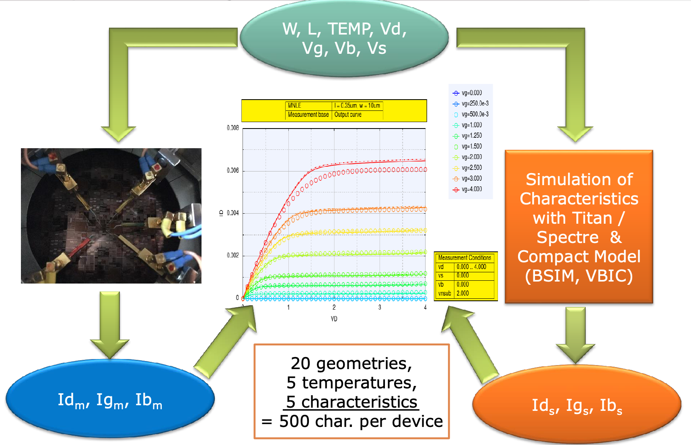

# ML application examples {#mlAplicationExamples}

In the following sections examples of ML applications from a wider field of industries are given. Those applications might inspire new projects by showcasing ideas and approaches which might not be straight forward. Sometimes processes need be thought the other way round to achieve faster solutions.

Also as the example DeepL in chapter \@ref(deepl) shows, it might be possible to stand up to the tech giants from overseas event though all odds seems to be against the idea of taken them on.


---


![Figure from  [@makimotokunstliche]](images/infarktDkg.png){width=100% .external}

---


## AI translation by DeepL {#deepl}

A good example to show that even small companies can be successful in areas where large companies seem to have an unassailable lead. When it comes to language, few would deny that Google has the largest data set available, but it seems that DeepL has an advantage over them.

<blockquote>

Tech giants Google, Microsoft and Facebook are all applying the lessons of machine learning to translation, but a small company called DeepL has outdone them all and raised the bar for the field.
Its translation tool is just as quick as the outsized competition, but more accurate and nuanced than any we’ve tried.  
TechCrunchUSA
</blockquote>

Text translation service by DeepL
<div class="rmdtip">
**DeepL facts:**

- Launch of DeepL Translator in August 2017
- Headquarter in Cologne 
- more than 500 Mio users
- Uses neural network
- Up to 5000 characters for free

</div>

A test by external professional translators showed that DeepL outperforms other translation services by quite some margin

<div class="rmdtip">
**Comparision DeepL and competitors:**

- 119 paragraphs
- different domains
- external professional translators
- blind test comparison

</div>


{width=80% .external}

<blockquote>


119 paragraphs from different domains were translated by the various systems. External professional translators were hired to review the translations - without information about which system produced which translation. The graph displays how often each system’s translations were rated better than all other translations. Not shown are cases where several systems produced the best translation. The tests were performed in January 2020.

</blockquote>


## Artificial intelligence detects myocardial infarctions in the ECG more reliably than cardiologistsn

The Deutsche Gesellschaft für Kardiologie - Herz- und Kreislaufforschung e.V.(DKG) developed an algorithm for machine learning that, with the help of ECG interpretation, can detect a myocardial infarction that has occurred within the last 3 months more reliably than a cardiologist.


![Figure from  [@makimotokunstliche]](images/infarktDkg.png){width=80% .external}

<div class="rmdtip">

**Project details:**  

- Used deep learning  
- Train to answer the following question:
    - Is this an ECG of a patient who's had an Myocardial infarction in the last three months?
- Compared with 9 cardiologist
    - algorithm is more reliable 
- Explainability of ML prediction was addressed

</div>

To better understand how the ML algorithm deducted the prediction a heatmap of the ECG was produced. The red areas show the focus of the ML algorithm.


![Heatmap of ECG shows the focus of ML algorithm, figure from  [@makimotokunstliche]](images/heatmapEKG.png){width=50% .external}


### First in Germany: Artificial intelligence recognizes COVID-19 in clinical routine

Another application using ML in for diagnostic is to detect COVID-19, details can be found at https://www.uniklinikum-jena.de/Uniklinikum+Jena/Aktuelles/Pressemitteilungen/Erstmals+in+Deutschland_+Künstliche+Intelligenz+erkennt+COVID_19+in+der+klinischen+Routine-pos-3-p-24500.html

## A Deep Learning Approach to Antibiotic Discovery

A trained deep neural network predicts antibiotic activity in molecules that are structurally different from known antibiotics, among which Halicin exhibits efficacy against broad-spectrum bacterial infections in mice. More details can be found at [@stokes2020deep]


![Figure from [@stokes2020deep]](images/MlForPharmacy.png){width=80% .external}

<div class="rmdtip">

- A deep learning model is trained to predict antibiotics based on structure
- Halicin is predicted as an antibacterial molecule from the Drug Repurposing Hub
- Halicin shows broad-spectrum antibiotic activities in mice 
- More antibiotics with distinct structures are predicted from
the ZINC15 database

</div>


## Fundamental limits from chaos on instability time predictions in compact planetary systems {#StabilityPlanetarySystem}

In the paper "Predicting the long-term stability of compact multiplanet systems" [@tamayo2020predicting] an interesting approach to replace simulation runs by a machine learning algorithm.


Astrophysics is a science which has a long history of handling huge amount of data, no wonder that there are also ML applications in this field. This application helps to determine whether or not a planetary system will be stable. Until now the stability is determined by calculating an astonishing $10^9$ orbits. Reducing simulation time by factor of 10,000 by combining analytical understanding of resonant dynamics in two-planet systems with machine learning was accomplished.

<div class="rmdtip">

**Reducing simulation time:**

- Combine
    - analytical understanding
    - machine learning (XGBoost)
    - calculation of only $10^4$ orbits instead of 1$0^9$

</div>

The following graph shows the flow of computation and the utilization of machine learning to reduce the number of necessary simulations.

---

![Figure from [@hussain2020fundamental]](images/spock.png){width=100% .external}

---


<div class="rmdtip">

**Training the model:**

- simulate 100,000 initial conditions simulated
    - 80% training set
     - 20% test set
    - machine learning (XGBoost)

</div>


### Comparison between SPOCK and previous models

The comparison between SPOCK and previous models are shown below. At an FPR of 10%, SPOCK correctly classifies 85% of stable systems. According to the shown results SPOCK is a huge advance from previous models.
  


<div class="rmdtip">

**Comparison between SPOCK and previous models:**

- At a false positive rate: 10% SPOCK has
    - True positive rate: 85%

</div>


--- 


![Figure from [@hussain2020fundamental]](images/spockROC.png){width=60% .external}

---
 
 An explanation of ROC is given at chapter \@ref(ROCexp)  
 
## Machine Learning Algorithms and Global Optimization Methods for SPICE Model Parameter Extraction {#ErmittlungVonSimulationsParametern}

Another interesting approach is to substitute a lengthy parameter search for a simulation model by reversing the task. Instead of matching simulation to measurement results by tuning the simulation parameter, extract simulation parameter from measurement results. The goal is to find simulation parameters for a semiconductor (BSIM4 MOSFET model)

<div class="rmdtip">

**Project details:**

- Previous method:
    - match simulation to measurement results by tuning simulation parameters
    - 34 different optimization steps
    - tuned by skilled workers (PhD)
- ML method:
    - extract simulation parameters from measurement results
    - training data can be generated by running simulations
    - simulation run time was short 
    - 10s of thousands of training data can be generated
    - validation of predictions by simulation
        - run simulation with predicted simulation parameters
        - compare simulation to measurement results

</div>


The previous method required a educated comparison of simulation and measurement results, based on the comparison the simulation parameter were tuned. 

---


{width=80% .external}

---


In the ML method measurement data are converted to a set of feature which are then used as input of the machine model. The simulation parameters can then be calculated in one step. Validation of the result can be achieved by running the simulation with the predicted simulation parameters.

---


{width=80% .external}

---

## How many yards will an NFL player gain after receiving a handoff? {#NflYardsPrediction}

Article NFL.com https://www.nfl.com/news/next-gen-stats-intro-to-expected-rushing-yards
Next Gen Stats: Intro to Expected Rushing Yards

Solution is described at 1st place solution The Zoo https://www.kaggle.com/c/nfl-big-data-bowl-2020/discussion/119400 


## Predictive Maintenance for the elevator and escalator industry TBD


https://www.i40-magazin.de/wp-content/uploads/dlm_uploads/2018/08/Whitepaper_Industrial_Analytics_180816.pdf## BBC: Artificial intelligence-created medicine to be used on humans for first time

<blockquote>
This year was the first to have an AI-designed drug but by the end of the decade all new drugs could potentially be created by AI  
Prof Andrew Hopkins, Exscienta chief executive
</blockquote>


The drug will be used to treat patients who have obsessive-compulsive disorder (OCD).

<div class="rmdtip">
- Created by 
    - British start-up Exscientia
    - Japanese pharmaceutical firm Sumitomo Dainippon Pharma
- Treat patients who have obsessive-compulsive disorder (OCD).
- Time to get to trial
    - Typically about five years
    - AI  took just 12 months.
</div>


## Disease outbreak risk software {#DiseaseOutbreakPrediction}

The company BlueDot employs ML to predict outbreaks and spread of diseases. 

<blockquote>

It notified its clients on 31st of December about the Covid threat, 9 days prior to the first WHO statement   [aerzteblatt](https://www.aerzteblatt.de/nachrichten/109037/Kuenstliche-Intelligenz-sagte-Krankheitsausbruch-in-Wuhan-voraus).  

</blockquote>


## Neural networks enable autonomous navigation of catheters

The Fraunhofer-Institut für Produktionstechnik und Automatisierung IPA presented this project at MEDICA 2019.

<div class="rmdtip">

**Project details:**  

- Using deep reinforcement learning
- Trained on computer simulation
- The project is scheduled to run until September 2020
- Enables faster navigation

</div>


<blockquote>
The operation itself, i.e. the removal of the blood clot using the stent retriever, is still performed by the doctor.   
Johannes Horsch, scientist in the project group.
</blockquote>

Further details at https://www.fraunhofer.de/de/presse/presseinformationen/2019/november/neuronale-netze-ermoeglichen-autonome-steuerung-von-kathetern.html 

## Bosch FLEXIDOME IP starlight 8000i

https://www.boschsecurity.com/xc/en/solutions/video-systems/solutions/flexidome-ip/

Example recognize available parking slot https://www.bosch.com/stories/intelligent-security-cameras/
 


## Demonstration of computer vision system "thumbs up" {#thumbsUp}


The demonstration of how to use a pre-trained Resnet-18 neural net to detect 👍 or 👎 in a video stream using Nvidia’s Jetson Nano is based on the Nvidia course [Getting Started with AI on Jetson Nano](https://courses.nvidia.com/courses/course-v1:DLI+C-RX-02+V1/about)


<iframe width="560" height="315" src="https://www.youtube-nocookie.com/embed/0bAcBntstUM" frameborder="0" allow="accelerometer; autoplay; encrypted-media; gyroscope; picture-in-picture" allowfullscreen></iframe>


The Jetson Nano is a small and powerful computer for a wide range of ML applications

</div>

The choice on courses is small and ML centered. All course work is in Python and is run in hosted notebooks.

<div class="rmdtip">

 
**ML applications for Jetson Nano:** 

- image classification
- object detection
- segmentation
- speech processing
    
</div>

Despite the low price of €99 and the size of 69 mm x 45 mm, the technical specification is quite impressive


<div class="rmdtip">

**Jetson Nano technical specification:**

- GPU: 128-core Maxwell
- CPU	Quad-core ARM A57 @ 1.43 GHz
- Memory	4 GB 64-bit LPDDR4 25.6 GB/s
- Camera	2x MIPI CSI-2 DPHY lanes
    
</div>

### Run demonstration on Jetson Nano 

To run the demonstration ssh into the Jetson Nano using its IP address, start jupyter notebook which opens a window in the browser from which you can select the demonstration.

```bash
ssh dlinano@192.x.x.x
jupyter notebook

# open in browser on port 8888
http://192.x.x.x:8888/lab?


```


## Master Autonomous Driving

Master course organized by Hochschulföderation SüdWest (HfSW), a consortium of the universities of applied science of Aalen, Esslingen, Heilbronn, Mannheim, Ravensburg-Weingarten, Reutlingen and Hochschule der Medien Stuttgart. More information on https://www.graduatecampus.de/en/masterstudiengaenge/master.html

Facts of Master Autonomous Driving:

- 4 semesters
- 18,000 € tuition fees
- attendance 10.5h per week
    - Fridays from 15:30 to 20:30
    - Saturdays from 09:30 to 16:45
- Course contents https://www.graduatecampus.de/fileadmin/50_redaktion/08_Sonstige_PDF/HfSW/Modulhandbuch_Autonomes_Fahren.pdf
    - path planning
    - sensor fusion
    - Robot Operating System (ROS)


## University Suttgart: Indoor-Ortung mit Mobilfunk

- University Stuttgart Institute of Telecommunications
- Leveraging 5G Infrastructure for a Robust Positioning System
- Using neural networks

More information on the work can be found in [@widmaier2019towards]
