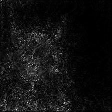
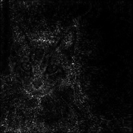
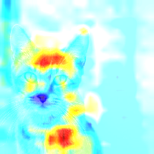
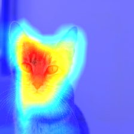
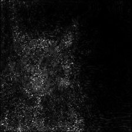
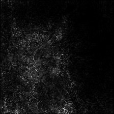

# (PART) Explainable machine learning  {-} 

# Explainable machine learning {#ExplainableMl}
ML algorithms can be quite complex and therefore not easy to analyze how they come to the result presented to the user, the term **black box** is used often when referring to this matter. Obviously a ML algorithm is not a black box since the algorithm is nothing but basic math operations, but of those there are a lot so that it is difficult to understand for humans to comprehend how the algorithms works. For example a neural net which is quite popular for natural language processing in 2020 is **BERT** which has in its base version **110 million** parameters, and in its large version an astonishing **340 million** parameters.

And then comes along Generative Pre-trained Transformer 3 (**GPT-3**) creaetd by [OpenAi](https://openai.com) with **175 billion machine learning parameters**.

Due to different reasons it might be nice or necessary to understand how the algorithm works. In case of a movie recommendation system it is not as important as for algorithms which work in autonomous driving cars were they are safety relevant.

Also biased algorithms can be problematic as as discussed in \@ref(ModelsWithBias) because they discriminate certain groups of people.

 

 
 
Benefits of explainable ML:

 

- Increase safety of systems using ML
- Avoid discrimination
    - human resources recruitment system
- Model improvement
    - find artifacts
- Training data verification
    - find unsuited training data

In the following chapters a description of methods and tools are given.

 

 
 **Next chapters:**
 

- Methods
- Tools

## Method: Layer-Wise Relevance Propagation

Developed by Fraunhofer Heinrich-Hertz-Institute and TU Berlin is well known method in explainable ML. A detailed description is given in the paper 
"On Pixel-wise Explanations for Non-Linear Classifier Decisions by Layer-wise Relevance Propagation" [@bach2015pixel].

First watch the Layer-Wise Relevance Propagation (LRP) at work in the interactive demo of the Fraunhofer Heinrich-Hertz-Institute [Explaining Artificial Intelligence](https://lrpserver.hhi.fraunhofer.de/image-classification), best to be viewed in **Chrome Browser**

 

 
Purpose of LRP:
 
 - Provide explanation of any neural net in domain of input
 - Example
    - Cancer prediction explanation by LPR
    - which pixel contributes to what extend
- Demo [Explaining Artificial Intelligence](https://lrpserver.hhi.fraunhofer.de/image-classification) (best viewed in Chrome browser)    
- Method can be applied on already trained classifiers  
    - for text and images
    

The method can be used on images as well as on text or any other data fed to a neural network. The concept is best shown using an image example as below:

---

![Figure from  [@bach2015pixel]](images/lrpExample.png){width=100% .external}

---

 

 
Basics of LRP:
 
- Uses weights and and neural activations
- Created by forward-pass (i.e. prediction, not training)
- Go back from prediction to input
- Visualize image pixels which caused high activation  
- Drawback
    - only one sample explained
    - considering several samples $\implies$ see chapter \@ref(SpRay) 
    

## Method: SpRay {#SpRay}

An international cooperation investigated recent ML successes in order to find whether or not the models deliver reliably for the problems they are trained for [@lapuschkin2019unmasking]

 

 
**Basics of SpRay:**
 
- Identifies and quantifies decision-making behaviors
- Finds undesirable decisions in vast data sets
- Can be used to improve 
    - model or 
    - dataset
    

 

Lets examine a model which classifies horses

---

![Figure from  [@lapuschkin2019unmasking]](images/sprayExample.png){width=100% .external}

---  

SpRay identifies 4 different prediction strategies for classifying images as "horse"

 

 
Detected prediction strategies:
 
- b $\implies$ detect a horse (and rider)  
- c $\implies$ detect a source tag in portrait oriented images  
- d $\implies$ detect wooden hurdles and other contextual elements of horseback riding  
- e $\implies$ detect a source tag in landscape-oriented images  
    

## Method: Salient-object-visualization

One of the machine learning applications which has high public attention is self-driving cars. All big car manufactures, suppliers and tech companies are working feverish on this topic. But there are also great concerns about safety and ethics which need to be addressed. 

Safety of a machine learning algorithm can be increased if the understanding of how the algorithm reaches its decisions. For computer vision this can be done with techniques like keras-salient-object-visualization described in chapter \@ref(keras-salient-object-visualization).

Utilizing this technique on the RC-Robocar framework [Donkeycar](https://www.donkeycar.com) yields to a movie like the following movie in which the pixels which the algorithm pays attention to are colorized. The green line gives the steering command at the time of recording, the colored pixels indicates the regions in input images by which the algorithm makes its steering decisions, i. e., the salient objects.

 

 
 **Salient-object-visualization:**
 
- Indicates the regions in input images by which the algorithm makes its steering decisions
- Helps to find sources of distractions  
        - reflections  
        - windows
- Helps to identify solutions  
        - crop top of image

<video width="720" controls>
  <source src="images/VaihingenTubMovieV3WithSteeringAndSalientLong.mp4" type="video/mp4">
</video>

### Tool: keras-salient-object-visualization {#keras-salient-object-visualization}

Keras implementation of Nvidia paper ['Explaining How a Deep Neural Network Trained with End-to-End Learning Steers a Car'](https://arxiv.org/abs/1704.07911). The goal of the visualization is to explain what DonkeyCar (https://github.com/wroscoe/donkey) learns and how it makes its decisions. The central idea in discerning the salient objects is finding parts of the image that correspond to locations where the feature maps of CNN layers have the greatest activations.

The code can be found at [GitHub](https://github.com/ermolenkodev/keras-salient-object-visualisation)

### Explaining How a Deep Neural Network Trained with End-to-End Learning Steers a Car

- Enable further system improvement
- Create trust that the system is paying attention to the essential cues

The conclusion of the paper is

<blockquote>

We describe a method for finding the regions in input images by which PilotNet makes its steering decisions, i. e., the salient objects. We further provide evidence that the salient objects identified by this method are correct. The results substantially contribute to our understanding of what PilotNet learns.
Examination of the salient objects shows that PilotNet learns features that “make sense” to a human, while ignoring structures in the camera images that are not relevant to driving. This capability is derived from data without the need of hand-crafted rules. In fact, PilotNet learns to recognize subtle features which would be hard to anticipate and program by human engineers, such as bushes lining the edge of the road and atypical vehicle classes.
[@bojarski2017explaining]
</blockquote>

## Tool: Lime
Very well-known tool **Local Interpretable Model-agnostic Explanations (LIME)** explains prediction for specific input. Details are given in the original paper **“Why Should I Trust You?” Explaining the Predictions of Any Classifier** [@tulio2016should]. The code is given at [GitHub](https://github.com/marcotcr/lime) along with installation guide and links to tutorial.

 

 
**Local Interpretable Model-agnostic Explanations (LIME):**
 
- Works for
    - images
    - text
    - tabular data
- Model agnostic, i.e. works for any model
    - Neural networks
    - Support Vector Machines (SVM)
    - Tree based algorithms
    - ...
    

---

![Explaining individual predictions. A model predicts that a patient has the flu, and LIME highlights
the symptoms in the patient’s history that led to the prediction. Sneeze and headache are portrayed as
contributing to the “flu” prediction, while “no fatigue” is evidence against it. With these, a doctor can make
an informed decision about whether to trust the model’s prediction. Figure from  [@tulio2016should]](images/ExplainingIndividualPredictions.png){width=100% .external}

---

## Tool: tf-explain tbd

tf-explain implements interpretability methods as Tensorflow 2.x callbacks to ease neural network's understanding. See [Introducing tf-explain, Interpretability for Tensorflow 2.0](https://blog.sicara.com/tf-explain-interpretability-tensorflow-2-9438b5846e35)

Documentation: https://tf-explain.readthedocs.io

The code can be found at [GitHub](https://github.com/sicara/tf-explain)

 

 
**tf-explain:**
 
- Implements interpretability methods as Tensorflow 2.x callbacks
- Several methods to look into different aspects
     - Activations Visualization
     - Vanilla Gradients
     - Gradients*Inputs
     - Occlusion Sensitivity
     - Grad CAM (Class Activation Maps)
     - SmoothGrad
     - Integrated Gradients
    

Vanilla Gradients

Visualize gradients on the inputs towards the decision.

{ .external}

Gradients*Inputs

Variant of Vanilla Gradients ponderating gradients with input values.

{ .external}

Occlusion Sensitivity

Visualize how parts of the image affects neural network’s confidence by occluding parts iteratively

{ .external}

Grad CAM

Visualize how parts of the image affects neural network’s output by looking into the activation maps

{ .external}

SmoothGrad

Visualize stabilized gradients on the inputs towards the decision.

{ .external}

Integrated Gradients

Visualize an average of the gradients along the construction of the input towards the decision. 

{ .external}

https://arxiv.org/abs/1611.05418 

## Tool: alibi  
https://github.com/SeldonIO/alibi

https://docs.seldon.io/projects/alibi/en/stable/overview/algorithms.html
