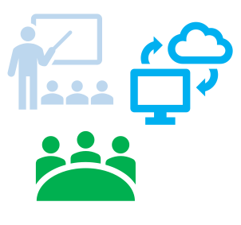
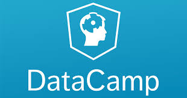
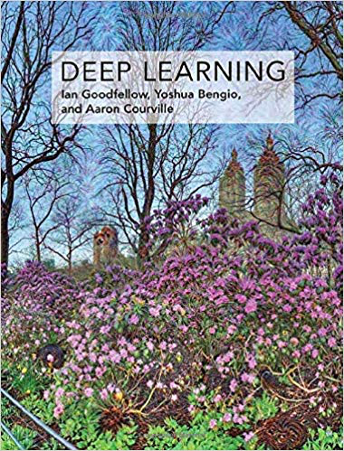

# (PART) ML online  resources {-} 

```{r setupMlResources, include=FALSE}
knitr::opts_chunk$set(echo = FALSE)

```


# ML online courses {#MlMooc}

Online courses are a very good opportunity to learn self paced with world class teachers. In the next chapters the most successful once are introduced. They offer hundreds of different courses, some together with universities or companies, sometimes one can achieve a certificate from a university.

<div class="rmdtip">

<p>Online courses:</p>

- World class teachers
- Self paced
- University certificates available
- Many are free
- Low cost compared to face to face courses
- Local face to face communities
- Discussions
    - online forums
    - local face to face meetups


</div>


##	Coursera

Coursera https://www.coursera.org was founded 2012 by Stanford computer science professors Andrew Ng and Daphne Koller. The Headquarter is in Mountain View in the US. By 2020 Coursera reached more than 48million people and 2200 businesses around the world


<div class="rmdtip">

 
<p>Coursera facts:</p>

- Founded 2012
    - two Standford computer science professors
    - Andrew Ng
    - Daphne Koller
-  Costs of courses
    - free courses
    - monthly charges (i.e 43€ for "Spezialisierung Deep Learning")
    - MSc ML and data science Imperial College London: **£28,000** 
- List of ML courses https://www.coursera.org/browse/data-science/machine-learning  

</div>

There are are course on art, health, social science, physics. Coursera offers a wide range of learning programs from free courses with a optional certificate to a full university diploma.

<div class="rmdtip">

<p>Coursera learning programs:</p>


- Course
    - recorded auto-graded and peer-reviewed assignments
    - video lectures
    - community discussion forums
    - course certificate for small fee
    
- Specialization   
    - series of rigorous courses
    - hands-on projects
    - specialization certificate
    
- Professional certificate
    - become job ready
    - learn from top companies and universities
    - hands-on projects
    - earn career credentials
    
    
- Mastertrack certificate
    - portions of Master's programs split into online modules
    - earn university-issued career credentials
    - real world projects
    - live expert instructions
    
- Degree
    - earn credit by completing course assignments
    - some credentials as on campus students

</div>

For ML there are courses in cooperation with companies and universities. 

<div class="rmdtip">

 
ML course partners:

- Universities
    - University of London
    - Imperial College London
    - Standford University
    - Arizona State University

- Companies
    - deeplearning.ai
    - IBM


</div>


##	Udemy

Udemy https://www.udemy.comwas founded 2011 by Eren Bali, Gagan Biyani and Oktay Caglar. In January 2020 Udemy has 50Mio students and 57,000 instructors from 190+ countries


<div class="rmdtip">

 
<p>Udemy facts:</p>

- Founded 2011
    - Eren Bali, Gagan Biyani and Oktay Caglar
-  more than 150,000 courses online    
-  Costs of courses
    - no free courses for ML
- List of ML courses https://www.udemy.com/courses/search/?q=machine%20learning&src=sac&kw=machine

</div>

There are are course on lifestyle, health, music and engineering. Udemy


	
##	DataCamp

DataCamp https://www.datacamp.com was founded 2014 by Martijn Theuwissen, Jonathan Cornelissen, Dieter De Mesmaeker


<div class="rmdtip">

 
<p>DataCamp facts:</p>

- Founded 2014
    - Martijn Theuwissen, Jonathan Cornelissen, Dieter De Mesmaeker
-  Costs of courses for individuals https://www.datacamp.com/pricing?variant=individual
    - first chapter of each course free
    - monthly payment
        - $25 for limited selection of courses (Basic)
        - $33.25 for all 325 courses (Premium as of Feb 2020)
- Costs for courses for business
    - $300 per user per year (Professional)
        - limited access to course material
    - $499 per user per year (Enterprise)  
        - full access to course material
        - plenty of service 
- Certificates are not available
    - provide Statements of Accomplishment at no charge

- List of ML courses https://www.datacamp.com/search?q=machine%20learning

</div>


##	Udacity

DataCamp https://www.udacity.com was founded 2014 by Sebastian Thrun, David Stavens, Mike Sokolsky. Thrun was a Google VP and a Professor of computer science at Stanford University and Carnegie Mellon University. At Google he found teh Google's self-driving car team.  
Udacity offers courses in data science, machine learning, artificial intelligence, cloud computing, and autonomous systems


<div class="rmdtip">

 
<p>Udacity facts:</p>

- Founded 2011
    - Sebastian Thrun
    - David Stavens
    - Mike Sokolsky
-  Costs of courses depends on course
     - monthly basis
     - per course
         - self driving car: €179/month
         - roughly 6 months at 15hrs/weeks
- Programs
    - data science
    - machine learning
    - artificial intelligence
    - cloud computing
    - autonomous systems
- Certificate
     - nanodegree
     - accepted by industry
     

- List of ML courses https://www.udacity.com/school-of-ai

</div>

### Example for self-driving car course project


During the course there are a number of projects which have to be finished successfully before going to the next stage. 

<div class="rmdtip">

Example project: 

Model predictive control:

- Drive car around track
- Combine
    - neural network
    - model predictive controller 
- Including 100ms latency between actuation commands    

</div>

The resulting driving performance can be seen in the following video

---

<video width="80%" loop controls>
  <source src="images/MPCforReviewWeb.mp4" type="video/mp4">
  Your browser does not support the video tag.
</video>

---


	
## fast.ai

Deep learning is transforming the world. fast.ai making deep learning easier to use and getting more people from all backgrounds involved through their:

- free courses for coders
- software library
- cutting-edge research
- community

The world needs everyone involved with AI, no matter how unlikely your background.

The fast.ai slogan

<blockquote>


Being cool is about being exclusive, and that’s the opposite of what we want. We want to make deep learning as accessible as possible– including to people using uncool languages like C#, uncool operating systems like Windows (which is used by the majority of the world), uncool datasets (way smaller than anything at Google, and in domain areas you’d consider obscure), and with uncool backgrounds (maybe you didn’t go to Stanford).
</blockquote>


### fast.ai Book


The  notebooks cover an introduction to deep learning, fastai, and PyTorch. fastai is a layered API for deep learning; for more information, see the [fastai paper](https://www.mdpi.com/2078-2489/11/2/108). Everything in this repo is copyright Jeremy Howard and Sylvain Gugger, 2020 onwards.
https://github.com/fastai/fastbook 
	
##	Kaggle Courses


Kaggle https://www.kaggle.com/learn/overview added courses to the data science platform 

<div class="rmdtip">

 
<p>Coursera facts:</p>

- Founded 2010
    - key personal was
    -  Anthony Goldbloom
    - Jeremy Howard
-  Costs of courses
    - free courses

- List of ML courses https://www.kaggle.com/learn/overview

</div>

The choice on courses is small and ML centered. All course work is in Python and is run in hosted notebooks.

<div class="rmdtip">

 
Course characteristics:

- Small selection
- ML or data science topics
- Course work in Python run in hosted notebooks
    - no software installation necessary
    
</div>

https://course.fast.ai


## Full Stack Deep Learning

https://course.fullstackdeeplearning.com

Since 2012, deep learning has lead to remarkable progress across a variety of challenging computing tasks, from image recognition to speech recognition, robotics, and audio synthesis. Deep learning has the potential to enable a new set of previously infeasible technologies like autonomous vehicles, real-time translation, and voice assistants and help reinvent existing software categories.
There are many great courses to learn how to train deep neural networks. However, training the model is just one part of shipping a deep learning project. This course teaches full-stack production deep learning:   

- Formulating the problem and estimating project cost  
- Finding, cleaning, labeling, and augmenting data  
- Picking the right framework and compute infrastructure  
- Troubleshooting training and ensuring reproducibility  
- Deploying the model at scale  


# ML online  resources {#MlResources}

## In-depth introduction to machine learning in 15 hours of expert videos

https://www.r-bloggers.com/in-depth-introduction-to-machine-learning-in-15-hours-of-expert-videos/ 

### An Introduction to Statistical Learning

This book provides an introduction to statistical learning methods.  
http://faculty.marshall.usc.edu/gareth-james/ISL/

## The learning machine

https://www.thelearningmachine.ai

WELCOME TO TLM
TLM is a new open-source project that aims to create an interactive textbook containing A-Z explanations of concepts and methods, algorithms and their code implementations from the fields of data science, machine learning, deep learning, natural language processing, statistics, and more.

## DeepAI: The front page of A.I.
https://deepai.org

The most popular research, guides, news
and more in artificial intelligence


##  TensorFlow tutorials

https://www.tensorflow.org/tutorials

The website has a range of examples which can be


TensorFlow tutorials examples: 
- run in Colab
- looked at in GitHub
- downloaded as notebook

Example include


- Text
- Image
- Generative
- Transfer learning

### MIT 6.S191 Introduction to Deep Learning

MIT's official introductory course on deep learning methods with applications in game play, and more!

http://introtodeeplearning.com


## Embedding Projector

Visualisation of 

- PCA
- t-SNE
- UMAP

Available data sets

- Word2Vec all
- Word2Vec 10k
- Minst with images
- Iris
-

http://projector.tensorflow.org 


## Tensorboard playground


Tinker With a Neural Network Right Here in Your Browser.
Don’t Worry, You Can’t Break It. We Promise.

https://playground.tensorflow.org

## Empowering companies to jumpstart AI and generate real-world value
Anrew Ng

Google speech first, than google maps finding house numbers 
https://landing.ai

## TensorFlow, Keras and deep learning, without a PhD


https://codelabs.developers.google.com/codelabs/cloud-tensorflow-mnist/#0 


## Neural Networks and Deep Learning


Neural Networks and Deep Learning is a free online book. The book will teach you about:

- Neural networks, a beautiful biologically-inspired programming paradigm which enables a computer to learn from observational data
- Deep learning, a powerful set of techniques for learning in neural networks
http://neuralnetworksanddeeplearning.com


## Platform.ai: produce high-quality labels

https://platform.ai

Platform allows domain experts to produce high-quality labels for AI applications in minutes in a visual, interactive fashion.

# ML online books

A good source for learning are online books, a few examples are given below-

## Neural Networks and Deep Learning

The book covers different aspects of NN from first principles to applications. It is hosted at http://neuralnetworksanddeeplearning.com/ 

<div class="rmdtip">

Main topics of book:

- A visual proof that neural nets can compute any function
- Why are deep neural networks hard to train?
</div>

## Deep Learning

The book on deep learning from Ian Goodfellow  [@Goodfellow-et-al-2016] the research scientist who pioneered generative adversarial networks (GANs) a book which goes deep into theory. The book is hosted at http://www.deeplearningbook.org/

<div class="rmdtip">
<p>Main topics of book:</p>


- Applied Math and Machine Learning Basics
- Modern Practical Deep Networks
- Deep Learning Research
</div>


