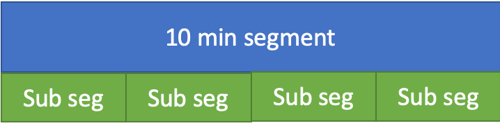
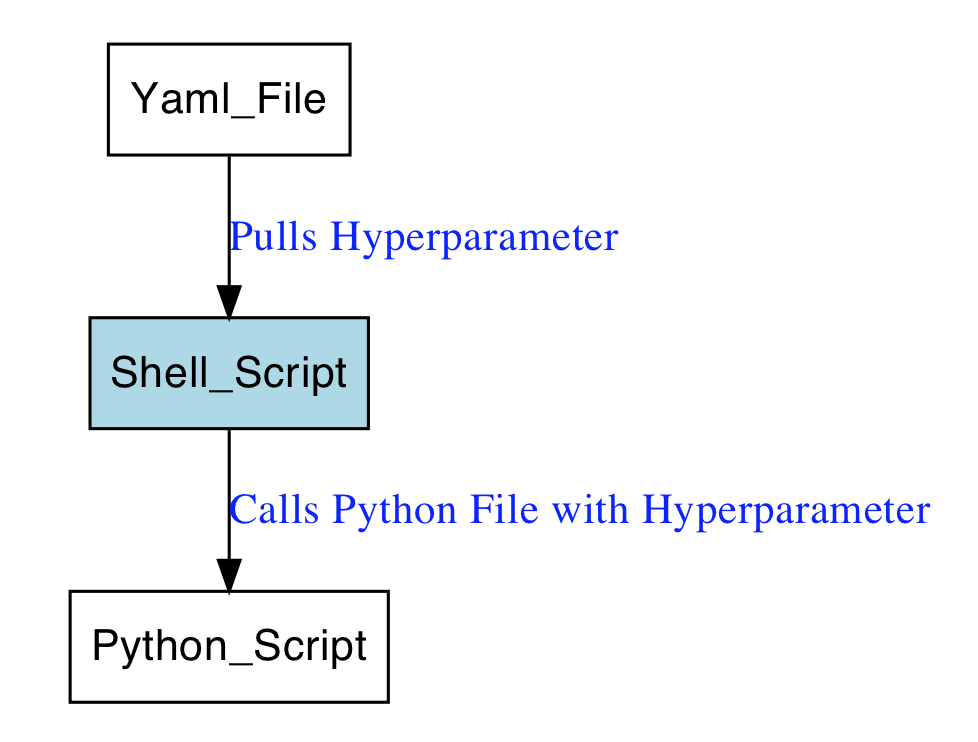

# (PART) Examples from Kaggle {-} 


# Examples in Kaggle {#KaggleExamples}

Kaggle is a platform for data scientists and machine learning practitioners which allows users to:

```{block2 echo=TRUE, type='rmdtip'}
- [find datasets](https://www.kaggle.com/datasets) 
- publish datasets
- [exlplore models on web-based data-science environment](https://www.kaggle.com/notebooks) in
    - Python
    - R
    - SQLite
    - Julia
- [work with other machine learning practitioners on competitions](https://www.kaggle.com/competitions)
    - 379 (Feb 2020)
- [Host competitions](https://www.kaggle.com/host)
- [engage in discussions](https://www.kaggle.com/discussion) 
- [find jobs](https://www.kaggle.com/jobs)

```
Same facts about Kaggle

```{block2 echo=TRUE, type='rmdtip'}

- Founded April 2010
- Headquarter in San Francisco 
- More than 1 million member since March 2017

```

Kinds of competitions

<div class="rmdtip">
- Featured
    - generally commercially-purposed prediction problems
    - with up to $1.5 mio price money
    - 177 (Feb 2020)
        - 2 active
    - good opportunity to learn from the best
        
- Research
    - more experimental than featured competition problems
    - with up to $50,000 price money
    - 94 (Feb 2020)
        - 2 active

- Recruitment
    - corporation-curated challenges
    - teams of size one
    - with up to $20,000 price money
    - 17 (Feb 2020)
        - 0 active
    - interested participants can upload their resume for consideration by the host
    - price: job interview
    
    
- Getting started
    - easiest, most approachable competitions
    - getting the foot in the door
    - 11 (Feb 2020)
        - 4 active
    
- Playground
    - one step above Getting Started in difficulty
    - with up to $30,000 price money
    - 60 (Feb 2020)
        - 2 active
- Masters
    - limited participation
    - only by invitation
    - with up to $125,000 price money
    - 6 (Feb 2020)
        - 0 active

</div>


More details on how competitions are conducted can be found at https://www.kaggle.com/docs/competitions  


# Melbourne University AES/MathWorks/NIH Seizure Prediction

The competition was hosted in 2016 by at https://www.kaggle.com/c/melbourne-university-seizure-prediction and was subtitled "Predict seizures in long-term human intracranial EEG recordings"

The **price money was $20,000**, the competition ended 24.11.2016 and **478 teams** had submitted a solution.


The competition was sponsored by:

- MathWorks
- National Institutes of Health (NINDS)
- American Epilepsy Society
- University of Melbourne

and organized in partnership with:

- Alliance for Epilepsy Research
- University of Pennsylvania
- Mayo Clinic.

```{block2 echo=TRUE, type='rmdtip'}

Challenge:

- Predict seizures 1h before they occur
- Data
    - Ten minutes intracranial EEG (iEEG) clips
- Benefits    
    - Seizure forecasting systems have the potential to help patients with epilepsy lead more normal lives. 

```

The metric was [area under the ROC curve](https://en.wikipedia.org/wiki/Receiver_operating_characteristic) between the predicted probability and the observed target.

The best possible score for perfect predictions is 1. The leader board look as follows:

```{block2 echo=TRUE, type='rmdtip'}

- <p>Leaderboard: </p>  
  
- 0.80701
- 0.79898
- 0.79652

```

The winning solution is described in the next chapter

## Winning solution (1st)

The first placed team was a two man show, they present their solution at [Kaggle discussion](https://www.kaggle.com/c/melbourne-university-seizure-prediction/discussion/26310)

```{block2 echo=TRUE, type='rmdtip'}

The team consisted of:

- Four ML experts
- Private team

```


The team members build a total of 11 models which were blended by using an average of ranked predictions of each individual model. The weight of all models was 1.

```{block2 echo=TRUE, type='rmdtip'}

<p>Models: </p>  

- 11 models in total
- Each weighted 1

```

### Alex / Gilberto models

The **two created 4 models** which were selected for the final ensemble

#### Pre-processing

For all models of Alex and Gilberto the pre-processing was the same. The code can be found at [GitHub](https://github.com/alexandrebarachant/kaggle-seizure-prediction-challenge-2016/blob/master/Alex_Gilberto/preproc.py)

```{block2 echo=TRUE, type='rmdtip'}


<p>Pre-processing: </p>  

  
- Segmentation of 10min segments into 
    - non-overlapping 
    - 30 20s segments
- No filtering

```

#### Software 
The team used Python and several libraries 

```{block2 echo=TRUE, type='rmdtip'}

<p>Software: </p>  


- Python
- scikit-learn
- pyRiemann
- xgboost
- mne-python
- pandas
- pyyaml

```


#### Model 1

The feature generation code is given at [GitHub](https://github.com/alexandrebarachant/kaggle-seizure-prediction-challenge-2016/blob/master/Alex_Gilberto/generate_features.py)


Model 1 used **XGB algorithm** and 96 features


```{block2 echo=TRUE, type='rmdtip'}

96 features:

-  normalized log power
    - 6 different frequency band (0.1 - 4 ; 4- 8 ; 8 - 15 ; 15 - 30 ; 30 - 90 ; 90 - 170 Hz)
    - for each channel
- Power spectral density 
    - Welch’s method (window of 512 sample, 25% overlap)
    - averaged in each band
    - normalized by the total power
    - taking logarithm.

```


#### Model 2

Model 2 used **XGB algorithm** and 336 features

```{block2 echo=TRUE, type='rmdtip'}

336 features:

- relative log power as described above
    - with the addition of various measures
        -mean
        - min
        - max
        - variance
        - 90th
        - 10th percentiles)
- auto regressive error coefficient (order 5)
- [fractal dimension](https://en.wikipedia.org/wiki/Fractal_dimension)
    - Petrosian
    - Higuchi
- [Hurst exponent](https://en.wikipedia.org/wiki/Hurst_exponent)

```


#### Model 3

Model 3 used **XGB algorithm** and 576 features
Each of the autocorrelation matrices were projected into their respective riemannian tangent space (see [@barachant2013classification], this operation can be seen as a kernel operation that unfold the natural structure of symmetric and positive define matrices) and vectorized to produce a single feature vector of 36 item.

```{block2 echo=TRUE, type='rmdtip'}
576 features:

- auto-correlation matrix 
    - projected into their respective riemannian tangent space 
        - kernel operation that unfold the natural structure of symmetric and positive define matrices

```


#### Model 4

Model 4 used **XGB algorithm** and 336 features
This feature set is composed by cross-frequency coherence (in the same 6 sub-band as in the relative log power features) of each channels, i.e. the estimation of coherence is achieved between pairs of frequency of the same channel instead to be between pairs of channels for each frequency band. This produce set of 6x6 coherence matrices, that are then projected in their tangent space and vectorized. 

```{block2 echo=TRUE, type='rmdtip'}

336 features:

- cross-frequency coherence 
    - projected in their tangent space and vectorized

```


### Feng models


**Feng created 4 models** which were selected for the final ensemble. Total training time (including feature extraction) is estimated to less than 6 hours for these 4 models on my 8 GB RAM MacBook Pro.

#### Pre-processing

The pre-processing was the same for all models

```{block2 echo=TRUE, type='rmdtip'}

<p>Pre-processing: </p>  

- Butterworth filter (5th order with 0.1-180 HZ cutoff ) 
- segmentation of 10min
    -non-overlapping 
    - 30s windows

```


#### Features

Two different sets of features were produced and used in different combinations for the models. The script to generate the features can be found at [GitHub](https://github.com/alexandrebarachant/kaggle-seizure-prediction-challenge-2016/blob/00f937cc7710977dc812d9fc675864e2b8288658/Feng/make_features.py)

The parameters of the feature generation is organized in the json file [kaggle_SETTINGS.json](https://github.com/alexandrebarachant/kaggle-seizure-prediction-challenge-2016/blob/00f937cc7710977dc812d9fc675864e2b8288658/Feng/kaggle_SETTINGS.json)


```{block2 echo=TRUE, type='rmdtip'}

Feature set 1:

- bands: (0.1–4 Hz), theta (4–8 Hz), alpha (8–12 Hz), beta (12–30 Hz), low gamma (30–70 Hz) and high gamma (70–180Hz)
    - standard deviation
    - average spectral power 

Feature set 2:
  
- correlation
    - time domain
    - frequency domain
    - upper triangle values of correlation matrices
    - eigenvalues

```


#### Models

The models used different algorithms and either feature set 1 or both feature sets

```{block2 echo=TRUE, type='rmdtip'}

- Model 1: XGB with feature 1

- Model 2: KNN with feature1

- Model 3: KNN with feature1+feature2

- Model 4: Logistic Regression with L2 penalty with feature1+feature2

```

### Andriy models

**Andriy created 3 models** which were selected for the final ensemble


#### Pre-processing

For all models of Andriy the pre-processing was the same

```{block2 echo=TRUE, type='rmdtip'}

Pre-processing: 

- demeaning the EEG signal
- filtering of the EEG signal between 0.5 and 128 Hz with a notch filter set at 60Hz
- downsampling to 256 Hz
- segmentation of the 10 minutes segment 
    - non-overlapping 
    - 30 seconds segment.

```


#### Features

**Andriy created 1965 features** from which he choose by computing the **feature importance** using an XGB classifier. 


The univarant features have been previously used in several EEG applications, including seizure detection in newborns and adults [@temko2011eeg] and [@temko2011performance]

```Markdown
per-channel feature (univariate): 

- 111 feature per channel => 11*16 = 1776
- peak frequency of spectrum
- spectral edge frequency (80%, 90%, 95%)
- fine spectral log-filterbank energies in 2Hz width sub-bands (0-2Hz, 1-3Hz, …30-32Hz)
- coarse log filterbank energies in delta, theta, alpha, beta, gamma frequency bands
- normalised FBE in those sub-bands
- wavelet energy
- curve length
- Number of maxima and minima
- RMS amplitude
- Hjorth parameters
- Zero crossings (raw epoch, Δ, ΔΔ)
- Skewness
- Kurtosis
- Nonlinear energy
- Variance (Δ, ΔΔ)
- Mean frequency
- band-width
- Shannon entropy
- Singular value decomposition entropy
- Fisher information
- Spectral entropy
- Autoregressive modelling error (model order 1-9)

```

These multivariate were extracted for the five conventional EEG sub-bands (delta, theta, alpha, beta, gamma) for 6 different montages (horizontal, vertical, diagonal, etc

```{block2 echo=TRUE, type='rmdtip'}

cross-channel features (multivariate): 

- 180 features
- lag of maximum cross correlation
- correlation
- brain asymmetry index
- brain synchrony index
- coherence
- frequency of maximum coherence. 

```


#### Models

Out of the 1965 features listed above the first model computed the **feature importance** which was then used to select features for model 2 and 3

```{block2 echo=TRUE, type='rmdtip'}

- Model 1: All features were used in a bagged XGB classifier (XGB).

- Model 2: Linear SVM was trained with top 300 features (SVM)

- Model 3: GLM was trained with top 200 features (Glmnet)

```


### Code on GitHub

A detailed explanation of solution and code is given at [GitHub](https://github.com/alexandrebarachant/kaggle-seizure-prediction-challenge-2016)


#### Alex / Gilberto code

The code of Alex / Gilberto is analyzed below

##### Pre-processing
For all models of Alex and Gilberto the pre-processing was the same. The code can be found at [GitHub](https://github.com/alexandrebarachant/kaggle-seizure-prediction-challenge-2016/blob/master/Alex_Gilberto/preproc.py)

##### Feature generation

The feature generation code is given at [GitHub](https://github.com/alexandrebarachant/kaggle-seizure-prediction-challenge-2016/blob/master/Alex_Gilberto/generate_features.py)


##### Models
They use the XGB algorithm, the XGB hyperparameters are set in .yml files as follows

```{r graphviz, eval=FALSE, include=FALSE}

library(DiagrammeR)
library(ggplot2)
p <- grViz("
digraph boxes_and_circles {

  # a 'graph' statement
  graph [overlap = true, fontsize = 10]

  # several 'node' statements
  node [shape = box,
        fontname = Helvetica]

  Yaml_File , Python_Script
  
    node [shape = box,
        fontname = Helvetica,
        fillcolor = lightblue,
        style = filled]
        
  Shell_Script      

  # several 'edge' statements
  Yaml_File->Shell_Script [label =<
 Pulls Hyperparameter  > fontcolor = blue];
 
  Shell_Script -> Python_Script [label =<
 Calls Python File with Hyperparameter >fontcolor = blue];
 
}
")


```


Yaml file:

```yml
output:  Alex_Gilberto_autocorrmat_TS_XGB

datasets:
  - autocorrmat

n_jobs: 1
safe_old: True

imports:
  models:
    - CoherenceToTangent
  xgboost:
    - XGBClassifier
  sklearn.ensemble:
    - BaggingClassifier

model:
  - CoherenceToTangent:
      tsupdate: False
      metric: '"identity"'
      n_jobs: 8
  - BaggingClassifier:
      max_samples: 0.99
      max_features: 0.99
      random_state: 666
      n_estimators: 4
      base_estimator: XGBClassifier(n_estimators=500, learning_rate=0.01, max_depth=4, subsample=0.50, colsample_bytree=0.50, colsample_bylevel=1.00, min_child_weight=2, seed=42)

```

The models were than called within a shell script:

```bash

for entry in "models"/*.yml
do
  echo config file "$entry"
  python generate_submission.py  -c "$entry" -p
done

```


#### Feng code

The code of Feng is analyzed below

##### Pre-processing

The scripts for pre-processing are given at [GitHub](https://github.com/alexandrebarachant/kaggle-seizure-prediction-challenge-2016/tree/00f937cc7710977dc812d9fc675864e2b8288658/Feng/preprocessors)

##### Features

 The script to generate the features can be found at [GitHub](https://github.com/alexandrebarachant/kaggle-seizure-prediction-challenge-2016/blob/00f937cc7710977dc812d9fc675864e2b8288658/Feng/make_features.py)

The parameters of the feature generation is organized in the json file [kaggle_SETTINGS.json](https://github.com/alexandrebarachant/kaggle-seizure-prediction-challenge-2016/blob/00f937cc7710977dc812d9fc675864e2b8288658/Feng/kaggle_SETTINGS.json)

```json
{
        "path":{
        "root" : "../",
        "raw_data_path" : "../data",
        "processed_data_path" :"./postprocessedfile",
        "submission_path" : "../submissions" 
    },

    "preprocessor":{
        "highcut" : 180,
        "lowcut" : 0.1,
        "nfreq_bands": 6,
        "win_length_sec": 30,
        "features": "meanlog_std",
        "stride_sec": 30
    }

}

```

##### Models

The code for the **GLM model:**

```python
def train(subject, data_path, plot=False):
    d = load_train_data_lasso(data_path, subject)
    x, y = d['x'], d['y']
    print 'n_preictal', np.sum(y)
    print 'n_inetrictal', np.sum(1-y)
    n_channels = x.shape[1]
    n_fbins = x.shape[2]

    x, y = reshape_data(x, y)
    x[np.isneginf(x)] = 0
    data_scaler = StandardScaler()
    x = data_scaler.fit_transform(x) ## Normalizaiton
    logreg = linear_model.LogisticRegression(penalty='l2',C=0.6)
    logreg.fit(x, y)
    return logreg, data_scaler

```

The code for the **KNN model:**


```python

def train(subject,data_path):
    d=load_train_data_knn(data_path,subject)
    x,y=reshape_data(d['x'],d['y'])
    x[np.isneginf(x)] = 0
    x[np.isnan(x)]=0
    data_scaler = StandardScaler()
    x = data_scaler.fit_transform(x)
    clf = KNeighborsClassifier(n_neighbors=40, weights='distance',metric='manhattan', n_jobs=-1)
    clf.fit(x, y)
    return clf

```
The code for the **XGB model:**


```python

params = {
        "objective": "binary:logistic",
        "booster" : "gbtree",
        "eval_metric": "auc",
        "eta": 0.22,##0.22
        "max_depth": 3,
        "subsample": 0.80,
        "colsample_bytree": 0.78,
        "silent": 1,
    }

def train(subject,data_path,params):
    d=load_train_data_xgb(data_path,subject)
    x,y=reshape_data(d['x'],d['y'])
    dtrain=xgb.DMatrix(x,y)
    gbm=xgb.train(params,dtrain,num_boost_round=500,verbose_eval=20)
    return gbm


```


#### Andriy code

The code of Andriy is analyzed below

##### Pre-processing

Pre-processing is done in Matlab scripts on [GitHub](https://github.com/alexandrebarachant/kaggle-seizure-prediction-challenge-2016/blob/00f937cc7710977dc812d9fc675864e2b8288658/Andriy/data_preprocess.m)


##### Feature generation

The feature generation is also done in 4 Matlab scripts at [GitHub](https://github.com/alexandrebarachant/kaggle-seizure-prediction-challenge-2016/tree/00f937cc7710977dc812d9fc675864e2b8288658/Andriy)

- FE_main_AR.m
- FE_main_CONN.m
- FE_main_CSP_AR.m
- FE_main_F.m


##### Models

The files for the models are:

```{block2 echo=TRUE, type='rmdtip'}

-GLM model
    - mod_glmnet_5_3.R

Creates SVM model and submission

-SVM model
     -mod_svm_5_7.R

-XGB model 
     - mod_xgb_7_5.R

```


Code for the XGB model

```r
  param <- list(  objective           = "binary:logistic", 
                  booster             = "gbtree",
                  eval_metric         = "auc",
                  eta                 = 0.3,
                  max_depth           = 3,
                  subsample           = 0.8,
                  colsample_bytree    = 1,
                  num_parallel_tree   = 2
  )
  
  cat('model1...')
  set.seed(1234)
  model1 <- xgb.train(   params              = param, 
                         data                = dtrain, 
                         nrounds             =  1000)
                         
  importance <- xgb.importance(model = model1)
  
  ```
  


## Solution(4th place)

The 4th placed team was a one man show, he presented his solution at [Kaggle discussion](https://www.kaggle.com/c/melbourne-university-seizure-prediction/discussion/26098)
The solution got a AUC of 0.79457 compared to the winning solution of 0.80701

### Pre-processing

```{block2 echo=TRUE, type='rmdtip'}

Pre-processing:
- Splitting into 75s windows
- Resampled to 100Hz

```

### Features

```{block2 echo=TRUE, type='rmdtip'}

Features: 
  
- Divide frequency spectrum
     - 50 bands
     - 0.67 - 46.67Hz
     - take power of bands
     - correlation matrix between channels
     - eingenvalues of correlation matrix
- Divide frequency spectrum
     - 5 bands delta (0.1-4Hz), theta (4-8Hz), alpha (8-12Hz), beta (12-30Hz), low-gamma (30-50Hz)
     - take power of bands
     - entropy of bands
- original signal 
     - correlation matrix
     - eigenvalues
- square all above features as additionals features     

```


### Model

A single XGB model was used


### GitHub code

The code is hosted on [GitHub](https://github.com/GainaTang/Melbourne-University-AES-MathWorks-NIH-Seizure-Prediction-4th-solution-)


# Bosch Production Line Performance 

This competition was hosted in 2016 by Bosch at https://www.kaggle.com/c/bosch-production-line-performance and was subtitled "Reduce manufacturing failures" 

The price money was $30,000, the competition ended 11.11.2016 and 1373 teams had submitted a solution.

```{block2 echo=TRUE, type='rmdtip'}

Challenge:  
  
- Predict internal failures  
- Data anonymized  
    - measurements  
    - tests  
- Benefit     
    - reduce manufacturing failures 

```  


The metric was [**Matthews correlation coefficient (MCC)**](https://en.wikipedia.org/wiki/Matthews_correlation_coefficient) between the predicted and the observed response. The MCC is given by:

```{block2 echo=TRUE, type='rmdmath'}

$$MCC = score=\frac{\left(TP*TN\right) - \left(FP*FN\right) }{\sqrt{\left(TP*FP\right) \left(TP*FN\right) \left(TN*FP\right) \left(TN*FN\right)}} $$
where:

- TP: number of true postive  
- FP: number of false positive  
- TN: number of true negative  
- FN: number of false negative  

```


The best possible score for perfect predictions is 1. The leader board look as follows:

```{block2 echo=TRUE, type='rmdtip'}

1. 0.52401
2. 0.51847
3. 0.51621

```

The winning solution is described in the next chapter

## 1st place solution


The first placed team was a two man show, they present their solution at [Kaggle discussion](https://www.kaggle.com/c/bosch-production-line-performance/discussion/25434)

```{block2 echo=TRUE, type='rmdtip'}
The team consisted of

- Two ML experts
- Private team

```    


### Data exploration

Two weeks were invested to explore the data regarding:

```{block2 echo=TRUE, type='rmdtip'}

- Statistics
- Correlation

``` 


    
### Hand crafted features

The team created their own features

```{block2 echo=TRUE, type='rmdtip'}
Time features are:
    
- StartStationTimes
- StartTime, EndTime, Duration
- StationTimeDiff
- Start/End part of week (mod 1680)
- Number of records in next/last 2.5h, 24h, 168h for each station
- Number of records in the same time (6 mins)
- MeanTimeDiff since last 1/5/10 failure(s)
- MeanTimeDiff till next 1/5/10 failure(s)   

```  


```{block2 echo=TRUE, type='rmdtip'}
Numeric features are:
    
- Raw numeric features (most of the time we used the raw numeric features or simple subsets based on xgb feature importance)
- Z-scaled features for each week
- Count encoding for each value
- Feature combinations (f1 + - * f2)
    
    
```  


### Hardware

Since there was no usage of NN the hardware cold be rather modest

```{block2 echo=TRUE, type='rmdtip'}

- Desktop machine (16GB RAM)

```


## 3rd place solution TBD

discussion not very elaborated

On [Kaggle discussion](https://www.kaggle.com/c/bosch-production-line-performance/discussion/25359)


## 8th place solution with GitHub


The eighth placed team was a team of eighth, they present their solution at [Kaggle discussion](https://www.kaggle.com/c/bosch-production-line-performance/discussion/25382)

```{block2 echo=TRUE, type='rmdtip'}
The team consisted of

- Eigth people
- Private group 
- Organised via the net
    
```    
    

### Overall architecture

A variety of model were combined

```{block2 echo=TRUE, type='rmdtip'}

- LightGBM (gbm)
- xgboost (xgb)
- Random Forest (rf)
- Neural Networks (didn’t get picked up on level 2, so they were removed)
 
```


### Input data sets

The team created different data sets and used them with different models

```{block2 echo=TRUE, type='rmdtip'}

Level 1 data set:

- Data set 1 (0.477 gbm): order, raw numeric, date, categorical
- Data set 2 (0.482 gbm, 0.477 xgb, 0.473 rf): order, path, raw numeric, date
- Data set 3 (0.479 gbm, 0.473 xgb): order, path, numeric, date, refined categorical
- Data set 4 (0.469 xgb, 0.442 rf): has features sorted by numeric values + date features + path, unsupervised nearest neighbors (L1 = Manhattan / L2 = Euclidean distances) per label
- Data set 5 (0.43 xgb):  path, unsupervised nearest neighbors

```   

The model was two staged, the second stage was as given below

```{block2 echo=TRUE, type='rmdtip'}

Level 2 data set:

- Level 1 predictions (we had 12 predictions from level 1)
- Data set 5
- Duplicate feature (count and position)

```  


### Ensembling

Often a better performance can be achieved when ensembling several model together, good practice is it to use models which a dissimilar because the variance helps to improve the overall performance.

```{block2 echo=TRUE, type='rmdtip'}

- 30% weighted xgboost gbtree (~0.488 CV)
- 70% weighted Random Forest (~0.485 CV)

```   


### Features


#### Features used

Features were created using several methods

```{block2 echo=TRUE, type='rmdtip'}

- Maximum
- Minimum
- [Kurtosis](https://en.wikipedia.org/wiki/Kurtosis) 
- Lead
- Lag
- One-hot encoded
    
```


### Validation method

The validation method used was 5-fold cross validation


### Software

The team used a variety of programming languages and tools

```{block2 echo=TRUE, type='rmdtip'}

- Programming language 
    - R
    - Python
- Tools
    - LightGBM through [Laurae package](https://github.com/Laurae2/Laurae)
    - [xgboost](https://github.com/dmlc/xgboost)
    - [Random Forest scikit-learn](https://scikit-learn.org/stable/modules/generated/sklearn.ensemble.RandomForestClassifier.html)
    - [H2O Random Forest](http://docs.h2o.ai/h2o/latest-stable/h2o-docs/data-science/drf.html)
    - [Keras Neural Networks](https://keras.io)
    - Markdown
    - Rmarkdown
    - RStudio for R,
    - Spyder for Python

```

### Code on GitHub

A detailed explanation of the code is given on [GitHub](https://github.com/joostgp/kaggle_bosch)


```{block2 echo=TRUE, type='rmdtip'}

The scripts for: 
  
- Pre-processing
- Feature engineering
- Modeling scripts
- Hyperparameter optimization using HyperOpt

```


#### Level 1 model scripts 

Lets look into some of the model scripts

##### [GBM Model](https://github.com/joostgp/kaggle_bosch/blob/master/model_lgbm.R)

```r

temp_model <- lgbm.cv(y_train = label,
                      x_train = train,
                      x_test = test,
                      data_has_label = TRUE,
                      NA_value = "nan",
                      lgbm_path = my_lgbm_is_at,
                      workingdir = my_script_is_using,
                      files_exist = TRUE,
                      save_binary = FALSE,
                      validation = TRUE,
                      folds = folds,
                      predictions = TRUE,
                      importance = TRUE,
                      full_quiet = FALSE,
                      verbose = FALSE,
                      num_threads = threads, # The number of threads to run for LightGBM.
                      application = "binary",
                      learning_rate = eta, # The shrinkage rate applied to each iteration
                      num_iterations = 5000, # The number of boosting iterations 
                      early_stopping_rounds = 700, # The number of boosting iterations whose validation metric is lower than the best is required for LightGBM to automatically stop
                      num_leaves = leaves, # The number of leaves in one tree
                      min_data_in_leaf = min_sample, # Minimum number of data in one leaf
                      min_sum_hessian_in_leaf = min_hess, # Minimum sum of hessians in one leaf to allow a split
                      max_bin = 255, # The maximum number of bins created per feature
                      feature_fraction = colsample, # Column subsampling percentage. For instance, 0.5 means selecting 50% of features randomly for each iteration
                      bagging_fraction = subsample, # Row subsampling percentage. For instance, 0.5 means selecting 50% of rows randomly for each iteration.
                      bagging_freq = sampling_freq, # The frequency of row subsampling 
                      is_unbalance = FALSE, #  For binary classification, setting this to TRUE might be useful when the training data is unbalanced
                      metric = "auc",
                      is_training_metric = TRUE, #  Whether to report the training metric in addition to the validation metric
                      is_sparse = FALSE) # Whether sparse optimization is enabled


```


##### [XGBoost model](https://github.com/joostgp/kaggle_bosch/blob/master/model_xgb.R)


```r

temp_model <- xgb.train(data = dtrain,
                        nthread = 12,
                        nrounds = floor(best_iter * 1.1), # max number of boosting iterations.
                        eta = 0.05, # control the learning rate: scale the contribution of each tree by a factor of 0 < eta < 1 when it is added to the current approximation
                        depth = 7, # maximum depth of a tree
                        #gamma = 20, #  minimum loss reduction required to make a further partition on a leaf node of the tree.
                        subsample = 0.9, # Setting it to 0.5 means that xgboost randomly collected half of the data instances to grow trees 
                        colsample_bytree = 0.7, # subsample ratio of columns when constructing each tree
                        min_child_weight = 50, # minimum sum of instance weight (hessian) needed in a child
                        booster = "gbtree", # which booster to use, can be gbtree or gblinear
                        #feval = mcc_eval_nofail,
                        eval_metric = "auc",
                        maximize = TRUE,
                        objective = "binary:logistic",
                        verbose = TRUE,
                        prediction = TRUE,
                        watchlist = list(test = dtrain))
                        
```                        

#### Level 2 model scripts 

##### [70% weighted Random Forest (~0.485 CV)](https://github.com/joostgp/kaggle_bosch/blob/master/model_rf_lv2_v3.R)

First read in the **results of level 1 models** which are now the **features for the level 2 model**


```r
train <- read_feather("Shubin/retrain_material/train.feather")
test <- read_feather("Shubin/retrain_material/test.feather")
train[, "xgb_jay_joost_v2"] <- fread("Laurae/20161110_xgb_jayjoost_fix2/aaa_stacker_preds_train_headerY_scale.csv")$x
test[, "xgb_jay_joost_v2"] <- fread("Laurae/20161110_xgb_jayjoost_fix2/aaa_stacker_preds_test_headerY_scale.csv")$x
train[, "gbm_jay_joost_v2"] <- fread("Laurae/20161111_lgbm_jayjoost/aaa_stacker_preds_train_headerY_scale.csv")$x
test[, "gbm_jay_joost_v2"] <- fread("Laurae/20161111_lgbm_jayjoost/aaa_stacker_preds_test_headerY_scale.csv")$x
train[, "gbm_jay"] <- fread("Laurae/20161111_lgbm_jay/aaa_stacker_preds_train_headerY_scale.csv")$x
test[, "gbm_jay"] <- fread("Laurae/20161111_lgbm_jay/aaa_stacker_preds_test_headerY_scale.csv")$x
train[, "gbm_mike"] <- fread("Laurae/20161110_lgbm_mike/aaa_stacker_preds_train_headerY_scale.csv")$x
test[, "gbm_mike"] <- fread("Laurae/20161110_lgbm_mike/aaa_stacker_preds_test_headerY_scale.csv")$x
train[, "xgb_mike"] <- fread("Laurae/20161110_xgb_mike/aaa_stacker_preds_train_headerY_scale.csv")$x
test[, "xgb_mike"] <- fread("Laurae/20161110_xgb_mike/aaa_stacker_preds_test_headerY_scale.csv")$x

```  

then train the **level 2 model**


```r
  temp_model <- h2o.randomForest(x = 1:12,
                                 y = "Response",
                                 training_frame = my_train[[i]],
                                 ntrees = 200, # Number of trees
                                 max_depth = 12, # Maximum tree depth
                                 min_rows = 20, # Fewest allowed (weighted) observations in a leaf
                                 seed = 11111)

```


##### Hyperparameter optimization using HyperOpt

The models have been implemented in R, the hyperparameter optimizsation is implemented in Python.

Define parameters to be optimized

```python
# Random Forest Params
params = {'n_estimators': 100}
params['random_state'] = 100
params['max_features'] = hp.choice('max_features', range(10, 199))
params['max_depth'] = hp.choice('max_depth', range(7,30))
params['verbose'] = 10
params['n_jobs'] = -1


```

Run optimizer from the library [Hyperopt](http://hyperopt.github.io/hyperopt/) 

```python

# Hyperopt
trials = Trials()
counter = 0
best = fmin(score_rf, 
                    params, 
                    algo=tpe.suggest, # search algorithm
                    max_evals=200, 
                    trials=trials)

```

choosing the trials option gives back a dictionary with 

- trials.trials - a list of dictionaries representing everything about the search
- trials.results - a list of dictionaries returned by 'objective' during the search
- trials.losses() - a list of losses (float for each 'ok' trial)
- trials.statuses() - a list of status strings


# Corporación Favorita Grocery Sales Forecasting
Brick-and-mortar grocery stores are always in a delicate dance with purchasing and sales forecasting. Predict a little over, and grocers are stuck with overstocked, perishable goods. Guess a little under, and popular items quickly sell out, leaving money on the table and customers fuming.

The problem becomes more complex as retailers add new locations with unique needs, new products, ever transitioning seasonal tastes, and unpredictable product marketing. Corporación Favorita, a large Ecuadorian-based grocery retailer, knows this all too well. They operate hundreds of supermarkets, with over 200,000 different products on their shelves.

Corporación Favorita has challenged the Kaggle community to build a model that more accurately forecasts product sales. They currently rely on subjective forecasting methods with very little data to back them up and very little automation to execute plans. They’re excited to see how machine learning could better ensure they please customers by having just enough of the right products at the right time.

More details are at https://www.kaggle.com/c/favorita-grocery-sales-forecasting


## 1st place solution

The first place solution is described at [Kaggle discussion](https://www.kaggle.com/c/favorita-grocery-sales-forecasting/discussion/47582)


## 4th-Place Solution Overview

On [Kaggle discussion](https://www.kaggle.com/c/favorita-grocery-sales-forecasting/discussion/47529)

A similar code used in a different competition was shared on [GitHub](https://github.com/sjvasquez/web-traffic-forecasting)

## 5th Place Solution

On [Kaggle discussion](https://www.kaggle.com/c/favorita-grocery-sales-forecasting/discussion/47556)

The code was shared on [GitHub](https://github.com/LenzDu/Kaggle-Competition-Favorita)


# Rossmann Store Sales
Rossmann operates over 3,000 drug stores in 7 European countries. Currently, Rossmann store managers are tasked with predicting their **daily sales for up to six weeks in advance**. Store sales are influenced by many factors, including promotions, competition, school and state holidays, seasonality, and locality. With thousands of individual managers predicting sales based on their unique circumstances, the accuracy of results can be quite varied.

https://www.kaggle.com/c/rossmann-store-sales/overview 

## 1st place solution

The model is XGBoost with focus on feature extraction and selection.

A model documentation of the 1st place solution is given at https://www.kaggle.com/c/rossmann-store-sales/discussion/18024. At the end of the post is link to Rossmann_nr1_doc.pdf which gives an even more detailed explanation as the kaggle discussion entry.


## 3rd place solution

The 3rd place solution was quite interesting because it introduced a now widely used technique called “entity embedding” which is described in detail in the paper "Entity Embeddings of Categorical Variables" http://arxiv.org/abs/1604.06737.
It uses an ensemble of 10 neural networks defined with Keras.
The code can be found at https://github.com/entron/entity-embedding-rossmann

An interview with Kaggle team Neokami Inc. is presented at https://medium.com/kaggle-blog/rossmann-store-sales-winners-interview-3rd-place-neokami-inc-ed67c7a2c3ca 


# Severstal: Steel Defect Detection
https://www.kaggle.com/c/severstal-steel-defect-detection


# Lyft 3D Object Detection for Autonomous Vehicles

https://www.kaggle.com/c/3d-object-detection-for-autonomous-vehicles 

## 3rd place solution

https://www.kaggle.com/c/3d-object-detection-for-autonomous-vehicles/discussion/117269#latest-679717 

# APTOS 2019 Blindness Detection

https://www.kaggle.com/c/aptos2019-blindness-detection

## 1st place solution summary

https://www.kaggle.com/c/aptos2019-blindness-detection/discussion/108065#latest-673088 


# Predicting Molecular Properties


The competition was hosted by a group of UK universities as a featured competition at https://www.kaggle.com/c/champs-scalar-coupling 
and was subtitled "Can you measure the magnetic interactions between a pair of atoms?"


```{block2 echo=TRUE, type='rmdtip'}

- Hosts: 
    - **CH**emistry **a**nd **M**athematics in **P**hase **S**pace (CHAMPS) University of Bristol
    - Cardiff University
    - Imperial College
    - University of Leeds

```


The price money was $30,000, the competition ended 21.08.2019 and 2,749 teams had submitted a solution. 

```{block2 echo=TRUE, type='rmdtip'}

- Challenge
    - Develop algorithm that can predict the **magnetic interaction between two atoms in a molecule**
- Data
    - dipole moments
    - magnetic shielding tensor
    - mulliken charge
    - potential energy 
- Benefit    
    - designing molecules to carry out specific cellular tasks
    - designing better drug molecules

```

The metric was **Log of the Mean Absolute Error (MAE)**, calculated for each scalar coupling type, and then averaged across types, so that a 1% decrease in MAE for one type provides the same improvement in score as a 1% decrease for another type.


```{block2 echo=TRUE, type='rmdmath'}

$$Log MAE = score=\frac{1}{T} \sum_{t=1}^{T} \log \left(\frac{1}{n_{t}} \sum_{i=1}^{n_{t}}\left|y_{i}-\hat{y}_{i}\right|\right)$$
    
    Where:

- $T$ is the number of scalar coupling types
- $n_t$: is the number of observations of type $t$
- $y_i$: is the actual scalar coupling constant for the observation
- $\hat{y}_{i}$ is the predicted scalar coupling constant for the observation

```


The **best possible score** for perfect predictions is **approximately -20.7232**.
The leader board look as follows:

```{block2 echo=TRUE, type='rmdtip'}
1. -3.23968
2. -3.22349
2. -3.19498

```

The winning solution is described in the next chapter

## #1 Solution - hybrid

The winning team was from Bosch Research, they present their solution at [Kaggle discussion](https://www.kaggle.com/c/champs-scalar-coupling/discussion/106575#latest-635305.)

```{block2 echo=TRUE, type='rmdtip'}
The team consisted of

- Two Bosch research groups
    - Bosch Corporate Research
    - Bosch Center for AI (BCAI, Pittsburgh)
- Domain experts
- ML experts
```    
    

### Overall architecture

The winning team used a neural network 

```{block2 echo=TRUE, type='rmdtip'}
- Wrote NN model from scratch
- Model processes an entire molecule at once
    - simultaneously making a prediction for each of the scalar couplings in the molecule
    
### Input features and embeddings

```{block2 echo=TRUE, type='rmdtip'}

- Embeddings
- Plus two scalar constants

```   

### Ensembling

Often a better performance can be achieved when ensembling several model together, good practice is it to use models which a dissimilar because the variance helps to improve the overall performance.

```{block2 echo=TRUE, type='rmdtip'}

- Trained 13 models
     - iterations and versions of same basic structure
- Best single model: -3.08
- Straight median across predictions: ~-3.22
- More involved blending: -3.245 ^[using the median of all 13 models to determine which 9 models seemed best, then taking the mean of a few different medians of the different model predictions]

```   


### Hardware

The variety of models were trained on different machines, each running a **Linux OS:**

```{block2 echo=TRUE, type='rmdtip'}

- 5 machines had 4 GPUs, each a NVIDIA GeForce RTX 2080 Ti
- 2 machines had 1 GPU NVIDIA Tesla V100 with 32 GB memory
- 6 machines had 1 GPU NVIDIA Tesla V100 with 16 GB memory

```

### Software

The team did not use any of the popular ML frameworks but coded their models from scratch

```{block2 echo=TRUE, type='rmdtip'}

- Python 3.5+
- PyTorch    
- CUDA 10.1
- NVIDIA APEX (Only available through the repo at this phase)

```

### Code on GitHub

A detailed explanation of the principle setup of the code for pre-processing and for the models is given at https://github.com/boschresearch/BCAI_kaggle_CHAMPS 


## #2 solution 🤖 Quantum Uncertainty 🤖


The second placed team was a two man show, they present their solution at [Kaggle discussion](https://www.kaggle.com/c/champs-scalar-coupling/discussion/106468#latest-685920)

```{block2 echo=TRUE, type='rmdtip'}
The team consisted of

- No domain experts
- ML experts
- Private team

```    
    

### Overall architecture

Since the team had no domain knowledge and  _"obviously we were at a disadvantage if we tried to become quantum experts in 1 month"_ they needed the model to build the features.

```{block2 echo=TRUE, type='rmdtip'}

- Deep learning
    - Dimension 512 to 2048
    - Layers 6 to 24
    - Parameters from ~12M to ~100M
- Letting the model build the features

```
    
### Input features and embeddings

```{block2 echo=TRUE, type='rmdtip'}

- Three input arrays of dimension 29 (maximum number of atoms)
    - x,y,z position of each atom
    - atom type index (C=0, H=1, etc…)
    - j-coupling type index (1JHC=0,'2JHH=1,etc.)
- No manually engineered features     

```  

### Data augmentation

Data augmentation helps to increase the data basis by producing new samples. Depending on how the augmentation is done it can also be a way of making the model more robust to disturbance, e.g. createing artificially shadow in images makes model less susceptible to lightning conditions

```{block2 echo=TRUE, type='rmdtip'}

- Rotations (though not used in final model)
- J-coupling symmetriy as described [here](https://www.kaggle.com/c/champs-scalar-coupling/discussion/94706#latest-563148)

```

### Ensembling

Often a better performance can be achieved when ensembling several model together, good practice is it to use models which a dissimilar because the variance helps to improve the overall performance.

```{block2 echo=TRUE, type='rmdtip'}

- Trained 14 models
     - iterations and versions of same basic structure
- Best single model: -3.16234

```   


### Hardware

On permise as well as rented hardware was used by the team.

```{block2 echo=TRUE, type='rmdtip'}

- 3 x 2080 Ti + 128 Gb RAM + 16c32t processor
- 2 x 1080 Ti + 64 Gb RAM + 8c16t processor
- Rented 8+ 2080 Ti + 64 Gb RAM + 16c32t processor (multiple machines rented as needed)

```

### Software

The team did not use any of the popular ML frameworks but coded their models from scratch

```{block2 echo=TRUE, type='rmdtip'}

- PyTorch
- FastAi    

```

### Code on GitHub

The code is shared at https://github.com/antorsae/champs-scalar-coupling. 
The jupyter notebook using FastAi is at https://github.com/antorsae/champs-scalar-coupling/blob/master/atom-transfomer.ipynb 

In the "Model" section the transformer is defined as follows:

```python
class AtomTransformer(Module):
    def __init__(self,n_layers,n_heads,d_model,embed_p:float=0,final_p:float=0,d_head=None,deep_decoder=False,
                 dense_out=False, **kwargs):
        
        self.d_model = d_model
        d_head = ifnone(d_head, d_model//n_heads)
        self.transformer = Transformer(n_layers=n_layers,n_heads=n_heads,d_model=d_model,d_head=d_head,
                                       final_p=final_p,dense_out=dense_out,**kwargs)
        
        channels_out = d_model*n_layers if dense_out else d_model
        channels_out_scalar = channels_out + n_types + 1
        if deep_decoder:
            sl = [int(channels_out_scalar/(2**d)) for d in range(int(math.ceil(np.log2(channels_out_scalar/4)-1)))]
            self.scalar = nn.Sequential(*(list(itertools.chain.from_iterable(
                [[nn.Conv1d(sl[i],sl[i+1],1),nn.ReLU(),nn.BatchNorm1d(sl[i+1])] for i in range(len(sl)-1)])) + 
                [nn.Conv1d(sl[-1], 4, 1)]))
        else:
            self.scalar = nn.Conv1d(channels_out_scalar, 4, 1)

        self.magnetic  = nn.Conv1d(channels_out, 9, 1)
        self.dipole    = nn.Linear(channels_out, 3)
        self.potential = nn.Linear(channels_out, 1)
        
        self.pool = nn.AdaptiveAvgPool1d(1)
        
        n_atom_embedding = d_model//2
        n_type_embedding = d_model - n_atom_embedding - 3 #- 1 - 1 
        self.type_embedding = nn.Embedding(len(types)+1,n_type_embedding)
        self.atom_embedding = nn.Embedding(len(atoms)+1,n_atom_embedding)
        self.drop_type, self.drop_atom = nn.Dropout(embed_p), nn.Dropout(embed_p)
            
    def forward(self,xyz,type,ext,atom,mulliken,coulomb,mask_atoms,n_atoms):
        bs, _, n_pts = xyz.shape        
        t = self.drop_type(self.type_embedding((type+1).squeeze(1)))
        a = self.drop_atom(self.atom_embedding((atom+1).squeeze(1)))
        
#        x = torch.cat([xyz, mulliken, ext, mask_atoms.type_as(xyz)], dim=1)
        #x = torch.cat([xyz, mask_atoms.type_as(xyz)], dim=1)
        x = xyz
        x = torch.cat([x.transpose(1,2), t, a], dim=-1) * math.sqrt(self.d_model) # B,N(29),d_model

        mask = (coulomb == 0).unsqueeze(1)
        x = self.transformer(x, mask).transpose(1,2).contiguous()
        
        t_one_hot = torch.zeros(bs,n_types+1,n_pts,device=type.device,dtype=x.dtype).scatter_(1,type+1, 1.)
        
        scalar    = self.scalar(torch.cat([x, t_one_hot], dim=1))
        magnetic  = self.magnetic(x) 
        px = self.pool(x).squeeze(-1)
        dipole    = self.dipole(px)
        potential = self.potential(px)
                
        return type,ext,scalar,magnetic,dipole,potential
    
    def reset(self): pass

```

The model is instantiated 

```python
net, learner = None,None
gc.collect()
torch.cuda.empty_cache()

n_layers=6
n_heads=16
d_model=1024
d_inner=2048*2

deep_decoder = False
dense_out = False

net = AtomTransformer(n_layers=n_layers, n_heads=n_heads,d_model=d_model,d_inner=d_inner,
                      resid_p=0., attn_p=0., ff_p=0., embed_p=0, final_p=0.,
                      deep_decoder=deep_decoder, dense_out=dense_out)

learner = Learner(data,net, loss_func=LMAEMaskedLoss(),)
learner.callbacks.extend([
    SaveModelCallback(learner, monitor='👉🏻LMAE👈🏻', mode='min'),
    LMAEMetric(learner)])

```


