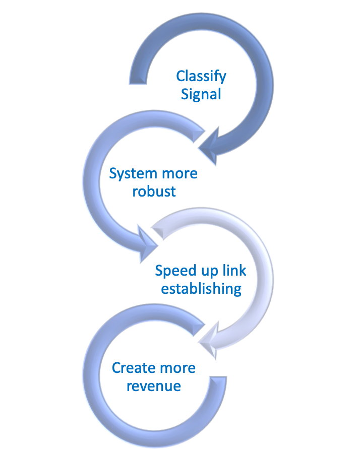
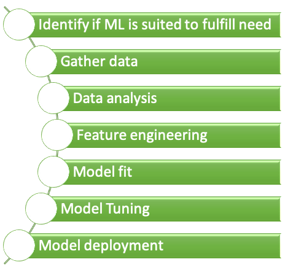

# (PART) Real world example {-} 

```{r setupRealWorldFunda, include=FALSE}
knitr::opts_chunk$set(echo = FALSE)
library(gganimate)
library(SimilarityMeasures) # for frechet and dtw
library(tidyverse)
library(DT)
library(tidyverse)
library(grid)
library(animation)
library(gridExtra)
library(knitr) 
library(kableExtra)
```


# Real world example {#RealWorld}

This real world example demonstrates all the steps from defining the goal of the project to to calculate the ROI. It aims to bridge also the gap between different roles in an ML project by addressing the that different roles think in their domains and how a common language can be found.

<div class="rmdtip">

**Content of chapter**

- Subject of the project
    - The question asked was: **How can the system create more revenue?**
- Overview of project phases
- Algorithm selection
- Performance measurement
- Data gathering
- ROI calculation


</div>


---


 {width=100%} 


## Subject of the project

###  Depending from where you were looking: {-}

---

 {width=60% }

---

### Looking from the perspective of machine learning expert {-}


---

 {width=90% }


---


## Project phases 

### The main project phases are: {-}

---

 {width=50% }


---

### After data gathering iteration is trump   {-}

---

 ![Figure from  [@FeatureEngineeringKuhnWebsite] (Image Credit: Owlsmcgee [Public domain] )](images/MLprocess.svg){width=100% .external}
 
---


EDA => exploratory data analysis  
source http://www.feat.engineering/intro-intro.html#the-model-versus-the-modeling-process]

```{block2 echo=TRUE, type='rmdtip'}

- <p>Exploratory data analysis </p>
    - Find correlations or mutial depence
- Quantiative analysis
    - Check distribution
        - Long tail => log of variable
- Feature engineering ^[Good source for feature engineering: http://www.feat.engineering/index.html]
    - Create and select meaningful features
- Model fit
    - Selecting a few suited models
- Model tuning
    - Vary model **hyperpparameters**


```


### Feature engineering

Variables that go into model are called:

```{block2 echo=TRUE, type='rmdtip'}

- <p>Predictors</p>
- Features
- Independent variables

```


Quantity being modeled called: 

```{block2 echo=TRUE, type='rmdtip'}

- <p>Prediction</p>
- Outcome
- Response
- Dependent variable

```


From input to output


```{block2 echo=TRUE, type='rmdtip'}

$$outcome = f(features) = f(X_1, X_2, \dots, Xp) = f(X)$$

$$\hat{Y} = \hat{f}(X)$$

```


## Algorithm selection

The following algorithms were meant to be investigated following the rule to start with the least complex one. 


```{block2 echo=TRUE, type='rmdtip'}
**Determination which algorithm is best suited depends on: **
  
- Start with simplest algorithm to get a baseline
    - doesn't have to be a machine learning algorithm

- Use simple algorithm for feature engineering

- Use more complex algorithm if result is unsatisfactory

```


This is even more important since the algorithm was to be run on a satellite which where computing power is more limited than on earth


 {width=90% }

```{block2 echo=TRUE, type='important'}

Start with **simple model**

```


### Logistic regression

Logistic regression is the algorithm with the lowest computational complexity and therefore it was the algorithm with which the investigation for the suitable model would start

```{block2 echo=TRUE, type='rmdtip'}

- Lowest computational complexity
- Start algorithm to determine suitable algorithm
- Details of algorithm are given in chapter \@ref(MlAlgoLogReg)

```

```{r logsiticFunciton, echo=FALSE, fig.height=5, message=FALSE, warning=FALSE}
library(ggplot2)
eq = function(x) {
  
  1/(1+exp(-x))
}

ggplot(data.frame(x=c(-6,6)), aes(x=x)) + stat_function(fun=eq, geom = "line") + xlab(expression(eta)) + ylab(expression(logsitic(eta)))
```


```{block2 echo=TRUE, type='rmdmath'}

$$ logistic(\eta) = \frac{1}{1+exp^{-\eta}}$$

$$P(Y = 1 \vert X_i = x_i) = \frac{1}{1+exp^{-(\beta_0 + \beta_1X_1+ \dots \beta_n X_n)}}$$

  
where:

- $\beta_n$ are the coeffcients we are searching
- $X_n$ are the features

```

### Tree based 

Two dominant concepts are used for tree based algorithms:

---

 {width=90% }

Details on the algorithms are given at: 

```{block2 echo=TRUE, type='rmdtip'}
Details on the algorithms: 
  
- Random forest in chapter \@ref(MlAlgoTreesRandomForest)
- Gradient boosted trees in chapter \@ref(MlAlgoTreesGBM)

```
 
### Support Vector Machine (SVM) TBD
 
 

- Support vector machine in chapter \@ref(MlAlgoSvm)

---


 ![Figure from Alisneaky, svg version by User:Zirguezi [CC BY-SA (https://creativecommons.org/licenses/by-sa/4.0)]](images/2880px-Kernel_Machine.svg.png){width=100% .external}

---


```{block2 echo=TRUE, type='rmdmath'}
**Constrained optimization problem**

$$\max_{\\beta_{1}, \ldots, \beta_{p}} M$$


$$\textrm{subject to} \sum_{j=1}^{p} \beta_{j}^{2}=1$$

$$y_{i}\left(\beta_{0}+\beta_{1} x_{i 1}+\ldots+\beta_{p} x_{i p}\right) \geq M$$
for all i=1, $\ldots$, N.

```

## Performance measurement {#ConfusionMatrixRocAuc}

The performance for a classification task is measured with a confusion matrix

 {width=90% }

```{block2 echo=TRUE, type='rmdtip'}

For more serios scenarios the false predictions can have severe impact:

- FP: False prediction
    - Healthy person is unesseary troubled
- FN: False negative
    - Ill person does not get necessary treatment

```

Based on the four elements of the confusion matrix **various metrics are defined**, for details check https://en.wikipedia.org/wiki/Confusion_matrix 

### Sensitivity and specificity

Two metrics which are derived from the confusion matrix are:

**Sensitivity** is the proportion of cats which have been identified as cats, or the proportion of people with the illness that have been identified as being ill. It is therefore also called **probability of detection**

```{block2 echo=TRUE, type='rmdmath'}

**Sensitivity** => P(cat predicted | cat given)

---

$$
\
Sensitivity = \frac
{\text{Sample with cat and predicted cat}}
{\text{Samples having cat}} = \frac{TP}{TP+FN}
$$

```


**Specificity** is the proportion of non-cats which have been identified as non-cats, or the proportion of healthy people which have been identified as healthy.


```{block2 echo=TRUE, type='rmdmath'}

**Specificity** => P(non-cat predicted | non-cat observed)

---


$$
\
Specificity = \frac
{\text{Sample with non-cat and predicted as non-cat}}
{\text{Samples with non-cat}} = \frac{TN}{TN+FP}
$$


```

### Receiver operating characteristic (ROC) {#RocExplanation}

The result of a classification with two classes (binary classification) is given as a percentage value of how sure the algorithm is that the sample belongs to a class. Depending on the the overall project  target the threshold upon which the class is rated as identified is set. If a false positive is to be avoided than the threshold for classifying a positive is set high.

```{block2 echo=TRUE, type='rmdtip'}

- Used to set the probability threshold of detection
- Visual representation of confusion matrix
- Includes for various probability thresholds
    - Sensitivity
    - Specificity
- AUC => area under curve
    - The higher the better
    - 0 < AUC < 1

```    
    
    

```{r rocImage, echo=FALSE, fig.height=13, fig.width=20, message=FALSE, warning=FALSE, comment='#'}
library(tidyverse)
## define colors
colorFP <- "#ff9999"
colorTP <- "#cc0000"
colorTN <- "blue"
colorFN <- "lightblue"
colorThreshold <- "#006600"


funcShadedFP <- function(x,threshold, noHitMean, noHitSd) {
  y <- dnorm(x, mean = noHitMean, sd = noHitSd)
  y[x < threshold | x > (threshold + 180 * noHitSd)] <- NA
  return(y)
}

funcShadedTP <- function(x,threshold, HitMean, HitSd) {
  y <- dnorm(x, mean = HitMean, sd = HitSd)
  y[x < threshold | x > (threshold + 180 * HitSd)] <- NA
  return(y)
}


funcShadedTN <- function(x,threshold, noHitMean, noHitSd) {
  y <- dnorm(x,  mean = noHitMean, sd = noHitSd)
  y[x > threshold | x < -(threshold + 180 * noHitSd)] <- NA
  return(y)
}


funcShadedFN <- function(x,threshold,  HitMean, HitSd) {
  y <- dnorm(x, mean = HitMean, sd = HitSd)
  y[x > threshold | x < -(threshold + 180 * HitSd)] <- NA
  return(y)
}


plotErrorDistr <- function(threshold, noHitMean, noHitSd, HitMean, HitSd) {


probPlot <-   ggplot(data.frame(x = c(0, 1)), aes(x = x)) +

    scale_x_continuous(name = "Predicted Probability of being positive",
                       breaks = seq(0, 1, 0.2),
                       limits=c(0, 1)) +
    scale_y_continuous(name = "Frequency") +
    scale_colour_brewer(palette="Accent") +
    theme_bw() +
    theme(axis.line = element_line(size=1, colour = "black"),
          #panel.grid.major = element_line(colour = "#d3d3d3"),
          panel.grid.major = element_blank(),
          panel.grid.minor = element_blank(),
          panel.border = element_blank(), panel.background = element_blank(),
          plot.title = element_text(size = 14, family = "Tahoma", face = "bold"),
          text=element_text(family="Tahoma"),
          axis.text.x=element_text(colour="black", size = 10),
          axis.text.y=element_text(colour="black", size = 10)) + 
    stat_function(fun=funcShadedFP, geom="area", fill=colorFP, alpha=0.7, args = list(threshold, noHitMean, noHitSd))  + 
    stat_function(fun=funcShadedTP, geom="area", fill=colorTP, alpha=0.7, args = list(threshold, HitMean, HitSd)) + 
    stat_function(fun=funcShadedTN, geom="area", fill=colorTN, alpha=0.7, args = list(threshold, noHitMean, noHitSd)) + 
    stat_function(fun=funcShadedFN, geom="area", fill=colorFN, alpha=.7, args = list(threshold,  HitMean, HitSd))  + 
    geom_vline(xintercept = threshold, col = colorThreshold, size = 2) +
    labs(title= "Density plot of predicted probability") + theme(plot.title = element_text(hjust = 0.5)) + theme(legend.position="top") +
  annotate("text", x = .39 , y = 2.5, label = "TN", size = 10) +
  annotate("text", x = .46 , y = 2.5, label = "FP", size = 10) +
  annotate("text", x = .39 , y = 0.3, label = "FN", size = 10) +
  annotate("text", x = .46 , y = 0.3, label = "TP", size = 10) +
  annotate("text", x = .2 , y = 3.5, label = "Ground truth = Negative", size = 10) +
  annotate("text", x = .79 , y = 3, label = "Ground truth = Positive", size = 10) + theme(plot.title = element_text(hjust = 0.5, color="green", size=34, face="bold.italic"),legend.position ="none",axis.title = element_text(size=22, face="bold")) 
 
 rocCurve <- data.frame(threshold= seq(0,1,length.out = 100 )) %>% mutate( xRoc = 1-pnorm(threshold,noHitMean, noHitSd),
                       yRoc =  1-pnorm(threshold,HitMean, HitSd))
 
annoStartX <- 0.375
annoStartY <- 0
blockSizeX = .25
blockSizeY = .375
textOffsetX <- 0.125
textOffsetY <- blockSizeY/2
alphaValue <- 0.7


RocPlot <- rocCurve %>% ggplot(aes(x=xRoc, y = yRoc)) + geom_line() + geom_area(fill = "lightgreen", alpha = 0.3) +
      scale_x_continuous(name = "P(FP) = 1 - Specificity",
                       breaks = seq(0, 1, 0.2),
                       limits=c(0, 1)) +
    scale_y_continuous(name = "P(TP) = Sensitivity",  limits=c(0, 1)) +
      theme_bw() +
    theme(axis.line = element_line(size=1, colour = "black"),
          panel.grid.major = element_blank(),
          panel.grid.minor = element_blank(),
          panel.border = element_blank(), panel.background = element_blank(),
          plot.title = element_text(size = 14, family = "Tahoma", face = "bold"),
          text=element_text(family="Tahoma"),
          axis.text.x=element_text(colour="black", size = 9),
          axis.text.y=element_text(colour="black", size = 9)) +  
  annotate("point", x = 1-pnorm(threshold,noHitMean, noHitSd), y = 1-pnorm(threshold,HitMean, HitSd),colour = colorThreshold, size = 6) + 
  #annotate("text",x = 1-pnorm(threshold,noHitMean, noHitSd) +0.0, y = 1-pnorm(threshold,HitMean, HitSd)-0.1, label =  paste0("threshold: ", round(threshold,3)), color = colorThreshold, size = 7) +
annotate("text",x = 0.2, y = 0.375, label =  paste0("threshold: ", round(threshold,3)), color = colorThreshold, size = 10) +  
   
  annotate("text", x = annoStartX + blockSizeX , y = 0.81, label = "Confusion Matrix", size = 10) +
  
  annotate("rect", xmin = annoStartX, xmax = annoStartX + blockSizeX , ymin = annoStartY + blockSizeY, ymax = annoStartY + 2*blockSizeY, alpha = alphaValue, fill = colorTP) + 
  annotate("text", x = annoStartX + textOffsetX , y = annoStartY + blockSizeY + textOffsetY, label = paste0("TP Rate: ", round(1-pnorm(threshold,HitMean, HitSd),2)), size = 10) +
  annotate("rect", xmin = annoStartX, xmax = annoStartX + blockSizeX , ymin = annoStartY, ymax = annoStartY + blockSizeY, alpha = alphaValue, fill = colorFN) +
  annotate("text", x = annoStartX + textOffsetX, y = annoStartY + textOffsetY,  label = paste0("FN Rate: ", round(pnorm(threshold,HitMean, HitSd),2)), size = 10) +

  annotate("rect", xmin = annoStartX + blockSizeX , xmax = annoStartX + 2*blockSizeX , ymin = annoStartY + blockSizeY, ymax = annoStartY + 2*blockSizeY, alpha = alphaValue, fill = colorFP) +   annotate("text", x = annoStartX + blockSizeX + textOffsetX, y = annoStartY + blockSizeY + textOffsetY, label = paste0("FP Rate: ", round(1-pnorm(threshold,noHitMean, noHitSd),2)) , size = 10) + 

  annotate("rect", xmin = annoStartX + blockSizeX , xmax = annoStartX + 2*blockSizeX  , ymin = annoStartY, ymax = annoStartY + blockSizeY, alpha = alphaValue, fill = colorTN) +
  annotate("text", x = annoStartX + blockSizeX + textOffsetX , y = annoStartY + textOffsetY, label = paste0("TN Rate: ", round(pnorm(threshold,noHitMean, noHitSd),2)), size = 10) +
  labs(title= "Receiver Operating Characteristic (ROC) ") + theme(plot.title = element_text(hjust = 0.5, color="green", size=34),legend.position ="none",axis.title = element_text( size=22, face="bold")) 


grid.arrange(probPlot, RocPlot)
#grid.arrange( RocPlot)

}


plotErrorDistr(threshold = 0.43, noHitMean = 0.4, noHitSd = 0.1, HitMean = 0.6, HitSd = 0.12)

```


## Confusion matrix and receiver operating characterstic (ROC) for pulse

```{r echo=FALSE, fig.height=13, fig.width=20, message=FALSE, warning=FALSE, comment='#'}


## define colors
colorFP <- "#ff9999"
colorTP <- "#cc0000"
colorTN <- "blue"
colorFN <- "lightblue"
colorThreshold <- "#006600"


funcShadedFP <- function(x,threshold, noHitMean, noHitSd) {
  y <- dnorm(x, mean = noHitMean, sd = noHitSd)
  y[x < threshold | x > (threshold + 180 * noHitSd)] <- NA
  return(y)
}

funcShadedTP <- function(x,threshold, HitMean, HitSd) {
  y <- dnorm(x, mean = HitMean, sd = HitSd)
  y[x < threshold | x > (threshold + 180 * HitSd)] <- NA
  return(y)
}


funcShadedTN <- function(x,threshold, noHitMean, noHitSd) {
  y <- dnorm(x,  mean = noHitMean, sd = noHitSd)
  y[x > threshold | x < -(threshold + 180 * noHitSd)] <- NA
  return(y)
}


funcShadedFN <- function(x,threshold,  HitMean, HitSd) {
  y <- dnorm(x, mean = HitMean, sd = HitSd)
  y[x > threshold | x < -(threshold + 180 * HitSd)] <- NA
  return(y)
}


plotErrorDistr <- function(threshold, noHitMean, noHitSd, HitMean, HitSd) {


probPlot <-   ggplot(data.frame(x = c(0, 1)), aes(x = x)) +

    scale_x_continuous(name = "Predicted Probability of being positive",
                       breaks = seq(0, 1, 0.2),
                       limits=c(0, 1)) +
    scale_y_continuous(name = "Frequency") +
    scale_colour_brewer(palette="Accent") +
    theme_bw() +
    theme(axis.line = element_line(size=1, colour = "black"),
          #panel.grid.major = element_line(colour = "#d3d3d3"),
          panel.grid.major = element_blank(),
          panel.grid.minor = element_blank(),
          panel.border = element_blank(), panel.background = element_blank(),
          plot.title = element_text(size = 14, family = "Tahoma", face = "bold"),
          text=element_text(family="Tahoma"),
          axis.text.x=element_text(colour="black", size = 10),
          axis.text.y=element_text(colour="black", size = 10)) + 
    stat_function(fun=funcShadedFP, geom="area", fill=colorFP, alpha=0.7, args = list(threshold, noHitMean, noHitSd))  + 
    stat_function(fun=funcShadedTP, geom="area", fill=colorTP, alpha=0.7, args = list(threshold, HitMean, HitSd)) + 
    stat_function(fun=funcShadedTN, geom="area", fill=colorTN, alpha=0.7, args = list(threshold, noHitMean, noHitSd)) + 
    stat_function(fun=funcShadedFN, geom="area", fill=colorFN, alpha=.7, args = list(threshold,  HitMean, HitSd))  + 
    geom_vline(xintercept = threshold, col = colorThreshold, size = 2) +
    labs(title= "Density plot of predicted probability") + theme(plot.title = element_text(hjust = 0.5)) + theme(legend.position="top") +
  annotate("text", x = .36 , y = 2.5, label = "No Pulse", size = 10) +
  annotate("text", x = .48 , y = 2.5, label = "False Pulse", size = 10) +
  annotate("text", x = .36 , y = 0.3, label = "Missed Pulse", size = 10) +
  annotate("text", x = .48 , y = 0.3, label = "Pulse", size = 10) +
  annotate("text", x = .2 , y = 3.5, label = "Ground truth = No Pulse", size = 10) +
  annotate("text", x = .79 , y = 3, label = "Ground truth = Pulse", size = 10) + theme(plot.title = element_text(hjust = 0.5, color="green", size=34, face="bold.italic"),legend.position ="none",axis.title = element_text(size=22, face="bold")) 
 
 rocCurve <- data.frame(threshold= seq(0,1,length.out = 100 )) %>% mutate( xRoc = 1-pnorm(threshold,noHitMean, noHitSd),
                       yRoc =  1-pnorm(threshold,HitMean, HitSd))
 
annoStartX <- 0.375
annoStartY <- 0
blockSizeX = .25
blockSizeY = .375
textOffsetX <- 0.125
textOffsetY <- blockSizeY/2
alphaValue <- 0.7


RocPlot <- rocCurve %>% ggplot(aes(x=xRoc, y = yRoc)) + geom_line() + geom_area(fill = "lightgreen", alpha = 0.3) +
      scale_x_continuous(name = "P(FP) => P(False Pulse)",
                       breaks = seq(0, 1, 0.2),
                       limits=c(0, 1)) +
    scale_y_continuous(name = "P(TP) => (P(Pulse detection)",  limits=c(0, 1)) +
      theme_bw() +
    theme(axis.line = element_line(size=1, colour = "black"),
          panel.grid.major = element_blank(),
          panel.grid.minor = element_blank(),
          panel.border = element_blank(), panel.background = element_blank(),
          plot.title = element_text(size = 14, family = "Tahoma", face = "bold"),
          text=element_text(family="Tahoma"),
          axis.text.x=element_text(colour="black", size = 9),
          axis.text.y=element_text(colour="black", size = 9)) +  
  annotate("point", x = 1-pnorm(threshold,noHitMean, noHitSd), y = 1-pnorm(threshold,HitMean, HitSd),colour = colorThreshold, size = 6) + 
  #annotate("text",x = 1-pnorm(threshold,noHitMean, noHitSd) +0.0, y = 1-pnorm(threshold,HitMean, HitSd)-0.1, label =  paste0("threshold: ", round(threshold,3)), color = colorThreshold, size = 7) +
annotate("text",x = 0.2, y = 0.375, label =  paste0("threshold: ", round(threshold,3)), color = colorThreshold, size = 10) +  
   
  annotate("text", x = annoStartX + blockSizeX , y = 0.81, label = "Confusion Matrix", size = 10) +
  
  annotate("rect", xmin = annoStartX, xmax = annoStartX + blockSizeX , ymin = annoStartY + blockSizeY, ymax = annoStartY + 2*blockSizeY, alpha = alphaValue, fill = colorTP) + 
  annotate("text", x = annoStartX + textOffsetX , y = annoStartY + blockSizeY + textOffsetY, label = paste0("Pulse Rate: ", round(1-pnorm(threshold,HitMean, HitSd),2)), size = 10) +
  annotate("rect", xmin = annoStartX, xmax = annoStartX + blockSizeX , ymin = annoStartY, ymax = annoStartY + blockSizeY, alpha = alphaValue, fill = colorFN) +
  annotate("text", x = annoStartX + textOffsetX, y = annoStartY + textOffsetY,  label = paste0("Missed Pulse Rate: ", round(pnorm(threshold,HitMean, HitSd),2)), size = 10) +

  annotate("rect", xmin = annoStartX + blockSizeX , xmax = annoStartX + 2*blockSizeX , ymin = annoStartY + blockSizeY, ymax = annoStartY + 2*blockSizeY, alpha = alphaValue, fill = colorFP) +   annotate("text", x = annoStartX + blockSizeX + textOffsetX, y = annoStartY + blockSizeY + textOffsetY, label = paste0("False Pulse Rate: ", round(1-pnorm(threshold,noHitMean, noHitSd),2)) , size = 10) + 

  annotate("rect", xmin = annoStartX + blockSizeX , xmax = annoStartX + 2*blockSizeX  , ymin = annoStartY, ymax = annoStartY + blockSizeY, alpha = alphaValue, fill = colorTN) +
  annotate("text", x = annoStartX + blockSizeX + textOffsetX , y = annoStartY + textOffsetY, label = paste0("No Pulse Rate: ", round(pnorm(threshold,noHitMean, noHitSd),2)), size = 10) +
  labs(title= "Receiver Operating Characteristic (ROC) ") + theme(plot.title = element_text(hjust = 0.5, color="green", size=34),legend.position ="none",axis.title = element_text( size=22, face="bold")) 


grid.arrange(probPlot, RocPlot)
#grid.arrange( RocPlot)

}


plotErrorDistr(threshold = 0.43, noHitMean = 0.4, noHitSd = 0.1, HitMean = 0.6, HitSd = 0.12)

```


### Receiver operating characterstic (ROC) and probability density plots

 {width=100%}


## Create augmented labeled data 


How to label data as being positive?


```{block2 echo=TRUE, type='rmdtip'}


- Create augmented hits

- Vary parameters

```

On the left hand side are the pulses which have to be detected amid noise as shown in the right hand side image. **Note**, the y-axis have the same scaling, i.e. the pulse signal strengths is lower than the noise.


 {width=45%}  {width=45%}


### Features of time signals


 {width=100%}  

## Features generated

```{block2 echo=TRUE, type='rmdtip'}
- Sample values of window

- Dynamic time warp (window)

- Min(window)

- Max(window)

- Median(window)

- Variance(window)

```

### Analysis of generated features


 {width=100%}  


### Dynamic time warp (DTW) for signal

 {width=100%}  


## Confusion matrix results logistic regression for measured data

 {width=80%}  


 {width=80%}  

 {width=80%}  


### ROC results for measured data 

```{block2 echo=TRUE, type='rmdtip'}

- ROC of logistic regression

- Perfect separation of two classes

- No need for more complex algorithm

```

 {width=100%}  

## Several algorithms results for SNR = 18dB

 {width=100%}  


### ROC results for SNR 18dB


```{block2 echo=TRUE, type='rmdtip'}

- ROC of logistic regression

    - Not perfect separation of two classes

    - Need more complex algorithm => Gradient boosted trees

```

 {width=100%}  


## Calculation of return of invest (ROI) {#ROIcalculation}

To calculate the ROI we need to calculate the profit as well as the invest.
The following numbers are, for obvious reasons, not the real numbers.

<div class="rmdtip">
**Calculation of ROI:**  

- Calculate invest
- Calculate profit
- $ROI =  \frac{Profit}{Invest}$

</div>


### Calculation of ML project invest
 
To calculate the project invest the different phases of the ML project have to be considered

<div class="rmdtip">
**Phases of ML project:**

- Development
- Deployment
- Maintenance 
</div> 
 
 
Estimating the invest is a bit tricky for ML projects because often there is not the same amount of heritage as for other software projects. Also the amount of effort to make the data available and accessible is difficult to estimate early in the project.
As a rule of thumb the effort to gather the data and pre-process is about 80% of the total effort to develop a ML model.

<div class="rmdtip">
**Estimate development cost:**

- Due to low heritage vague
- Cost related with data
    - making them available
    - making them accessible (e.g. data might be hand written)
    - necessary data might only become clear during project
- Data handling could be 80% of development effort
    - accessing data
    - pre-processing data
    
</div> 
 
 
 
The deployment of a ML algorithm can be simple but might also be an elaborated effort. In the example here the deployment costs are effort is considerable because software which runs on a satellite has to fulfill special requirements. 

Deployment might happen in different stages, it might be deployed only for certain regions a certain kinds of customers. There might be the need for a feedback mechanism to improve the algorithm over time. Also the implementation might be such that it is easily scalable in case the use of the model increases potentially within a short time.


<div class="rmdtip">
**Estimate deployment cost:**

- Deployment might happen in different stages
    - regional
    - certain groups of customer
- Might need feedback mechanism
    - to improve algorithm
    - to report issues
        - fault
        - bias
        - unwanted behavior 
- Scalability  
    - in case of demand increase
    - increase might be sudden
    
</div> 


Maintaining the ML algorithm shall ensure that the algorithm's performance does not deteriorate over time and might even be increased, also that the algorithm runs safely and works in a maybe changing IT environment.

<div class="rmdtip">
**Estimate maintenance cost:**

- Ensure safety
    - IT environment might change
    - new operating system version
- Ensure performance
    - maybe include feedback
    - could involve human intervention
    
    
</div> 


Below the numbers for the previously described project are given. Please note that for confidential reasons the figures are not the real figures, but are in the right ballpark.
 
---
 
  {width=100%}  
  
---
  
  
### Calculation of ML profit

For a given ROC the **highest available profit** can be calculated by assigning a price tag to the elements of the confusion matrix. The profit calculated is per day.

<div class="rmdtip">
**Calculation of ML profit:**

- Assign price tag to elements of confusion matrix
    - e.g. $Profit=TP Rate *1000€ - FP Rate *5000€)$
- Determine maximum profit per day

</div> 

--- 

 {width=100%}  


---

Choosing the probability threshold for maximum profit yields to a **profit of 386.25€/d.**


### Resulting ROI

The resulting ROI is given for the years 2017-2019 in the following table:


 {width=100%}  
 
The analysis shows that the ML algorithm not only improves the technical capability of the system but also would have an impressive ROI.

## Compare models for SNR = 18dB

- **ROC, Sensitivity and Specificity** for gradient boosted trees (GBM) and logistic regression (LogReg) and support vector machine (SVM) vs cross validation


---


## Optimize ML hyper parameter


 {width=80%}  


```{block2 echo=TRUE, type='rmdtip'}


```